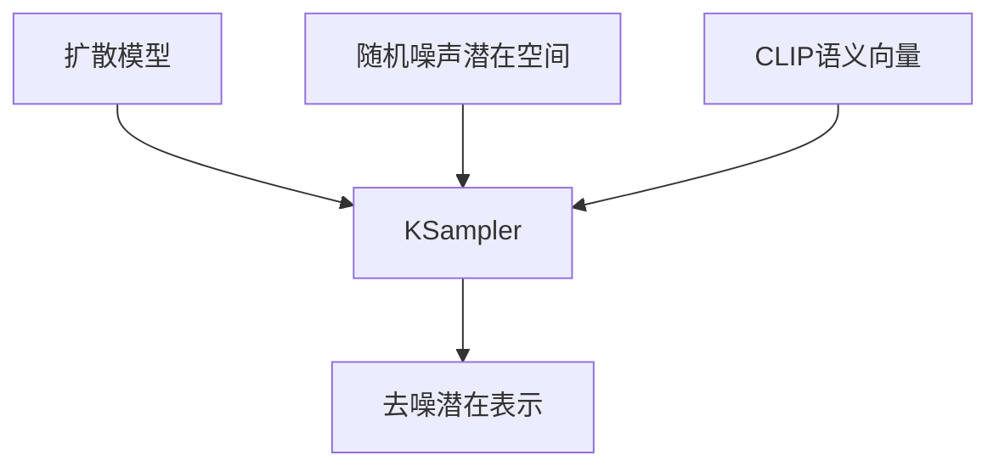

# 目录

- [1 介绍](#1-介绍)
- [2 安装](#2-安装)
  - [2.1 ComfyUI Desktop](#21-comfyui-desktop)
  - [2.2 便携版](#22-便携版)
    - [2.2.1 README_VERY_IMPORTANT.txt](#221-readme_very_importanttxt)
    - [2.2.2 添加额外模型路径](#222-添加额外模型路径)
    - [2.2.3 设置局域网访问](#223-设置局域网访问)
  - [2.3 手动安装](#23-手动安装)
  - [2.4 Comfy Cloud](#24-comfy-cloud)
- [3 安装自定义节点](#3-安装自定义节点)
  - [3.1 ComfyUI Manager（推荐）](#31-comfyui-manager推荐)
    - [3.1.1 ComfyUI-Manager 配置](#311-comfyui-manager-配置)
    - [3.1.2 常见问题](#312-常见问题)
- [4 基本流程](#4-基本流程)
- [5 基本概念](#5-基本概念)
  - [5.1 工作流](#51-工作流)
  - [5.2 节点](#52-节点)
    - [5.2.1 节点状态](#521-节点状态)
    - [5.2.2 节点连接](#522-节点连接)
    - [5.2.3 节点上下文菜单](#523-节点上下文菜单)
    - [5.2.4 节点选择工具箱](#524-节点选择工具箱)
    - [5.2.5 子图](#525-子图)
    - [5.2.6 自定义节点](#526-自定义节点)
  - [5.3 参数](#53-参数)
  - [5.4 链接](#54-链接)
  - [5.5 模型](#55-模型)
  - [5.6 依赖项](#56-依赖项)
- [6 界面概览](#6-界面概览)
- [7 其他](#7-其他)
- [8 基本工作流](#8-基本工作流)
  - [8.1 文生图](#81-文生图)
    - [8.1.1 工作原理](#811-工作原理)
    - [8.1.2 工作流节点说明](#812-工作流节点说明)
  - [8.2 图生图](#82-图生图)
  - [8.3 重绘](#83-重绘)
    - [8.3.1 使用蒙版编辑器](#831-使用蒙版编辑器)
  - [8.4 扩图](#84-扩图)
  - [8.5 图像放大](#85-图像放大)
  - [8.6 LoRRa](#86-lorra)
    - [8.6.1 多LoRa](#861-多lora)
- [9 ControlNet](#9-controlnet)
  - [9.1 Pose ControlNet](#91-pose-controlnet)
  - [9.2 Depth ControlNet](#92-depth-controlnet)
  - [9.3 Depth T2I Adapter](#93-depth-t2i-adapter)
  - [9.4 Mixing ControlNet](#94-mixing-controlnet)
- [10 3D](#10-3d)
- [11 工具](#11-工具)
  - [11.1 预处理器工作流](#111-预处理器工作流)
  - [11.2 帧插值工作流 与 视频超分辨率](#112-帧插值工作流-与-视频超分辨率)

---
# 1 介绍
参考[Comfyui官网](https://docs.comfy.org/)

# 2 安装

## 2.1 ComfyUI Desktop
...

## 2.2 便携版
在官网找到适用你GPU的版本

下载文件并使用 7-ZIP 解压。解压后的文件夹结构：
```md
ComfyUI_windows_portable
├── 📂ComfyUI                    // ComfyUI 主程序
├── 📂python_embeded            // 独立 Python 环境
├── 📂update                    // 用于升级便携版的批处理脚本
├── README_VERY_IMPORTANT.txt   // ComfyUI 便携版英文使用说明
├── run_cpu.bat                 // 双击启动 ComfyUI（仅 CPU）
└── run_nvidia_gpu.bat           // 双击启动 ComfyUI（Nvidia GPU）
```

双击 run_nvidia_gpu.bat 以启动 ComfyUI。

打开浏览器并访问 http://127.0.0.1:8188 即可

### 2.2.1 README_VERY_IMPORTANT.txt
```md
如何运行：
如果您拥有 NVIDIA GPU：
run_nvidia_gpu.bat
如果您想启用快速 fp16 累加（对于 fp16 模型速度更快，但质量略低）：
run_nvidia_gpu_fast_fp16_accumulation.bat


便携版没有传统的安装程序，所有文件都在解压的文件夹里。常规卸载的第一步，就是直接把这个文件夹删除。

用户配置和虚拟环境:
这是 ComfyUI 生成工作流、日志和独立 Python 环境的地方，可能包含了你辛苦调好的设置。
路径：C:\Users\<你的用户名>\Documents\ComfyUI 内的 .venv 和 user 文件夹-3-19。

应用程序数据:
ComfyUI 会在这里存储全局配置。
路径：C:\Users\<你的用户名>\AppData\Roaming\ComfyUI-3-7。

临时更新文件:
路径：C:\Users\<你的用户名>\AppData\Local\@comfyorgcomfyui-electron-updater-4-7。

桌面快捷方式和固定图标:
检查并删除桌面上的 ComfyUI 图标，以及清理任务栏或开始菜单里的“固定图标”。

=================================================

要在缓慢的 CPU 模式下运行：
run_cpu.bat

如果界面中出现红色错误，请确保您在以下目录中有模型/检查点：ComfyUI\models\checkpoints

您可以从以下地址下载 Stable Diffusion 1.5 模型：https://huggingface.co/Comfy-Org/stable-diffusion-v1-5-archive/blob/main/v1-5-pruned-emaonly-fp16.safetensors

推荐的更新方式：
要更新 ComfyUI 代码：update\update_comfyui.bat

要更新 ComfyUI 及其 Python 依赖项，请注意，仅在遇到 Python 依赖项问题时才应运行此脚本。
update\update_comfyui_and_python_dependencies.bat

在 ComfyUI 和其他 UI 之间共享模型：
在 ComfyUI 目录中，您会找到一个文件：extra_model_paths.yaml.example
将此文件重命名为：extra_model_paths.yaml，并使用您喜欢的文本编辑器进行编辑。
```

### 2.2.2 添加额外模型路径
在 ComfyUI/models 目录之外管理模型文件，例如
- 有多个 ComfyUI 实例，并希望它们共享模型文件以节省磁盘空间
- 有不同类型的图形用户界面程序（例如 WebUI），并希望它们使用相同的模型文件
- 无法识别或找到模型文件

在 ComfyUI 的根目录中找到一个名为 extra_model_paths.yaml.example 的示例文件

复制并重命名为 extra_model_paths.yaml 

假设你想将以下模型路径添加到 ComfyUI：
```md
📁 YOUR_PATH/
  ├── 📁models/
  |   ├── 📁 loras/
  |   │   └── xxxxx.safetensors
  |   ├── 📁 checkpoints/
  |   │   └── xxxxx.safetensors
  |   ├── 📁 vae/
  |   │   └── xxxxx.safetensors
  |   └── 📁 controlnet/
  |       └── xxxxx.safetensors
```

如下配置 extra_model_paths.yaml 文件，让 ComfyUI 识别您设备上的模型路径：
```md
my_custom_config:
    base_path: YOUR_PATH
    loras: models/loras/
    checkpoints: models/checkpoints/
    vae: models/vae/
    controlnet: models/controlnet/
```

或
```md
my_custom_config:
    base_path: YOUR_PATH/models/
    loras: loras
    checkpoints: checkpoints
    vae: vae
    controlnet: controlnet
```

保存后，重启 ComfyUI 

另外，可以参考默认的 extra_model_paths.yaml.example 以获取更多配置选项。

### 2.2.3 设置局域网访问
修改相应的 .bat 文件，通过添加 --listen 参数来指定监听地址。 

例如：
```bash
.\python_embeded\python.exe -s ComfyUI\main.py --listen --windows-standalone-build
pause
```
启用 ComfyUI 后，最终运行地址将变为
```bash
Starting server

To see the GUI go to: http://0.0.0.0:8188
To see the GUI go to: http://[::]:8188
```
按 WIN + R 并输入 cmd 以打开命令提示符，然后输入 ipconfig 查看本地 IP 地址。

其他设备即可通过在浏览器中输入 http://your-local-IP:8188 来访问 ComfyUI。

## 2.3 手动安装
...

## 2.4 Comfy Cloud
ComfyUI 的云端版本，月度订阅

https://comfy.org/cloud

# 3 安装自定义节点
自定义节点是 ComfyUI 的扩展插件，可添加新功能，例如高级图像处理、微调、色彩调整等。

两个步骤：
1. 将节点代码克隆到 ComfyUI/custom_nodes 目录
2. 安装所需的 Python 依赖项

有三种安装方式
1. ComfyUI Manager
2. Git
3. Zip

注意：小心恶意插件

## 3.1 ComfyUI Manager（推荐）
ComfyUI Manager 已内置于大多数当前版本的 ComfyUI 中。当节点未在注册表中或你需要特定版本时，请使用 Git clone 或 ZIP 方式。

优点
1. 自动安装
2. 依赖处理
3. 图形用户界面	无法直接搜索未在注册表中注册的节点

缺点
1. 无法直接搜索未在注册表中注册的节点

对于运行 Windows 便携版 的用户，新版 ComfyUI-Manager 已内置于 ComfyUI 核心中，但需要手动启用。

在项目根目录运行如下命令

1. 安装管理器依赖项
    ```bash
    .\python_embeded\python.exe -m pip install -r ComfyUI\manager_requirements.txt
    ```

2. 启用管理器启动 ComfyUI：
    ```bash
    .\python_embeded\python.exe -s ComfyUI\main.py --windows-standalone-build --enable-manager
    pause
    ```

界面
- 左侧边栏（过滤器）：过滤已安装的节点、工作流中的节点、缺失的节点、可更新的节点等。
- 顶部搜索栏：搜索节点包（Node Pack）或单个节点（Node），使用“过滤器”下拉菜单切换搜索类型
- 右侧详情面板：点击节点以显示详细信息，包括描述、启用状态、版本信息等。“描述”选项卡包含仓库信息，“节点”选项卡预览所有节点

功能
- 搜索节点包（Node Pack）或单个节点（Node）
- 安装节点，更新节点，查找缺失的节点，卸载节点

新版管理器仅支持从注册表安装节点。如果您的节点未在注册表中注册，请先在管理器中完成注册。

### 3.1.1 ComfyUI-Manager 配置
管理器路径：`<USER_DIRECTORY>/__manager/`

| 文件 | 描述 |
| --- | --- |
| config.ini | 基本配置 |
| channels.list | 可配置的频道列表 |
| pip_overrides.json | 自定义 pip 包映射 |
| pip_blacklist.list | 禁止安装的包 |
| pip_auto_fix.list | 自动恢复的包 |
| snapshots/ | 已保存的快照文件 |
| startup-scripts/ | 启动脚本文件 |
| components/ | 组件文件 |

[ComfyUI-Manager 配置](https://docs.comfy.org/manager/configuration) 包括
- Config.ini 选项，环境变量，高级配置，extra_model_paths.yaml 配置，CLI 工具

### 3.1.2 常见问题
自定义 git 可执行文件路径
- 安装 ComfyUI-Manager 并运行一次 ComfyUI
- 打开 `<USER_DIRECTORY>/default/ComfyUI-Manager/config.ini`
- 在 git_exe = 中指定包含文件名的完整路径  git_exe = C:\Program Files\Git\bin\git.exe

ComfyUI-Manager 更新失败
- 进入 ComfyUI-Manager 目录并运行
    ```bash
    git update-ref refs/remotes/origin/main a361cc1 && git fetch --all && git pull
    ```
安装路径不正确
- ComfyUI-Manager 文件必须位于 ComfyUI/custom_nodes/comfyui-manager

网络问题
- 如果对 GitHub 的访问受限，请设置 GITHUB_ENDPOINT 环境变量
    ```bash
    GITHUB_ENDPOINT=https://mirror.ghproxy.com/https://github.com
    ```
- 如果对 Hugging Face 的访问受限，请设置 HF_ENDPOINT 环境变量
    ```bash
    HF_ENDPOINT=https://some-hf-mirror.com
    ```

[故障排除](https://docs.comfy.org/manager/troubleshooting)

# 4 基本流程
1.加载示例工作流(三种方式)

- 从 ComfyUI 的工作流模板加载（在侧边栏中点击'模板'，选择第一个默认工作流'图像生成'来加载它）

- 从带有工作流元数据的图像中加载(ComfyUI 生成的所有图像都包含元数据，其中包括工作流信息。)
  - 将 ComfyUI 生成的图像拖放到界面中
  - 使用菜单 Workflows -> Open 打开图像

- ComfyUI 的工作流以 JSON 格式存储。通过菜单 Workflows -> Export 导出工作流。下载后，使用菜单 Workflows -> Open 加载该 JSON 文件。

2.模型安装

加载工作流后，ComfyUI 会警告某些模型缺失

点击警告以查看缺失的模型及下载链接，点击下载，或在HUggingFace手动下载。之后放入对应模型的文件夹

所有模型都存储在 `<your ComfyUI installation>/ComfyUI/models/` 目录下，并包含 `checkpoints`、`embeddings`、`vae`、`lora`、`upscale_model` 等子文件夹。

3.文生图生成

安装或更新模型后，按下键盘上的 R 键以刷新对象定义，并更新节点中的模型列表

在模型节点中确保选择模型，然后点击 Run 或按 Ctrl + Enter 进行生成。

结果将显示在 Save Image 节点中。右键点击以保存到本地。


# 5 基本概念

## 5.1 工作流
ComfyUI 是一个用于构建和运行生成式内容**工作流**的环境。

工作流被定义为一组称为**节点**的程序对象的集合，这些对象相互连接形成网络。该网络也被称为**图**


ComfyUI 的节点图不受传统计算机应用程序中提供的工具的限制。它是一个高级的**可视化编程环境**，允许用户在设计复杂系统时无需编写程序代码或理解高级数学知识。

## 5.2 节点
节点是执行任务的基本构建模块。

节点通过链接相互连接，使我们能够像搭积木一样构建复杂的功能。 


例如，在 K-Sampler 节点中，你可以看到它具有多个输入和输出，并且还包括多个参数设置。这些参数决定了节点的执行逻辑。每个节点背后都有精心编写的 Python 逻辑，使你无需自行编写代码即可实现相应的功能。


### 5.2.1 节点状态


### 5.2.2 节点连接

节点通过 链接 连接，使得相同类型的数据能够在不同的处理单元之间流动，从而实现最终结果。

每个节点接收一些输入，通过其模块进行处理，并将其转换为相应的输出。不同节点之间的连接必须符合数据类型要求。在 ComfyUI 中，我们使用不同的颜色来区分节点的数据类型。以下是一些基本的数据类型：


| 数据类型 | 颜色 |
| --- | --- |
| 扩散模型/U-Net | 淡紫色 |
| CLIP 文本编码模型 | 黄色 |
| VAE 解码/编码模型 | 玫瑰 |
| 条件化 | 橙色 |
| 潜在图像 | 粉色 |
| 像素图像 | 蓝色 |
| 遮罩 | 绿色 |
| 数字（整数或浮点数） | 浅绿色 |
| 网格 | 亮绿色 |

* **三大核心模型**：淡紫色（扩散模型/U-Net）、黄色（CLIP文本编码模型）、玫瑰/粉红色（VAE解码/编码模型）。
* **数据载体**：粉色线代表在潜在空间中的图像数据（Latent），蓝色线代表已解码的像素级图像数据（Image）。
* **条件与控制**：橙色线代表条件化，通常连接文本提示词；绿色线代表遮罩，用于局部重绘或控制区域。
* **数值与参数**：浅绿色和亮绿色代表各种输入输出的参数（如步数、CFG、宽高、种子等），不涉及图像或模型本体。

也可以自定义节点的外观：修改样式，双击节点标题以修改节点名称，通过拖动任意角来调整节点大小

**节点徽章**

徽章显示功能，包含节点 ID 与 节点来源

Comfy Core 节点使用狐狸图标进行显示，而自定义节点则使用其名称。

可以在菜单中设置相应的显示方式

### 5.2.3 节点上下文菜单
包括
- 节点自身的上下文菜单
- 输入/输出的上下文菜单

通过右键点击节点，可以展开相应的节点上下文菜单：


在节点的右键上下文菜单中，可以调整节点的颜色样式，修改标题，克隆、复制或删除节点，设置节点的模式（始终、从不、旁路）

**模式**

- 始终（Always）：默认节点模式。节点在首次运行或自上次执行以来任何输入发生变化时都会执行
- 从不（Never）：节点在任何情况下都不会执行，就像已被删除一样。后续节点无法从中读取或接收任何数据
- 旁路（Bypass）：该节点在任何情况下都不会执行，但后续节点仍可以尝试获取未经过此节点处理的数据。


在对比示例中，两个工作流同时应用了两个 LoRA 模型，区别在于一个 Load LoRA 节点设置为 Never 模式，而另一个设置为 Bypass 模式。

设置为 Never 模式的节点会导致后续节点显示错误，因为它们没有接收到任何输入数据。

设置为 Bypass 模式的节点仍允许后续节点接收未处理的数据，因此它们会从第一个 Load LoRA 节点加载输出数据，使后续工作流能够正常运行

**输入/输出右键菜单**

主要与相应输入/输出的数据类型相关

当拖动节点的输入/输出时，如果出现连接但尚未连接到另一个节点的输入或输出，松开鼠标后会弹出该输入/输出的上下文菜单，用于快速添加相关类型的节点。

### 5.2.4 节点选择工具箱
节点选择工具箱是一个浮动工具，提供对节点的快速操作。当选择一个节点时，它会悬浮在该节点上方。

通过此工具箱，可以更改节点的颜色，快速将节点设置为旁路模式，锁定节点，删除节点

这些功能也可以在对应节点的右键菜单中找到。节点选择工具箱只是提供了一种快捷操作方式。可以在设置中将其关闭。

### 5.2.5 子图
可以将一组节点折叠为一个可复用的子图节点，以整理复杂的图表，并在不同工作流中复用相同的结构。 

### 5.2.6 自定义节点
ComfyUI 的基础安装中包含了大量的 Comfy Core 节点。社区还维护着一个庞大的自定义节点目录，用于支持专业的工作流。

ComfyUI 支持通过多种方式安装自定义节点，推荐使用 ComfyUI Manager 安装。可以帮助进行自定义节点的安装（包括依赖项），版本控制等

有关如何安装使用 自定义节点 与 ComfyUI Manager 参阅 [3 安装自定义节点](#3-安装自定义节点)。

## 5.3 参数
节点是参数的容器。节点通常具有属性，也称为参数。是可以更改的变量。


例如，Load Checkpoint（加载检查点）节点只有一个属性：生成模型检查点文件的路径。KSampler（K采样器）节点则具有多个属性，如采样步骤数、CFG 比例、sampler_name（采样器名称）等。

**数据类型**

ComfyUI 使用 Python 脚本语言编写，Python 对数据类型的宽容度很高。相比之下，ComfyUI 环境是强类型的。这意味着不同的数据类型不能混用。例如，我们不能将图像输出连接到整数输入。

## 5.4 链接
节点之间绘制的线条或曲线被称为链接。它们将数据从一个节点的输出传输到另一个节点的输入，从而定义工作流的流向。

**重定向节点**

当工作流变得复杂时，连接线可能会相互重叠或穿过节点后方，导致难以阅读。Reroute 节点（在画布空白处右键 → 搜索 Reroute → 添加 Reroute 节点。）允许你手动将连接线重定向到二维图表空间中的任意位置，从而保持布局的整洁和清晰。


ComfyUI 在图形画布中也内置了原生的重定向功能。


## 5.5 模型
模型是实际驱动工作流的权重文件，例如检查点（Checkpoints）、VAE、LoRA、ControlNet 和超分辨率工具。

通常需要从网上（如 Hugging Face、Civitai 或 GitHub）下载，并将它们放置在 ComfyUI/models/ 下对应类型的子文件夹中（或遵循模板的提示），然后在正确的加载器节点中选择该文件（通常以 Load 开头的节点）。

除了主检查点之外，许多工作流会添加更小的辅助模型，例如：
- LoRA — 针对特定风格、角色或概念优化的轻量级附加模型
- ControlNet — 提供来自边缘、深度、姿态等额外引导信息
- Inpainting  — 填充或替换现有图像中的区域

**卸载模型**

删除放入ComfyUI/models/文件夹中的其文件。

**添加额外的模型路径**

通过 extra_model_paths.yaml 配置文件添加额外模型搜索路径 参考[2.2.2 添加额外模型路径](#222-添加额外模型路径)

## 5.6 依赖项 
工作流文件依赖于其他文件，例如媒体素材输入、模型、自定义节点、相关的 Python 依赖项等。只有当所有相关依赖都满足时，才能正常运行。

# 6 界面概览
**语言**

可以点击设置齿轮图标，然后在 Comfy —> Locale 下选择想要的语言。

**界面**


1. 主菜单：点击展开功能菜单，包括文件操作、帮助菜单等。

2. 左侧面板条目：
- 资源：显示生成的图像、视频及其他资源。
- 节点：列出 ComfyUI 原生和第三方节点。
- 模型：显示 ComfyUI 启动后检测到的模型信息。启动后，如果下载了模型，按 r 键刷新节点定义以获取最新模型。
- 工作流：显示本地保存的工作流。
- 模板：提供 ComfyUI 内置的工作流模板。

3. 底部工具栏：包含帮助（打开运行时日志）、控制台（打开运行时日志）、快捷键（显示快捷键面板）和设置（打开设置面板）按钮。

4. 顶部区域：显示当前打开的工作流。 

5. 新建工作流按钮：点击可创建一个新的空白工作流文件。 

6. 右侧控制区域：运行和队列控制管理，在此可以运行工作流并查看队列。 

7. 登录状态：默认不显示，仅在登录后显示，用于需要闭源合作伙伴节点时。 

8. 快捷访问按钮：打开右侧面板。
 
9. 画布导航工具：可以在移动或平移模式之间切换，打开小地图，并切换节点连接显示。


1. 工作流历史记录队列（队列）：ComfyUI 执行媒体内容生成的所有队列信息

2. 节点库：这里可以找到 ComfyUI 中的所有节点，包括 Comfy Core 和你已安装自定义节点

3. 模型库：这里可以找到你本地 ComfyUI/models 目录中的模型

4. 本地用户工作流（工作流）：这里可以找到你本地保存的工作流

# 7 其他

## 遮罩编辑器
ComfyUI 内置的工具，允许你直接在图像上创建和编辑遮罩——无需外部图像编辑器。它支持多种绘图工具、图层管理、撤销/重做、画布变换以及 GPU 加速的画笔渲染。

打开（三种方式）
- 选择工具箱 — 选择一个“加载图像”节点，然后点击该节点上方选择工具栏中的遮罩图标按钮。
- 图像叠加层 — 将鼠标悬停在图像预览（画廊模式）上，然后点击出现在左上角的 编辑或遮罩图像 按钮（遮罩图标）。
- 右键菜单 — 在“加载图像”节点上右键单击，然后从上下文菜单中选择 在蒙版编辑器中打开。


## 子图
1. 选择要分组的节点

2. 点击子图图标


3. 子图已创建


ComfyUI 会根据所选节点的输入和输出自动创建子图

4. 可以编辑和组织子图以创建一个功能完整的节点

**编辑子图**

子图的操作方式与节点相同。双击子图内部的空白区域（不要在控件上），或者点击子图编辑按钮就可以编辑子图


- 导航栏：退出当前子图并返回到父级
- 输入槽位：暴露给外部的内部节点输入
  - 像普通节点一样将输出连接到槽位
  - 右键单击连接点以重命名/删除暴露的槽位
- 输出槽位：暴露给外部的输出（与输入槽位功能相同）

点击导航栏或按 Esc 键退出当前子图，返回父工作流。

**子图参数**

**嵌套子图**

**子图解包**

**子图蓝图**

## 节点文档


选择一个节点，在选择工具栏中点击节点信息图标，以打开节点文档页面。点击左上角的箭头图标来退出节点文档。

也可以通过节点库访问节点文档，将鼠标悬停在某个节点上，然后点击“?”图标以打开节点文档。

## Agent / MCP
通过模型上下文协议（MCP）将 AI 智能体连接到 ComfyUI

ComfyUI 提供两个 MCP 服务器

# 8 基本工作流

## 8.1 文生图
文生图是人工智能艺术生成中的一个基本过程，它通过文本描述来创建图像，其核心是扩散模型。

需要以下要素：
- 图像生成模型
- 潜在空间
- 提示词（正向提示词和负向提示词）


1. 在加载检查点节点中，使用箭头或点击文本区域以确保选中v1-5-pruned-emaonly-fp16.safetensors，并且左右箭头不显示null 文本。

2. 修改CLIP 文本编码器中的文本

3. 连接到 KSampler 节点的 Positive 代表正向提示词，而 Negative 代表负向提示词

    以下是 SD1.5 模型的一些基本提示原则：
    - 尽可能使用英文
    - 用英文逗号分隔提示词,
    - 使用短语而非长句
    - 使用具体描述
    - 使用如 (golden hour:1.2) 这样的表达式可增加特定关键词的权重，使其更有可能出现在图像中。1.2 是权重，golden hour 是关键词。
    - 使用如 masterpiece, best quality, 4k 等关键词可提高生成质量。

4. 运行：尝试多次运行生成。每次运行时，KSampler 都会基于 seed 参数使用不同的随机种子，因此每次生成的结果都会有所不同。

### 8.1.1 工作原理
整个文生图过程可以理解为一种反向扩散过程。我们下载的v1-5-pruned-emaonly-fp16.safetensors是一个预训练模型，能够从纯高斯噪声中生成目标图像。我们只需输入提示词，它就能通过去噪随机噪声来生成目标图像。

```md
文本提示 → CLIP编码器 → 语义向量
                            ↓
                            → 迭代去噪 → 中间潜在表示 → 最终生成图像
                            ↑ 
                        纯高斯噪声 
```

理解两个概念：
- 潜在空间：扩散模型中的一种抽象数据表示方法。将图像从像素空间转换为潜在空间可以减少存储空间，使训练扩散模型更容易并降低去噪复杂度。
这就像建筑师使用蓝图（潜在空间）进行设计，而不是直接在建筑物（像素空间）上设计，在保持结构特征的同时显著降低了修改成本。
- 像素空间：像素空间是图像的存储空间，即我们最终看到的图像，用于存储像素值。

### 8.1.2 工作流节点说明


A. 加载检查点节点

通常用于加载图像生成模型。一个checkpoint 通常包含三个组件：MODEL (UNet)、CLIP 和 VAE

- MODEL (UNet): 负责在扩散过程中进行噪声预测和图像生成的 UNet 模型
- CLIP: 文本编码器，将我们的文本提示转换为模型可以理解的向量，因为模型无法直接理解文本提示
- VAE: 变分自编码器，用于在像素空间和潜在空间之间转换图像，因为扩散模型在潜在空间中工作，而我们的图像处于像素空间

B. 空潜在图像节点

定义了一个潜在空间，该空间输出到 KSampler 节点。Empty Latent Image 节点构建了一个纯噪声潜在空间

你可以将其功能理解为定义画布尺寸，这决定了我们最终生成图像的维度。

C. CLIP 文本编码器节点

提示词由 Load Checkpoint 节点中的 CLIP 组件编码为语义向量，并作为条件输出到 KSampler 节点

D. KSampler 采样器节点

整个流程的核心，负责执行完整的去噪过程，最终输出潜空间图像。




| 参数名称 | 描述 | 功能 |
| :--- | :--- | :--- |
| model | 用于去噪的扩散模型 | 决定生成图像的风格和质量 |
| 正向提示词 | 正向提示词条件编码 | 引导生成包含指定元素 |
| 负面提示 | 负面提示条件编码 | 抑制不需要的内容 |
| 潜在图像 | 需要去噪的潜在空间图像 | 作为噪声初始化的输入载体 |
| seed | 用于生成噪声的随机种子 | 控制生成的随机性 |
| control_after_generate | 生成后的种子控制模式 | 决定批量生成中的种子变化模式 |
| step | 去噪迭代次数 | 步数越多细节越精细，但处理时间也越长 |
| cfg | 分类器自由引导比例 | 控制提示词约束强度（过高会导致过拟合） |
| sampler_name | 采样算法名称 | 决定去噪路径的数学方法 |
| scheduler | 调度器类型 | 控制噪声衰减率和步长分配 |
| denoise | 去噪强度系数 | 控制添加到潜在空间的噪声强度，0.0 保留原始输入特征，1.0 为完全噪声 |

在 KSampler 节点中，潜在空间使用 seed 作为初始化参数来构建随机噪声，并将语义向量 Positive 和 Negative 作为条件输入到扩散模型中，然后，根据 steps 参数指定的去噪步数执行去噪。每个去噪步骤都会使用 denoise 参数指定的去噪强度系数对潜在空间进行去噪，并生成新的潜在空间图像。

E. VAE 解码器节点

将来自 KSampler 的潜在空间图像输出转换为像素空间图像


F. 保存图像节点

## 8.2 图生图
允许用户输入一张图像并基于它生成新图像。

图生图的过程与文生图非常相似， 只是多了一个作为条件的参考图像输入。


关键在于 KSampler 节点中的 denoise 参数，该参数应 小于 1
- denoise值越小，生成图像与参考图像之间的差异就越小
- denoise值越大，生成图像与参考图像之间的差异就越大

这是因为denoise决定了在将参考图像转换为潜在空间图像后添加噪声的强度。如果denoise为1，潜在空间图像将完全变为随机噪声，与由empty latent image节点生成的潜在空间相同，从而失去参考图像的所有特征。

## 8.3 重绘
们经常会遇到这样的情况：对整体画面感到满意，但其中包含了一些我们不想要或存在错误的元素。如果直接重新生成，可能会产生完全不同的图像，因此使用重绘（inpainting）功能来修正特定部分就变得非常有用。使用 ComfyUI 遮罩编辑器绘制遮罩，需要调整的区域（mask）


注意：相比使用 v1-5-pruned-emaonly-fp16.safetensors 等模型。由 512-inpainting-ema.safetensors 模型生成的结果具有更好的修复效果和更自然的过渡。这是因为该模型专为修复功能而设计。因此选择合适的模型可以帮助你获得更好的生成结果。

### 8.3.1 使用蒙版编辑器
右键单击 Save Image 节点，然后选择Copy(Clipspace)

右键单击 Load Image 节点，并选择Paste（Clipspace）

再次右键单击 Load Image 节点，并选择在 Open in MaskEditor （蒙版编辑器）中打开

- 在右侧面板调整画笔参数
- 使用橡皮擦修正错误
- 完成后点击保存

绘制的内容将作为蒙版输入到 VAE Encoder (for Inpainting) 节点中进行编码

与'文生图'和'图生图'进行比较，主要区别在于 VAE 部分的条件输入。在此工作流中，我们使用 VAE Encoder (for Inpainting) 节点，该节点专为修复功能设计，帮助我们更好地控制生成区域并获得更好的结果。

原理流程：将原始图像编码为潜在表示，然后利用 mask 填充待修复区域的潜在表示为零，保留未修复区域的原始潜在信息，以供后续修复生成。

输入类型

| 参数名称 | 功能 |
| --- | --- |
| pixels | 要编码为潜在空间的输入图像。 |
| vae | 用于将图像从像素空间编码到潜在空间的 VAE 模型。 |
| mask | 指定需要修改区域的图像蒙版。 |
| grow_mask_by | 用于扩展原始蒙版的像素值，确保蒙版周围存在过渡区域，以避免修复区域与原始区域之间出现生硬的边缘。 |

输出类型

| 参数名称 | 功能 |
| --- | --- |
| latent | 图像已通过 VAE 编码为潜在空间。 |


## 8.4 扩图
我们经常会遇到这样的情况：现有图像的构图很好，但画布区域太小，需要扩展画布以获得更大的场景。这时就需要用到外绘（Outpainting）技术。

它与 Inpainting 相似，但我们使用不同的节点来构建蒙版。


Pad Image for outpainting 节点：该节点接受一张输入图像，并输出一张扩展后的图像及相应的蒙版，其中蒙版是根据节点参数构建的

经过 Pad Image for outpainting 节点处理后，输出图像和蒙版预览如下：


输入参数

| 参数名称 | 功能 |
| --- | --- |
| image | 输入图像 |
| left | 左侧填充量 |
| top | 顶部填充量 |
| right | 右侧填充量 |
| bottom | 底部填充量 |
| feathering | 控制原始图像与添加的填充区域之间的过渡平滑度，数值越高，过渡越平滑。 |

输出参数

| 参数名称 | 功能 |
| --- | --- |
| image | 输出 image 表示填充后的图像 |
| mask | 输出 mask 指示原始图像区域和添加的填充区域 |

## 8.5 图像放大
Image Upscale：利用算法将低分辨率图像转换为高分辨率图像的过程。与传统插值方法不同，AI 放大模型（如 ESRGAN）能够在保持图像质量的同时智能地重建细节。

下载并安装放大模型，将模型文件（.pth）保存到 ComfyUI/models/upscale_models。


与文生图结合：


提示：
- 链式放大：组合多个放大节点（例如 2 倍 → 4 倍）以实现超高倍率放大
- 混合工作流：在生成后连接放大节点，实现“生成 + 增强”流程

## 8.6 LoRRa
LoRA（低秩适应）是一种用于微调大型生成模型（如 Stable Diffusion）的高效技术。 它在预训练模型中引入可训练的低秩矩阵，仅调整部分参数而非重新训练整个模型， 从而以较低的计算成本实现特定任务的优化。 与 SD1.5 等基础模型相比，LoRA 模型体积更小且更容易训练。能为你的作品添加独特风格和细节。

下载 dreamshaper_8.safetensors 文件，并将其放入 ComfyUI/models/checkpoints 文件夹中。  
下载 blindbox_V1Mix.safetensors 文件，并将其放入 ComfyUI/models/loras 文件夹中。

确保 Load Checkpoint 加载 dreamshaper_8.safetensors，Load LoRA 加载 blindbox_V1Mix.safetensors（Lora在底模之后作用）

Load LoRA 节点

输入类型

| 参数名称 | 功能 |
| --- | --- |
| model | 连接到基础模型 |
| clip | 连接到 CLIP 模型 |
| lora_name | 选择要加载和使用的 LoRA 模型 |
| strength_model | 影响 LoRA 对模型权重的影响程度；数值越大，LoRA 风格越强 |
| strength_clip | 影响 LoRA 对 CLIP 文本嵌入的影响程度 |

输出类型

| 参数名称 | 功能 |
| --- | --- |
| model | 输出应用了 LoRA 调整后的模型 |
| clip | 输出应用了 LoRA 调整后的 CLIP 模型 |


### 8.6.1 多LoRa
此节点支持链式连接，允许将多个 Load LoRA 节点串联以应用多个 LoRA 模型。从而实现画风 + 人物 + 细节特效的多重叠加。


# 9 ControlNet
在 AI 图像生成中实现对图像创作的精确控制无法仅凭一次点击完成。 通常需要多次生成尝试才能产生令人满意的图像。然而，ControlNet 的出现有效地解决了这一挑战。

ControlNet 是一种基于扩散模型（如 Stable Diffusion）的条件控制生成模型

ControlNet 模型通过引入边缘检测图、深度图和姿态关键点等多模态输入条件， 显著增强了图像生成的可控性和细节再现能力。

这些条件约束使图像生成更具可控性，允许在绘制过程中同时使用多个 ControlNet 模型以获得更好的效果。

随着 ControlNet 的出现，我们可以通过引入额外的条件来控制图像生成。例如，我们可以使用简单的草图来引导图像生成过程，从而生成与草图高度一致的图像。

不同类型的 ControlNet 模型通常需要不同类型的参考图像


**Load ControlNet 节点**

**Apply ControlNet 节点**

接受由 `load controlnet` 加载的 ControlNet 模型，并根据输入图像生成相应的控制条件。

输入类型

| 参数名称 | 功能 |
| --- | --- |
| positive | 正向条件 |
| negative | 负向条件 |
| control_net | 要应用的 ControlNet 模型 |
| image | 用作 ControlNet 应用参考的预处理图像 |
| vae | VAE 模型输入 |
| strength | ControlNet 应用的强度；数值越高，ControlNet 对生成图像的影响越大 |
| start_percent | 确定以百分比形式开始应用 ControlNet 的时间点；例如，0.2 表示在扩散过程完成 20% 时开始 ControlNet 引导 |
| end_percent | 确定何时停止应用 ControlNet 的百分比；例如，0.8 表示在扩散完成 80% 时停止 ControlNet 引导 |

输出类型

| 参数名称 | 功能 |
| --- | --- |
| positive | 经过 ControlNet 处理的正向条件数据 |
| negative | 经过 ControlNet 处理的负向条件数据 |

可以使用链式连接来应用多个 ControlNet 模型


## 9.1 Pose ControlNet
OpenPose是由卡内基梅隆大学（CMU）开发的开源实时多人姿态估计系统，代表了计算机视觉领域的一项重大突破。该系统能够同时检测图像中的多个人物，并捕捉：身体骨架，面部表情，手部细节，脚部姿态


此工作流程采用双遍图像生成方法
- 第一阶段，将majicmixRealistic_v7模型与 Pose ControlNet 结合，生成初始的人物姿势图像
- 第二阶段，将第一阶段生成的输出图像将作为参考，由japaneseStyleRealistic_v20模型进行风格化处理和细节增强

优势：
- 更高分辨率：两遍处理可以生成单遍生成无法达到的高分辨率图像
- 风格融合：可以结合不同模型的优势，例如在第一阶段使用写实模型，在第二阶段使用风格化模型
- 更佳细节：第二阶段可以专注于优化细节，而无需担心整体结构
- 精准控制：一旦在第一阶段完成姿态控制，第二阶段即可专注于风格与细节的优化
- 降低 GPU 负载：分两遍生成能够在有限的 GPU 资源下实现高质量的大图

## 9.2 Depth ControlNet
深度图是一种特殊的图像，它使用灰度值来表示场景中物体与观察者或相机之间的距离。在深度图中，灰度值与距离成反比：较亮的区域（接近白色）表示较近的物体，而较暗的区域（接近黑色）表示较远的物体。

深度 ControlNet 是一种专门用于理解和利用深度图信息的 ControlNet 模型。它帮助 AI 正确解读空间关系，确保生成的图像符合深度图指定的空间结构，从而实现对三维空间布局的精确控制。


## 9.3 Depth T2I Adapter
T2I-Adapter 是由 腾讯 ARC 实验室开发的一款轻量级适配器，旨在增强文本到图像生成模型（如 Stable Diffusion）的结构、颜色和风格控制能力。 它通过将外部条件（例如边缘检测图、深度图、草图、姿态或颜色参考图像）与模型内部特征对齐，在不修改原始模型结构的前提下实现高精度控制。该适配器仅包含约 7700 万参数（大小约为 300MB），其推理速度比 ControlNet 快约三倍，并支持多种条件组合（例如草图 + 颜色网格）。应用场景包括线稿转图像、色彩风格迁移、多元素场景生成等。

与 ControlNet 的比较
- 轻量级设计：T2I Adapter 参数量更少，内存占用更小
- 推理速度：T2I Adapter 的推理速度通常比 ControlNet 快约 3 倍
- 控制精度：ControlNet 在某些场景下提供更精确的控制，而 T2I Adapter 则更适合轻量级控制。
- 多条件组合：当结合多个条件时，T2I Adapter 展现出更显著的资源优势。


## 9.4 Mixing ControlNet
使用多个 ControlNet 模型来控制图像生成。


在控制图像的不同区域时，平衡强度参数尤为重要。如果一个区域的 ControlNet 强度显著高于另一个区域，可能会导致该区域的控制效果压倒并抑制另一个区域。建议为控制不同区域的 ControlNet 设置相似的强度值，例如都设为 1.0。

对于区域划分混合，提示词需要包含两个区域的描述。

另一种常见的混合方式是对同一主体施加多维度控制。

# 10 3D
在 ComfyUI 中使用 Hunyuan3D-2 生成 3D 资产。

Hunyuan3D 2.0 是由腾讯发布的开源 3D 资产生成模型，能够通过文本或图像生成带有高分辨率纹理贴图的高保真 3D 模型。

Hunyuan3D 2.0 采用两阶段生成方法，首先生成无纹理的几何模型，然后合成高分辨率纹理贴图。这有效地将形状和纹理生成的复杂性分离开来。以下是 Hunyuan3D 2.0 的两个核心组件：
- 几何生成模型（Hunyuan3D-DiT）：基于流扩散 Transformer 架构，生成与输入条件精确匹配的无纹理几何模型。
- 纹理生成模型（Hunyuan3D-Paint）：结合几何条件和多视图扩散技术，为模型添加高分辨率纹理，支持 PBR 材质。

**ComfyUI Hunyuan3D-2mv 工作流**

此工作流中多视角图像并非必需——您可以仅使用 front 视角图像来生成 3D 模型。


**Hunyuan3D-2mv-turbo 工作流**

在此版本的工作流中，我们将 cfg 设置为 1.0，并添加一个 flux guidance 节点以控制 distilled cfg 的生成。


Hunyuan3D-2 单视图工作流

使用 Hunyuan3Dv2Conditioning 节点，而非 Hunyuan3Dv2ConditioningMultiView 节点。


# 11 工具

## 11.1 预处理器工作流
预处理器是用于从图像中提取结构信息的基础工具。它们将图像转换为深度图、线稿、姿态骨架和表面法线等条件信号。这些输出能够在 ControlNet、图生图以及视频工作流中实现更好的控制与一致性。

将预处理器作为独立工作流使用可以无需重新运行完整图即可实现更快的迭代，预处理与生成清晰分离，更易于调试和调优，图像和视频结果更具可预测性。

https://docs.comfy.org/tutorials/utility/preprocessors

**深度估计**

深度估计将平面图像转换为表示场景中相对距离的深度图。这种结构信号是可控生成、空间感知编辑和重光照工作流的基础。

**线稿转换**

线稿预处理器将图像提炼为其基本的边缘和轮廓，在保留结构的同时去除纹理和色彩。

**姿态检测**

姿态检测从图像中提取人体关键点和骨骼结构，从而实现对人类姿势和动作的精确控制。

**法线提取**

法线估计将平面图像转换为表面法线图——这是一种逐像素的方向场，用于描述表面各部分的朝向（通常以 RGB 编码）。该信号对于重新打光、基于材质的风格化以及高度结构化的编辑非常有用。

## 11.2 帧插值工作流 与 视频超分辨率
帧插值会在现有帧之间生成中间帧，从而使运动更平滑并提升时间一致性。该技术对于视频后期处理至关重要，可显著提高生成视频的质量。

https://docs.comfy.org/tutorials/utility/image-upscale

https://docs.comfy.org/tutorials/utility/video-upscale
