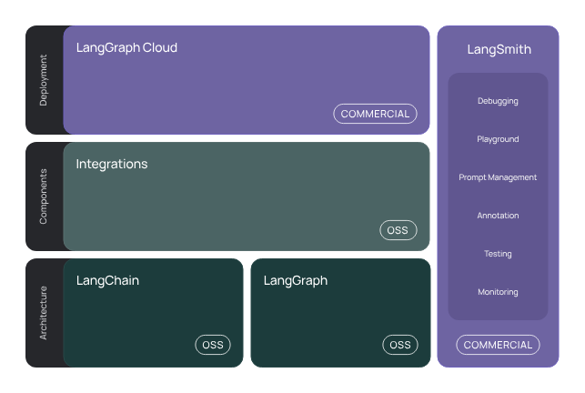
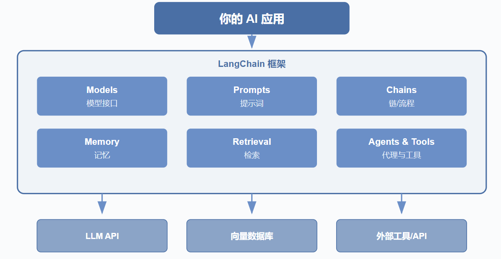

# 目录

- [1 简介](#1-简介)
- [2 安装](#2-安装)
- [3 一个简单的 LLM 应用](#3-一个简单的-llm-应用)
  - [3.1 使用语言模型](#31-使用语言模型)
  - [3.2 输出解析器](#32-输出解析器)
  - [3.3 提示词模板](#33-提示词模板)
  - [3.4 langSmith](#34-langsmith)
  - [3.5 LangServe](#35-langserve)
- [4 聊天机器人](#4-聊天机器人)
  - [4.1 加入提示词模板](#41-加入提示词模板)
  - [4.2 管理对话历史](#42-管理对话历史)
  - [4.3 流式处理](#43-流式处理)
- [5 向量存储和检索器](#5-向量存储和检索器)
  - [5.1 文档](#51-文档)
  - [5.2 向量存储](#52-向量存储)
  - [5.3 检索器](#53-检索器)
- [6 Agent](#6-agent)

---
# 1 简介
LangChain 是一个用于开发由大型语言模型 (LLMs) 驱动的应用程序的框架。



框架由以下开源库组成

- langchain-core: 基础抽象和LangChain表达式 (LCEL)。

- langchain-community: 第三方集成。

- 合作伙伴库（例如 langchain-openai、langchain-anthropic 等）：一些集成已进一步拆分为自己的轻量级库，仅依赖于 langchain-core。

- langchain: 组成应用程序认知架构的链、代理和检索策略。

- LangGraph: 通过将步骤建模为图中的边和节点，构建强大且有状态的多参与者应用程序。与LangChain无缝集成，但也可以单独使用。

- LangServe: 将LangChain链部署为REST API。

- LangSmith: 一个开发者平台，让您调试、测试、评估和监控LLM应用程序。



# 2 安装
>```bash
>pip install langchain
>```
或使用conda
>```bash
>conda install langchain -c conda-forge
>```

# 3 一个简单的 LLM 应用
这个应用将把文本从英语翻译成另一种语言。

这是一个相对简单的 LLM 应用 - 只需一次 LLM 调用加上一些提示。

尽管如此，这是一个很好的开始使用 LangChain 的方式 - 许多功能只需一些提示和一次 LLM 调用就可以构建！

>```bash
>pip install langchain-openai
>```

## 3.1 使用语言模型


```python
from langchain_openai import ChatOpenAI
from dotenv import load_dotenv
import os

load_dotenv()
api_key = os.getenv('DASHSCOPE_API_KEY')
if not api_key:
    print('缺少API_key')

chatLLM = ChatOpenAI( # 适配阿里云百炼
    api_key = api_key,
    base_url = "https://dashscope.aliyuncs.com/compatible-mode/v1",
    model = 'qwen1.5-7b-chat'
)

messages = [
    {'role':'system','content':'You are a helpful assistant'},
    {'role':'user','content':'你是谁?'}
]

response = chatLLM.invoke(messages)
print(response.model_dump_json())
# response.content # 只打印content

# 输出：
# {"content":"我是阿里云推出的一种超大规模语言模型，我叫通义千问。",
#  "additional_kwargs":{"refusal":null},
#  "response_metadata":{"token_usage":{"completion_tokens":17,
#                                      "prompt_tokens":21,
#                                      "total_tokens":38,
#                                      "completion_tokens_details":null,
#                                      "prompt_tokens_details":null
#                                       },
#                       "model_provider":"openai",
#                       "model_name":"qwen1.5-7b-chat",
#                       "system_fingerprint":null,
#                       "id":"chatcmpl-1ba47ead-d95d-989d-9926-66587a8520c8",
#                       "finish_reason":"stop",
#                       "logprobs":null
#                       },
#  "type":"ai",
#  "name":null,
#  "id":"lc_run--019d295c-cafd-7653-9c1f-14c059953fb9-0",
#  "tool_calls":[],
#  "invalid_tool_calls":[],
#  "usage_metadata":{"input_tokens":21,
#                    "output_tokens":17,
#                    "total_tokens":38,
#                    "input_token_details":{},
#                    "output_token_details":{}
#                                         }
# }
```


```python
from langchain_openai import ChatOpenAI
from dotenv import load_dotenv
import os

load_dotenv()

model = ChatOpenAI(
    api_key = os.getenv('DASHSCOPE_API_KEY'),
    base_url = "https://dashscope.aliyuncs.com/compatible-mode/v1",
    model = 'qwen1.5-7b-chat'
)

# os.environ["OPENAI_API_KEY"] = getpass.getpass() 直接使用OpenAI的key与模型
# model = ChatOpenAI(model='gpt-4')

messages = [
    {'role':'system','content':'You are a helpful assistant'},
    {'role':'user','content':'你好！'}
]

model.invoke(messages)
```

## 3.2 输出解析器
注意到，模型的响应是一个AIMessage。

包含一个字符串响应以及关于响应的其他元数据。我们通常可能只想处理字符串响应。

1. 通过使用简单的输出解析器来解析出这个响应。

2. 我们可以将模型与此输出解析器“链式”连接。

这意味着在此链中，每次都会调用此输出解析器。

我们可以使用` | `运算符轻松创建链。` | `运算符在 LangChain 中用于将两个元素组合在一起。


```python
from langchain_core.output_parsers import StrOutputParser

parser = StrOutputParser()

# 1.
result = model.invoke(messages)
parser.invoke(result)
# 2.
chain = model | parser
chain.invoke(messages)
```

## 3.3 提示词模板


```python
from langchain_core.prompts import PromptTemplate   

template = "将以下内容翻译成英文 : {text}"

prompts = PromptTemplate(
    template = template,
    input_variables=["text"]
)

chain = prompts | model | parser
# 或
# chain = (
#     prompts
#     | model
#     | parser
# )

chain.invoke({'text':'你好'})
```

## 3.4 langSmith
使用 LangChain 构建的许多应用程序将包含多个步骤和多次调用大型语言模型。 随着这些应用变得越来越复杂，能够检查您的链或代理内部究竟发生了什么变得至关重要。 

做到这一点的最佳方法是使用 LangSmith。

1. 访问[langSmith官网](https://smith.langchain.com/) 点击 “Sign Up” 用邮箱注册。

2. 登录后，进入 “Settings > API Keys” 生成 API Key，也可创建项目用于组织追踪和数据集，默认项目为 “default”。

3. 在终端设置export LANGCHAIN_TRACING_V2=true开启追踪，  
    export LANGCHAIN_API_KEY=<your - api - key>，  
    export LANGCHAIN_PROJECT=<your - project - name>（可选，不设置则日志归到默认项目）。  
    也可在 Python 代码中通过os.environ设置，如os.environ["LANGCHAIN_TRACING_V2"] = "true"。

4. 运行包含 LangChain 组件的代码后登录 LangSmith 平台，进入项目查看 “Traces” 页面，应能看到运行日志。    

## 3.5 LangServe
现在我们已经构建了一个应用程序，我们需要提供服务。这就是 LangServe 的用武之地。 

LangServe 帮助开发者将 LangChain 链部署为 REST API。

安装方式：
>```bash
>pip install "langserve[all]"
>```

创建一个 Python 文件`serve.py`

这个文件将包含我们服务应用的逻辑。它由三部分组成：

- 我们刚刚构建的链的定义

- 我们的 FastAPI 应用

- 一个定义用于服务链的路由，这通过 langserve.add_routes 完成


```python
#!/usr/bin/env python
from fastapi import FastAPI
from langchain_core.prompts import ChatPromptTemplate
from langchain_core.output_parsers import StrOutputParser
from langchain_openai import ChatOpenAI
from langserve import add_routes

# 1. Create prompt template
system_template = "Translate the following into {language}:"
prompt_template = ChatPromptTemplate.from_messages([
    ('system', system_template),
    ('user', '{text}')
])

# 2. Create model
model = ChatOpenAI()

# 3. Create parser
parser = StrOutputParser()

# 4. Create chain
chain = prompt_template | model | parser


# 4. App definition
app = FastAPI(
  title="LangChain Server",
  version="1.0",
  description="A simple API server using LangChain's Runnable interfaces",
)

# 5. Adding chain route
add_routes(
    app,
    chain,
    path="/chain",
)

if __name__ == "__main__":
    import uvicorn

    uvicorn.run(app, host="localhost", port=8000)
```

执行文件

>```bash
>python serve.py
>```

在 http://localhost:8000 看到我们的链被服务。

每个 LangServe 服务都配有一个简单的 内置用户界面，用于配置和调用应用，支持流式输出并可查看中间步骤。 

前往 http://localhost:8000/chain/playground/ 试用，输入与之前相同的内容 - {"text": "你好"} - 它应该会像之前一样响应。

现在让我们设置一个客户端，以便以编程方式与我们的服务进行交互。

我们可以使用 langserve.RemoteRunnable 做到这一点。 

使用这个，我们可以像在客户端运行一样与服务的链进行交互。


```python
from langserve import RemoteRunnable

remote_chain = RemoteRunnable("http://localhost:8000/chain/")
remote_chain.invoke({"text": "你好"})
```

# 4 聊天机器人
我们将通过一个示例来设计和实现一个基于大型语言模型的聊天机器人。 这个聊天机器人将能够进行对话并记住之前的互动。

我们可以使用消息历史类来包装我们的模型，使其具有状态。 这将跟踪模型的输入和输出，并将其存储在某个数据存储中。 

未来的交互将加载这些消息，并将其作为输入的一部分传递给链。

我们可以导入相关类并设置我们的链，该链包装模型并添加此消息历史。

这里的一个关键部分是我们作为 get_session_history 传入的函数。这个函数预计接受一个 session_id 并返回一个消息历史对象。

这个 session_id 用于区分不同的对话，并应作为配置的一部分在调用新链时传入。


```python
import os
from dotenv import load_dotenv

from langchain_openai import ChatOpenAI

from langchain_core.output_parsers import StrOutputParser
from langchain_core.prompts import PromptTemplate
from langchain_core.messages import HumanMessage
from langchain_core.chat_history import BaseChatMessageHistory,InMemoryChatMessageHistory
from langchain_core.runnables.history import RunnableWithMessageHistory

load_dotenv()
store = {}

def get_session_history(session_id:str) -> BaseChatMessageHistory:
    if session_id not in store:
        store[session_id] = InMemoryChatMessageHistory()  # session_id 是键，InMemoryChatMessageHistory() 是对应的值。
    return store[session_id]    

chatmodel = ChatOpenAI(
    api_key = os.getenv('DASHSCOPE_API_KEY'),
    base_url = "https://dashscope.aliyuncs.com/compatible-mode/v1",
    model = 'qwen1.5-7b-chat'
)
# chatmodel.invoke([HumanMessage(content='Hi')])

with_message_history = RunnableWithMessageHistory(chatmodel,get_session_history)
# 我们现在需要创建一个 config，每次都传递给可运行的部分。这个配置包含的信息并不是直接作为输入的一部分，但仍然是有用的。在这种情况下，我们想要包含一个 session_id
config = {"configurable": {"session_id": "A1"}}

response1 = with_message_history.invoke(
    [HumanMessage(content="Hi,I'm Floaritay")],
    config=config
)
response1.content

response2 = with_message_history.invoke(
    [HumanMessage(content="What's my name")],
    config=config
)
response2.content

# 如果我们更改配置以引用不同的 session_id，我们可以看到它开始新的对话。
# 然而，我们始终可以回到原始对话（因为我们将其保存在数据库中）
# 这里的 “数据库” 实际上是通过 Python 的字典 store 在内存中模拟实现的。
# 如果希望实现本地持久化存储会话历史，可以考虑使用真正的数据库如 SQLite
```


    'Your name is Floaritay.'


## 4.1 加入提示词模板
提示词模板帮助将原始用户信息转换为大型语言模型可以处理的格式。

在这种情况下，原始用户输入只是一个消息，我们将其传递给大型语言模型。

现在让我们使其变得更复杂一些。让我们添加一个带有一些自定义指令的系统消息。

首先，让我们添加一个系统消息。为此，我们将创建一个 ChatPromptTemplate。我们将利用 MessagesPlaceholder 来传递所有消息。


```python
from dotenv import load_dotenv
import os

from langchain_openai import ChatOpenAI
from langchain_core.prompts import ChatPromptTemplate,MessagesPlaceholder
from langchain_core.messages import HumanMessage
from langchain_core.chat_history import InMemoryChatMessageHistory,BaseChatMessageHistory
from langchain_core.runnables import RunnableWithMessageHistory

load_dotenv()
store = {}

chatmodel = ChatOpenAI(
    api_key = os.getenv('DASHSCOPE_API_KEY'),
    base_url = "https://dashscope.aliyuncs.com/compatible-mode/v1",
    model = 'qwen1.5-7b-chat'
)

prompt = ChatPromptTemplate(
    [("system","You are a helpful assistant. Answer all questions to the best of your ability.",),MessagesPlaceholder(variable_name="messages"),]
) 

chain = prompt | chatmodel

# response = chain.invoke({'messages':[HumanMessage(content="Hi,I'm Floaritay")]}) # 传递的是一个包含 messages 键的字典，其中包含一系列消息，而不是传递消息列表。
# response.content
# 输出：'Hello, Floaritay! How can I assist you today? If you have any questions or need information on a specific topic, feel free to ask.'
# 我们现在可以将其包装在与之前相同的消息历史对象中

def get_session_history(session_id:str) -> BaseChatMessageHistory:
    if session_id not in store:
        store[session_id] = InMemoryChatMessageHistory()
    return store[session_id]

with_message_history = RunnableWithMessageHistory(chain,get_session_history)
config = {'configurable':{'session_id':'A2'}}

response1 = with_message_history.invoke(
    [HumanMessage(content="Hi,I'm Floaritay")],
    config=config
)
response1.content
```


    'Hello, Floaritay! How can I assist you today? If you have any questions or need information on a specific topic, feel free to ask.'


```python
response2 = with_message_history.invoke(
    [HumanMessage(content="What's my name")],
    config=config
)
response2.content
```


    'Your name is Floaritay.'


现在让我们使我们的提示变得更复杂一点。

在提示中添加了一个新的 language 输入。

我们现在可以调用链并传入我们选择的语言。


```python
prompt = ChatPromptTemplate.from_messages(
    [
        ('system',
        "You are a helpful assistant. Answer all questions to the best of your ability in {language}."
        ),
        MessagesPlaceholder(variable_name='messages'),
    ]
)
chain = prompt | chatmodel

with_message_history = RunnableWithMessageHistory(chain,get_session_history,input_messages_key='messages')

config = {'configurable':{'session_id':'A3'}}
response3 = with_message_history.invoke(
    {'messages':[HumanMessage(content="Hi,I'm Floaritay")],'language':'Chinese'},
    config=config
)
response3.content
```


    '你好，Floaritay！有什么我可以帮你的吗？如果有问题或者需要咨询，尽管说吧。'


## 4.2 管理对话历史
如果不加以管理，消息列表将无限增长，并可能溢出大型语言模型的上下文窗口。因此，添加一个限制您传入消息大小的步骤是很重要的。

注意：在提示模板之前但在从消息历史加载之前的消息之后执行此操作。

我们可以通过在提示前添加一个简单的步骤，适当地修改 messages 键，然后将该新链封装在消息历史类中来实现。


```python

```

## 4.3 流式处理 
大型语言模型有时可能需要一段时间才能响应，因此为了改善用户体验，大多数应用程序所做的一件事是随着每个令牌的生成流回。这样用户就可以看到进度。

所有链都暴露一个.stream方法，使用消息历史的链也不例外。我们可以简单地使用该方法获取流式响应。


```python
config = {'configurable':{'session_id':'A3'}}
for r in with_message_history.stream(
    {
        'messages': [HumanMessage(content="Hi,I'm Floaritay")],
        'language':'Chinese' 
    },
    config=config
):
    print(r.content)
```


```python
from langchain_openai import ChatOpenAI
import os


llm = ChatOpenAI(
    api_key=os.getenv("DASHSCOPE_API_KEY"),
    base_url="https://dashscope.aliyuncs.com/compatible-mode/v1", 
    model="qwen-plus",
    tream_usage=True
    )

messages = [
    {"role":"system","content":"You are a helpful assistant."}, 
    {"role":"user","content":"你是谁？"},
]
response = llm.stream(messages)

for chunk in response:
    print(chunk.model_dump_json())
```

# 5 向量存储和检索器
从（向量）数据库和其他来源检索数据，以便与大型语言模型工作流集成。

## 5.1 文档
LangChain 实现了一个 文档 抽象，旨在表示一个文本单元及其相关元数据。它有两个属性：
- page_content：一个表示内容的字符串；
- metadata：一个包含任意元数据的字典。

metadata 属性可以捕获有关文档来源、与其他文档的关系以及其他信息。请注意，单个 Document 对象通常表示一个较大文档的一部分。


```python
from langchain_core.documents import Document
# 在这里，我们生成了五个文档，包含指示三个不同“来源”的元数据。
documents = [
    Document(
        page_content="Dogs are great companions, known for their loyalty and friendliness.",
        metadata={"source": "mammal-pets-doc"},
    ),
    Document(
        page_content="Cats are independent pets that often enjoy their own space.",
        metadata={"source": "mammal-pets-doc"},
    ),
    Document(
        page_content="Goldfish are popular pets for beginners, requiring relatively simple care.",
        metadata={"source": "fish-pets-doc"},
    ),
    Document(
        page_content="Parrots are intelligent birds capable of mimicking human speech.",
        metadata={"source": "bird-pets-doc"},
    ),
    Document(
        page_content="Rabbits are social animals that need plenty of space to hop around.",
        metadata={"source": "mammal-pets-doc"},
    ),
]
```

## 5.2 向量存储
向量搜索是一种常见的存储和搜索非结构化数据（例如非结构化文本）的方法。其思想是存储与文本相关联的数值向量。

给定一个查询，我们可以将其 嵌入 为相同维度的向量，并使用向量相似性度量来识别存储中的相关数据。

LangChain 向量存储 对象包含用于将文本和 文档 对象添加到存储中以及使用各种相似性度量进行查询的方法。

它们通常使用 嵌入 模型进行初始化，这决定了文本数据如何转换为数值向量。

要实例化一个向量存储，我们通常需要提供一个 嵌入 模型，以指定文本应如何转换为数值向量。这里我们将使用阿里云嵌入模型。


```python

```

## 5.3 检索器
LangChain VectorStore 对象不继承 Runnable，因此无法立即集成到 LangChain 表达式 chains 中。

LangChain 检索器 是 Runnables，因此它们实现了一组标准方法（例如，同步和异步的 invoke 和 batch 操作），并设计为可以纳入 LCEL 链中。

我们可以自己创建一个简单版本，而无需继承 Retriever。如果我们选择希望用于检索文档的方法，我们可以轻松创建一个可运行的对象。下面我们将围绕 similarity_search 方法构建一个：

# 6 Agent


