# 目录


---
**引用资料**  
https://blog.csdn.net/qq_36816848/article/details/122286610?ops_request_misc=%257B%2522request%255Fid%2522%253A%252297b8cfef9715fbe9c31808d5428f70ab%2522%252C%2522scm%2522%253A%252220140713.130102334..%2522%257D&request_id=97b8cfef9715fbe9c31808d5428f70ab&biz_id=0&utm_medium=distribute.pc_search_result.none-task-blog-2~all~top_positive~default-1-122286610-null-null.142^v102^pc_search_result_base5&utm_term=%E6%B7%B1%E5%BA%A6%E5%AD%A6%E4%B9%A0&spm=1018.2226.3001.4187

# 深度学习概念
发展历程

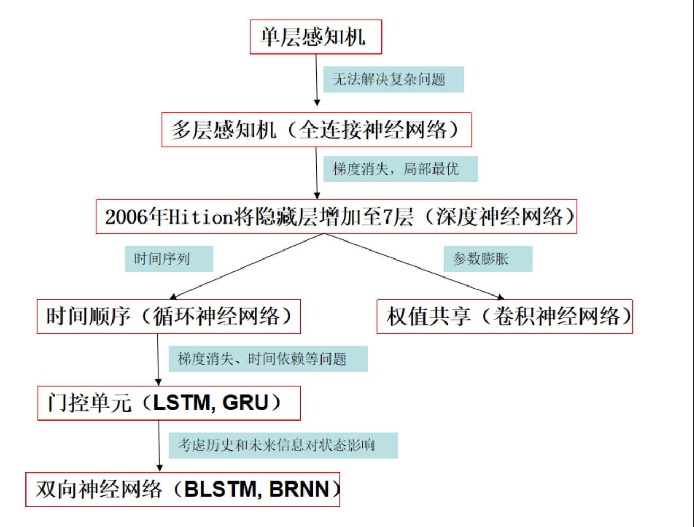

## 深度学习定义
深度学习定义：一般是指通过训练多层网络结构对未知数据进行分类或回归

深度学习分类：

- 有监督学习方法——深度前馈网络、卷积神经网络、循环神经网络等；

- 无监督学习方法——深度信念网、深度玻尔兹曼机，深度自编码器等。

深度学习的思想：

深度神经网络的基本思想是通过构建多层网络，对目标进行多层表示，以期通过多层的高层次特征来表示数据的抽象语义信息，获得更好的特征鲁棒性

## 深度学习主要术语
**--基础概念**  

张量 (Tensor)  

维度 (Dimension)  

数据类型 (Data Type)   

**--模型构建**  

神经元 (Neuron)  

层 (Layer)  

神经网络 (Neural Network)  

激活函数 (Activation Function)：赋予神经网络非线性特性的函数，作用于神经元的加权求和结果。常见的激活函数有 Sigmoid 函数、ReLU函数、tanh 函数等。  

损失函数 (Loss Function)：常见的损失函数有均方误差损失MSE，常用于回归任务；交叉熵损失，常用于分类任务。

**--模型训练**  

优化器 (Optimizer)  ：调整模型参数以最小化损失函数的算法。常见的优化器有随机梯度下降（SGD）及其变种，如 Adagrad、Adadelta、Adam 等。

梯度 (Gradient)  ：损失函数关于模型参数的导数，指示了损失函数在参数空间中上升最快的方向，优化器通过反向传播计算梯度，并沿梯度的反方向更新参数，以降低损失函数值。

反向传播 (Backpropagation)  ：通过链式法则将损失函数对输出层的梯度反向传播到网络的每一层，从而计算出损失函数对每个参数的梯度，为参数更新提供依据。

学习率 (Learning Rate)  ：优化器在每次更新参数时步长的大小，它决定了模型在参数空间中搜索最优解的速度。

批量大小 (Batch Size)  

迭代 (Epoch)  

**--模型评估与应用**
过拟合 (Overfitting)  

欠拟合 (Underfitting)  

泛化能力 (Generalization Ability)  

准确率 (Accuracy)  

召回率 (Recall)   

F1 值 (F1 - score)  

# 神经网络ANNs基础

## 感知机
神经元是神经网络的基本计算单元。每个神经元接收多个输入，每个输入都对应一个权重。  

神经元首先对输入进行加权求和：z=∑_i=1_n w_i * x_i + b  

其中b是偏置（bias）

然后，加权求和的结果z会通过一个激活函数f，得到神经元的输出y=f(z)  

激活函数赋予了神经元非线性特性，使得神经网络能够学习复杂的函数关系。  

## 多层感知机
多层感知机由感知机推广而来，最主要的特点是有多个神经元层，因此也叫深度神经网络。

**结构**
- 输入层：负责接收外部数据，它的神经元数量通常取决于输入数据的维度。例如，对于一张28×28像素的灰度图像，输入层神经元数量为28×28=784

- 隐藏层：位于输入层和输出层之间，不直接与外部数据交互。隐藏层可以有一层或多层，每一层都由多个神经元组成。  
隐藏层的作用是对输入数据进行特征提取和转换，将原始数据映射到一个更高层次的特征空间。不同隐藏层学习到的特征逐渐从简单的局部特征过渡到复杂的全局特征 。

- 输出层：在分类任务中，输出层的神经元数量通常等于类别数，输出值可以是概率分布，表示输入数据属于各个类别的可能性；
在回归任务中，输出层一般只有一个神经元，输出一个连续值 。

**全连接层**  
在全连接层中，每一个神经元都与上一层的所有神经元相连。假设上一层有m个神经元，当前层有n个神经元，那么这两层之间就有m×n个权重参数。

全连接层可以对输入数据进行线性变换，公式为y=f(Wx+b)，其中x是上一层的输出向量，W是权重矩阵，b是偏置向量，f是激活函数 。

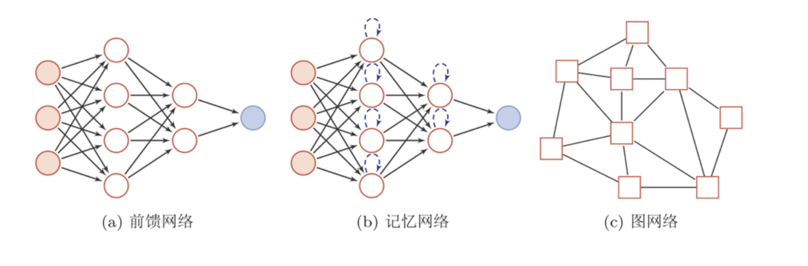  
其中圆形节点表示一个神经元，方形节点表示一组神经元

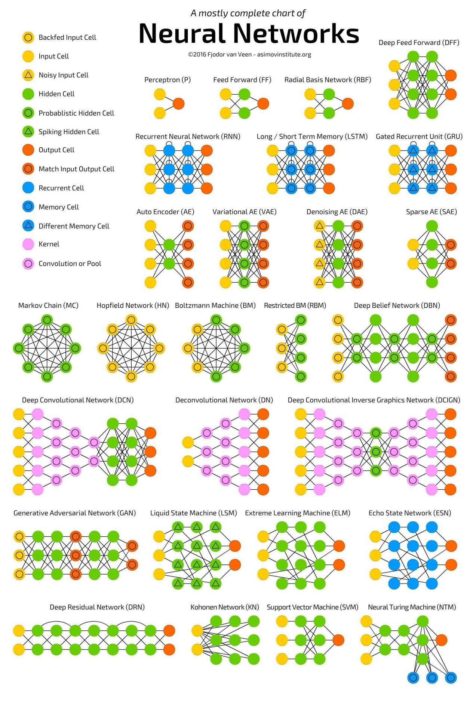

## 前向传播
神经网络的计算主要有两种：

前向传播（foward propagation, FP）作用于每一层的输入，通过逐层计算得到输出结果；  

反向传播（backward propagation, BP）作用于网络的输出，通过计算梯度由深到浅更新网络参数。

## 反向传播
**损失函数**

为了衡量神经网络预测结果与真实值之间的差异，需要定义一个损失函数L

在回归任务中，常用均方误差损失函数，在分类任务中，常用交叉熵损失函数

**反向传播**  

反向传播是一种高效计算损失函数关于神经网络参数梯度的算法。

它基于链式法则，从输出层开始，将损失函数对输出层的梯度反向传播到每一层，从而计算出损失函数对每一个权重和偏置的梯度。

例如，对于上述三层神经网络，先计算损失函数L对输出层输出 y^​ 的梯度 ∂L/∂y^
​
然后通过链式法则计算对隐藏层输出h的梯度 ∂L/∂h = ∂L/∂y^ * ∂y^/∂h

​进而计算对隐藏层权重W 1和偏置b 1的梯度 。

**参数更新**  

计算出梯度后，使用优化器来更新神经网络的参数。最常用的优化器是随机梯度下降（SGD）及其变种。

SGD 的基本思想是在每次迭代中，沿着损失函数梯度的反方向更新参数，更新公式为 w_t+1 = w_t − η * ∂L/∂wt
​
其中wt是当前参数值，η是学习率，

∂L/∂wt是损失函数关于参数w在当前时刻的梯度 

通过不断迭代更新参数，使损失函数逐渐减小，从而让神经网络学习到数据中的模式和规律 。

# 超参数
超参数是在开始学习过程之前设置值的参数，而不是通过训练得到的参数数据。通常情况下，需要对超参数进行优化，给学习机选择一组最优超参数，以提高学习的性能和效果

比如学习率、梯度下降法迭代的数量、隐藏层数目、隐藏层单元数目、激活函数都需要根据实际情况来设置，这些数字实际上控制了最后的参数和的值，所以它们被称作超参数。

## 超参数搜索算法
- 猜测和检查：根据经验或直觉，选择参数，一直迭代。
- 网格搜索：让计算机尝试在一定范围内均匀分布的一组值。
- 随机搜索：让计算机随机挑选一组值。
- 贝叶斯优化：使用贝叶斯优化超参数，会遇到贝叶斯优化算法本身就需要很多的参数的困难。
- MITIE方法：在好的初始猜测的前提下进行局部优化。  
它使用BOBYQA算法，并有一个较优的起始点。由于BOBYQA只寻找最近的局部最优解，所以这个方法是否成功很大程度上取决于是否有一个好的起点。  
在MITIE的情况下，我们知道一个好的起点，但这不是一个普遍的解决方案，因为通常你不会知道好的起点在哪里。这种方法非常适合寻找局部最优解。
- 最新提出的LIPO的全局优化方法。这个方法没有参数，而且经验证比随机搜索方法好。

## 超参数搜索一般过程
1. 将数据集划分成训练集、验证集及测试集。
2. 在训练集上根据模型的性能指标对模型参数进行优化。
3. 在验证集上根据模型的性能指标对模型的超参数进行搜索。
4. 步骤 2 和步骤 3 交替迭代，最终确定模型的参数和超参数，在测试集中验证评价模型的优劣。

# 激活函数
激活函数将非线性特性引入到神经网络中。没有激活函数的每层都相当于矩阵相乘。输出仅是一个简单的线性函数。  
激活函数可以把当前特征空间通过一定的线性映射转换到另一个空间，让数据能够更好的被分类。

**为什么激活函数需要非线性函数**

假若网络中全部是线性部件，那么线性的组合还是线性，输出就是一个简单的线性函数。这样就做不到用非线性来逼近任意函数。  
使用非线性激活函数，使网络表示输入输出之间非线性的复杂的任意函数映射。

**常见激活函数**  
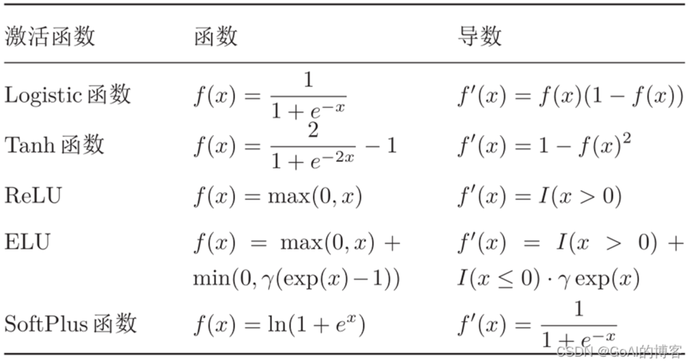  
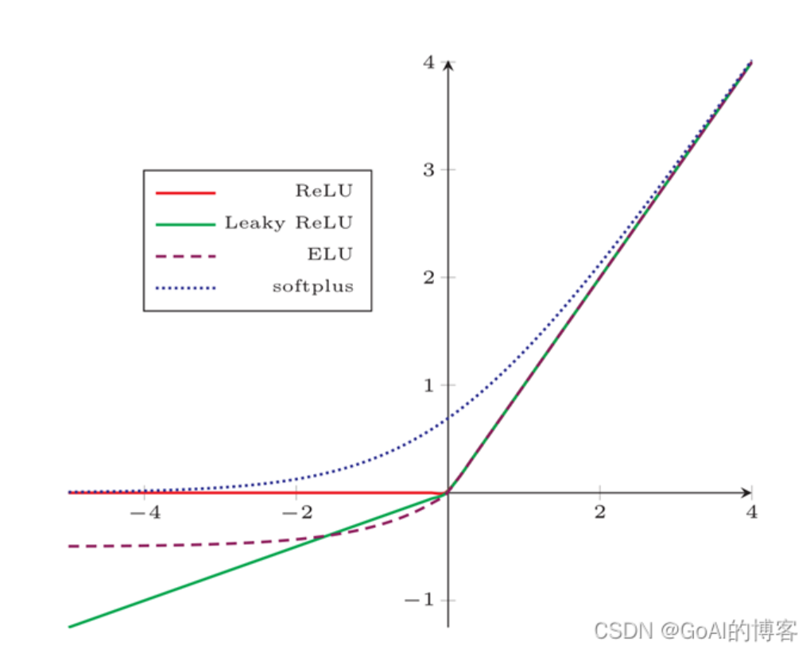

**引用资料**  
https://ai-wx.blog.csdn.net/article/details/104729911  
https://ai-wx.blog.csdn.net/article/details/118914829   

详解各激活函数（归一化层，“神经元死亡” 现象）  
https://blog.csdn.net/JNingWei/article/details/79210904  
总结  
https://www.cnblogs.com/wj-1314/p/12015278.html  


# 优化方法
深度学习网络训练过程可以分成两大部分：前向计算过程与反向传播过程。

反向传播是为了将设定的网络中的众多参数一步步调整，使得预测结果能更加贴近真实值。

那么，在反向传播过程中，很重要的一点就是：参数如何更新？

显然，参数应该是朝着目标损失函数下降最快的方向更新，即最小化损失函数！

## 梯度下降算法
**什么是梯度下降算法**  
一种常用的一阶迭代优化算法，用于求解无约束优化问题，在深度学习中被广泛应用于训练模型，以最小化损失函数。

**什么是梯度**  
梯度是一个向量，它在函数中的每一点都指向函数增长最快的方向。  
对于一个多元函数 J(θ1,θ2​,⋯,θn)，其梯度表示为∇J=(∂J/∂θ1, ∂J/∂θ2,⋯, ∂J/∂θn)。  
例如，对于函数J(θ) = θ1^2 + θ2^2，∇J=(2θ1,2θ2)。

**基本思想**  
为了找到损失函数的最小值，需要沿着与梯度相反的方向移动。因为梯度指向函数增长最快的方向，那么其反方向就是函数下降最快的方向。

每次移动的距离由学习率（learning rate）决定。

**算法公式**  
单变量情况:  
假设我们有一个单变量损失函数J(θ)，梯度下降算法通过不断更新θ来最小化J(θ)。  更新公式为：θ = θ − α *  ∂J(θ)/∂θ    
例如，对于函数J(θ)=(θ−2)^2，其导数∂J(θ)/∂θ=2(θ−2)。若初始θ=5，学习率α=0.1，则第一次更新后θ=5−0.1×2×(5−2)=5−0.6=4.4。  

多变量情况：  
对于多元函数J(θ1,θ2​,⋯,θn)，更新公式为：θi = θi − α * J(θ1,θ2​,⋯,θn)/∂θi。这里θi是函数的参数。  
在深度学习中，损失函数L通常是关于模型参数W和b（例如权重和偏置）的多元函数，我们通过上述公式更新W和b来最小化损失函数。

**引用资料**  
https://zhuanlan.zhihu.com/p/22252270   
Pytorch中优化器与学习率衰减方法总结  
https://blog.csdn.net/ys1305/article/details/94332643

### 批量梯度下降法 BGD
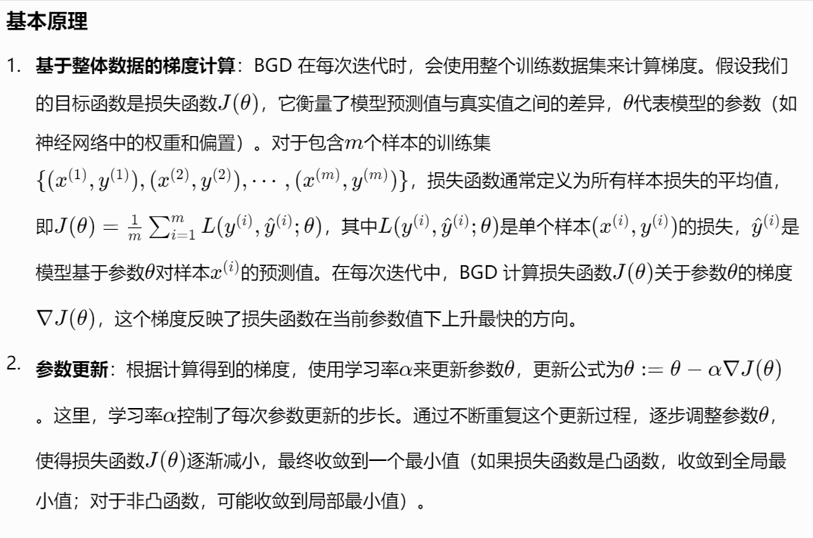  
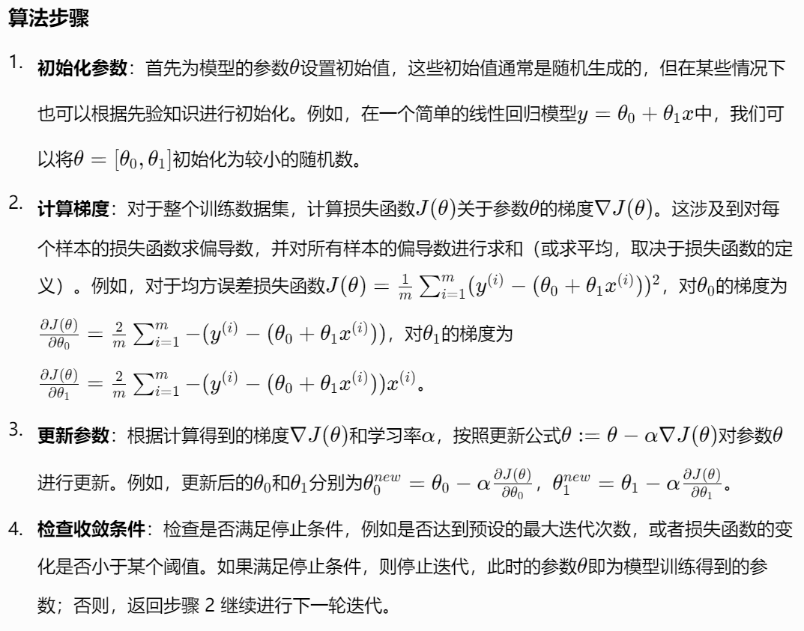  
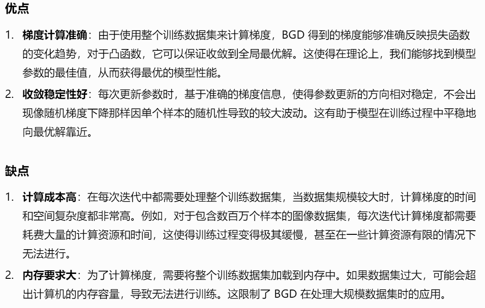  

**计算示例**  
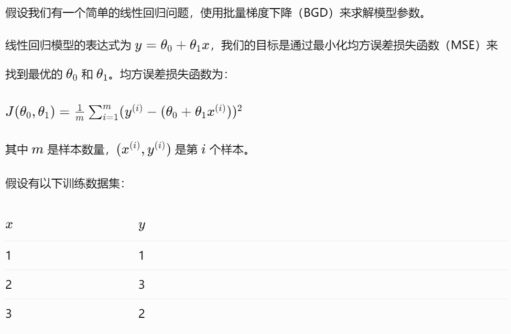  
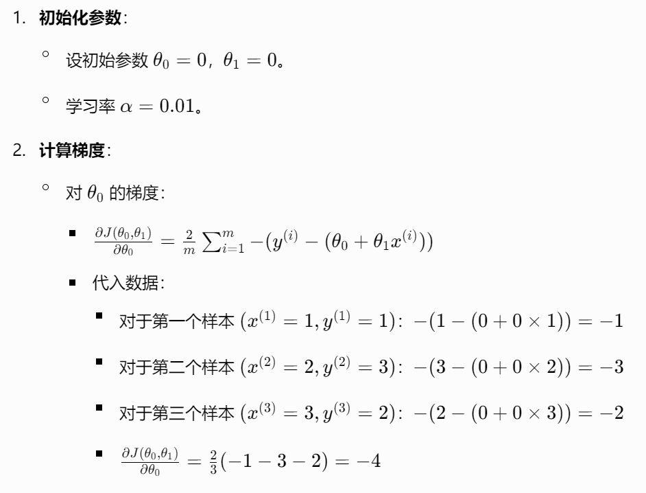 
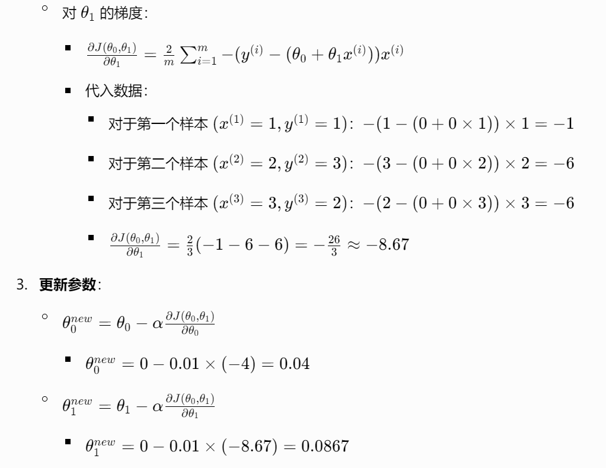  
新的参数 θ0 =0.04，θ1 =0.0867，再次计算梯度并更新参数，直到满足收敛条件（如损失函数变化小于某个阈值或达到最大迭代次数）。

### 随机梯度下降 SGD
每次迭代（更新参数）只使用``单个训练样本``   
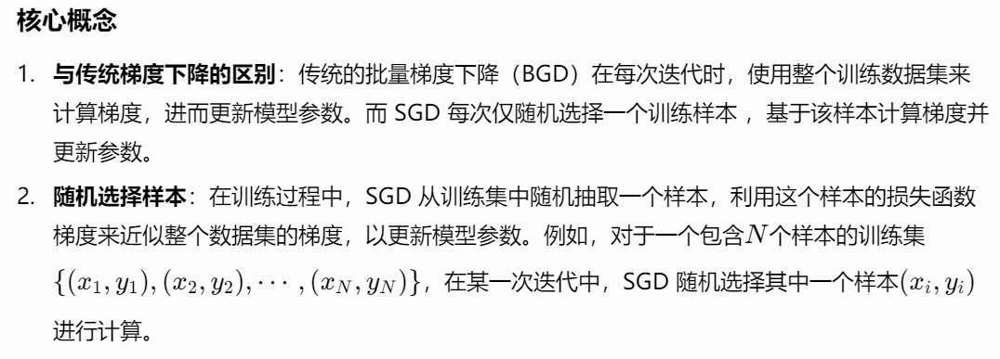
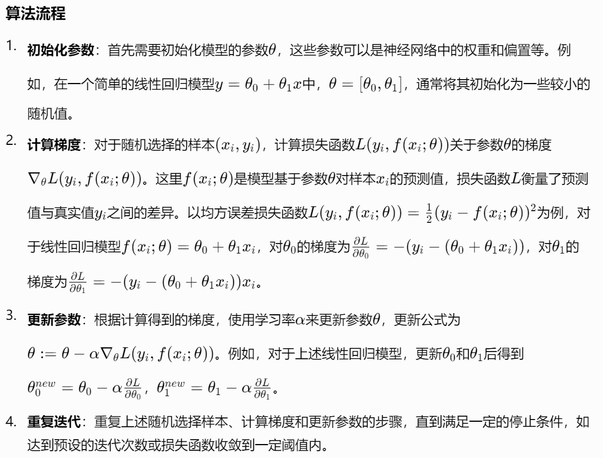

优点：  
SGD 一次迭代只需对一个样本进行计算，因此运行速度很快。

缺点：   
1. 由于单个样本的随机性，实际过程中，目标损失函数值会剧烈波动，  
一方面，SGD 的波动使它能够跳到新的可能更好的局部最小值。  
另一方面，使得训练永远不会收敛，而是会一直在最小值附近波动。  
2. 一次迭代只计算一张图片，没有发挥GPU并行运算的优势，使得整体计算的效率不高。
3. 由于梯度的不稳定性，SGD 通常难以收敛到精确的全局最优解，而是收敛到一个接近全局最优解的区域。

### 小批量梯度下降法 MBGD
**核心原理**  
小批量数据计算梯度：  
MBGD 每次迭代使用一小部分训练样本（称为一个小批量，batch）来计算梯度。损失函数通常定义为小批量内样本损失的平均值,然后根据这个梯度来更新参数

参数更新：  
利用计算得到的小批量梯度，结合学习率α，按照θ=θ−α∇J(θ)的公式更新参数。通过不断重复这个过程，遍历整个训练数据集多次（称为 epoch），逐步调整参数θ，使损失函数最小化

**优势**  
计算效率与稳定性平衡：  
相比于 BGD，MBGD 每次只处理小部分数据，大大减少了计算量，提高了训练速度，尤其适用于大规模数据集。
与 SGD 相比，由于使用多个样本计算梯度，MBGD 的梯度估计相对更稳定，减少了因单个样本随机性导致的参数更新波动，使得模型收敛过程更加平稳。  

**劣势**  
小批量大小选择：  
小批量大小b的选择较为关键。在实际应用中，需要通过实验来确定合适的小批量大小。

收敛速度：  
尽管 MBGD 在大多数情况下收敛速度较快，但在某些复杂的非凸问题中，可能仍然无法快速收敛到全局最优解或接近全局最优解的区域，
相较于一些自适应学习率的优化算法，如 Adam，可能需要更多的迭代次数。  


### 自适应学习率AdaGrad
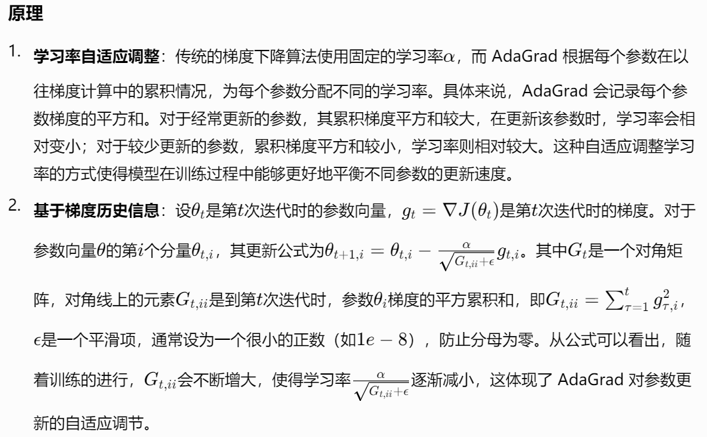
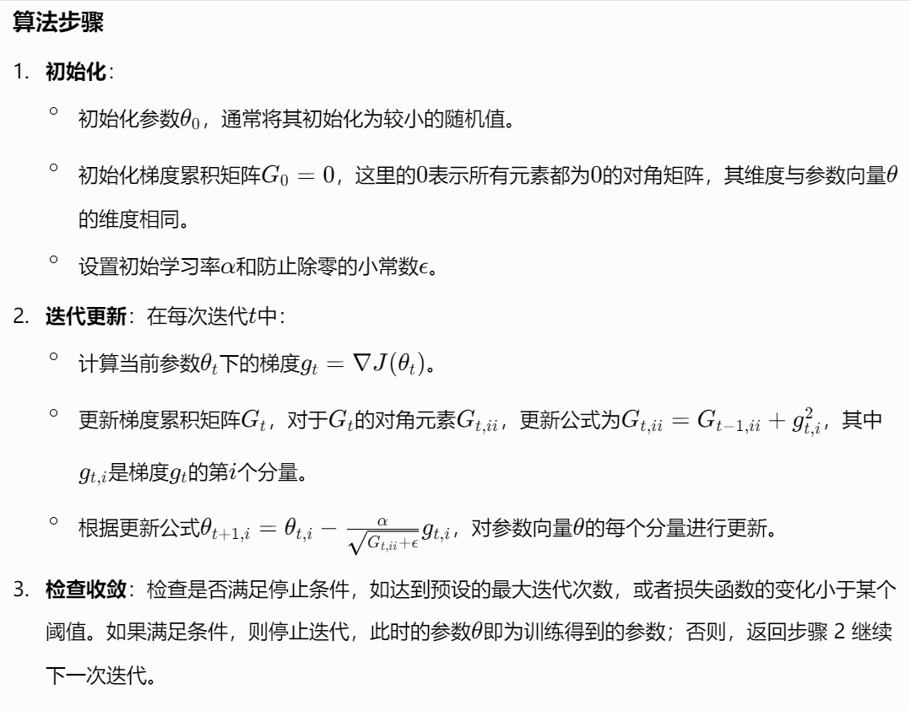  
**优势**   
自适应学习率：  
无需手动调整每个参数的学习率，算法能够自动根据参数的更新情况调整学习率。AdaGrad 可以为不同参数提供合适的学习率。

处理稀疏数据：  
对于数据集中出现频率较低的特征（稀疏数据），其对应的参数更新频率也较低，AdaGrad 会为这些参数分配较大的学习率，使得模型能够更好地捕捉这些稀疏特征的信息。

**劣势**  
学习率单调递减：  
随着训练的进行，梯度累积矩阵的对角元素不断增大，导致学习率单调递减，最终可能变得极小。
这会使得参数更新步伐越来越小，导致模型训练后期收敛速度极慢，甚至可能无法收敛到最优解。  

超参数依赖：  
虽然 AdaGrad 减少了对学习率手动调整的需求，但对初始学习率α和防止除零的小常数ϵ的选择仍然较为敏感。

### AdaDelta
Adagrad的改进，解决了 Adagrad 学习率单调递减且过早衰减的问题，能够在训练过程中动态调整学习率。   
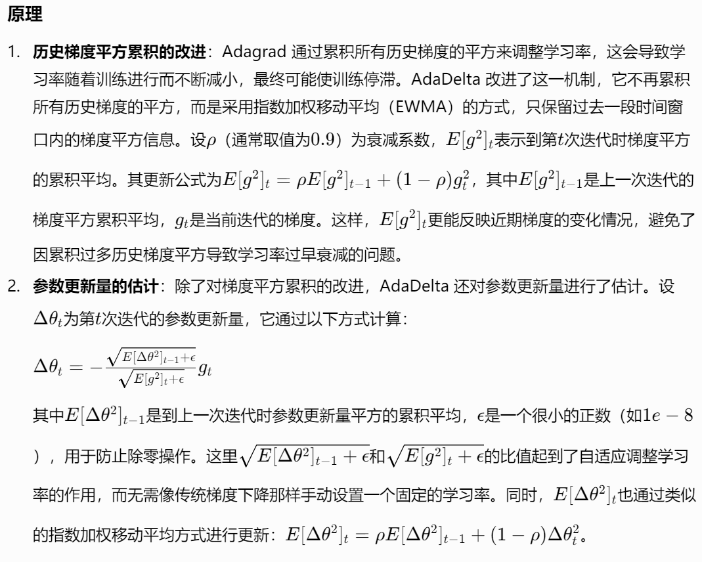
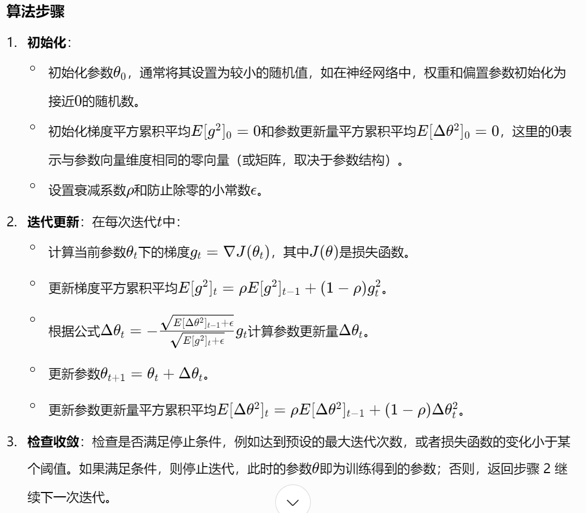

**优势**  
无需手动设置学习率：AdaDelta 通过自身机制动态调整学习率。  

对非平稳目标函数适应性强：  
在处理非平稳目标函数（如复杂的损失函数）时，AdaDelta 能够根据梯度的变化动态调整学习率，更好地适应目标函数的变化，从而提高模型的收敛速度和稳定性。

有效避免学习率过早衰减：  
通过采用指数加权移动平均的方式更新梯度平方累积平均，AdaDelta 避免了 Adagrad 中学习率过早衰减的问题

**劣势**  
对超参数敏感：虽然 AdaDelta 不需要手动设置学习率，但它对衰减系数ρ和防止除零的小常数ϵ比较敏感。

计算依赖历史信息：  
由于 AdaDelta 的计算依赖于过去的梯度和参数更新量信息，在某些情况下对梯度变化的响应可能不够及时   
特别是在梯度突然发生较大变化时，可能需要一定的时间来调整学习率以适应新的梯度情况。

### RMSProp
AdaDelta的一个特例  
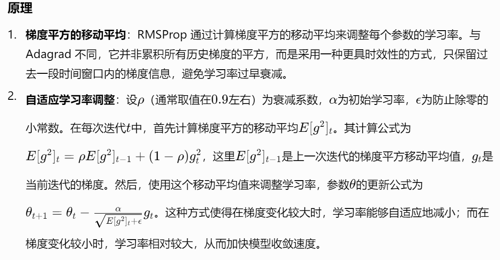

**优势**  
避免学习率过早衰减：  
RMSProp 通过引入梯度平方的移动平均，克服了 Adagrad 中学习率随时间单调递减且过早衰减的问题。  
它能够根据近期梯度的变化动态调整学习率，使得模型在训练后期仍能保持一定的学习能力，加快收敛速度。

对非平稳目标函数有效：  
在深度学习中，损失函数往往是非平稳的，其表面可能包含许多局部起伏。  
RMSProp 能够适应这种非平稳性，通过对梯度变化的及时响应，更好地在复杂的损失函数表面找到最优解。

相对简单易调参：  
相比于一些复杂的自适应优化算法，RMSProp 的超参数相对较少，主要涉及初始学习率α、衰减系数ρ和防止除零的小常数ϵ。

**劣势**   
对梯度一阶矩利用不足：  
RMSProp 主要关注梯度的二阶矩（平方的平均）来调整学习率，对梯度的一阶矩（梯度的平均）利用不足。  
可能导致在某些复杂问题上的收敛效果不如同时利用一阶矩和二阶矩的算法，如 Adam 算法。  

可能陷入局部最优解：  
尽管 RMSProp 在收敛速度和处理非平稳目标函数方面表现良好，但像其他基于梯度的优化算法一样，它仍然有可能陷入局部最优解，尤其是在处理非常复杂的非凸优化问题时。


### Adam
结合了 Adagrad 和 RMSProp 的优点，通过计算梯度的一阶矩估计（均值）和二阶矩估计（方差），自适应地调整每个参数的学习率。
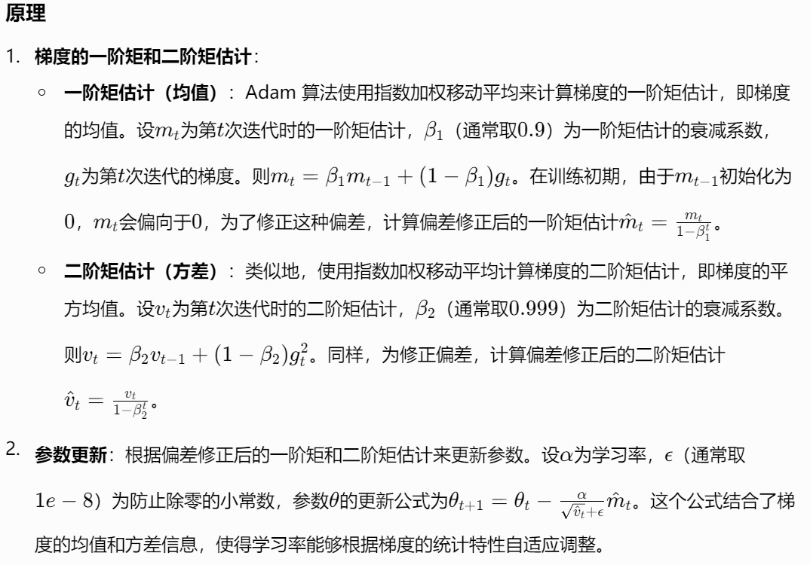
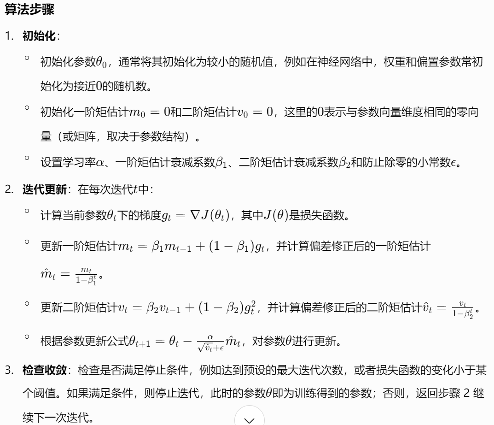

**优势**  
收敛速度快：Adam 结合了梯度的一阶矩和二阶矩信息，自适应地调整学习率，收敛更快。

鲁棒性强：   
对不同类型的问题和数据集都具有较好的适应性，无需过多地调整超参数就能取得不错的效果。 
其自适应的学习率调整机制使得它在处理非平稳目标函数和具有噪声的梯度时表现出色，能够在各种复杂的情况下稳定地更新参数。

计算效率高：   
Adam 的计算过程相对简单，主要涉及梯度计算、一阶矩和二阶矩估计的更新以及参数更新，这些计算操作在现代深度学习框架中都能高效实现。  
同时，由于其快速收敛的特性，在达到相同的训练效果时，往往比其他算法需要更少的迭代次数，进一步提高了计算效率。

**劣势**  
可能陷入局部最优解：  
尽管 Adam 在收敛速度和鲁棒性方面表现优秀，但像大多数基于梯度的优化算法一样，它仍然有可能陷入局部最优解，特别是在处理非常复杂的非凸优化问题时。

对超参数的依赖：  
虽然 Adam 对超参数的敏感性相对较低，但学习率α、一阶矩估计衰减系数β1和二阶矩估计衰减系数β2等超参数的选择仍然会影响模型的训练效果。

### Momentum 模拟动量
一种在梯度下降优化算法基础上引入的技术，用于加速模型收敛并减少振荡，尤其在处理复杂的损失函数地形时表现出色。  

**原理**    
Momentum 的核心思想源于物理学中的动量概念。在梯度下降过程中，每次参数更新不仅考虑当前梯度，还结合之前更新的 “方向惯性”。  
想象一个小球在损失函数的 “地形” 上滚动，它不仅受当前坡度（梯度）影响，还保留了之前滚动方向的部分动量。  
这有助于小球（参数更新）更直接地朝着最优解滚动，而不会在局部起伏中频繁改变方向。

**参数更新公式：**  
设θ_t为第t次迭代时的参数向量，g_t = ∇J(θ_t)为第t次迭代的梯度，α为学习率，β（通常取值在0.9左右）为动量因子。引入一个速度变量v_t，它表示参数更新的方向和速度。  

速度更新公式为v_t =β * v_(t−1) + α * g_t    

参数更新公式为θ_(t+1) =θ_t − v_t  

从公式可以看出，v_t不仅包含当前梯度g_t，还通过β * v_(t−1)保留了上一次速度的信息。  

β的作用类似于摩擦力，它使得速度在每次迭代中逐渐衰减，但同时也保留了部分之前的更新方向，帮助参数更新在稳定方向上加速。

**算法步骤**
1. 初始化：
  - 初始化参数θ_0，通常初始化为接近0的随机数。
  - 初始化速度v_0 =0，这里的0表示与参数向量维度相同的零向量。
  - 设置学习率α和动量因子β。

2. 迭代更新：
  - 计算当前参数θ_t下的梯度g_t
  - 速度更新v_t = β * v_(t−1) + α * g_t
  - 更新公式θ_(t+1) =θ_t − v_t

3. 检查收敛：

**优势**    
加速收敛：   
在损失函数的梯度方向较为一致的情况下，Momentum 能够加速参数更新。  
因为它在更新过程中积累了之前的梯度信息，使得参数更新方向更稳定，从而更快地朝着最优解移动。  
例如，在一个具有长而窄的 “山谷” 形状的损失函数中，传统梯度下降可能会在山谷两侧来回振荡，而 Momentum 可以借助之前的更新方向，沿着山谷快速下降，大大缩短收敛时间。  

减少振荡：  
在梯度方向频繁变化的区域，Momentum 可以平滑梯度的影响，减少参数更新的振荡。  
由于速度变量综合了多个梯度信息，不会因单次梯度的剧烈变化而产生大幅度的方向改变，有助于模型更稳定地收敛。  

**劣势**  
超参数依赖：Momentum 对学习率α和动量因子β较为敏感。  

可能错过最优解：  
虽然 Momentum 有助于加速收敛，但在某些情况下，由于它具有一定的惯性，可能会在接近最优解时 “冲过” 最优解，导致无法准确收敛到全局最优解。  
尤其是在最优解附近梯度变化较小的情况下，Momentum 可能无法及时调整更新方向，从而错过最优解。  

## 启发式算法

# 损失函数
在机器学习任务中，大部分监督学习算法都会有一个目标函数,算法对该目标函数进行优化，称为优化算法的过程。  
例如在分类或者回归任务中，使用损失函数( Loss Function )作为其目标函数对算法模型进行优化 。

不同的损失函数在梯度下降过程中的收敛速度和性能都是不同的。  
均方误差作为损失函数收敛速度慢，可能会陷入局部最优解；  
而交叉熵作为损失函数的收敛速度比均方误差快，且较为容易找到函数最优解。

## 回归-损失函数

### 均方误差损失（MSE）
### 平均绝对误差损失函数（MAE）
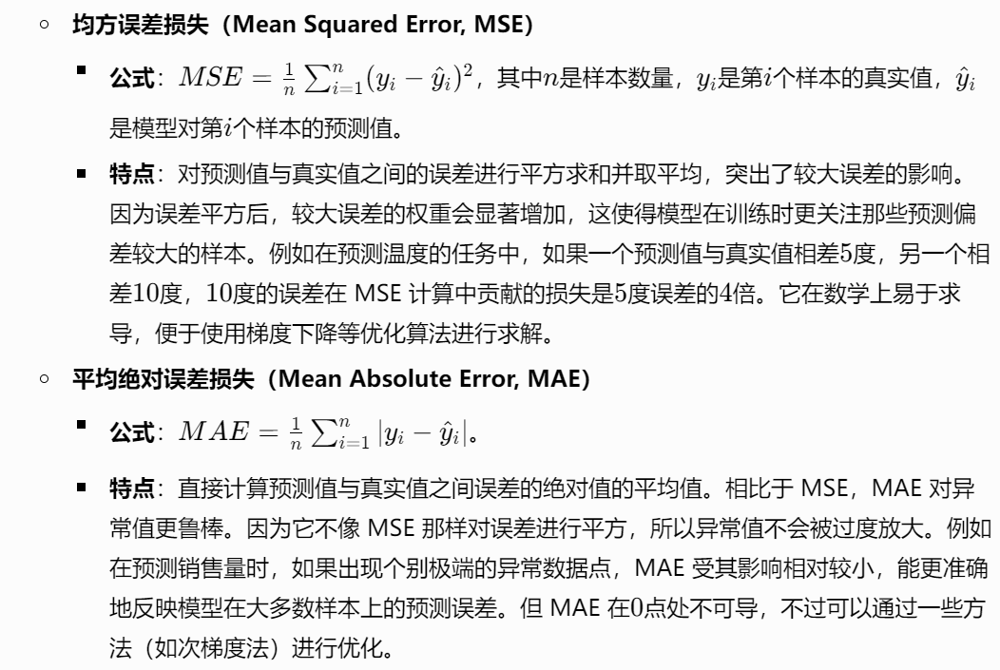  


```python
import numpy as np
def mean_squared_error(y_true, y_pred):
    return np.mean(np.square(y_pred - y_true), axis=-1)

def mean_absolute_error(y_true, y_pred):
    return np.mean(np.abs(y_pred - y_true), axis=-1)
```

### 均方误差对数损失函数（MSLE）

### 平均绝对百分比误差损失函数（MAPE）


```python
def mean_squared_logarithmic_error(y_true, y_pred):
    first_log = np.log(np.clip(y_pred, 10e-6, None) + 1.)
    second_log = np.log(np.clip(y_true, 10e-6, None) + 1.)
    return np.mean(np.square(first_log - second_log), axis=-1)

def mean_absolute_percentage_error(y_true, y_pred):
    diff = np.abs((y_pred - y_true) / np.clip(np.abs(y_true), 10e-6, None))
    return 100 * np.mean(diff, axis=-1)
```

### 小结
均方误差损失函数 MSE 是使用最广泛的，且在大部分情况下有不错的性能。  

平均绝对误差损失函数 MAE 会比较有效地惩罚异常值，如果数据异常值较多，考虑使用其作为损失函数。  
一般情况下，为了不让数据出现太多异常值，可以对数据进行预处理操作。  

均方误差对数损失与均方误差的计算过程类似，多了对每个输出数据进行对数计算，目的是缩小函数输出的范围值。  

平均绝对百分比误差损失则计算预测值与真实值的相对误差。均方误差对数损失与平均绝对百分比误差损失实际上是用来处理大范围数据的  
但是在神经网络中，我们常把输入数据归一化，然后再使用均方误差或者平均绝对误差损失来计算损失。

## 分类-损失函数


### Logistic损失函数

### 负对数似然损失函数
(Negative Log Likelihood Loss)  


### 交叉熵损失函数 
Logistic损失函数和负对数似然损失函数只能处理二分类问题，对于多分类，使用交叉熵损失函数(Cross Entropy Loss)，其定义如下：


```python
def cross_entropy(y_true, y_pred):
    return -np.mean(y_true * np.log(y_pred + 10e-6))
```

### 铰链损失函数
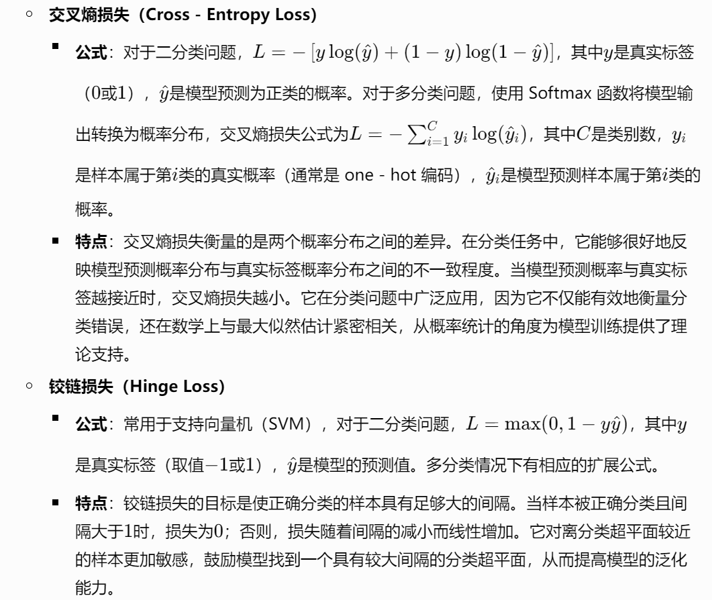

### Hinge损失函数
运用 Hinge 损失的典型分类器是 SVM 算法，因为 Hinge 损失可以用来解决间隔最大化问题。  
当分类模型需要硬分类结果的，例如分类结果是 0 或 1 、 -1或 1 的二分类数据， Hinge 损失是最方便的选择 。  
Hinge 损失函数定义如下：  


### 指数损失函数
使用指数(Exponential)损失函数的典型分类器是 AdaBoost 算法，指数损失函数的定义如下：  


```python
def exponential(y_true, y_pred):
    return np.sum(np.exp(-y_true * y_pred))
```

# CNN

**引用资料**  
https://blog.csdn.net/jiaoyangwm/article/details/80011656

``局部连接``和``权值共享``  
- 通过卷积操作实现局部连接，这个局部区域的大小就是滤波器filter，避免了全连接中参数过多造成无法计算的情况，
- 再通过参数共享来缩减实际参数的数量，为实现多层网络提供了可能


## 局部连接 与 权值共享

1. 局部连接：
  - 在传统的全连接神经网络中，每一层的每个神经元都与下一层的所有神经元相连。而在 CNN 中，局部连接意味着卷积层的神经元仅与输入数据的一个局部区域相连。

  - 一般认为图像的空间联系是``局部的像素联系比较密切，而距离较远的像素相关性较弱``，因此，每个神经元没必要对全局图像进行感知，只要对局部进行感知，然后在更高层将局部的信息综合起来得到全局信息。

  - 每个神经元只与上一层的部分神经元相连，只感知局部，而不是整幅图像。

  - 相比于全连接网络，局部连接大大减少了参数的数量。

2. 参数共享:
  - 共享是指在卷积层中，一个卷积核的所有参数在对输入数据进行卷积操作时是共享的。也就是说，无论卷积核在输入数据的哪个位置进行滑动，其权重参数都保持不变。    
  卷积核共享有个问题：提取特征不充分，可以通过增加多个卷积核来弥补，可以学习多种特征。  

  - 对于一个100x100像素的图像，如果我们用一个神经元来对图像进行操作，这个神经元大小就是100x100=10000，  
  如果我们使用10x10的卷积核，我们虽然需要计算多次，但我们需要的参数只有10x10=100个，加上一个偏向b，一共只需要101个参数。我们取得图像大小还是100x100。

  - 一个卷积核只能提取一个特征，所以我们需要多几个卷积核，假设我们有6个卷积核，我们就会得到6个Feature Map，将这6个Feature Map组成一起就是一个神经元。这6个Feature Map我们需要101*6=606个参数。这个值和10000比还是比较小的。

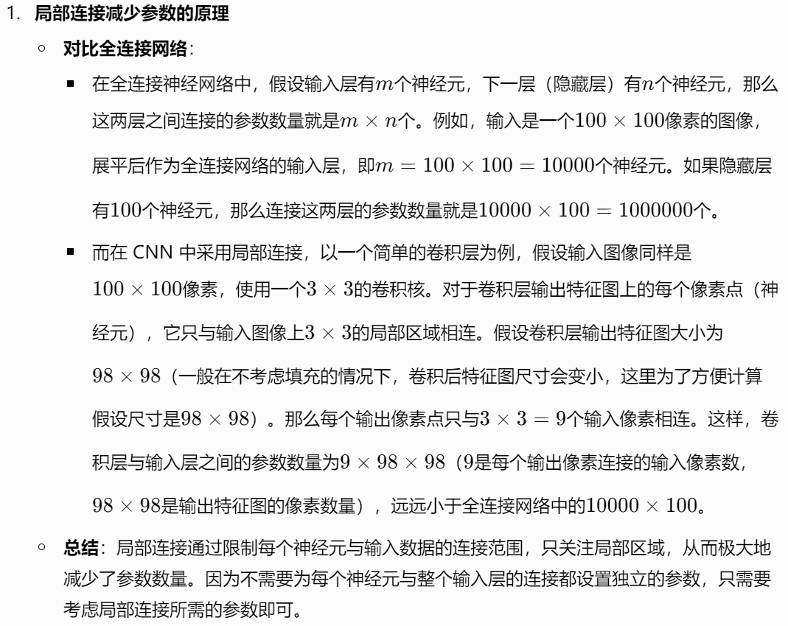  
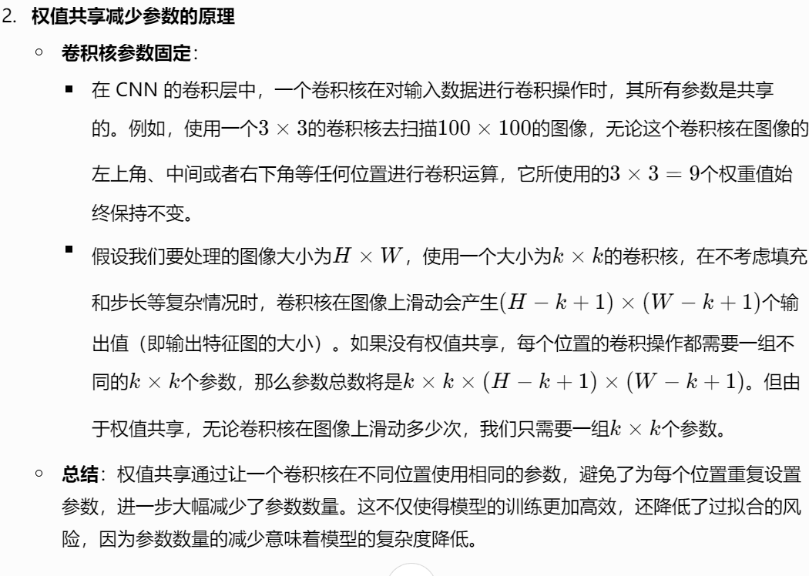


**参数计算**  
在局部连接且有权值共享的情况下，参数计算：  
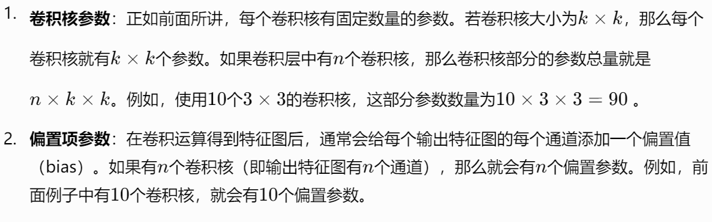  
没有权值共享时：  
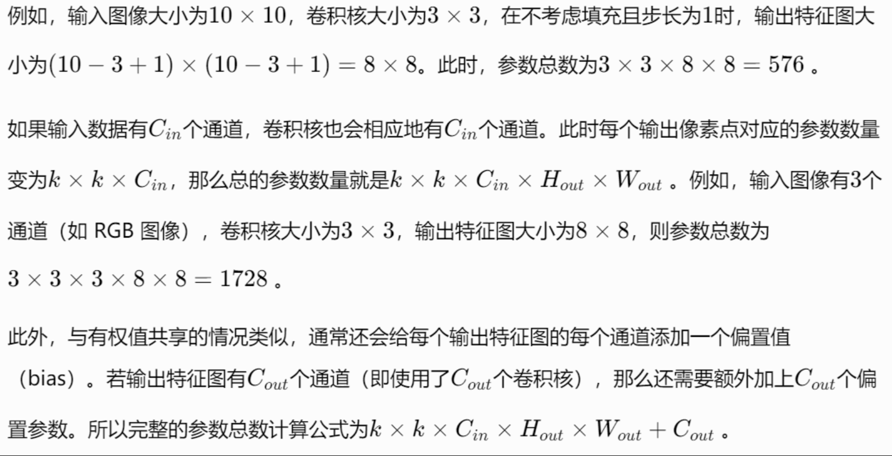

## 卷积层
卷积是一种有效提取图片特征的方法。  
一般用一个正方形卷积核，遍历图片上的每一个像素点。  
图片与卷积核重合区域内相对应的每一个像素值，乘卷积核内相对应点的权重，然后求和， 再加上偏置后，最后得到输出图片中的一个像素值。  
图片分灰度图和彩色图，卷积核可以是单个也可以是多个。  

因此卷积操作分以下三种情况：  
1. 单通道输入，单卷积核  
  

2. 多通道输入，单卷积核  
卷积核通道数等于输入图片的通道数，每个通道都会随机生成 9 个待优化的参数，一共有 27 个待优化参数 w 和一个偏置 b。   
  
>注：这里还是单个卷积核的情况，但是一个卷积核可以有多个通道。默认情况下，卷积核的通道数等于输入图片的通道数。  

3. 多通道输入，多卷积核
以3通道输入，2个卷积核为例：  
  
图中输入X:[1,h,w,3]指的是：输入1张高h宽w的3通道图片。  
卷积核W:[k,k,3,2]指的是：卷积核尺寸为3*3，通道数为3，个数为2。  

卷积操作后，输出的通道数=卷积核的个数    
卷积核的个数和卷积核的通道数是不同的概念。每层卷积核的个数在设计网络时会给出，但是卷积核的通道数不一定会给出。默认情况下，卷积核的通道数=输入的通道数。  
偏置数=卷积核数   

**填充**  
卷积操作中，经常会使用padding对输入进行填充操作。默认在图片周围填充0。  

## 池化层

卷积层通过局部连接和权值共享的机制，显著减少连接的个数(需要训练的参数数量)，但是每一个特征映射的神经元个数并没有显著减少。

例如，输入28×28，用5×5卷积核、步长1、无填充时，输出为24×24的特征图，神经元数量为24×24=576个。

池化层旨在通过降低特征面的分辨率来获得具有空间不变性的特征 。池化层起到二次提取特征的作用，它的每个神经元对局部接受域进行池化操作。

池化层同样基于局部相关性的思想，通过从局部相关的一组元素中进行采样或信息聚合，从而得到新的元素值。通常我们用到两种池化进行下采样：  
（1）最大池化(Max Pooling)，从局部相关元素集中选取最大的一个元素值。  
（2）平均池化(Average Pooling)，从局部相关元素集中计算平均值并返回。  

## 激活函数

## 全连接层
  
权重W个数 + 偏置b的个数  

# CNN经典网络

## LeNet

### 网络结构
LeNet - 5的典型结构包含7层（不包括输入层），由卷积层、池化层和全连接层组成，其结构如下表所示：
|层类型|名称|输入大小|输出大小|说明|
| ---- | ---- | ---- | ---- | ---- |
|输入层|Input|$32\times32$|$32\times32$|原始图像大小|
|卷积层|C1|$32\times32\times1$|$28\times28\times6$|6个$5\times5$卷积核，步长1，填充0|
|池化层|S2|$28\times28\times6$|$14\times14\times6$|$2\times2$平均池化，步长2|
|卷积层|C3|$14\times14\times6$|$10\times10\times16$|16个$5\times5$卷积核，步长1，填充0|
|池化层|S4|$10\times10\times16$|$5\times5\times16$|$2\times2$平均池化，步长2|
|全连接层|F5|$5\times5\times16$|$120\times1$|连接上一层所有神经元|
|全连接层|F6|$120\times1$|$84\times1$| - |
|全连接层|Output|$84\times1$|$10\times1$|10个输出对应10个数字类别|

### 各层功能
1. **卷积层（Convolutional Layers）**
    - **C1层**：输入为单通道的$32\times32$图像。使用6个$5\times5$的卷积核，步长为1且不填充。每个卷积核在输入图像上滑动，通过卷积操作提取不同的局部特征，得到6个特征图，每个特征图大小为$28\times28$ 。卷积操作通过对局部区域的加权求和，能够捕捉图像中的边缘、线条等简单特征 。``例如，某个卷积核可能对水平方向的边缘敏感，另一个对垂直方向的边缘敏感。``
    - **C3层**：输入是S2层输出的6个$14\times14$特征图。使用16个$5\times5$的卷积核，步长为1且不填充，输出16个$10\times10$的特征图。这一层进一步组合和提取上一层的特征，形成更复杂的特征表示。与C1层不同的是，C3层的卷积核并非对所有输入特征图都进行卷积，而是采用了一种更复杂的连接方式，部分卷积核仅连接部分输入特征图，这种方式减少了参数数量，同时增加了特征组合的多样性 。
2. **池化层（Pooling Layers）**
    - **S2层**：采用$2\times2$的平均池化（Average Pooling），步长为2。对C1层输出的每个$28\times28$特征图进行池化操作，将其大小缩小为$14\times14$。池化操作的作用是降低数据维度，减少计算量，同时在一定程度上使特征具有平移不变性。例如，平均池化就是计算$2\times2$窗口内像素的平均值作为池化后的输出值。
    - **S4层**：同样是$2\times2$平均池化，步长为2，对C3层输出的$10\times10$特征图进行处理，得到$5\times5$的特征图。通过这一层，进一步降低数据维度，使模型对图像的微小变化更加鲁棒。
3. **全连接层（Fully - Connected Layers）**
    - **F5层**：将S4层输出的$5\times5\times16$的三维特征图展平为一维向量，长度为$5\times5\times16 = 400$，然后与120个神经元全连接。全连接层对前面提取的特征进行综合处理，将特征映射到一个更高层次的语义空间。
    - **F6层**：输入是F5层的120维向量，与84个神经元全连接。这一层进一步对特征进行变换和组合，为最终的分类做准备。
    - **Output层**：输入为F6层的84维向量，与10个神经元全连接，对应10个数字类别（0 - 9）。这一层通常使用Softmax激活函数，将输出转换为概率分布，表示输入图像属于每个类别的概率 。

### 参数总量
卷积层 C1 总参数量：  
每个卷积核有5×5×1=25个参数（因为输入是单通道），共6个卷积核，所以卷积核参数总数为6×25=150。  
每个卷积核输出一个特征图，会对应一个偏置参数，共6个偏置参数。150+6=156。  

池化层 S2：0  

...

全连接层 F5：  
输入：S4 层输出的16个特征图，每个特征图大小为5×5，将其展平后得到16×5×5=400个神经元。  
输出：该层有120个神经元。  
参数数量为400×120=48000。
每个输出神经元有一个偏置参数，共120个偏置参数。
F5 层总参数量：48000+120=48120。

### 训练过程
1. **损失函数**：LeNet训练时使用交叉熵损失函数，用于衡量模型预测的概率分布与真实标签之间的差异。在数字识别任务中，真实标签是一个独热编码向量，只有对应数字类别的位置为1，其余位置为0。交叉熵损失函数能够有效地指导模型学习，使预测结果尽可能接近真实标签。
2. **优化算法**：在当时，随机梯度下降（SGD）是常用的优化算法。通过计算损失函数关于网络参数（卷积核权重、全连接层权重和偏置等）的梯度，然后沿着梯度的反方向更新参数，以逐步降低损失函数的值。在训练过程中，会设置学习率、迭代次数、批量大小等超参数。学习率决定了每次参数更新的步长，合适的学习率对于模型收敛至关重要；迭代次数决定了模型对整个训练数据集进行学习的轮数；批量大小则决定了每次迭代中用于计算梯度的样本数量。

### 数据大小计算
输入数据的大小 I，卷积和池化核大小 K，相应公式如下：  

1. 卷积层   
**输出高度和宽度**：O = (I + 2P - K) / S + 1  
这里O表示输出数据大小，P为填充值，S为步长  
**输出通道数**：仍为卷积核的输出通道数C_out，所以卷积层输出形状为O×O×C_out  

例如，输入图像边长I = 224，卷积核边长K = 3，步长S = 1，填充P = 1，输出通道数C_out=64，则输出边长O=(224 + 2×1 - 3)/1 +1 = 224，输出形状为224×224×64

2. 池化层     
**输出高度和宽度**：同卷积层  
**输出通道数**：保持与输入通道数C_in一致，所以池化层输出形状为O_O_C_in  

例如，输入特征图边长I = 56，池化核边长K = 2，步长S = 2，无填充（P = 0），则输出边长O=(56 + 2×0 - 2)/2 +1 = 28，输出形状为28×28×C_in

3. 全连接层   
全连接层展平操作不受输入数据高宽相等这一条件影响  
假设上一层输出形状为I×I×C_in，展平后的向量长度为L = I×I×C_in  
如果全连接层有N个神经元，输出大小就是N   
例如，上一层输出边长I = 7，通道数C_in=512，展平后长度为7×7×512 = 25088，若全连接层有4096个神经元，则输出大小为4096

**参数总量计算**  
卷积层：K * K * C_in * 卷积核个数 + 卷积核个数  
>卷积参数 = 卷积核长度x卷积核宽度x输入通道数x输出通道数+输出通道数（偏置）  
>卷积计算量 = 输出数据大小x卷积核长度x卷积核宽度x输入通道数  

池化层：0  
全连接层：输入神经元个数 * 输出神经元个数 + 输出神经元个数

**为什么一层有多个卷积核**  
一个卷积核可能对水平边缘敏感，另一个卷积核可能更擅长检测垂直方向的边缘。通过使用多个卷积核，网络可以同时提取多种不同的局部特征  

>注意:在卷积神经网络中，尽管输入通道数为 6 且有 16 个卷积核，但输出通道数并不是简单的6×16，而是 16

每个卷积核实际上是三维的，其通道数与输入数据的通道数相同

以当前输入14×14×6为例，每个卷积核大小假设为K×K×6

在进行卷积运算时，对于每个卷积核，它会同时对输入数据的 6 个通道进行二维卷积操作

然后将这 6 个二维卷积的结果相加，得到一个二维特征图（无通道维度）

这就意味着，一个卷积核无论输入通道数是多少，最终只会产生一个二维特征图（不考虑通道）

## AlexNet

### 网络结构
AlexNet包含8层，其中有5层卷积层和3层全连接层，具体结构如下表所示：
|层类型|名称|输入大小|输出大小|卷积核/池化核大小|步长|填充|说明|
| ---- | ---- | ---- | ---- | ---- | ---- | ---- | ---- |
|输入层|Input|$227×227×3$|$227×227×3$| - | - | - |彩色图像输入|
|卷积层|Conv1|$227×227×3$|$55×55×96$|$11×11$|4|0|96个卷积核，ReLU激活|
|池化层|Pool1|$55×55×96$|$27×27×96$|$3×3$|2|0|最大池化|
|卷积层|Conv2|$27×27×96$|$27×27×256$|$5×5$|1|2|256个卷积核，ReLU激活|
|池化层|Pool2|$27×27×256$|$13×13×256$|$3×3$|2|0|最大池化|
|卷积层|Conv3|$13×13×256$|$13×13×384$|$3×3$|1|1|384个卷积核，ReLU激活|
|卷积层|Conv4|$13×13×384$|$13×13×384$|$3×3$|1|1|384个卷积核，ReLU激活|
|卷积层|Conv5|$13×13×384$|$13×13×256$|$3×3$|1|1|256个卷积核，ReLU激活|
|池化层|Pool5|$13×13×256$|$6×6×256$|$3×3$|2|0|最大池化|
|全连接层|FC6|$6×6×256$（展平为9216）|$4096×1$| - | - | - |全连接，ReLU激活|
|全连接层|FC7|$4096×1$|$4096×1$| - | - | - |全连接，ReLU激活|
|全连接层|FC8|$4096×1$|$1000×1$| - | - | - |全连接，Softmax激活用于1000类分类|

### 各层功能
1. **卷积层（Convolutional Layers）**
    - **Conv1**：输入为\(227×227×3\)的彩色图像，使用96个\(11×11\)的卷积核，步长为4且不填充。该层通过较大的卷积核和步长快速降低数据维度，同时提取图像中的低级特征，如边缘、颜色等。卷积操作后经过ReLU激活函数，增加网络的非线性。
    - **Conv2**：输入是Pool1层输出的\(27×27×96\)特征图，使用256个\(5×5\)的卷积核，步长为1，填充为2。这一层进一步提取特征，由于卷积核变小，能捕捉更细致的局部特征。同样经过ReLU激活函数。
    - **Conv3 - Conv5**：这些层使用较小的\(3×3\)卷积核，步长为1，填充为1。Conv3有384个卷积核，Conv4有384个卷积核，Conv5有256个卷积核。较小的卷积核可以在增加网络深度的同时减少参数数量，并且多个卷积层的堆叠可以学习到更复杂的特征表示。
2. **池化层（Pooling Layers）**
    - **Pool1 - Pool5**：均采用最大池化（Max Pooling）操作，池化核大小为\(3×3\)，步长为2且不填充。池化层的主要作用是降低数据维度，减少计算量，同时使特征具有一定的平移不变性。
3. **全连接层（Fully - Connected Layers）**
    - **FC6 - FC8**：FC6将Pool5层输出的\(6×6×256\)（展平为9216）特征向量与4096个神经元全连接，经过ReLU激活函数。FC7同样与4096个神经元全连接并经过ReLU激活。这两层进一步对前面提取的特征进行综合处理，将特征映射到更高层次的语义空间。FC8与1000个神经元全连接，对应ImageNet数据集中的1000个类别，使用Softmax激活函数将输出转换为概率分布，用于分类任务。

### 创新点
1. **使用ReLU激活函数**：传统的激活函数如Sigmoid和tanh在训练过程中容易出现梯度消失问题，导致训练困难。AlexNet使用ReLU（Rectified Linear Unit）激活函数，其表达式为\(f(x) = max(0, x)\)。ReLU在正区间的梯度恒为1，有效避免了梯度消失问题，使得网络可以更快地收敛。
2. **数据增强**：为了增加训练数据的多样性，缓解过拟合，AlexNet采用了数据增强技术。包括对图像进行随机裁剪、水平翻转和颜色抖动等操作。例如，从原始图像中随机裁剪\(227×227\)的区域作为训练样本，这大大增加了训练数据的数量，提高了模型的泛化能力。
3. **Dropout**：Dropout是一种正则化技术，在训练过程中随机将一部分神经元的输出设置为0，这样可以防止神经元之间的过拟合，使得模型学习到更鲁棒的特征。在AlexNet中，FC6和FC7层使用了Dropout，随机失活比例为0.5。
4. **多GPU训练**：由于AlexNet模型规模较大，训练所需的计算资源多。该模型使用了两个GPU进行并行计算，将不同的卷积核分配到不同的GPU上，加速了训练过程。

### 训练技巧
1. **优化算法**：使用随机梯度下降（SGD）算法进行参数更新，设置了初始学习率为0.01，并在训练过程中根据一定策略调整学习率。例如，当验证集准确率不再提升时，将学习率降低为原来的十分之一。
2. **局部响应归一化（LRN）**：在Conv1和Conv2层后使用了局部响应归一化。LRN通过对局部区域内的神经元进行归一化操作，增强了模型的泛化能力。其原理是对同一位置上不同通道的特征进行归一化，使得响应大的通道得到进一步增强，抑制其他通道。 

第一层卷积层使用了11 x 11 的卷积核，卷积核过大导致效果较差

## VGG

## GoogleNet（Inception网络）
   
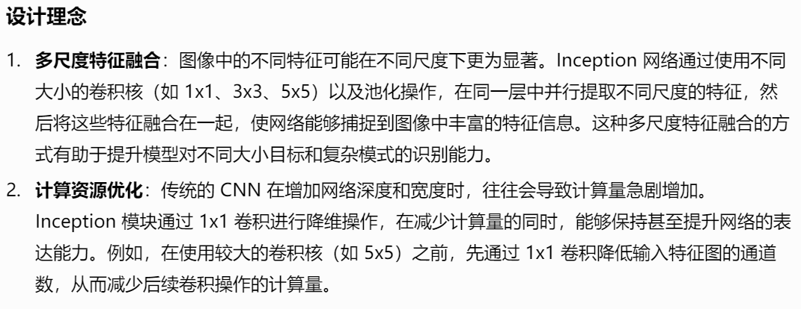  
  
  
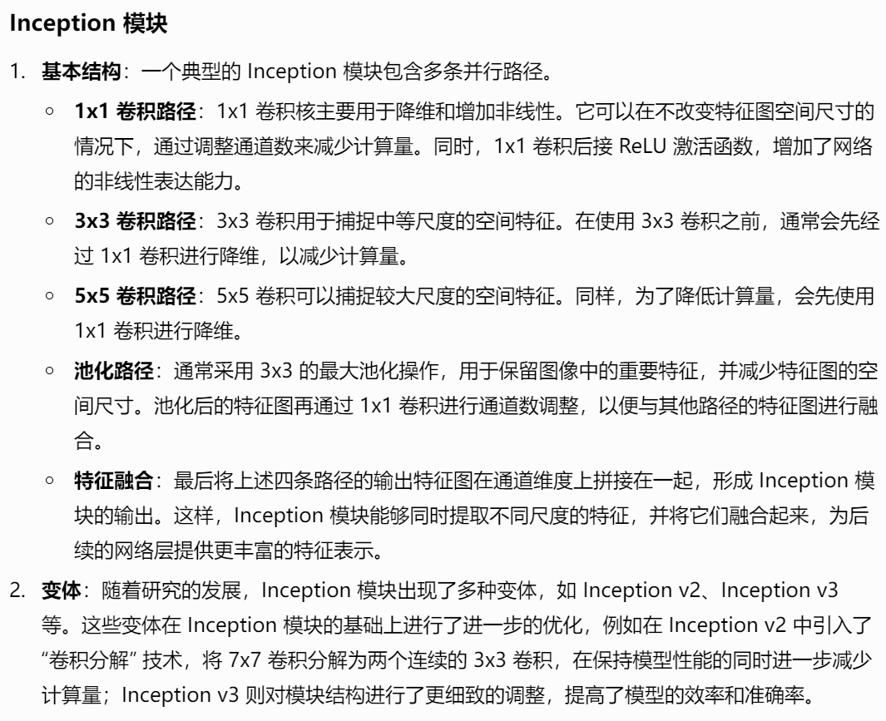 
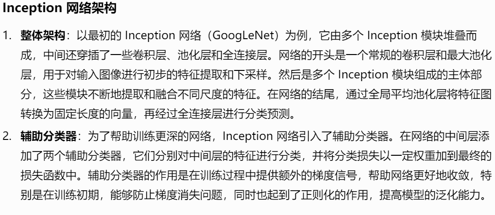 

Inception V1 参数少但效果好的原因除了模型层数更深、表达能力更强外，还有两点：

- 去除了最后的全连接层，用全局平均池化层（即将图片尺寸变为 1x1）来取代它。   
全连接层几乎占据了 AlexNet 或 VGGNet 中 90% 的参数量，而且会引起过拟合，去除全连接层后模型训练更快并且减轻了过拟合。

- Inception V1 中精心设计的 Inception Module 提高了参数的利用效率，其结构如上图所示。  
这一部分也借鉴了 Network In Network 的思想，形象的解释就是 Inception Module 本身如同大网络中的一个小网络，其结构可以反复堆叠在一起形成大网络。


**为什么1 x 1卷积能降维**    
卷积以后通道数变为卷积核个数的数量  

**为什么卷积分解减少参数**  
从感受野的角度看，两个连续的3×3卷积核组合起来的感受野与一个7×7卷积核的感受野相同。  
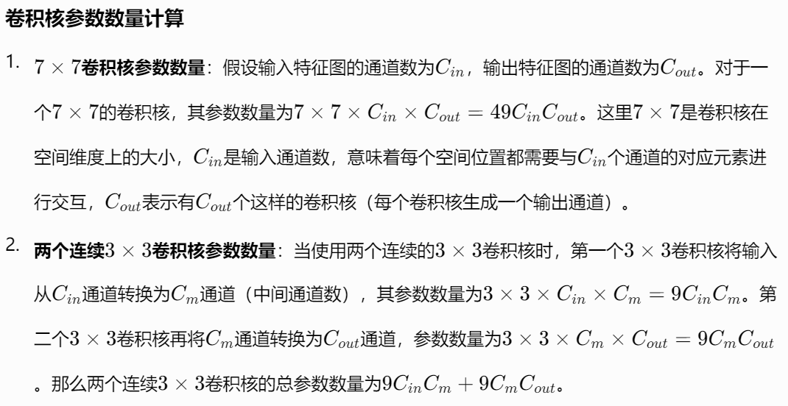

## ResNet
### 原理
假设现有一个比较浅的网络已达到了饱和的准确率，这时在它后面再加上几个恒等映射层（即 y=x，输出等于输入），这样就增加了网络的深度，并且误差不会增加，也即更深的网络不应该带来训练集上误差的上升。

ResNet 引入了残差网络结构（residual network）  
  
借鉴了高速网络的跨层连接的思想，但是对其进行了改进，残差项原本是带权值的，但 ResNet 用恒等映射代替了它。  

当已经学习到较为饱和的准确率，或者发现下层的误差变大时，接下来的目标就转化为恒等映射的学习，也就是使得输入x近似于输出 H(x)，以保持在后面的层次中不会造成精度下降。

上图的残差网络中，通过捷径连接的方式直接将输入x传到输出作为初始结果，输出结果为 H(x)=F(x)+x，当 F(x)=0 时，H(x)=x，也就是恒等映射。

于是，ResNet 相当于将学习目标改变了，不再是学习一个完整的输出，而是目标值H(X)和x的差值，也就是所谓的残差 F(x) := H(x)-x，因此，后面的训练目标就是要将残差结果逼近于 0，使到随着网络加深，准确率不下降。

``学习的目标：目标值 H(x) 和输入 x 的差值，即 F(x):=H(x)-x，将残差逼近于 0，使得随着网络加深，准确率不下降。``

**残差网络**  


### 核心
残差块（Residual Block）：    
一个标准的残差块包含两条路径：  
 - 主路径：通常由多个卷积层（一般是 2 - 3 个）组成，每个卷积层后接批归一化（Batch Normalization，BN）和激活函数（如 ReLU）。  
 卷积层负责提取特征，BN 用于对数据进行归一化处理，加速训练并减少梯度消失或爆炸的风险，ReLU 则增加模型的非线性表达能力。

 - 捷径连接（shortcut connection）：也称为跳跃连接（skip connection），直接将主路径的输入直接加到主路径的输出上。  
 这种连接方式使得网络可以直接学习残差函数，而不是学习完整的输入 - 输出映射，极大地简化了学习过程。

网络整体架构：  
ResNet 由多个残差块堆叠而成，在网络的开头和结尾通常还包含一些常规的卷积层、池化层和全连接层。
例如，在常见的 ResNet - 50 模型中，包含了一个 7x7 的卷积层用于初始特征提取，接着是多个残差块组成的不同阶段，每个阶段包含多个残差块，最后通过全局平均池化层和全连接层得到分类结果。不同深度的 ResNet 模型（如 ResNet - 18、ResNet - 34、ResNet - 101 等）主要区别在于残差块的数量不同。  

### ResNet - 18网络结构
| 层名 | 输出尺寸 | 卷积核大小 | 步长 | 填充 | 输出通道数 | 残差块数量 |
|:------:|:------:|:------:|:------:|:------:|:------:|:------:|
| 卷积层1 | \(112×112×64\) | \(7×7\) | 2 | 3 | 64 | - |
| 最大池化层 | \(56×56×64\) | \(3×3\) | 2 | 1 | - | - |
| 残差块组1 | \(56×56×64\) | - | - | - | 64 | 2 |
| 残差块组2 | \(28×28×128\) | - | - | - | 128 | 2 |
| 残差块组3 | \(14×14×256\) | - | - | - | 256 | 2 |
| 残差块组4 | \(7×7×512\) | - | - | - | 512 | 2 |
| 全局平均池化层 | \(1×1×512\) | - | - | - | - | - |
| 全连接层 | \(1×1×1000\) | - | - | - | - | - |

**注**：
 - 每个残差块内部包含2个卷积层，且每个卷积层后接BN和ReLU激活函数。
 - 不同残差块组之间通过步长为2的卷积层或池化层进行下采样，以减小特征图尺寸并增加通道数。

### ResNet - 50网络结构
| 层名 | 输出尺寸 | 卷积核大小 | 步长 | 填充 | 输出通道数 | 残差块数量 |
|:------:|:------:|:------:|:------:|:------:|:------:|:------:|
| 卷积层1 | \(112×112×64\) | \(7×7\) | 2 | 3 | 64 | - |
| 最大池化层 | \(56×56×64\) | \(3×3\) | 2 | 1 | - | - |
| 残差块组1 | \(56×56×256\) | - | - | - | 256 | 3 |
| 残差块组2 | \(28×28×512\) | - | - | - | 512 | 4 |
| 残差块组3 | \(14×14×1024\) | - | - | - | 1024 | 6 |
| 残差块组4 | \(7×7×2048\) | - | - | - | 2048 | 3 |
| 全局平均池化层 | \(1×1×2048\) | - | - | - | - | - |
| 全连接层 | \(1×1×1000\) | - | - | - | - | - |

**注**：
 - ResNet - 50的残差块采用了Bottleneck结构，每个残差块内部包含3个卷积层，分别为1x1、3x3和1x1卷积核，且每个卷积层后接BN和ReLU激活函数。
 - 同样，不同残差块组之间通过步长为2的卷积层或池化层进行下采样，以改变特征图尺寸和通道数。全连接层的输出维度根据具体任务（如1000类分类任务）而定。 

### 原理
**残差学习：**  
传统神经网络学习的是y=F(x)。  
而在 ResNet 中，网络学习的是残差函数F(x)=H(x)−x，其中H(x)是期望学习的映射，x是输入。   
通过捷径连接，模型实际学习的是y=F(x)+x。   
这种设计的好处在于，如果学习的残差函数F(x)为0，那么输出y就等于输入x，此时网络相当于恒等映射。  
相比于直接学习复杂的映射H(x)，学习残差函数F(x)要容易得多，尤其是当网络深度增加时，这种方式可以有效避免梯度消失问题，使得网络能够更容易收敛。  

**梯度传播：**  
在反向传播过程中，残差结构有助于梯度的顺利传播。
由于捷径连接的存在，梯度可以直接通过捷径连接回传到前面的层，而不会因为网络深度的增加而衰减过多。  

**优势**  
解决深度网络的退化问题：  
通过引入残差结构，ResNet 成功解决了随着网络深度增加而导致的退化问题，使得模型可以在更深的层次上学习到更丰富的特征。

易于训练：  
残差学习的方式使得网络更容易优化，即使网络深度非常深，也能够通过反向传播有效地更新参数。

泛化能力强：  
ResNet 的结构设计使得模型具有较好的泛化能力，不仅在图像分类任务中表现出色，在其他计算机视觉任务如目标检测、语义分割等，以及一些非视觉领域的任务中也被广泛应用，并取得了良好的效果。


# RNN

## 原理结构
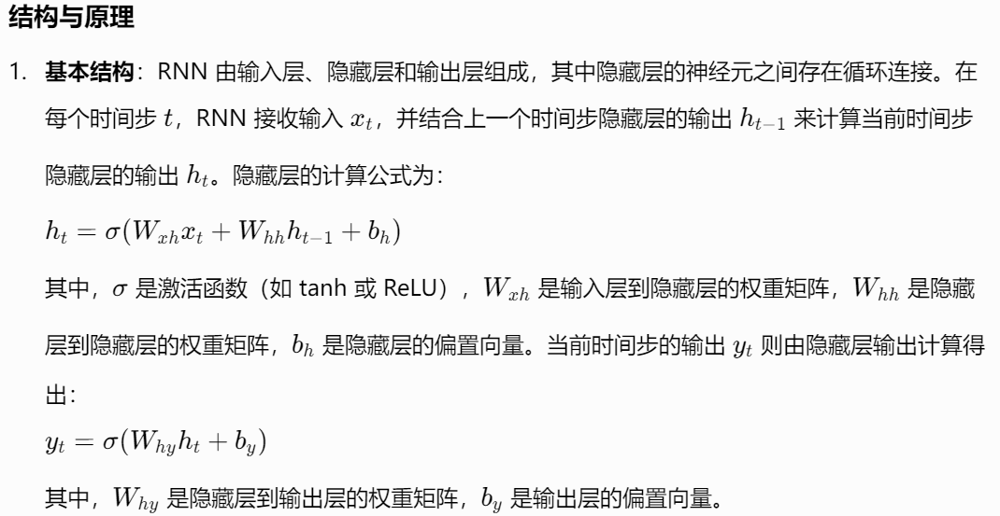
  

**引用资料**  
https://my.oschina.net/u/876354/blog/1621839

## 长期依赖问题
RNN在处理长期依赖（时间序列上距离较远的节点）时会遇到巨大的困难，因为计算距离较远的节点之间的联系时会涉及雅可比矩阵的多次相乘，会造成梯度消失或者梯度膨胀的现象。

# RNN经典网络

## LSTM
**解决长期依赖问题**  
RNN  

LSTM
  


### 核心
LSTM 有通称作为“门”的结构来去除或者增加信息到细胞状态的能力。  
门是一种让信息选择式通过的方法。他们包含一个 sigmoid 神经网络层和一个 pointwise 乘法操作。  
  
LSTM 拥有三个门，分别是遗忘门，输入门和输出门，来保护和控制细胞状态。

### 遗忘门
读取ht−1​​和xt​​，通过 sigmoid 层输出一个在 0 到 1 之间的数值给每个在细胞状态Ct−1​​中的数字。1 表示“完全保留”，0 表示“完全舍弃”。  

### 输入门
sigmoid 层称 “输入门” 决定什么值我们将要更新。

tanh 层创建一个新的候选值向量C~t​​加入到状态中。


将ct−1​​更新为ct​:将旧状态与ft​​相乘，丢弃掉我们确定需要丢弃的信息。接着加上it​∗C~t​​得到新的候选值，根据我们决定更新每个状态的程度进行变化。

### 输出门
通过sigmoid 层来确定细胞状态的哪个部分将输出。

把细胞状态通过 tanh 进行处理，并将它和 sigmoid 门的输出相乘，最终我们仅仅会输出我们确定输出的那部分。


## GRU
  
门控循环单元（Gated Recurrent Unit，GRU）是一种循环神经网络（RNN）的变体，它是长短期记忆网络（LSTM）的简化版本，在保持处理序列长期依赖能力的同时，具有更简单的结构和更少的参数，计算效率更高。

### 结构与原理
1. **核心组件与门控机制**：GRU主要包含重置门（Reset Gate）和更新门（Update Gate）。  
    - **重置门**：决定如何将上一时刻的隐藏状态 h_{t - 1} 与当前输入 x_t 相结合。  
    计算公式为 **r_t = sigma(W_r [h_{t - 1} . x_t] + b_r)**，其中 sigma 是Sigmoid函数，W_r 是权重矩阵，[h_{t - 1}, x_t] 表示将上一时刻隐藏状态 h_{t - 1} 和当前输入 x_t 进行拼接，b_r 是偏置向量。重置门输出一个介于0到1之间的向量。
    - **更新门**：控制当前时刻隐藏状态 h_t 在多大程度上保留上一时刻隐藏状态 h_{t - 1} 的信息，以及在多大程度上融入新的信息。  
    计算公式为 **z_t = sigma(W_z [h_{t - 1} . x_t] + b_z)**，这里的参数含义与重置门类似。  
    更新门输出的向量同样介于0到1之间，接近0表示当前隐藏状态将主要由新信息构成，接近1则表示当前隐藏状态将与上一时刻隐藏状态非常相似。
2. **隐藏状态更新**：
    - 首先，通过重置门得到重置后的隐藏状态 h_{t - 1}
    - 然后，计算候选隐藏状态 h_t，公式为 **h_t = tanh (W . [h_{t - 1}, x_t] + b)**，这里 W 是权重矩阵，b 是偏置向量，tanh 是双曲正切函数。  
    候选隐藏状态包含了当前输入 x_t 和经过重置的上一时刻隐藏状态 h_{t - 1} 的信息。
    - 最后，根据更新门来确定最终的隐藏状态 h_t，公式为 **h_t = (1 - z_t) . h_t + z_t . h_{t - 1}**。这意味着最终隐藏状态 h_t 是候选隐藏状态 h_t 和上一时刻隐藏状态 h_{t - 1} 的线性组合，组合比例由更新门 z_t 控制。

### 与LSTM的比较
1. **结构复杂度**：LSTM包含输入门、遗忘门和输出门以及记忆单元，结构相对复杂。而GRU通过重置门和更新门简化了结构，参数数量更少。  
例如，假设输入维度为 d_{in}，隐藏维度为 d_{hidden}，LSTM大约有 4 * d_{in} * d_{hidden} + 4 * d_{hidden}^2 个参数，GRU大约有 3 * d_{in} * d_{hidden} + 3 * d_{hidden}^2 个参数。
2. **计算效率**：由于结构更简单，GRU在训练和推理时的计算量更小，计算速度更快。尤其在处理大规模数据或长序列数据时，这种计算效率的提升更为明显。
3. **性能表现**：在许多实际应用中，GRU和LSTM的性能表现相近。例如在简单的时间序列预测任务或短文本分类任务中，GRU凭借其高效性可能更具优势；而在一些对长期依赖关系要求极高、数据序列非常复杂的任务中，LSTM可能会表现得更好，但差距并不总是十分显著。


# R-CNN、Fast R-CNN


# GAN
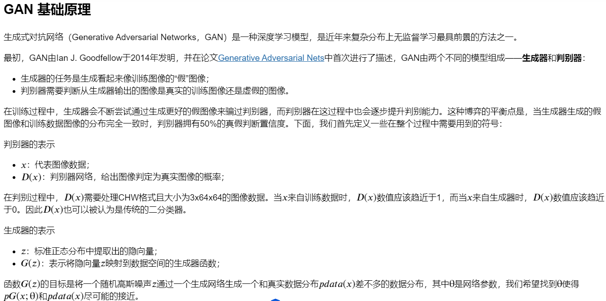
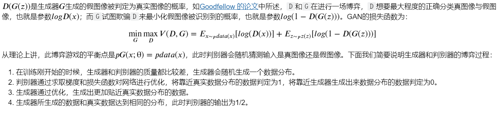
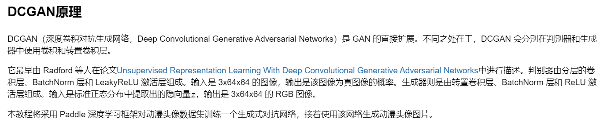  
见Paddle实践

# YOLO

# AE 自编码器
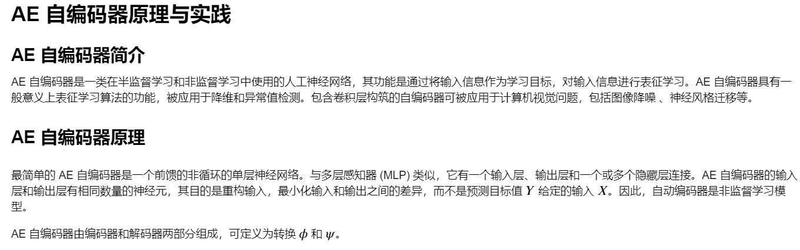
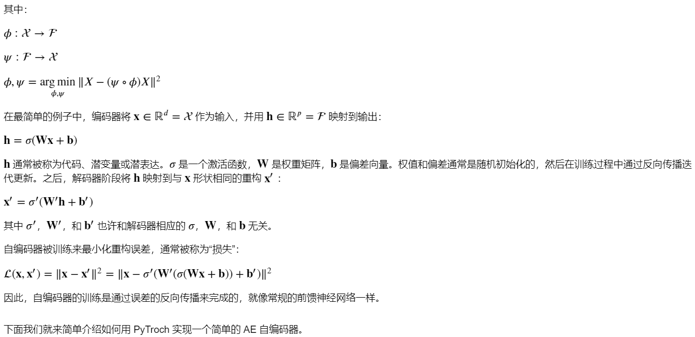

# 其他
## 梯度爆炸
在反向传播计算梯度时，梯度值变得非常大，以指数级增长，最终导致模型无法收敛，具体表现为模型参数更新幅度过大，权重变得极不稳定，甚至使得训练过程中断。  

出现梯度爆炸的情况：  
1. 网络层数过深：      
随着神经网络层数的增加，信号在网络中传递时会经过多次运算。     
在反向传播中，梯度通过链式法则进行计算，每经过一层，梯度就会与该层的权重矩阵相乘。    
如果网络层数过多，并且权重矩阵设置不合理（例如权重值普遍较大），在多次相乘后，梯度值可能会迅速增大，引发梯度爆炸。     
例如，在一些深度超过几十层甚至上百层的神经网络中，如果没有适当的机制来控制梯度，梯度爆炸的风险就会显著增加。    

2. 激活函数选择不当：   
某些激活函数的导数在特定区间内具有较大的值。例如，Sigmoid 函数的导数σ′(x)=σ(x)(1−σ(x))，其最大值为0.25，  
但在某些情况下，如果网络中大量神经元都处于 Sigmoid 函数导数较大的区域，   
在反向传播时，梯度经过这些层不断放大，也可能导致梯度爆炸。  
相比之下，ReLU 函数在正数部分导数恒为1，相对不容易引发梯度爆炸，但如果网络结构设计不合理，依然可能出现问题。

3. 权重初始化不合理：  
如果权重初始值设置得过大，在正向传播时，经过多层的线性变换后，输出值会变得非常大。   
当进行反向传播计算梯度时，这些较大的输出值会导致梯度也变得很大。   
例如，在全连接层中，如果权重初始值普遍在10以上，且没有合适的初始化策略或正则化方法，梯度爆炸很可能在训练初期就出现。

4. 学习率设置过高：  
学习率决定了模型参数在每次更新时的步长。如果学习率设置得过大，在根据梯度更新参数时，参数更新的幅度就会过大。  
这可能使得模型在参数空间中 “跳跃” 过度，导致梯度不断增大，进而引发梯度爆炸。  
例如，在使用随机梯度下降（SGD）算法时，如果初始学习率设置为0.1甚至更大，而没有采用学习率衰减策略，在训练过程中很容易出现梯度爆炸问题。

## 梯度消失
梯度消失与梯度爆炸相反。随着反向传播的进行，梯度在经过多层传递后逐渐趋近于 0，导致网络参数无法得到有效更新，模型难以收敛。

直观表现为训练过程中，损失函数长时间不下降或下降极为缓慢，模型的学习能力停滞，即使训练很长时间，性能也没有明显提升。

产生原因：  
1. 激活函数选择：  
  - Sigmoid 函数：Sigmoid 函数σ(x)= 1/(1+e^−x)   
其导数σ′(x)=σ(x)(1−σ(x))取值范围在``(0,0.25]``。  
在反向传播中，梯度计算需要乘以激活函数的导数。当神经元的输入值处于 Sigmoid 函数饱和区（即x绝对值较大的区域）时，导数接近 0。  
例如，当x=4时，σ′(4)≈0.018。如果网络中多层神经元都处于这种状态，经过多次链式求导后，梯度会迅速趋近于 0。  
  - tanh 函数：tanh 函数tanh(x)= (e^x - e^−x)/(e^x + e^−x)   
其导数tanh′(x)=1−tanh^2(x)取值范围在``(0,1]``。  
。类似 Sigmoid 函数，在输入值较大或较小时，导数接近 0，在深层网络中容易导致梯度消失。  

2. 网络深度与链式求导：  
神经网络是一个多层的链式结构，在反向传播计算梯度时，根据链式法则，梯度从输出层向输入层传递过程中，要经过多次乘法运算。    
每一层的梯度计算都依赖上一层的梯度和当前层的权重与激活函数导数。例如，对于一个L层神经网络，假设第l层到第L层的权重矩阵为W_l,W_l+1 ,⋯,W_L​    
激活函数导数为δ_l ,δ_l+1​ ,⋯,δ_L ，那么第l层的梯度∂Loss/∂W_l的计算涉及到∏_i=l_L W_i * ∏_i=l_L δ_i  
​如果权重矩阵的某些元素绝对值小于 1，或者激活函数导数较小，随着层数L的增加，这些小于 1 的值不断相乘，梯度就会以指数级减小，最终趋近于 0。  

3. 权重初始化不合理：  
若权重初始值设置过小，在反向传播过程中，梯度在经过与权重矩阵相乘后，会变得更小。  
例如，在全连接层中，如果权重初始值普遍在0.01以下，那么每次梯度更新时，参数的改变量就会非常小，导致梯度在传递过程中逐渐消失。  

解决方法
1. 选择合适的激活函数：  
如 ReLU函数，其表达式为f(x)=max(0,x)，在x>0时，导数f′(x)=1   
避免了因激活函数导数导致的梯度消失问题。  
此外，还有 Leaky ReLU、PReLU 等改进的 ReLU 函数，在一定程度上缓解了 ReLU 函数在x<0时梯度为 0 的情况。  

2. 使用梯度裁剪（Gradient Clipping）：  
在反向传播计算完梯度后，对梯度进行检查和裁剪。   
如果梯度的某个维度或整体范数超过设定的阈值，就按比例缩放梯度，使其保持在合理范围内，防止梯度消失（同时也能预防梯度爆炸）。

3. 合理的权重初始化：  
采用合适的权重初始化方法，如 Xavier 初始化、Kaiming 初始化等。  
Xavier 初始化根据输入和输出神经元的数量来初始化权重，使得权重在正向和反向传播时，信号的方差保持一致，减少梯度消失的可能性。  
Kaiming 初始化则针对 ReLU 激活函数进行了优化，能更好地初始化权重，提高网络的收敛速度。  

4. 引入残差连接（Residual Connection）：  
在深层网络中，通过添加残差连接，允许梯度直接跳过某些层进行传播，减少了梯度在多层传递过程中的衰减。  
例如 ResNet 网络通过引入残差块，成功训练了超过 100 层的深度神经网络，有效解决了梯度消失问题，提升了模型性能。  

## 感受野

## 为什么采用批量

1. **内存优化**
    - **降低内存需求**：深度学习模型处理的数据量往往非常大，如果一次性将所有数据输入模型进行计算，可能会超出计算机内存的承载能力。  
    通过分批量处理，每次只将一小部分数据（一个批量）读入内存进行计算，大大降低了内存的瞬时需求，使得在有限内存条件下也能训练大规模模型。  
    - **高效利用内存**：现代深度学习框架在实现时针对批量数据的计算进行了优化，能够更高效地利用内存资源。
    例如，在进行矩阵乘法等运算时，批量数据可以更好地利用内存缓存机制，提高数据访问速度，从而加速计算过程。
2. **加速训练**
    - **并行计算优势**：深度学习框架通常利用GPU进行并行计算。批量数据能够充分发挥GPU并行处理的能力，一次处理多个样本，而不是逐个处理。  
    例如，GPU可以同时对一个批量中的所有图像进行卷积操作，相较于逐个图像处理，大大减少了计算时间。这种并行计算的优势随着批量大小的增加而更加明显。
    - **梯度计算与更新**：每次计算一个批量数据的梯度并更新模型参数，而不是对单个样本进行更新，能够使梯度计算更加稳定。
    单个样本的梯度可能会受到噪声或异常值的影响，而批量数据的梯度是多个样本梯度的平均值。这有助于模型更快地收敛到最优解，提高训练效率。
3. **泛化能力提升**
    - **模拟整体数据分布**：分批量训练时，每个批量的数据可以看作是从整个数据集中随机采样得到的子集。  
    通过在不同批量上进行训练，模型能够接触到数据集中不同的样本组合，更好地模拟数据的整体分布情况。  
    这使得模型在训练过程中对数据的多样性有更广泛的学习，从而提高模型的泛化能力，减少过拟合的风险。
    - **正则化效果**：一定程度上，分批量训练类似于一种隐式的正则化方法。由于每次使用不同的批量数据更新参数，模型不会过度依赖于某一部分特定的数据，从而避免模型在训练集上过拟合。  
    这种效果在批量大小较小时更为明显，因为较小的批量使得每次更新所基于的数据更加多样化。 

## 层归一化 批归一化
批归一化（Batch Normalization，BN）和层归一化（Layer Normalization，LN）  
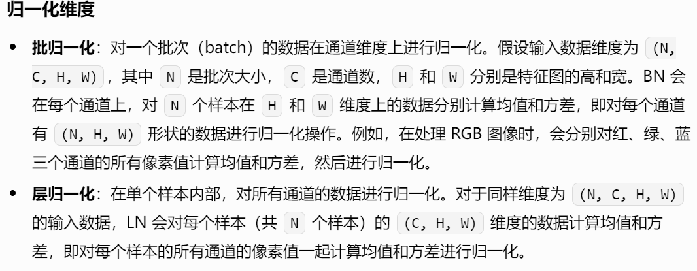

# PyTorch实践

## Pytorch中模型的搭建


```python
import torch
from torch import nn     # 导入nn模块
class Sample(nn.Module):
    def __init__(self):
        super(Sample, self).__init__()
        self.conv = nn.Sequential(
            nn.Conv2d(1, 1, 5),     # 卷积层
            nn.Sigmoid(),     # 激活函数
            nn.MaxPool2d(2, 2),     # 最大池化层
        )
        self.fc = nn.Sequential(
            nn.Linear(14*14, 10),     # 全连接层
            nn.Sigmoid(),     # 激活函数
        )
    def forward(self, img):     # 定义前向计算
        feature = self.conv(img)     # 卷积层
        output = self.fc(feature.view(img.shape[0], -1))     # 全连接层
        return output
```

## LeNet
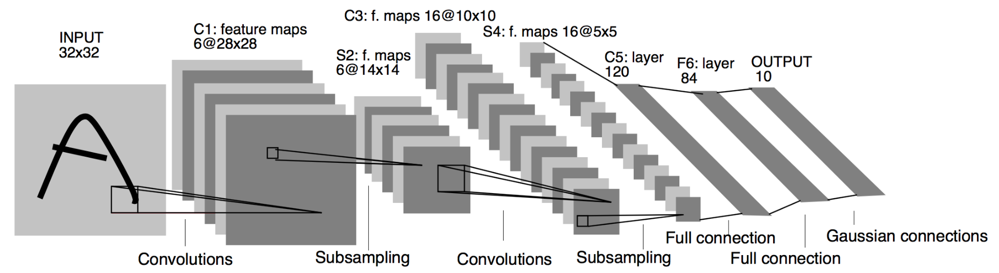


```python
import torch
from torch import nn
class LeNet(nn.Module):
    def __init__(self):
        super(LeNet, self).__init__()
        '''
        这里搭建卷积层，需要按顺序定义卷积层、
        激活函数、最大池化层、卷积层、激活函数、最大池化层，
        具体形状见测试说明
        '''
        self.conv = nn.Sequential( # 输入(32*32*1)
            ########## Begin ##########
            nn.Conv2d(1,6,5),  # (batch_size, 6, 28, 28)
            nn.Sigmoid(),
            nn.MaxPool2d(2,2), # (batch_size, 6, 14, 14)
            nn.Conv2d(6,16,5), # (batch_size, 6, 10, 10)
            nn.Sigmoid(),
            nn.MaxPool2d(2,2), # (batch_size, 16, 5, 5)
            ########## End ##########
        )
        '''
        这里搭建全连接层，需要按顺序定义全连接层、
        激活函数、全连接层、激活函数、全连接层，
        具体形状见测试说明
        '''
        self.fc = nn.Sequential(
            ########## Begin ##########
            nn.Linear(16*5*5,120), # 输入大小为16*5*5=400
            nn.Sigmoid(),
            nn.Linear(120,84),
            nn.Sigmoid(),
            nn.Linear(84,10),
            ########## End ##########
        )

    def forward(self, img):
        '''
        这里需要定义前向计算
        '''
        ########## Begin ##########
        feature=self.conv(img)
        output=self.fc(feature.view(img.shape[0],-1)) 
        # img.shape[0] 是 batch_size
        # -1 表示自动计算该维度的大小，使得总元素数量保持不变。 例如 (batch_size, 16, 5, 5) --> (batch_size, 16*5*5)
        # view(img.shape[0], -1) 会将其变形为 (batch_size, 16*5*5)
        # img.shape[0] 改为 feature.shape[0] 可能有一定风险：卷积操作不会改变 batch size，但在某些特殊情况下（如自定义操作或错误的数据流），两者可能不一致。
        return output

        ########## End ##########
```

## AlexNet
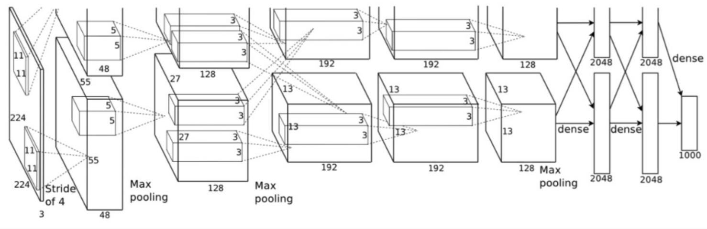


```python
import torch
from torch import nn


class AlexNet(nn.Module):
    def __init__(self):
        super(AlexNet, self).__init__()
        '''
        这里搭建卷积层，需要按顺序定义卷积层、
        激活函数、最大池化层、卷积层、激活函数、
        最大池化层、卷积层、激活函数、卷积层、
        激活函数、卷积层、激活函数、最大池化层，
        具体形状见测试说明
        '''
        self.conv = nn.Sequential(
            ########## Begin ##########
            nn.Conv2d(3,96,kernel_size=(11,11),stride=(4,4)),
            nn.ReLU(),
            nn.MaxPool2d(kernel_size=3,stride=2,padding=0),
            nn.Conv2d(96,256,kernel_size=(5,5),stride=(1,1),padding=(2,2)),
            nn.ReLU(),
            nn.MaxPool2d(kernel_size=3,stride=2,padding=0),
            nn.Conv2d(256,384,kernel_size=(3,3),stride=(1,1),padding=(1,1)),
            nn.ReLU(),
            nn.Conv2d(384,384,kernel_size=(3,3),stride=(1,1),padding=(1,1)),
            nn.ReLU(),
            nn.Conv2d(384,256,kernel_size=(3,3),stride=(1,1),padding=(1,1)),
            nn.ReLU(),
            nn.MaxPool2d(kernel_size=3,stride=2,padding=0),
            ########## End ##########
        )
        '''
        这里搭建全连接层，需要按顺序定义
        全连接层、激活函数、丢弃法、
        全连接层、激活函数、丢弃法、全连接层，
        具体形状见测试说明
        '''
        self.fc = nn.Sequential(
            ########## Begin ##########
            nn.Linear(in_features=6400,out_features=4096,bias=True),
            nn.ReLU(),
            nn.Dropout(p=0.5),
            nn.Linear(in_features=4096,out_features=4096,bias=True),
            nn.ReLU(),
            nn.Dropout(p=0.5),
            nn.Linear(in_features=4096,out_features=1000,bias=True),
            ########## End ##########
        )

    def forward(self, img):
        '''
        这里需要定义前向计算
        '''
        ########## Begin ##########
        feature=self.conv(img)  
        result=self.fc(feature.view(img.shape[0],-1))    
        ########## End ##########

model = AlexNet()
print(model)
```

## AE 自编码器


```python
import matplotlib.pyplot as plt
import numpy as np

import torch
import torch.nn as nn
import torch.optim as optim
import torchvision

# 设置种子和其他配置。

seed = 42
torch.manual_seed(seed)
torch.backends.cudnn.benchmark = False
torch.backends.cudnn.deterministic = True

# 设置批大小、学习周期和学习率。

batch_size = 512
epochs = 30
learning_rate = 1e-3

# 载入 MNIST 数据集中的图片进行训练。

transform = torchvision.transforms.Compose([torchvision.transforms.ToTensor()])


train_dataset = torchvision.datasets.MNIST(
    root="~/torch_datasets", train=True, transform=transform, download=True
)

train_loader = torch.utils.data.DataLoader(
    train_dataset, batch_size=batch_size, shuffle=True
)

# AE 自编码器
# 为了简化实现，我们在一个类中编写编码器和解码器层。我们为编码器和解码器层的组件都定义了全连接层。

class AE(nn.Module):
    def __init__(self, **kwargs):
        super().__init__()
        self.encoder_hidden_layer = nn.Linear(
            in_features=kwargs["input_shape"], out_features=128
        )
        self.encoder_output_layer = nn.Linear(
            in_features=128, out_features=128
        )
        self.decoder_hidden_layer = nn.Linear(
            in_features=128, out_features=128
        )
        self.decoder_output_layer = nn.Linear(
            in_features=128, out_features=kwargs["input_shape"]
        )

    def forward(self, features):
        activation = self.encoder_hidden_layer(features)
        activation = torch.relu(activation)
        code = self.encoder_output_layer(activation)
        code = torch.sigmoid(code)
        activation = self.decoder_hidden_layer(code)
        activation = torch.relu(activation)
        activation = self.decoder_output_layer(activation)
        reconstructed = torch.sigmoid(activation)
        return reconstructed
    
# 在使用我们定义的 AE 类之前，我们有以下事情要做:

# 配置要在哪个设备上运行；
# 实例化一个 AE 对象；
# 要定义优化器；
# 要定义重建损失。

device = torch.device("cpu")

# 建立 AE 模型并载入到 CPU 设备
model = AE(input_shape=784).to(device)

# Adam 优化器，学习率 10e-3
optimizer = optim.Adam(model.parameters(), lr=learning_rate)

# MSE 损失
criterion = nn.MSELoss()

# 我们在 CPU 设备上运行，实例化一个输入大小为 784 的 AE 自编码器，并用 Adam 作为我们的训练优化器。用 MSELoss 作为损失函数。接下来我们就可以训练了。

for epoch in range(epochs):
    loss = 0
    for batch_features, _ in train_loader:
        # 将小批数据变形为 [N, 784] 矩阵，并加载到 CPU 设备
        batch_features = batch_features.view(-1, 784).to(device)
        
        # 梯度设置为 0，因为 torch 会累加梯度
        optimizer.zero_grad()
        
        # 计算重构
        outputs = model(batch_features)
        
        # 计算训练重建损失
        train_loss = criterion(outputs, batch_features)
        
        # 计算累积梯度
        train_loss.backward()
        
        # 根据当前梯度更新参数
        optimizer.step()
        
        # 将小批量训练损失加到周期损失中
        loss += train_loss.item()
    
    # 计算每个周期的训练损失
    loss = loss / len(train_loader)
    
    # 显示每个周期的训练损失
    print("epoch : {}/{}, recon loss = {:.8f}".format(epoch + 1, epochs, loss))

# 我们用训练过的自编码器提取一些测试用例来重构。

test_dataset = torchvision.datasets.MNIST(
    root="~/torch_datasets", train=False, transform=transform, download=True
)

test_loader = torch.utils.data.DataLoader(
    test_dataset, batch_size=10, shuffle=False
)

test_examples = None

with torch.no_grad():
    for batch_features in test_loader:
        batch_features = batch_features[0]
        test_examples = batch_features.view(-1, 784).to(device)
        reconstruction = model(test_examples)
        break

# 可视化
# 用我们训练过的自编码器重建一些测试图像。

with torch.no_grad():
    number = 10
    plt.figure(figsize=(20, 4))
    for index in range(number):
        # 显示原始图
        ax = plt.subplot(2, number, index + 1)
        plt.imshow(test_examples[index].cpu().numpy().reshape(28, 28))
        plt.gray()
        ax.get_xaxis().set_visible(False)
        ax.get_yaxis().set_visible(False)

        # 显示重构图
        ax = plt.subplot(2, number, index + 1 + number)
        plt.imshow(reconstruction[index].cpu().numpy().reshape(28, 28))
        plt.gray()
        ax.get_xaxis().set_visible(False)
        ax.get_yaxis().set_visible(False)
    plt.show()
# 可以看出，重构图片和原始图片差别不大，我们的训练还是比较成功的。
```


```python
import torch
import torch.nn as nn
import torch.nn.functional as F
import matplotlib.pyplot as plt


class ConvAE(nn.Module):
    def __init__(self, **kwargs):
        super().__init__()
        
        # 编码器 (Encoder)：通过卷积层逐步压缩特征
        self.encoder = nn.Sequential(
            # 输入: (batch_size, 3, 64, 64) 假设输入为3通道64x64图像
            nn.Conv2d(3, 16, kernel_size=3, stride=2, padding=1),  # 输出: (16, 32, 32)
            nn.ReLU(inplace=True),
            nn.Conv2d(16, 32, kernel_size=3, stride=2, padding=1),  # 输出: (32, 16, 16)
            nn.ReLU(inplace=True),
            nn.Conv2d(32, 64, kernel_size=3, stride=2, padding=1),  # 输出: (64, 8, 8)
            nn.ReLU(inplace=True),
            nn.Conv2d(64, 128, kernel_size=3, stride=2, padding=1),  # 输出: (128, 4, 4)
            nn.ReLU(inplace=True)
        )
        
        # 解码器 (Decoder)：通过转置卷积层恢复图像
        self.decoder = nn.Sequential(
            # 输入: (128, 4, 4)
            nn.ConvTranspose2d(128, 64, kernel_size=3, stride=2, padding=1, output_padding=1),  # 输出: (64, 8, 8)
            nn.ReLU(inplace=True),
            nn.ConvTranspose2d(64, 32, kernel_size=3, stride=2, padding=1, output_padding=1),  # 输出: (32, 16, 16)
            nn.ReLU(inplace=True),
            nn.ConvTranspose2d(32, 16, kernel_size=3, stride=2, padding=1, output_padding=1),  # 输出: (16, 32, 32)
            nn.ReLU(inplace=True),
            nn.ConvTranspose2d(16, 3, kernel_size=3, stride=2, padding=1, output_padding=1),  # 输出: (3, 64, 64)
            nn.Sigmoid()  # 使用Sigmoid将输出归一化到[0,1]范围
        )

    def forward(self, x):
        # 编码过程：得到潜在特征
        x = self.encoder(x)
        # 解码过程：重建输入图像
        x = self.decoder(x)
        return x


# 测试代码
if __name__ == "__main__":
    # 实例化模型
    model = ConvAE()
    print(model)
    
    # 创建随机测试数据 (batch_size=4, 3通道, 64x64图像)
    test_input = torch.randn(4, 3, 64, 64)
    
    # 前向传播
    output = model(test_input)
    
    # 打印输入输出形状（应保持一致）
    print(f"输入形状: {test_input.shape}")
    print(f"输出形状: {output.shape}")
```

## GAN


```python
import torch
from torch import nn

class ConvBNReLU(nn.Module):# 定义标准的卷积层：Conv+BN+ReLU
    def __init__(self,nin,nout,ks,stride=1):
        super().__init__()
        pad=(ks-1)//2

        self.layers=nn.Sequential(
            nn.Conv1d(nin,nout,ks,stride,padding=pad), 
            # 输入：(batch_size, nin, sequence_length) 
            # 输出：(batch_size, nout, sequence_length)（当 stride=1 时长度不变）
            nn.BatchNorm1d(nout), # 一维批标准化
            nn.ReLU(),
        )

    def forward(self,x):
        y=self.layers(x)
        return y    
    
class ConvUpBNReLU(nn.Module):# 上采样+卷积
    def __init__(self,nin,nout,ks,stride=1):
        super().__init__()

        self.layers = nn.Sequential(
            nn.Upsample(scale_factor=stride, mode="nearest"),  # 上采样
            ConvBNReLU(nin,nout,ks,stride)
        )

    def forward(self, x):
        y=self.layers(x)
        return y    
```


```python
# 生成器
class ImageGeneration(nn.Module):
    def __init__(self,nclass=10):
        super().__init__()

        self.emb=nn.Embedding(nclass,64*4*4)
        self.layers=nn.Sequential(
            ConvBNReLU(64,64,1),
            ConvUpBNReLU(64,32,2),
            ConvBNReLU(32,32,1),
            ConvUpBNReLU(32,16,2),
            ConvBNReLU(16,16,1),
            ConvUpBNReLU(16,8,2),
            nn.Conv2d(8,3,1,1),
            nn.Sigmoid() # 输出[0,1]
        )

    def forward(self,d):
        h=self.emb(d)
        h=h.reshape([-1,64,4,4])
        x=self.layers(h)
        return x
```


```python
# 判别器
class ImageClassify(nn.Module):
    def __init__(self):
        super().__init__()

        # DNN输出长度为2的表示向量
        self.dnn=nn.Sequential(
            ConvBNReLU(3,16,2),
            ConvBNReLU(16,16,1),
            ConvBNReLU(16,32,2),
            ConvBNReLU(32,32,1),
            ConvBNReLU(32,64,2),
            ConvBNReLU(64,64,1),
            nn.Flatten(),
            nn.Linear(4*4*64,128),
        )

        self.classify=nn.Linear(128,10)
        self.ganout=nn.Linear(128,1) 

    def forward(self,x):
        h=self.dnn(x)
        y1=self.classify(h)
        y2=self.ganout(h)
        return y1,y2
```


```python
# 损失函数，交替迭代
# 定义生成器
gen=ImageGeneration()
gen.train()
# 定义判别器
dis=ImageClassify()
dis.train()
optim_gen=torch.optim.Adam(gen.parameters(),1e-3,weight_decay=0.0) # gen.parameters()获取需要训练的参数，无权重衰减
optim_dis=torch.optim.Adam(dis.parameters(),1e-3,weight_decay=0.0)

for epoch in range(10):
    for x,d in dataloader: # x: 真实图像, d: 条件标签
        # 训练判别器
        dis.zero_grad()
        # 噪声向量
        z=torch.randn([len(x),100]),device=device,dtype=torch.float32
        # 生成假图像
        fake=gen(d,z)
        # 生成图像输入到判别器
        y1,y2=dis(fake.detach()) # 判别器对假图像的输出，阻止梯度传到生成器
        # 真实图像输入到判别器
        y3,y4=dis(x)
        # 生成图像判别接近0
        loss1=lossmse(y2,torch.zeros_like(y2)) # 判别器输出 y2 应接近 0
        # 真实图像损失=类别损失+判别损失
        loss2=lossce(y3,d)*0.2+lossmse(y4,torch.ones_like(y4)) # 判别器的分类输出 y3 应与真实标签 d 一致，判别器的真假输出 y4 应接近 1
        # 优化
        loss=loss1+loss2
        loss.backward()
        optim_dis.step()
        optim_dis.zero_grad()
        optim_gen.zero_grad()

        # 训练生成器
        gen.zero_grad()
        z=torch.randn([len(x),100]),device=device,dtype=torch.float32
        fake=gen(d,z)
        y1,y2=dis(fake)
        loss=lossce(y1,d)*0.2+lossmse(y2,torch.ones_like(y2))
        loss.backward()
        optim_gen.step()
        optim_gen.zero_grad()
        optim_dis.zero_grad()
```

# Paddle实践

## DCGAN


```python
# 解压数据集
import zipfile
zip_file = zipfile.ZipFile('/data/bigfiles/faces.zip')
zip_extract = zip_file.extractall('/data/faces')

batch_size = 72           # 批量大小
image_size = 64           # 训练图像空间大小
lr = 0.0002               # 学习率
beta1 = 0.5               # Adam优化器的beta1超参数

# 通过 paddle.vision.datasets 库读取数据：
import numpy as np
import paddle
import paddle.vision.datasets as ds
from paddle.vision.transforms import Compose, Resize, CenterCrop, ToTensor

def create_dataset_imagenet(dataset_path):
    """数据加载"""
    
    transforms = Compose([Resize(image_size), CenterCrop(image_size), ToTensor()])
    

    dataset = ds.DatasetFolder(root = dataset_path, transform=transforms)


    return dataset

dataset = create_dataset_imagenet('/data/faces')

data_loader = paddle.io.DataLoader(dataset, batch_size=batch_size, shuffle=True)

# 可视化一部分卡通头像数据：

import matplotlib.pyplot as plt

def plot_data(data):
    # 可视化部分训练数据
    plt.figure(figsize=(10, 3), dpi=140)
    for i, image in enumerate(data[:30], 1):
        plt.subplot(3, 10, i)
        plt.axis("off")
        plt.imshow(image.transpose(1, 2, 0))
    plt.show()

# 读取第一批数据    
sample_data = iter(data_loader)

# 绘制第一批数据的部分图片
plot_data(next(sample_data)[0].numpy())

# 在加载好数据集以后，接着我们定义 DCGAN 模型，首先是生成器 Generator：

import paddle
import paddle.nn.functional as F
import paddle.nn as nn

##################################################################
#生成器定义
class Generator(nn.Layer):
    def __init__(self, nz=100):
        super().__init__()
        #100*1*1
        self.layer1 = nn.Sequential(
            nn.Conv2DTranspose(nz, 1024, 4, 1, 0),
            nn.BatchNorm2D(1024),
            nn.ReLU()
        )
        #1024*4*4 （Paddle 默认的 NCHW 数据格式，N 为批量大小，C 为通道数，H 为高，W 为宽）
        self.layer2 = nn.Sequential(
            nn.Conv2DTranspose(1024, 512, 4, 2, 1),
            nn.BatchNorm2D(512),
            nn.ReLU()
        )
        #512*8*8
        self.layer3 = nn.Sequential(
            nn.Conv2DTranspose(512, 256, 4, 2, 1),
            nn.BatchNorm2D(256),
            nn.ReLU()
        )
        #256*16*16
        self.layer4 = nn.Sequential(
            nn.Conv2DTranspose(256, 128, 4, 2, 1),
            nn.BatchNorm2D(128),
            nn.ReLU()
        )
        #128*32*32
        self.layer5 = nn.Sequential(
            nn.Conv2DTranspose(128, 3, 4, 2, 1),
            nn.Tanh()
        )
        self.seq = nn.Sequential(
            self.layer1, 
            self.layer2,
            self.layer3,
            self.layer4,
            self.layer5
        )
    
    def forward(self, x):
        return self.seq(x)
    
# 接着是判别器 Discriminator：

#判别器定义
class Discriminator(nn.Layer):
    def __init__(self):
        super().__init__()
        #3*64*64
        self.layer1 = nn.Sequential(
            nn.Conv2D(3, 64, 4, 2, 1),
            nn.BatchNorm2D(64),
            nn.LeakyReLU(0.2)
        )
        #64*32*32
        self.layer2 = nn.Sequential(
            nn.Conv2D(64, 128, 4, 2, 1),
            nn.BatchNorm2D(128),
            nn.LeakyReLU(0.2)
        )
        #128*16*16
        self.layer3 = nn.Sequential(
            nn.Conv2D(128, 256, 4, 2, 1),
            nn.BatchNorm2D(256),
            nn.LeakyReLU(0.2)
        )
        #256*8*8
        self.layer4 = nn.Sequential(
            nn.Conv2D(256, 512, 4, 2, 1),
            nn.BatchNorm2D(512),
            nn.LeakyReLU(0.2)
        )
        #512*4*4
        self.layer5 = nn.Sequential(
            nn.Conv2D(512, 1, 4, 1, 0),
            nn.Sigmoid()  
        )
        self.seq = nn.Sequential(
            self.layer1,
            self.layer2,
            self.layer3,
            self.layer4,
            self.layer5
        )
    
    def forward(self, x):
        out = self.seq(x)
        return out
####################################################################    
# 接着将生成器 Generator 与 Discriminator 组合起来构成 DCGAN：

import paddle.vision
from paddle.io import DataLoader
import paddle.optimizer
import paddle.vision.transforms as transforms
import matplotlib.pyplot as plt

noise_eval = paddle.randn((batch_size, 100, 1, 1)) # 随机噪声

class DCGAN:
    def __init__(self):
        self.generator = Generator() # 生成器
        self.discriminator = Discriminator() # 判别器
        self.optim_for_gen = paddle.optimizer.Adam(lr, parameters=self.generator.parameters(), beta1=0.5) # 生成器优器
        self.optim_for_dis = paddle.optimizer.Adam(lr, parameters=self.discriminator.parameters(), beta1=0.5) # 判别器优化器
        self.loss_for_gen = nn.BCELoss() # 生成器损失 
        self.loss_for_dis = nn.BCELoss() # 判别器损失
        self.true_label = 1 # 真实数据标签
        self.false_label = 0 # 生成假数据标签
        self.label = paddle.to_tensor([1]*72)

    def load_data(self, data):
        # 导入数据
        self.data_loader = data
        
    def train(self, epochs):
        ## 导入之前的训练参数##
        # self.generator.set_state_dict(paddle.load( os.path.join('model', 'generator.pdmodel')))
        # self.discriminator.set_state_dict(paddle.load( os.path.join('model', 'discriminator.pdmodel'))) 
        for epoch in range(1, epochs+1):
            for i, img in enumerate(self.data_loader):
                
                # 训练生成器
                img = img[0]
                self.optim_for_dis.clear_grad()
                output = self.discriminator(img).squeeze()
                self.label = paddle.to_tensor([self.true_label]*img.shape[0], dtype='float32')
                err1 = self.loss_for_dis(output, self.label)
                err1.backward()
                self.label = paddle.to_tensor([self.false_label]*img.shape[0], dtype='float32')
                noise = paddle.randn((img.shape[0], 100, 1, 1))
                fake = self.generator(noise)
                output = self.discriminator(fake.detach()).squeeze()
                err2 = self.loss_for_dis(output, self.label)
                err2.backward()
                err = err1+err2
                self.optim_for_dis.step()
                
                
                # 训练判别器
                self.optim_for_gen.clear_grad()
                self.label = paddle.to_tensor([self.true_label]*img.shape[0], dtype='float32')
                output = self.discriminator(fake).squeeze()
                err3 = self.loss_for_gen(output, self.label)
                err3.backward()
                self.optim_for_gen.step()
                
                # 打印损失
                if i%5==0:
                    print('epoch/Epoch {}/{} iter/Iter {}/{} lossD {:.4f}, lossG {:.4f}'.format(epoch, 
                                                                                                epochs, 
                                                                                                i+1, 
                                                                                                len(self.data_loader), 
                                                                                                err.item(), 
                                                                                                err3.item()))
# 模型训练
# 下面实例化 DCGAN，并导入上面加载好的数据 data_loader 进行模型训练。

dcgan = DCGAN() # 实例化 DCGAN
dcgan.load_data(data_loader) # 导入上面的数据集
dcgan.train()

# 模型测试
# 这里是输入随机噪声并测试训练了一个epoch的模型，生成卡通头像的代码和效果图：


t = transforms.Transpose(order=(1, 2, 0))
to_plot = dcgan.generator(noise_eval).numpy()
plt.figure(figsize=(8, 8))
for i, img in enumerate(to_plot):
    if i >= 64:
        break
    img = t(img)
    plt.subplot(8, 8, i+1)
    plt.imshow(abs(img))
plt.show()

# 下面，我们导入预训练好的模型参数（80 个 epoch），再生成一批卡通头像：

# 载入模型参数
state_dict = paddle.load("/data/bigfiles/generator_net.pdparams")
# 将load后的参数与模型program关联起来
dcgan.generator.set_state_dict(state_dict)


t = transforms.Transpose(order=(1, 2, 0))
to_plot = dcgan.generator(noise_eval).numpy()
plt.figure(figsize=(8, 8))
for i, img in enumerate(to_plot):
    if i >= 64:
        break
    img = t(img)
    plt.subplot(8, 8, i+1)
    plt.imshow(abs(img))
plt.show()
```

# 深度学习总结

## 深度学习概述
深度学习是一种基于多层神经网络的机器学习方法，强调通过构建和训练包含多个隐藏层的模型，自动从数据中提取特征，实现对复杂数据的高层次抽象和理解。

## 深度学习基础
### 1. 机器学习发展路径
- 线性回归 -> 逻辑回归 -> softmax多回归 -> 神经网络多分类

### 2. 损失函数构建
- **回归任务**：最小二乘（均方误差MSE）
- **分类任务**：最大似然估计（二分类/多分类交叉熵）
- **正则化**：最大后验概率（正则项）

### 3. 模型求解
- **网格搜索方法**
- **梯度下降（gradient Descent）**

### 4. 关键概念
- 任何机器学习模型，都需要定义一个假设函数。逻辑回归的假设函数，可以由线性回归的假设函数进行调整和修改而来。
- 设线性回归模型的假设函数为hθ(x)。将样本的特征向量x带入到模型后，模型会输出连续的数值型结果，取值范围从负无穷到正无穷。
- 逻辑回归在线性回归的基础上，增加了sigmoid函数。设线性计算结果为z，将z输入至sigmoid函数，就得到了逻辑回归的输出。
- 我们可以将hθ(x)看做是，在给定输入特征x的情况下，样本属于某个类别的概率。
- 在分类时，我们会提前设置一个阈值p：
- 计算出逻辑回归的输出hθ(x)后，会将hθ(x)和阈值p进行比较，然后根据比较的结果，得到模型的最终输出值。
- **逻辑回归**：基于线性回归，增加sigmoid函数，输出样本属于某个类别的概率。
- **Softmax回归**：将线性输出转换为每个类别的预测概率，当类别数为2时，与逻辑回归等价。
- **神经网络**：包含隐藏层，解决非线性分类问题。

## 深度学习基础2
### 1. 图像分类及线性分类器
- **模型构建**：线性分类器
- **学习准则**：损失函数
- **优化求解**：梯度下降

### 2. 梯度下降算法变种
- **梯度下降算法（GD）**
- **随机梯度下降(SGD)**
- **小批量梯度下降法Mini Batch-SGD**
- **带动量的梯度下降法（Momentum）**
- **均方误差传递迭代算法(RMSProp,2012)**
- **自适应矩估计迭代算法(Adma,2014)**

### 3. 精度评价标准
- **分类问题**：精确度、召回率、准确率、假阳性率、ROC曲线
- **回归问题**：RMSE (Root Mean Square Error)、MAE(Mean Absolute Error)

### 4. 过拟合和欠拟合
- **过拟合**：训练集精度高，测试集精度低
- **欠拟合**：训练集精度低，测试集精度低

### 5. 全连接神经网络
- **激活函数**：sigmoid，relu，tanh，leaky relu
- **组成**：一个输入层、一个输出层及多个隐层
- **特点**：激活函数是全连接神经网络中的重要部分，缺少激活函数将退化为线性分类器。

## CNN
### 1. 特点
- **局部连接**，**权值共享**
- **卷积层维度计算公式**：$(M-K+2P)/S+1$
  - **通道数**：
    - 卷积层：输出通道数=卷积个数
    - 池化层：输出通道数=输入通道数
  - **参数量计算公式**：
    - 卷积层：$(输入通道数 \times 卷积核高度 \times 卷积核宽度 + 1) \times 输出通道数$
    - 池化层：无参数量
    - 全连接层：$输入神经元数 \times 输出神经元数 + 输出神经元数$

### 2. ReLU激活函数优势
- 避免梯度消失
- 引入稀疏性，减少过拟合风险
- 计算效率高

### 3. 池化层作用
- 减少参数数量，提高计算效率
- 提高局部平移不变性
- 降低数据维度，避免过拟合
- 增强网络鲁棒性

### 4. 全连接层
- 激励函数一般采用RELU函数
- 最后一层可采用softmax逻辑回归进行分类

### 5. 多通道卷积
- 各通道卷积值相加得到最终值

### 6. 加速方法：IM2COL
- 对输入数据和滤波器进行展开和矩阵乘法

### 7. 正则化
- **L1正则化**：参数个数
- **L2正则化**：参数大小范围
- **dropout正则化**

## 经典卷积网络
### 1. LeNet-5

### 2. AlexNet（8层）
- 计算网络层数时仅统计卷积层与全连接层

### 3. 局部响应归一化层
- 创建竞争机制，增强模型泛化能力

### 4. ZFNet
- 改进AlexNet的卷积核大小和步长

### 5. VGG
- **小卷积核优势**：
  - 多个小尺寸卷积核串联可以得到与大尺寸卷积核相同的感受野
  - 网络深度更深、非线性更强、参数更少
- **卷积核个数增加原因**：
  - 平衡识别精度与存储、计算开销
- **卷积核个数不再增加原因**：
  - 避免全连接层参数过多导致过拟合

### 6. GoogLeNet
- **Inception结构**：保留输入信号中的更多特征信息
- **去掉前两个全连接层**，采用平均池化，减少参数数量
- **引入辅助分类器**，克服梯度消失问题

### 7. ResNet
- **残差模块**：避免卷积层堆叠导致的信息丢失，应对梯度消失问题

## RNN
- **处理序列数据**
- **输出公式**：$S_t=f (Wx + US_{(t-1)} + b)$
- **隐状态h**：提取序列特征，参数共享
- **局限**：长期依赖问题

### LSTM
- **细胞状态**
- **门结构**：遗忘门、输入门、输出门

### Transformer
- **词嵌入与NLP**
- **多头自注意力机制**

## 深层设计和优化结构
### 1. 设计原则
- 避免表征瓶颈
- 平衡特征数量和计算代价
- 平衡网络深度和宽度

### 2. 解决梯度消失方法
- 使用合适的激活函数（如ReLU）
- 残差网络设计
- 批标准化（BN）
- 正则化方法（L1、L2）
- 适当的权重初始化方法（Xavier初始化、He初始化）

### 3. 解决过拟合问题
- **数据增强**：仿射变换，裁剪，擦除，亮度、饱和度，分辨率，对比度
- **正则化方法**：增加优化约束，干扰优化过程
- **DropOut层**

## 参数初始化和迁移学习
### 1. 参数初始化
- **不能初始化为0**：对称权重问题
- **初始化方法**：
  - 预训练初始化
  - 随机初始化
  - 固定值初始化（偏置通常用0初始化）
- **基于方差缩放的参数初始化**：
  - Xavier初始化（适合双曲正切或者Sigmoid）
  - He初始化（适合ReLU或Leakly ReLU）
- **基于随机分布的初始化方法**：
  - Gaussian分布初始化
  - 均匀分布初始化
- **基于正交矩阵的初始化方法**：
  - 正交初始化

### 2. 迁移学习
- 把已学训练好的模型参数迁移到新模型帮助训练
- 使用模型结构和权重，微调部分神经网络层权重

## 信号与图形学应用
### 1. 视觉识别任务
- 分类
- 语义分割
- 目标检测
- 实例分割

### 2. 语义分割
- **方法**：滑动窗口，全卷积（加入上、下采样）
- **上采样方式**：转置卷积，图像插值，像素洗牌

### 3. 目标检测
- **单目标**：分类+定位
- **多目标**：
  - 滑动窗口
  - 卷积法实现滑动窗口
  - 区域建议
  - R-CNN
  - Fast R-CNN
  - 区域裁剪：Rol Pool
- **评估指标**：交并比IoU
- **非极大值抑制方法**

### 4. 自编码器
- **核心目标**：通过编码-解码结构学习输入数据的低维表示，尽可能重构原始输入
- **目标**：最小化重构误差
- **输入数据流程**：$x \rightarrow 编码器 \rightarrow 特征z \rightarrow 解码器 \rightarrow 重构输入数据x'$
- **特征降维作用**：保留数据中有意义的信息
- **变分自编码器（VAE）**：引入KL散度
- **问题**：
  - 编码器的映射空间不连续
  - 编码器的映射分布无规律
  - 编码器映射呈无界分布

### 5. GAN
- **生成器**，**判别器**
- **训练过程**：生成器创建真实图像，鉴别器区分真伪，达到平衡时鉴别器无法分辨

## 模型压缩与加速
### 1. 压缩与加速层面
- 算法层
- 框架层
- 硬件层

### 2. 算法层面优化方向
- 使用尽可能少的可训练参数
- 减少模型计算过程中的浮点操作次数
- 使用低bit位完成计算

### 3. 主流压缩与加速技术
- **结构优化**
- **剪枝（Pruning）**
- **量化（Quantization）**
- **知识蒸馏（Knowledge Distillation）**

### 4. 优化网络结构设计方式
- **矩阵分解**：如ALBERT的embedding layer
- **参数共享**：如CNN和ALBERT
- **分组卷积**：如shuffleNet，mobileNet等
- **分解卷积**：
  - 使用两个串联小卷积核代替大卷积核（Inception V2）
  - 使用两个并联的非对称卷积核代替正常卷积核（Inception V3）
- **全局平均池化代替全连接层**
- **使用1*1卷积核**

### 5. 分组卷积与深度可分离卷积
- **分组卷积**：分成g组，一个卷积核的通道数变为原来的g分之一，隔绝不同组信息交换，可通过Channel_Shuffle模块打乱通道顺序实现信息交换
- **深度可分离卷积**：分组数等于输入通道数且等于输出通道数，每个输出通道仅由输入的一个通道得来，缺乏输入通道间信息交换，通常后面加一个1x1卷积实现信息交换

### 6. 模型部署-ONNX

## 关键层作用
- **卷积层**：提取图像局部特征
- **池化层**：降低特征图维度，减少参数数量，保留主要特征信息
- **全连接层**：将提取的特征映射到不同类别概率上，进行分类或回归任务

## 梯度问题
### 1. 梯度消失
- **原因**：反向传播中梯度逐层传递，每层梯度小于1，多层连乘后梯度指数级衰减至接近0
- **表现**：浅层参数不更新，收敛慢
- **解决办法**：
  - 使用恰当的激活函数（如Relu）
  - 权重初始化
  - 批归一化
  - 残差链接

### 2. 梯度爆炸
- **原因**：反向传播中梯度逐层传递，每层梯度大于1，多层连乘后梯度指数级膨胀
- **表现**：损失震荡或NaN，训练不稳定
- **解决办法**：
  - 减小学习率
  - 梯度归一化
  - 权重初始化
  - 梯度裁剪

## 过拟合原因及解决方法
### 1. 过拟合原因
- **数据**：量少，分布不均，噪声过多
- **模型**：复杂，特征工程过度，缺少正则化
- **训练**：时间过长，缺少早停

### 2. 解决方法
- **数据增强**：仿射变换，裁剪，擦除，亮度、饱和度，分辨率，对比度
- **正则化方法**：增加优化约束，干扰优化过程
- **DropOut层**
