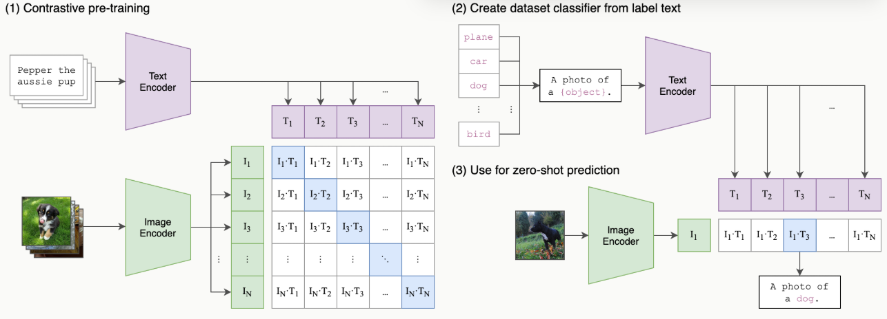
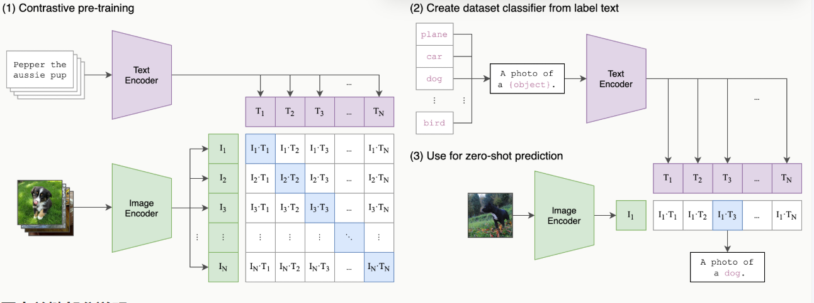

# 目录
- [1. 发展历程](#1-发展历程)
  - [1.1 基于规则](#11-基于规则)
  - [1.2 基于统计](#12-基于统计)
  - [1.3 基于神经网络](#13-基于神经网络)
- [2. 语言模型发展](#2-语言模型发展)
  - [2.1 N-gram模型](#21-n-gram模型)
  - [2.2 神经网络模型与词嵌入](#22-神经网络模型与词嵌入)
    - [2.2.1 前馈神经网络模型](#221-前馈神经网络模型)
    - [2.2.2循环神经网络模型](#222循环神经网络模型)
    - [2.2.3 LSTM/GRU](#223-lstmgru)
    - [2.2.4 Transformer架构](#224-transformer架构)
    - [2.2.5 Decoder-Only 架构](#225-decoder-only-架构)
    - [2.2.6 预训练语言模型](#226-预训练语言模型)
- [3. 文本预处理](#3-文本预处理)
  - [3.1 文本清洗](#31-文本清洗)
  - [3.2 分词](#32-分词)
    - [3.2.1 字节对编码(BPE)](#321-字节对编码bpe)
  - [3.3 移除停用词](#33-移除停用词)
  - [3.4 词干还原](#34-词干还原)
  - [3.5 词性标注](#35-词性标注)
- [4 文本表示方法](#4-文本表示方法)
  - [4.1 传统文本表示](#41-传统文本表示)
    - [4.1.2 词袋模型（Bag of Words）](#412-词袋模型bag-of-words)
    - [4.1.3 TF-IDF](#413-tf-idf)
    - [4.1.4 N-gram 模型](#414-n-gram-模型)
  - [4.2 词向量表示](#42-词向量表示)
    - [4.2.1 Word2Vec](#421-word2vec)
    - [4.2.2 GloVe 词向量](#422-glove-词向量)
    - [4.2.3 FastText](#423-fasttext)
  - [4.3 文档级表示](#43-文档级表示)
    - [4.3.1 Doc2Vec](#431-doc2vec)
    - [4.3.2 句向量与文档向量](#432-句向量与文档向量)
    - [4.3.4 主题模型（LDA）](#434-主题模型lda)
  - [4.4 上下文感知的表示](#44-上下文感知的表示)
    - [4.4.1 ELMo 模型](#441-elmo-模型)
    - [4.4.2 BERT 及其变体](#442-bert-及其变体)
- [5 文本分类](#5-文本分类)
  - [5.1 流程与方法](#51-流程与方法)
  - [5.2 示例](#52-示例)
- [6 情感分析](#6-情感分析)
  - [6.1 基于词典的情感分析方法](#61-基于词典的情感分析方法)
  - [6.2 基于机器学习的情感分析方法](#62-基于机器学习的情感分析方法)
  - [6.3 细粒度情感分析](#63-细粒度情感分析)
- [7 命名实体识别](#7-命名实体识别)
  - [7.1 评估指标](#71-评估指标)
- [8 关系抽取](#8-关系抽取)
  - [8.1 主要方法](#81-主要方法)
  - [8.2 评估指标](#82-评估指标)
  - [8.3 示例](#83-示例)
- [9 文本相似度计算](#9-文本相似度计算)
  - [9.1 主要方法](#91-主要方法)
  - [9.2 相似度度量指标](#92-相似度度量指标)
  - [9.3 示例](#93-示例)
- [10 神经网络](#10-神经网络)
  - [10.1 循环神经网络（RNN）](#101-循环神经网络rnn)
  - [10.2 长短期记忆网络（LSTM）](#102-长短期记忆网络lstm)
  - [10.3 门控循环单元（GRU）](#103-门控循环单元gru)
  - [10.4 双向 RNN（Bi-RNN）](#104-双向-rnnbi-rnn)
- [11 序列到序列模型](#11-序列到序列模型)
  - [11.1 训练与优化](#111-训练与优化)
- [12 Transformer架构](#12-transformer架构)
  - [12.1 注意力机制](#121-注意力机制)
    - [12.1.1 自注意力机制](#1211-自注意力机制)
    - [12.1.2 多头注意力](#1212-多头注意力)
  - [12.2 位置编码（Positional Encoding）](#122-位置编码positional-encoding)
- [位置编码实现示例](#位置编码实现示例)
  - [12.3 前馈神经网络（Feed-Forward Network）](#123-前馈神经网络feed-forward-network)
  - [12.4 残差连接与层归一化（Residual Connection & Layer Norm）](#124-残差连接与层归一化residual-connection-layer-norm)
  - [12.5 编码器-解码器结构](#125-编码器-解码器结构)
- [13 预训练模型](#13-预训练模型)
- [情感分析示例](#情感分析示例)
- [准备训练数据...](#准备训练数据)
- [14 BERT](#14-bert)
  - [14.1 BERT的微调](#141-bert的微调)
- [使用HuggingFace Transformers进行微调示例](#使用huggingface-transformers进行微调示例)
  - [14.2 主流BERT变体模型](#142-主流bert变体模型)
- [15 生成式模型](#15-生成式模型)
- [16 多模态](#16-多模态)
  - [16.1 CLIP](#161-clip)
  - [16.2 DALL-E](#162-dall-e)
  - [16.3 其他多模态模型](#163-其他多模态模型)
- [17 扩散模型](#17-扩散模型)
- [Python NLP 生态](#python-nlp-生态)

---


# 1. 发展历程
基于规则->基于统计->基于深度学习

## 1.1 基于规则
- 基于人工制定的语法规则和知识库
- 正则表达式

局限性：
- 规则覆盖面有限，难以处理语言的复杂性
- 维护成本高，扩展性差
- 无法很好处理歧义和异常情况


```python
import re
def chat_bot(input_text):
    # 匹配问候语的正则表达式
    greeting_pattern = r'^(你好|嘿|哈喽)$'
    
    # 匹配身份查询的正则表达式
    identity_pattern = r'^(你是谁|你叫什么名字)$'
    
    # 检查是否是问候
    if re.match(greeting_pattern, input_text):
        return "你好！我是一个简单的聊天机器人。"
    
    # 检查是否是关于身份的查询
    elif re.match(identity_pattern, input_text):
        return "我是一个用Python编写的聊天机器人，基于正则表达式来理解和回应你的问题。"
    
    # 其他未知输入
    else:
        return "对不起，我不懂你的意思。"
# 测试聊天机器人
print(chat_bot("你好"))          # 应该返回问候回应
print(chat_bot("你是谁"))        # 应该返回身份定义
print(chat_bot("今天天气如何"))  # 应该返回未知输入回应
```

    你好！我是一个简单的聊天机器人。
    我是一个用Python编写的聊天机器人，基于正则表达式来理解和回应你的问题。
    对不起，我不懂你的意思。
    

## 1.2 基于统计
- 基于大规模语料库的统计学习方法
- 机器学习算法的广泛应用
- 数据驱动的方法论

局限性：
- 需要大量标注数据
- 特征工程工作量大
- 难以捕捉深层语义信息

跳转[2.1 N-gram模型](#21-n-gram模型)

## 1.3 基于神经网络
跳转[2.2 神经网络模型](#22-神经网络模型与词嵌入)

# 2. 语言模型发展
语言模型（Language Model，LM）是人工智能领域中用于理解和生成人类语言的核心工具，其本质是通过数学方法对自然语言的概率分布进行建模。  
- 计算词序列概率的模型
- 评估句子的流畅度和合理性
- 形式化描述：P(w₁,w₂,…,wₙ)

## 2.1 N-gram模型
深度学习兴起之前，统计方法是语言模型的主流。其核心思想是，一个句子出现的概率，等于该句子中每个词出现的条件概率的连乘。
$$P(S) = P(w_1, w_2, \dots, w_n) = P(w_1) \cdot P(w_2 \mid w_1) \cdot P(w_3 \mid w_1, w_2) \cdots P(w_n \mid w_1, \dots, w_{n-1})$$
直接计算这个公式几乎是不可能的,为了解决这个问题，引入马尔可夫假设

**马尔可夫假设**  
- 当前词只依赖前n-1个词，简化计算但忽略长距离依赖
- 简化概率计算：$P(w_i \mid w_1, \dots, w_{i-1}) \approx P(w_i \mid w_{i-n+1}, \dots, w_{i-1})$

**统计原理**  
计算连续N个词（如2-gram、3-gram）的共现频率来预测下一个词  
这些概率可以通过在大型语料库中进行最大似然估计来计算。  
$$ P(w_i \mid w_{i-1}) = \frac{\text{Count}(w_{i-1}, w_i)}{\text{Count}(w_{i-1})} $$
示例：  
语料库：`datawhale agent learns`，`datawhale agent works`。使用2-gram (N=2) 模型，估算句子 `datawhale agent learns` 出现的概率。

计算第一个词的概率 $$P(\text{datawhale}) = \frac{\text{总语料中“datawhale”的数量}}{\text{总语料的词数}} = \frac{2}{6} \approx 0.333$$

计算条件概率 $$P(\text{agent} \mid \text{datawhale}) = \frac{\text{Count}(\text{datawhale agent})}{\text{Count}(\text{datawhale})} = \frac{2}{2} = 1$$

计算条件概率 $$P(\text{learns} \mid \text{agent}) = \frac{\text{Count}(\text{agent learns})}{\text{Count}(\text{agent})} = \frac{1}{2} = 0.5$$

最后将概率连乘 $$P(\text{datawhale agent learns}) \approx P(\text{datawhale}) \cdot P(\text{agent} \mid \text{datawhale}) \cdot P(\text{learns} \mid \text{agent}) \approx 0.333 \cdot 1 \cdot 0.5 \approx 0.167$$

**局限性**
- 数据稀疏问题：如果一个词序列从未在语料库中出现，其概率估计就为 0，这显然是不合理的。虽然可以通过平滑 (Smoothing) 技术缓解，但无法根除。
- 长距离依赖难以捕捉，上下文信息有限
- 无法理解语义相似性：当我们计算 robot learns 的概率时，如果 robot 这个词从未出现过，或者 robot learns 这个组合从未出现过，模型计算出的概率也会是零。

## 2.2 神经网络模型与词嵌入
核心思想：用连续的向量来表示词

### 2.2.1 前馈神经网络模型
核心思想：
1. 创建一个高维的连续向量空间，然后将词汇表中的每个词都映射为该空间中的一个点。这个点（即向量）就被称为词嵌入 (Word Embedding) 或词向量。在这个空间里，语义上相近的词，它们对应的向量在空间中的位置也相近。
2. 利用神经网络的强大拟合能力，来学习一个函数。这个函数的输入是前 n−1 个词的词向量，输出是词汇表中每个词在当前上下文后出现的概率分布。

基本结构  
- 输入层：前n-1个词的one-hot表示
- 嵌入层：学习词向量
- 隐藏层：非线性变换
- 输出层：预测下一个词的概率分布

在这个架构中，词嵌入是在模型训练过程中自动学习得到的。  
模型为了完成“预测下一个词”这个任务，会不断调整每个词的向量位置，最终使这些向量能够蕴含丰富的语义信息。  
一旦我们将词转换成了向量，我们就可以用数学工具来度量它们之间的关系。  
最常用的方法是余弦相似度 (Cosine Similarity) ，它通过计算两个向量夹角的余弦值来衡量它们的相似性。  
$$\text{similarity}(\vec{a}, \vec{b}) = \cos(\theta) = \frac{\vec{a} \cdot \vec{b}}{\|\vec{a}\| \|\vec{b}\|}$$

- 如果两个向量方向完全相同，夹角为0°，余弦值为1，表示完全相关。
- 如果两个向量方向正交，夹角为90°，余弦值为0，表示毫无关系。
- 如果两个向量方向完全相反，夹角为180°，余弦值为-1，表示完全负相关。

一个著名的例子展示了词向量捕捉到的语义关系： vector('King') - vector('Man') + vector('Woman') 这个向量运算的结果，在向量空间中与 vector('Queen') 的位置惊人地接近。

优势
- 分布式表示缓解数据稀疏
- 自动学习特征组合
- 更好的泛化能力

局限性
- 仍然没有解决 N-gram 的一个局限：长距离依赖难以捕捉，上下文信息有限。它同样只考虑前n-1个词，这为能处理任意长序列的循环神经网络埋下了伏笔。

### 2.2.2循环神经网络模型
为了打破固定窗口的限制，循环神经网络应运而生，其核心思想非常直观：为网络增加记忆能力。

RNN结构
- 循环处理变长序列
- 隐藏状态传递历史信息
- 存在长期依赖问题



RNN 的设计引入了一个**隐藏状态向量**，可以理解为网络的短期记忆。  
在处理序列的每一步，网络都会读取当前的输入词，并结合它上一刻的记忆（即上一个时间步的隐藏状态），然后生成一个新的记忆（即当前时间步的隐藏状态）传递给下一刻。  
这个循环往复的过程，使得信息可以在序列中不断向后传递。

局限：
- 长期依赖问题：  
在训练过程中，模型通过反向传播算法根据输出端的误差来调整网络权重。对于 RNN 而言，序列的长度就是网络的深度。当序列很长时，梯度在从后向前传播的过程中会经过多次连乘，这会导致梯度值快速趋向于零（梯度消失）或变得极大（梯度爆炸）。


### 2.2.3 LSTM/GRU
- 解决长期依赖问题
- 改进RNN，引入了**细胞状态**和**门控机制**解决长距离依赖问题
- 更稳定的训练过程

门包括
- 遗忘门 (Forget Gate)：决定从上一时刻的细胞状态中丢弃哪些信息。
- 输入门 (Input Gate)：决定将当前输入中的哪些新信息存入细胞状态。
- 输出门 (Output Gate)：决定根据当前的细胞状态，输出哪些信息到隐藏状态。

### 2.2.4 Transformer架构
RNN及LSTM通过引入循环结构来处理序列数据，这在一定程度上解决了捕捉长距离依赖的问题。  
然而，这种循环的计算方式也带来了新的瓶颈：它必须按顺序处理数据。  
第 t 个时间步的计算，必须等待第 t−1 个时间步完成后才能开始。  
这意味着 RNN 无法进行大规模的并行计算，在处理长序列时效率低下，这极大地限制了模型规模和训练速度的提升。  

现代语言模型的主流，通过自注意力机制（Self-Attention）捕捉序列内的依赖关系，实现并行计算。
- 全局上下文建模
- 并行计算优势
- 位置编码处理词序

(1) 架构图  


（2）**注意力机制**

“The agent learns because it is intelligent.”。  
当我们读到的 "it" 时，为了理解它的指代，我们的大脑会不自觉地将更多的注意力放在前面的 "agent" 这个词上。  
自注意力机制就是对这种现象的数学建模。它允许模型在处理序列中的每一个词时，都能兼顾句子中的所有其他词，并为这些词分配不同的“注意力权重”。  
权重越高的词，代表其与当前词的关联性越强，其信息也应该在当前词的表示中占据更大的比重。

自注意力机制为每个输入的词元向量引入了三个可学习的角色：

- 查询 (Query, Q)：代表当前词元，它正在主动地“查询”其他词元以获取信息。
- 键 (Key, K)：代表句子中可被查询的词元“标签”或“索引”。
- 值 (Value, V)：代表词元本身所携带的“内容”或“信息”。

这三个向量都是由原始的词嵌入向量乘以三个不同的、可学习的权重矩阵$(W^Q, W^K, W^V)$得到的。整个计算过程可以分为以下几步：

- 对于句子中的每个词，都通过权重矩阵生成其$Q, K, V$向量。
- 计算相关性得分：要计算词$A$的新表示，就用词$A$的$Q$向量，去和句子中所有词（包括$A$自己）的$K$向量进行点积运算。这个得分反映了其他词对于理解词$A$的重要性。
- 稳定化与归一化：将得到的所有分数除以一个缩放因子$\sqrt{d_k}$（$d_k$是$K$向量的维度），以防止梯度过小，然后用Softmax函数将分数转换成总和为1的权重。
- 加权求和：将上一步得到的权重分别乘以每个词对应的$V$向量，然后将所有结果相加。最终得到的向量，就是词$A$融合了全局上下文信息后的新表示。

公式：
$$
\text{Attention}(Q, K, V) = \text{softmax}\left( \frac{QK^T}{\sqrt{d_k}} \right) V
$$

如果只进行一次上述的注意力计算（即单头），模型可能会只学会关注一种类型的关联。  
比如，在处理 "it" 时，可能只学会了关注主语。但语言中的关系是复杂的，我们希望模型能同时关注多种关系（如指代关系、时态关系、从属关系等）。  
多头注意力机制应运而生。它的思想很简单：把一次做完变成分成几组，分开做，再合并。


**多头注意力机制**

它将原始的 Q, K, V 向量在维度上切分成 h 份（h 就是“头”数），每一份都独立地进行一次单头注意力的计算。  
每个头都能捕捉到一种不同的特征关系。最后，将这 h 个头的输出向量拼接起来，再通过一个线性变换进行整合，就得到了最终的输出。

（3）**逐位置前馈网络**

多头注意力子层之后都跟着一个**逐位置前馈网络**（FFN）

前馈网络的作用从这些聚合后的信息中提取更高阶的特征。

'逐位置'意味着这个前馈网络会独立地作用于序列中的每一个词元向量。  
对于一个长度为 `seq_len` 的序列，这个 FFN 实际上会被调用 `seq_len` 次，每次处理一个词元。  
重要的是，所有位置共享的是同一组网络权重。这种设计既保持了对每个位置进行独立加工的能力，又大大减少了模型的参数量。  
这个网络的结构非常简单，由两个线性变换和一个 ReLU 激活函数组成：
$$
\text{FFN}(x) = \max(0, xW_1 + b_1)W_2 + b_2
$$

其中，$x$ 是注意力子层的输出。$W_1, b_1, W_2, b_2$ 是可学习的参数。  
通常，第一个线性层的输出维度 `d_ff` 会远大于输入的维度 `d_model`（例如 `d_ff = 4 * d_model`），经过 ReLU 激活后再通过第二个线性层映射回 `d_model` 维度。  
这种“先扩大再缩小”的模式，被认为有助于模型学习更丰富的特征表示。

（4）**残差连接与层归一化**

在 Transformer 的每个编码器和解码器层中，所有子模块（如多头注意力和前馈网络）都被一个 Add & Norm 操作包裹。这个组合是为了保证 Transformer 能够稳定训练。

- 残差连接 (Add)：该操作将子模块的输入 x 直接加到该子模块的输出 Sublayer(x) 上。这一结构解决了深度神经网络中的梯度消失问题。在反向传播时，梯度可以绕过子模块直接向前传播，从而保证了即使网络层数很深，模型也能得到有效的训练。其公式可以表示为：
Output=x+Sublayer(x)。
- 层归一化 (Norm)：该操作对单个样本的所有特征进行归一化，使其均值为0，方差为1。这解决了模型训练过程中的内部协变量偏移 (Internal Covariate Shift) 问题，使每一层的输入分布保持稳定，从而加速模型收敛并提高训练的稳定性。

（5）**位置编码**

Transformer 的自注意力机制通过计算序列中任意两个词元之间的关系来捕捉依赖。然而，这种计算方式有一个问题：它本身不包含任何关于词元顺序或位置的信息。对于自注意力来说，“agent learns” 和 “learns agent” 这两个序列是完全等价的，因为它只关心词元之间的关系，而忽略了它们的排列。为了解决这个问题，Transformer 引入了位置编码 (Positional Encoding) 。

位置编码的核心思想是，为输入序列中的每一个词元嵌入向量，都额外加上一个能代表其绝对位置和相对位置信息的“位置向量”。这个位置向量不是通过学习得到的，而是通过一个固定的数学公式直接计算得出。这样一来，即使两个词元（例如，两个都叫 `agent` 的词元）自身的嵌入是相同的，但由于它们在句子中的位置不同，它们最终输入到 Transformer 模型中的向量就会因为加上了不同的位置编码而变得独一无二。原论文中提出的位置编码使用正弦和余弦函数来生成，其公式如下：

$$
PE_{(pos,2i)} = \sin\left( \frac{pos}{10000^{2i/d_{\text{model}}}} \right),
$$

$$
PE_{(pos,2i+1)} = \cos\left( \frac{pos}{10000^{2i/d_{\text{model}}}} \right)
$$

其中：
- $pos$ 是词元在序列中的位置（例如，0, 1, 2, ...）
- $i$ 是位置向量中的维度索引（从 $0$ 到 $d_{\text{model}}/2$）
- $d_{\text{model}}$ 是词嵌入向量的维度

### 2.2.5 Decoder-Only 架构
ransformer的设计哲学是“先理解，再生成”。编码器负责深入理解输入的整个句子，形成一个包含全局信息的上下文记忆，然后解码器基于这份记忆来生成翻译。但 OpenAI 在开发 GPT (Generative Pre-trained Transformer) 时，提出了一个更简单的思想：语言的核心任务，不就是预测下一个最有可能出现的词吗？基于这个思想，GPT 做了一个大胆的简化：它完全抛弃了编码器，只保留了解码器部分。 这就是 Decoder-Only 架构的由来。

Decoder-Only 架构的工作模式被称为自回归 (Autoregressive) ：根据文本预测下一个词，循环至生成完整或停止。

**掩码自注意力**

解码器通过掩码自注意力保证在预测第 t 个词时，模型不去“偷看”第 t+1 个词。

在自注意力机制计算出注意力分数矩阵（即每个词对其他所有词的关注度得分）之后，但在进行 Softmax 归一化之前，模型会应用一个“掩码”。这个掩码会将所有位于当前位置之后（即目前尚未观测到）的词元对应的分数，替换为一个非常大的负数。当这个带有负无穷分数的矩阵经过 Softmax 函数时，这些位置的概率就会变为 0。这样一来，模型在计算任何一个位置的输出时，都从数学上被阻止了去关注它后面的信息。这种机制保证了模型在预测下一个词时，能且仅能依赖它已经见过的、位于当前位置之前的所有信息，从而确保了预测的公平性和逻辑的连贯性。

- 训练目标统一：模型的唯一任务就是预测下一个词，适合在海量的无标注文本数据上进行预训练。
- 结构简单，易于扩展
- 天然适合生成任务：其自回归的工作模式与所有生成式任务（对话、写作、代码生成等）完美契合，这也是它能成为构建通用智能体基础的核心原因。

### 2.2.6 预训练语言模型
- BERT：双向上下文表示
- GPT：自回归生成模型
- 强大的迁移学习能力

---

# 3. 文本预处理
第一步需要对输入的文本进行处理，尤其是分词

## 3.1 文本清洗
- 编码格式处理  
不同来源的文本可能采用不同的编码格式（如UTF-8、GBK、ASCII等），统一编码是首要任务：
  - 使用chardet库自动检测编码

  - 统一转换为UTF-8编码

  - 处理无法解码的字符（通常替换或忽略）

- 特殊字符处理  
不同场景下需要处理不同类型的特殊字符：  

|字符类型	|处理方法	|应用场景|
|---|---|---|
|HTML标签	|正则表达式移除	|网页爬取文本|
|表情符号	|移除或转换为文字描述	|社交媒体分析|
|控制字符	|过滤掉	|所有文本处理|
|特殊标点	|标准化处理	|文本规范化|  

- 噪声数据去除
  - 去除无关信息（广告、版权声明等）
  - 处理拼写错误（使用拼写检查库）

  - 标准化数字表示（如将"1000"统一为"1,000"）
  
  - 统一日期格式（"2023-01-01" vs "01/01/2023"）


```python
# 编码转换示例
text = "示例文本".encode('gbk')  # 假设原始编码是GBK
text = text.decode('gbk').encode('utf-8')  # 转换为UTF-8
```


```python
import re

# 移除HTML标签示例
text = "<p>这是一段<b>HTML</b>文本</p>"
clean_text = re.sub(r'<[^>]+>', '', text)
print(clean_text)  # 输出: 这是一段HTML文本
```

## 3.2 分词
在将自然语言文本喂给大语言模型之前，必须先将其转换成模型能够处理的数字格式

分词（Tokenization）是将连续文本分割成有意义的语言单元（token）的过程

早期的自然语言处理任务可能会采用简单的分词策略：

- 按词分词 (Word-based) ：直接用空格或标点符号将句子切分成单词。
  - 词表爆炸与未登录词：每个词都作为一个独立的词元，词表会变得难以管理。更糟糕的是，模型将无法处理任何未在词表中出现过的词，这种现象我们称为“未登录词” (Out-Of-Vocabulary, OOV)。
  - 语义关联的缺失：模型难以捕捉词形相近的词之间的语义关系。例如，"look"、"looks" 和 "looking" 会被视为三个完全不同的词元。训练数据中的低频词其语义也难以被模型充分学习。
- 按字符分词 (Character-based) ：将文本切分成单个字符。这种方法词表很小（例如英文字母、数字和标点），不存在 OOV 问题。缺点是，单个字符大多不具备独立的语义，模型需要花费更多的精力去学习如何将字符组合成有意义的词，学习效率低下。

为了兼顾词表大小和语义表达，现代大语言模型普遍采用子词分词算法。

- 子词分词 (Subword Tokenization) ：将常见的词（如 "agent"）保留为完整的词元，同时将不常见的词（如 "Tokenization"）拆分成多个有意义的子词片段（如 "Token" 和 "ization"）。这样既解决罕见词和词表膨胀问题，又能让模型通过组合子词来理解和生成新词。  
常用方法：
  - **Byte Pair Encoding (BPE)**：通过合并高频字符对构建子词
  - WordPiece：类似BPE，但基于概率合并
  - Unigram Language Model：从大词表开始逐步删除低概率子词


### 3.2.1 字节对编码(BPE) 
主流的子词分词算法之一，GPT就采用了这种算法。

核心思想
- 初始化：将词表初始化为所有在语料库中出现过的基本字符。
- 迭代合并：在语料库上，统计所有相邻词元对的出现频率，找到频率最高的一对，将它们合并成一个新的词元，并加入词表。
- 重复：重复第 2 步，直到词表大小达到预设的阈值。

假设语料库是 {"hug": 1, "pug": 1, "pun": 1, "bun": 1}

| 步骤   | 最高频词元对 | 频率 | 合并为 | 新增词元               | 当前词表大小 |
|--------|--------------|------|--------|------------------------|--------------|
| 初始化 | -            | -    | -      | {h, u, g, p, n, b}     | 6            |
| 合并 1 | u, g         | 2    | ug     | ug                     | 7            |
| 合并 2 | u, n         | 2    | un     | un                     | 8            |
| 合并 3 | p, ug        | 1    | pug    | pug                    | 9            |
| 合并 4 | p, un        | 1    | pun    | pun                    | 10           |

训练结束后，词表大小达到 10，我们就得到了新的分词规则。现在，对于一个未见过的词 "bug"，分词器会先查找 "bug" 是否在词表中，发现不在；然后查找 "bu"，发现不在；最后查找 "b" 和 "ug"，发现都在，于是将其切分为 ['b', 'ug']。

后续的许多算法都是在BPE的基础上进行优化的。例如 Google 开发的 WordPiece 和 SentencePiece。

>```py
># 使用NLTK进行英文分词
>from nltk.tokenize import word_tokenize
>
>text = "Natural Language Processing is fascinating!"
>tokens = word_tokenize(text)
>print(tokens)  # ['Natural', 'Language', 'Processing', 'is', 'fascinating', '!']
>```

>```py
># 使用jieba进行中文分词
>import jieba
>
>text = "自然语言处理非常有趣"
>tokens = jieba.lcut(text)
>print(tokens)  # ['自然语言', '处理', '非常', '有趣']
>```

>```py
># 使用HuggingFace的tokenizer示例
>from transformers import BertTokenizer
>
>tokenizer = BertTokenizer.from_pretrained('bert-base-chinese')
>tokens = tokenizer.tokenize("自然语言处理")
>print(tokens)  # ['自', '然', '语', '言', '处', '理']
>```

常用分词工具对比

|工具名称	|支持语言	|特点	|适用场景|
|---|---|---|---|
|NLTK	|英文为主	|功能全面，速度一般	|教学、研究|
|spaCy	|多语言	|工业级，速度快	|生产环境|
|jieba	|中文	|简单易用，词典可扩展	|中文处理|
|Stanford CoreNLP	|多语言	|准确度高，资源消耗大	|学术研究|
|HuggingFace Tokenizers	|多语言	|支持子词分词	|深度学习|

## 3.3 移除停用词
文本中无实际语义、仅起语法连接的高频通用词，过滤掉这类词，减少无效干扰。

常见停用词
中文：的、了、是、我、都、也、在、和
英文：a、an、the、is、in、on、and

核心作用
1. 缩减词汇总量，降低计算开销
2. 凸显名词、动词等核心关键词
3. 提升TF-IDF、词向量、主题模型效果

示例：  
原句：我今天**在**公园**里**看见**了**漂亮**的**花朵  
去停用词：今天 公园 看见 漂亮 花朵  

分词后常规预处理，词袋、TF-IDF、LDA、词向量训练都会用到。

短句、问答场景慎用，过度删除可能丢失语句原意。

## 3.4 词干还原
把单词缩减成最原始词*，去掉时态、复数、后缀，统一同类词。

减少词汇数量，让含义相同、形态不同的词视作同一个词。结果不一定是合法单词。

示例
- running → run
- walked → walk
- apples → appl
- beautiful → beauti

常用算法
- **Porter**：最经典、速度快
- Lancaster：裁剪更狠

预处理步骤，降低词袋、TF-IDF、词向量的词汇维度，提升匹配准确率。

## 3.5 词性标注
词性标注（Part-of-Speech Tagging）是为分词结果中的每个词语标注其词性类别的过程  
词性标注有助于：理解句子结构，消除词义歧义，支持更高级的NLP任务（如句法分析）  
  
常见词性体系  
不同语言和工具使用不同的词性标注体系：  

英文常用Penn Treebank标签集（部分）：
- NN：名词
- VB：动词
- JJ：形容词
- RB：副词
- PRP：代词

中文常用ICTCLAS标签集（部分）：
- n：名词
- v：动词
- a：形容词
- d：副词
- r：代词

自动词性标注方法
- 基于规则的方法：使用手工编写的规则进行标注
- 基于统计的方法：HMM、MaxEnt等模型
- 基于深度学习的方法：RNN、Transformer等神经网络

>```py
># 使用spaCy进行词性标注
>import spacy
>
>nlp = spacy.load("en_core_web_sm")
>doc = nlp("Natural Language Processing is fascinating!")
>for token in doc:
>    print(token.text, token.pos_)  # 输出每个词及其词性标签

词性标注的评估指标：
- 准确率（Accuracy）

- 未知词准确率（OOV Accuracy）

- 混淆矩阵分析

# 4 文本表示方法
在文本处理之后，需要将非结构化的文本数据转化为计算机可以处理的数值形式。  

## 4.1 传统文本表示

### 4.1.2 词袋模型（Bag of Words）  
词袋模型是最简单的文本表示方法之一，它将文本视为一个无序的词汇集合。  
- 根据语料库构建词汇表，统计每个词在文档中出现的次数
- 最终表示为一个高维稀疏向量

示例：

句子 1：我 爱 吃饭  
句子 2：我 爱 喝水  
词典：[我，爱，吃饭，喝水]  
向量 1：[1,1,1,0]  
向量 2：[1,1,0,1]  

优点：
- 实现简单，计算效率高
- 适用于小规模数据集和简单任务

缺点：
- 忽略词序和语义信息，只关注词语是否出现
- 高维稀疏性问题
- 无法处理同义词和多义词


```python
from sklearn.feature_extraction.text import CountVectorizer

corpus = [
    'This is the first document.',
    'This document is the second document.',
    'And this is the third one.',
    'Is this the first document?'
]

vectorizer = CountVectorizer()
X = vectorizer.fit_transform(corpus)
print(vectorizer.get_feature_names_out())
print(X.toarray())
```

### 4.1.3 TF-IDF  
TF-IDF（Term Frequency-Inverse Document Frequency）是对词袋模型的改进，考虑了词语在整个语料库中的重要性。  
  
计算公式  
- $$TF(t,d)=\frac{词t在文档d出现次数}{文档总词数}$$
- $$IDF(t)=\log\left(\frac{总文档数}{包含词t的文档数}\right)$$
- $$TF\text{-}IDF = TF × IDF$$

示例：

文档总数$N=3$（分词后）  
D1：苹果 香蕉 苹果  
D2：苹果 橘子  
D3：香蕉 葡萄  

对文档D1：
- $TF(\text{苹果})=\dfrac{2}{3}$
- $TF(\text{香蕉})=\dfrac{1}{3}$

- $IDF(\text{苹果})=\log\dfrac{3}{2}$
- $IDF(\text{香蕉})=\log\dfrac{3}{2}$

- $TF\text{-}IDF(\text{苹果})=\dfrac{2}{3}\log\dfrac{3}{2}$
- $TF\text{-}IDF(\text{香蕉})=\dfrac{1}{3}\log\dfrac{3}{2}$


优点：
- **降低常见词的影响，突出重要词**
- 比简单词袋模型效果更好

缺点：
- 仍然无视语序上下文，仅统计词重要程度，无法捕捉语义关系
- 高维问题依然存在


```python
from sklearn.feature_extraction.text import TfidfVectorizer

tfidf_vectorizer = TfidfVectorizer()
X_tfidf = tfidf_vectorizer.fit_transform(corpus)
print(tfidf_vectorizer.get_feature_names_out())
print(X_tfidf.toarray())
```

### 4.1.4 N-gram 模型  
N-gram 模型考虑了词语的顺序信息，通过连续n个词的组合来表示文本。  

常见类型
- Unigram (1-gram)：单个词
- Bigram (2-gram)：两个连续词的组合
- Trigram (3-gram)：三个连续词的组合

参考[2.1 N-gram模型](#21-n-gram模型)

优点：
- 捕捉**局部词序信息**
- 可以表示短语和固定搭配

缺点：
- 维度爆炸问题更严重
- 仍然无法处理长距离依赖


```python
bigram_vectorizer = CountVectorizer(ngram_range=(2, 2))
X_bigram = bigram_vectorizer.fit_transform(corpus)
print(bigram_vectorizer.get_feature_names_out())
```

## 4.2 词向量表示

### 4.2.1 Word2Vec 
Word2Vec 是一种基于神经网络的词向量表示方法，由 Google 在 2013 年提出。  

核心思想：相似上下文的词，语义相似 → 向量相似
  
两种模型架构
- CBOW（Continuous Bag of Words）：通过上下文预测当前词
- Skip-gram：通过当前词预测上下文

示例：

语料（已分词）
- 我 爱 吃 苹果
- 我 爱 喝 奶茶

词汇表  
我、爱、吃、苹果、喝、奶茶  

给每个词生成一个 3维向量（维度可自己设）
1. 取中心词：**爱**
2. 它的上下文：**我、吃**
3. 模型调整“爱”的向量，让它能预测出“我”和“吃”
4. 同理：
   - “苹果”的上下文是“吃”
   - “奶茶”的上下文是“喝”
   - “吃”和“喝”都跟着“爱” → 它们向量会比较近

最终得到的向量（示例）
- 我: [0.1, 0.3, 0.5]
- 爱: [0.2, 0.4, 0.6]
- 吃: [0.3, 0.5, 0.7]
- 苹果: [0.32, 0.51, 0.69]
- 喝: [0.31, 0.52, 0.68]
- 奶茶: [0.33, 0.50, 0.71]

你会发现：  
**吃 ≈ 喝**  
**苹果 ≈ 奶茶**  
**我 ≈ 爱**  

这就是**语义被编码进向量**了。说明：**Word2Vec 学到的不是词频，而是真正的语义关系。**

优点
- 低维稠密向量（通常50-300维）
- 可以捕捉词语的**语义关联**和**语法关系**
- 支持向量运算（如：king - man + woman ≈ queen）

缺点
- 无法解决**一词多义**（“苹果”既是水果也是公司，但 Word2Vec 只给一个向量）

和之前模型的对比
- 词袋：只看词有没有出现
- TF-IDF：看词重要程度
- N-gram：看词顺序
- **Word2Vec：看词语义**

>```py
>from gensim.models import Word2Vec
>
>sentences = [["cat", "say", "meow"], ["dog", "say", "woof"]]
>model = Word2Vec(sentences, vector_size=100, window=5, min_count=1, workers=4)
>
># 获取词向量
>vector = model.wv['cat']
># 找相似词
>similar_words = model.wv.most_similar('cat')

### 4.2.2 GloVe 词向量
GloVe（Global Vectors for Word Representation）结合了全局统计信息和局部上下文窗口的优点。

核心思想
- GloVe = 全局词向量 + 共现矩阵
- 计算的是词与词一起出现的概率比值
- 优化目标是使两个词的向量点积等于它们共现次数的对数

原理：
- 先建一个共现矩阵  
行 = 中心词，列 = 上下文词，格子里填两个词一起出现多少次
- 用矩阵训练词向量  
让共现多的词向量近，共现少的远
- 输出低维语义向量  
和 Word2Vec 长得一样，但全局信息更准

示例（2-gram窗口）：

语料：  
D1：我 爱 苹果  
D2：我 爱 香蕉  

构建共现矩阵

| 词 | 我 | 爱 | 苹果 | 香蕉 |
|---|---|---|---|---|
| 我 | 0 | 2 | 1 | 1 |
| 爱 | 2 | 0 | 1 | 1 |
| 苹果 | 1 | 1 | 0 | 0 |
| 香蕉 | 1 | 1 | 0 | 0 |

意思：
- 我 & 爱 一起出现 **2次**
- 爱 & 苹果 一起出现 **1次**
- 苹果 & 香蕉 一起出现 **0次**

训练目标是让向量满足：
- **苹果** 和 **香蕉** 都跟着“爱” → 向量近
- **我** 和 **爱** 共现最多 → 向量近

最终得到的向量（示例）
- 我: [0.1, 0.2]
- 爱: [0.11, 0.22]
- 苹果: [0.5, 0.6]
- 香蕉: [0.51, 0.59]

你能看到：  
**苹果 ≈ 香蕉**  
**我 ≈ 爱**  

|特性	|Word2Vec	|GloVe|
|---|---|---|
|训练方式	|局部窗口	|全局统计|
|计算效率	|较高	|较低|
|小数据集表现	|较好	|一般|
|大数据集表现	|好	|更好|

### 4.2.3 FastText
FastText 是 Facebook 开发的词向量模型，特点是考虑子词（subword）信息。融合子词粒度，解决生僻词、低频词表征问题，训练速度远快于 Word2Vec、GloVe。

核心两点：
- 子词 n-gram 拆分：把单词切分成字符级片段，词根、后缀共享语义
- 训练框架沿用 CBOW 思路，用上下文预测中心词，同时支持快速文本分类
  
关键机制
1. 字符子词切割  
给单词首尾加边界符`<>`，按指定长度切字符n-gram，单词向量 = 所有子词向量求和平均。  
例单词：apple，切3-gram子词  
`<ap, app, ppl, ple, le>`  

2. 模型结构
- 词向量层：由子词向量累加得到单词表征
- 隐藏层：简单求和平均
- 输出层：预测中心词/文本类别

3. 核心优势  
生僻词可依靠子词拼接出向量；分类推理极速，适合大规模文本任务

示例

文本：爱吃苹果、爱吃香蕉  
字符子词拆分（取3-gram）
- 苹果 → `<苹, 苹果, 果>`
- 香蕉 → `<香, 香蕉, 蕉>`
- 吃 → `<吃>`

向量生成逻辑  
单词向量 = 自身子词向量叠加  
苹果向量 = 子词`<苹>`+`<苹果>`+`<果>`向量之和  
香蕉向量 = 子词`<香>`+`<香蕉>`+`<蕉>`向量之和  

词根语义相近，**苹果、香蕉子词特征趋同**，最终词向量距离相近。  

语句：我爱吃苹果  
输入子词聚合向量，模型快速判定类别：水果类  

|模型|粒度|特点|适用场景|
| ---- | ---- | ---- | ---- |
|Word2Vec|整词|仅学习完整单词，低频词效果差|常规语义表征|
|GloVe|整词|全局共现统计，无分子词|通用词向量|
|FastText|**子词+整词**|兼容生僻词，训练推理超快|海量文本分类、小语种、生僻词|

优点
1. 子词机制搞定未登录词、拼写变体
2. 训练、预测速度大幅领先
3. 小数据集也能拿到不错效果，适合形态丰富的语言

缺点
1. 语义精细度弱于GloVe、Word2Vec
2. 长文本复杂语义捕捉能力一般

>```py
>from gensim.models import FastText
>
>model = FastText(sentences, vector_size=100, window=5, min_count=1, workers=4)
># 即使单词不在词典中也能获得向量
>vector = model.wv['unseenword']

## 4.3 文档级表示

### 4.3.1 Doc2Vec
Doc2Vec 是 Word2Vec 的扩展，新增段落向量，既能生成词向量，也直接输出整篇文档向量。  
  
两种模型
- PV-DM（Distributed Memory）：类似CBOW，加入文档ID
- PV-DBOW（Distributed Bag of Words）：类似Skip-gram

核心逻辑：给每篇文档分配唯一段落标识，和词语一起训练，最终得到固定维度文档表征

>```py
>from gensim.models import Doc2Vec
>from gensim.models.doc2vec import TaggedDocument
>
>documents = [TaggedDocument(doc, [i]) for i, doc in enumerate(corpus)]
>model = Doc2Vec(documents, vector_size=100, window=5, min_count=1, workers=4)
>vector = model.infer_vector(["new", "document", "text"])

### 4.3.2 句向量与文档向量
常用方法
- 平均法：对词向量取平均
- SIF：平滑逆频率加权平均
- BERT句向量：使用[CLS]标记或平均所有词向量

>```py
># 使用Sentence-BERT
>from sentence_transformers import SentenceTransformer
>
>model = SentenceTransformer('all-MiniLM-L6-v2')
>sentences = ["This is an example sentence", "Each sentence is converted"]
>embeddings = model.encode(sentences)

### 4.3.4 主题模型（LDA）
潜在狄利克雷分配（LDA）是一种无监督的主题建模方法。  

核心思想：一篇文档由多个主题混合构成，一个主题由多个词语混合构成
- 文档 → 服从主题分布
- 主题 → 服从词语分布

基本原理
- 将文档表示为多个主题的混合
- 每个主题是词语的概率分布
- 通过变分推断或Gibbs采样学习

生成逻辑
- 预设主题数量
- 每份文档随机抽取主题
- 按主题对应的词概率，逐词生成文本
- 训练反向推导：由已知文本，反推文档 - 主题、主题 - 词语分布


```python
from sklearn.decomposition import LatentDirichletAllocation
from sklearn.feature_extraction.text import CountVectorizer

vectorizer = CountVectorizer()
X = vectorizer.fit_transform(corpus)
lda = LatentDirichletAllocation(n_components=2)
lda.fit(X)
```

## 4.4 上下文感知的表示

### 4.4.1 ELMo 模型
ELMo（Embeddings from Language Models）动态上下文词向量 是最早的上下文相关词表示方法之一。  

核心：同一个词，不同句子、不同语境，生成不一样向量

解决 Word2Vec/GloVe/FastText 一词一向量、无法区分多义词的缺陷。

核心特点
- 基于双向LSTM语言模型（正向 LSTM：从左往右读上下文，反向 LSTM 反之）
- 根据上下文预测当前词
- 生成多层表示（可以组合不同层次的语义，融合浅层语法、深层语义）
- 词向量随句子上下文实时变化


### 4.4.2 BERT 及其变体
BERT（Bidirectional Encoder Representations from Transformers）是 Google 提出的预训练语言模型。

双向预训练 Transformer 编码器，生成上下文动态词向量，彻底解决一词多义，是经典预训练底座模型。
  
关键创新
- Transformer 架构
- 两大预训练任务：掩码语言模型（MLM）：随机盖住句子中部分单词，根据前后文预测被遮挡词。下一句预测（NSP）：判断两个句子是否为连续上下文，学习句子关系

核心结构
- 基础单元：Transformer Encoder
- 双向自注意力：每个词能关联整句所有位置词语
- 输入嵌入：词嵌入 + 位置嵌入 + 分句嵌入叠加
- 输出：每个位置得到专属动态语义向量

流程
1. 文本加特殊标记：开头`[CLS]`，句间`[SEP]`
2. 嵌入层融合词、位置、分句信息
3. 多层双向自注意力编码全局语义
4. 输出每个字词动态向量，`[CLS]`向量代表整句语义

|模型|编码方式|词义表现|上下文能力|
|----|----|----|----|
|ELMo|双向LSTM|区分多义|弱于Transformer|
|BERT|双向Transformer|精准区分多义|全局全上下文理解|

常见变体
- RoBERTa：优化训练策略
- DistilBERT：轻量版BERT
- ALBERT：参数共享减少模型大小

优点
1. 全局双向语义理解，语义表征极强
2. 天然适配分类、问答、命名实体、翻译等任务
3. 微调简单，小样本也能取得好效果

缺点
1. 仅编码器，**不能直接生成文本**
2. 模型参数量大，算力开销偏高

>```py
>from transformers import BertTokenizer, BertModel
>
>tokenizer = BertTokenizer.from_pretrained('bert-base-uncased')
>model = BertModel.from_pretrained('bert-base-uncased')
>
>inputs = tokenizer("Hello, my dog is cute", return_tensors="pt")
>outputs = model(**inputs)
>last_hidden_states = outputs.last_hidden_state

现代NLP主要使用预训练+微调范式：
- 预训练阶段：在大规模语料上训练通用语言表示
- 微调阶段：在特定任务数据上调整模型参数
  
|模型	|发布时间|	主要特点|
|---|---|---|
|Word2Vec	|2013|	静态词向量|
|GloVe	|2014|	全局统计+局部窗口|
|ELMo	|2018|	双向LSTM，上下文相关|
|BERT	|2018|	Transformer，双向上下文|
|GPT-3	|2020|	单向Transformer，生成能力强|

# 5 文本分类
将给定的文本文档自动归类到一个或多个预定义的类别中。
  
- 情感分析：判断评论是正面还是负面
- 垃圾邮件过滤：区分正常邮件和垃圾邮件
- 新闻分类：将新闻归类到体育、财经、科技等板块
- 意图识别：理解用户查询的真实意图
- 医疗诊断：根据症状描述分类疾病类型

## 5.1 流程与方法
原始文本 -> 文本预处理 -> 特征提取 -> 分类模型 -> 分类结果  

1. 文本预处理
文本预处理是将原始文本转换为适合机器学习模型处理的形式

>```py
>import re
>import nltk
>from nltk.corpus import stopwords
>from nltk.stem import PorterStemmer
>
>## 1. 文本预处理
>def preprocess_text(text):
>    # 转换为小写
>    text = text.lower()
>    # 移除特殊字符和数字
>    text = re.sub(r'[^a-zA-Z\s]', '', text)
>    # 分词
>    words = text.split()
>    # 移除停用词
>    stop_words = set(stopwords.words('english'))
>    words = [word for word in words if word not in stop_words]
>    # 词干提取
>    stemmer = PorterStemmer()
>    words = [stemmer.stem(word) for word in words]
>    return ' '.join(words)
```

2. 特征提取
将文本转换为数值特征表示，常见方法包括：

|方法	|描述	|优点	|缺点|
|---|---|---|---|
|词袋模型(BoW)	|统计词频	|简单直观|	忽略词序和语义|
|TF-IDF	|考虑词的重要性	|比BoW更精确|	仍然忽略上下文|
|Word2Vec	|词向量表示	|捕捉语义关系|	无法处理多义词|
|BERT	|上下文嵌入	|最先进的表示	|计算资源要求高|

3. 分类模型选择

传统机器学习方法：  
- 朴素贝叶斯
- 支持向量机(SVM)
- 逻辑回归
- 随机森林

深度学习方法：
- 卷积神经网络(CNN)
- 循环神经网络(RNN/LSTM)
- Transformer模型(BERT等)

## 5.2 示例


```python
## 实践示例：新闻分类
from sklearn.datasets import fetch_20newsgroups # 导入新闻数据集

# 20 类新闻数据集。这里选择4个类别作为示例（无神论、基督教、计算机图形、医学）
categories = ['alt.atheism', 'soc.religion.christian', 'comp.graphics', 'sci.med'] 

# 加载训练集和测试集
newsgroups_train = fetch_20newsgroups(subset='train', categories=categories)
newsgroups_test = fetch_20newsgroups(subset='test', categories=categories)

print(f"训练集样本数: {len(newsgroups_train.data)}")
print(f"测试集样本数: {len(newsgroups_test.data)}")

from sklearn.feature_extraction.text import TfidfVectorizer

# 创建TF-IDF向量化器
vectorizer = TfidfVectorizer(max_features=5000) # 只保留最高频 5000 个词

# 转换训练集和测试集
X_train = vectorizer.fit_transform(newsgroups_train.data) # 学习词汇表 + 转成向量
X_test = vectorizer.transform(newsgroups_test.data) # 只用学习好的词汇表转测试集

y_train = newsgroups_train.target
y_test = newsgroups_test.target

from sklearn.linear_model import LogisticRegression # 逻辑回归
from sklearn.metrics import accuracy_score, classification_report

# 创建并训练模型
model = LogisticRegression(max_iter=1000)
model.fit(X_train, y_train)

# 预测测试集
y_pred = model.predict(X_test)

# 评估模型
print(f"准确率: {accuracy_score(y_test, y_pred):.2f}")
print("\n分类报告:")
print(classification_report(y_test, y_pred, target_names=newsgroups_test.target_names))

# 准确率: 0.91

# 分类报告:
#                         precision    recall  f1-score   support

#            alt.atheism       0.90      0.87      0.89       319
# soc.religion.christian       0.93      0.95      0.94       389
#          comp.graphics       0.89      0.90      0.90       396
#                sci.med       0.92      0.91      0.92       398

#               accuracy                           0.91      1502
#              macro avg       0.91      0.91      0.91      1502
#           weighted avg       0.91      0.91      0.91      1502
```

处理类别不平衡
- 重采样(过采样少数类或欠采样多数类)
- 使用类别权重
- 尝试不同的评估指标(如F1-score而不是准确率)

提高模型性能的方法
- 特征工程：
  - 尝试不同的n-gram范围
  - 加入词性特征
  - 使用更高级的词嵌入

- 模型优化：
  - 超参数调优
  - 模型集成
  - 尝试深度学习模型

- 数据增强：
  - 回译(Back Translation)
  - 同义词替换
  - 生成对抗网络(GAN)

常见挑战
1. 多标签分类：一个文档可能属于多个类别
2. 领域适应：模型在新领域的表现下降
3. 小样本学习：标注数据有限的情况
4. 解释性：理解模型为何做出特定分类决策

# 6 情感分析
通过计算技术自动识别、提取和分析文本中的主观信息，判断作者对特定主题、产品或服务的态度是正面、负面还是中性  

## 6.1 基于词典的情感分析方法
传统的情感分析技术，主要依赖预构建的情感词典。

优点：
- 无需训练数据
- 计算效率高
- 可解释性强

缺点：
- 难以处理复杂语言现象(如讽刺、反语)
- 依赖词典的覆盖度和质量
- 无法捕捉上下文语义


## 6.2 基于机器学习的情感分析方法
典型特征工程
- 词袋模型(BOW)：文本表示为词语出现频率的向量
- TF-IDF：考虑词语在文档中的重要性
- N-gram特征：捕获局部词语序列模式
- 情感词典特征：结合词典方法的优势

>```python
># 使用Scikit-learn实现情感分类
>from sklearn.feature_extraction.text import TfidfVectorizer
>from sklearn.svm import LinearSVC
>from sklearn.pipeline import Pipeline
>
># 构建分类管道
>sentiment_clf = Pipeline([
>    ('tfidf', TfidfVectorizer(ngram_range=(1, 2))),
>    ('clf', LinearSVC())
>])
>
># 训练模型
>sentiment_clf.fit(train_texts, train_labels)
>
># 预测新文本
>prediction = sentiment_clf.predict(["这个产品非常好用，强烈推荐！"])
>print(prediction)  # 输出: 'positive'

## 6.3 细粒度情感分析
细粒度情感分析(Aspect-Based Sentiment Analysis, ABSA)是更高级的情感分析任务，旨在识别文本中提到的特定方面及其对应的情感。  

ABSA的核心子任务  
- 方面提取：识别文本中讨论的实体或属性
  - 显式方面："手机的电池续航很好" → "电池"
  - 隐式方面："拍出来的照片很清晰" → "摄像头"
- 情感分类：对每个识别出的方面进行情感判断

实现方法对比
|方法类型	|代表模型	|适用场景	|优点	|缺点|
|---|---|---|---|---|
|流水线方法	|先CRF提取方面，再分类器判断情感	|资源有限场景	|模块清晰，易于调试	|误差传播|
|端到端方法	|BERT-ABSA、AOA-LSTM	|高精度要求	|联合优化，性能更好	|需要更多数据|
|多任务学习	|MT-DNN、Multi-Task BERT	|相关任务辅助	|知识共享	|任务平衡困难|

>```py
># 基于BERT的方面级情感分析
>from transformers import BertTokenizer, BertForSequenceClassification
>import torch
>
># 加载预训练模型
>model = BertForSequenceClassification.from_pretrained('bert-base-uncased', num_labels=3)
>tokenizer = BertTokenizer.from_pretrained('bert-base-uncased')
>
># 准备输入
>text = "餐厅的环境很棒，但服务太慢了。"
>aspect = "服务"
>inputs = tokenizer(f"[CLS] {aspect} [SEP] {text} [SEP]", return_tensors="pt")
>
># 预测情感
>outputs = model(**inputs)
>predictions = torch.argmax(outputs.logits, dim=1)
>print(predictions)  # 可能输出: 1 (负面)

# 7 命名实体识别
命名实体识别（Named Entity Recognition，简称 NER）是自然语言处理（NLP）中的一项基础任务，它的目标是识别文本中具有特定意义的实体，并将其分类到预定义的类别中  
- 命名实体：文本中表示特定对象的专有名词
- 实体类别：常见类型包括人名、地名、组织机构名、时间、日期、货币等

基本方法
|方法类型	|描述|	优缺点|
|---|---|---|
|规则匹配	|基于预定义规则和词典|	高精度但覆盖率低|
|统计学习	|使用传统机器学习模型|	需要特征工程|
|深度学习	|基于神经网络模型|	高性能但需要大量数据|

常用算法
- 条件随机场（CRF）
- 双向LSTM
- BERT等预训练模型

>```python
># 使用spaCy进行NER的简单示例
>import spacy
>
># 加载英文模型
>nlp = spacy.load("en_core_web_sm")
>
># 处理文本
>text = "Apple is looking at buying U.K. startup for $1 billion"
>doc = nlp(text)
>
># 输出识别结果
>for ent in doc.ents:
>    print(ent.text, ent.label_)


```python
# 基于规则的简单NER实现
import re

def rule_based_ner(text):
    # 匹配日期
    dates = re.findall(r'\d{1,2}[/-]\d{1,2}[/-]\d{2,4}', text)
    # 匹配货币
    currencies = re.findall(r'\$\d+\.?\d*', text)
    return {"日期": dates, "货币": currencies}

sample = "会议定于12/15/2023举行,预算为$5000"
print(rule_based_ner(sample))
```

## 7.1 评估指标
关键性能指标
- 精确率（Precision）：识别正确的实体占所有识别实体的比例
- 召回率（Recall）：识别正确的实体占所有实际实体的比例
- F1分数：精确率和召回率的调和平均数

评估示例
假设测试集中有100个实体：  

系统识别出90个，其中80个正确  
精确率 = 80/90 ≈ 89%  
召回率 = 80/100 = 80%  
F1 = 2*(0.89*0.8)/(0.89+0.8) ≈ 84%  

# 8 关系抽取
关系抽取(Relation Extraction)是自然语言处理中的一个重要任务，旨在从非结构化文本中识别实体之间的语义关系。简单来说，就是从句子中找出"谁"和"谁"之间有什么"关系"  

核心要素
- 实体识别：首先需要识别文本中的命名实体
- 关系分类：然后判断这些实体之间存在什么类型的关系
- 关系表示：最后以结构化形式表示这些关系

## 8.1 主要方法
1. 基于规则的方法  
优点：实现简单，准确率高  
缺点：覆盖面有限，难以处理复杂句式


```python
# 示例：简单的规则匹配
import re

text = "马云创立了阿里巴巴"
pattern = r"(.+?)创立了(.+?)"
match = re.search(pattern, text)
if match:
    print(f"创始人: {match.group(1)}, 公司: {match.group(2)}")
```

2. 监督学习方法   
使用标注数据进行模型训练，常见算法包括：支持向量机(SVM)，条件随机场(CRF)，深度学习模型

>```py
># 示例：使用spaCy进行关系抽取
>import spacy
>
>nlp = spacy.load("en_core_web_sm")
>text = "Apple was founded by Steve Jobs in 1976."
>doc = nlp(text)
>
>for ent in doc.ents:
>    print(ent.text, ent.label_)

3. 半监督/远程监督方法  
利用少量标注数据和大量未标注数据  
远程监督：利用知识库自动生成训练数据  

4. 基于预训练语言模型的方法  
BERT，GPT，RoBERTa

>```py
># 示例：使用HuggingFace Transformers
>from transformers import pipeline
>
>classifier = pipeline("text-classification", model="bert-base-uncased")
>result = classifier("马云是阿里巴巴的创始人")
>print(result)

## 8.2 评估指标
精确率(Precision)  
召回率(Recall)  
F1值  

## 8.3 示例


```python
# 示例数据集
data = [
    {"text": "比尔盖茨是微软的创始人", "relations": [{"head": "比尔盖茨", "tail": "微软", "type": "创始人"}]},
    {"text": "北京是中国的首都", "relations": [{"head": "北京", "tail": "中国", "type": "首都"}]}
]

from sklearn.feature_extraction.text import TfidfVectorizer

texts = [d["text"] for d in data]
vectorizer = TfidfVectorizer()
X = vectorizer.fit_transform(texts) # 一个稀疏矩阵，里面全是数字，代表文本的 TF-IDF 特征值。

from sklearn.svm import SVC

# 简化示例，实际需要更复杂的标签处理
y = [d["relations"][0]["type"] for d in data]  # ["创始人", "首都"]
model = SVC()
model.fit(X, y)

test_text = "乔布斯创立了苹果公司"
test_vec = vectorizer.transform([test_text])
prediction = model.predict(test_vec)
print(f"预测关系: {prediction[0]}")
```

# 9 文本相似度计算
旨在量化两个文本片段之间的相似程度。这项技术在信息检索、问答系统、抄袭检测、推荐系统等多个领域都有广泛应用。
- 语义相似度：衡量文本在含义上的接近程度
- 字面相似度：衡量文本在表面词汇上的重叠程度
- 向量空间模型：将文本表示为高维空间中的向量
- 距离度量：计算向量之间的距离或相似度

## 9.1 主要方法
1. 基于词频的方法  
词袋模型(Bag of Words)  
TF-IDF    


```python
# 词袋模型(Bag of Words)  
from sklearn.feature_extraction.text import CountVectorizer

corpus = [
    '我喜欢自然语言处理',
    '我爱学习NLP技术',
    '文本相似度计算很有趣'
]

vectorizer = CountVectorizer()
X = vectorizer.fit_transform(corpus)
print(X.toarray()) # .toarray() = 把稀疏矩阵 X 变成二维数组
```


```python
# TF-IDF
from sklearn.feature_extraction.text import TfidfVectorizer

tfidf = TfidfVectorizer()
tfidf_matrix = tfidf.fit_transform(corpus)
print(tfidf_matrix.toarray())
```

2. 基于词向量的方法  
Word2Vec 相似度  
句子向量计算  

>```py
># Word2Vec 相似度
>from gensim.models import Word2Vec
>
>sentences = [
>    ['我','喜欢','自然语言处理'],
>    ['我','爱','学习','NLP','技术'],
>    ['文本','相似度','计算','很','有趣']
>]
>
>model = Word2Vec(sentences, vector_size=100, window=5, min_count=1, workers=4)
>vector = model.wv['自然语言处理']  # 获取词向量

>```py
># 句子向量计算
>import numpy as np
>
>def sentence_vector(sentence, model):
>    vectors = [model.wv[word] for word in sentence if word in model.wv]
>    return np.mean(vectors, axis=0) if vectors else np.zeros(model.vector_size)
>
>sentence_vec1 = sentence_vector(['我','喜欢','自然语言处理'], model)
>sentence_vec2 = sentence_vector(['我','爱','NLP'], model)

3. 基于预训练模型的方法  
BERT 相似度计算  

>```py
>from transformers import BertTokenizer, BertModel
>import torch
>
>tokenizer = BertTokenizer.from_pretrained('bert-base-chinese')
>model = BertModel.from_pretrained('bert-base-chinese')
>
>inputs = tokenizer("这是一个示例句子", return_tensors="pt")
>outputs = model(**inputs)
>last_hidden_states = outputs.last_hidden_state

## 9.2 相似度度量指标
|方法名称|特点|
|---|---|
|余弦相似度		|忽略向量长度，专注方向|
|欧氏距离		|考虑向量绝对位置|
|曼哈顿距离		|对异常值不敏感|
|Jaccard相似度 |适用于集合相似度|


```python
from sklearn.metrics.pairwise import cosine_similarity

# 计算余弦相似度
similarity = cosine_similarity(tfidf_matrix[0:1], tfidf_matrix[1:2])
print(f"文本相似度: {similarity[0][0]:.4f}")
```

## 9.3 示例


```python
# 新闻标题相似度检测
import pandas as pd
from sklearn.metrics.pairwise import cosine_similarity

# 示例数据
titles = [
    "苹果发布新款iPhone手机",
    "苹果公司推出最新智能手机",
    "微软公布季度财报",
    "谷歌宣布新的人工智能计划"
]

# 计算相似度矩阵
tfidf = TfidfVectorizer()
tfidf_matrix = tfidf.fit_transform(titles)
similarities = cosine_similarity(tfidf_matrix)

# 显示结果
df = pd.DataFrame(similarities, columns=titles, index=titles)
print(df)
```

长文本相似度计算：分句处理--计算句间相似度--聚合相似度得分--最终相似度    
  
最佳实践建议  
数据预处理很重要（统一大小写，去除停用词，词干提取/词形还原）  
根据场景选择方法（短文本：BERT等预训练模型，长文档：TF-IDF + 余弦相似度，实时系统：Word2Vec等轻量模型）  
考虑计算效率（大规模数据使用近似最近邻(ANN)算法，考虑使用Faiss等高效相似度搜索库）  
持续评估优化（建立人工评估集，监控生产环境效果，定期更新模型）  

# 10 神经网络

## 10.1 循环神经网络（RNN）
循环神经网络（Recurrent Neural Network，RNN） 是一种专门处理序列数据（如文本、语音、时间序列）的神经网络。  

与传统的前馈神经网络不同，RNN 具有"记忆"能力，能够保存之前步骤的信息。  

循环神经网络能够利用前一步的隐藏状态（Hidden State）来影响当前步骤的输出，从而捕捉序列中的时序依赖关系   



RNN 的核心在于循环连接（Recurrent Connection），即网络的输出不仅取决于当前输入，还取决于之前所有时间步的输入。这种结构使 RNN 能够处理任意长度的序列数据。  
 
RNN：通过循环连接将上一步的隐藏状态传递到下一步，形成"记忆"。  

每一步的输入 = 当前数据 + 上一步的隐藏状态。  

输出不仅依赖当前输入，还依赖之前所有步骤的上下文。     


```python
# 简单的 RNN 单元实现示例
import numpy as np

class SimpleRNN:
    def __init__(self, input_size, hidden_size): # 输入 x 形状：(input_size, 1)
        self.Wx = np.random.randn(hidden_size, input_size)  # 输入权重
        self.Wh = np.random.randn(hidden_size, hidden_size)  # 隐藏状态权重（上一刻记忆）
        self.b = np.zeros((hidden_size, 1))  # 偏置项
    
    def forward(self, x, h_prev): # h_prev 形状：(hidden_size, 1)
        h_next = np.tanh( # 激活函数 tanh 压缩到 -1~1 之间
                        np.dot(self.Wx, x) + # 输入 × 输入权重
                        np.dot(self.Wh, h_prev) + # 上一刻记忆 × 记忆权重
                        self.b
                        )
        return h_next
```

RNN 的工作机制：  
RNN 在每个时间步 t 执行以下计算：  
- 接收当前输入 xₜ 和前一时刻的隐藏状态 hₜ₋₁  
- 计算新的隐藏状态 hₜ = f(Wₕₕ·hₜ₋₁ + Wₓₕ·xₜ + b)  
- 产生输出 yₜ = g(Wₕᵧ·hₜ + c)    

其中 f 和 g 通常是激活函数（如 tanh 或 softmax）。  

RNN 的优缺点  
优点：  
- 能够处理变长序列  
- 理论上可以记住任意长度的历史信息  
- 参数共享（同一组权重用于所有时间步）  

缺点：  
- 梯度消失/爆炸问题（难以学习长期依赖）  
- 计算效率较低（无法并行处理时间步）  

## 10.2 长短期记忆网络（LSTM）
LSTM（Long Short-Term Memory）是 RNN 的一种改进架构，专门设计来解决标准 RNN 的长期依赖问题  

LSTM 引入了三个门控机制和一个记忆单元：

|组件	|功能|
|---|---|
|输入门	|把什么新信息存进记忆|
|遗忘门	|决定丢弃哪些旧信息|
|输出门	|现在输出什么记忆|
|记忆单元（细胞状态）|	保存长期状态|

LSTM 如何解决长期依赖问题
- 选择性记忆：遗忘门可以决定保留或丢弃特定信息
- 梯度通路：记忆单元提供了相对直接的梯度传播路径
- 信息保护：记忆内容不会被每个时间步的操作直接修改

>```py
># LSTM 单元的基本实现
>class LSTMCell:
>    def __init__(self, input_size, hidden_size):
>        # 组合所有门的权重
>        self.W = np.random.randn(4*hidden_size, input_size+hidden_size) # x + h_prev = input_size + hidden_size
>        self.b = np.random.randn(4*hidden_size, 1)
>    
>    def forward(self, x, h_prev, c_prev):
>        combined = np.vstack((h_prev, x)) # 把 上一刻输出 h_prev 和 当前输入 x 拼在一起。输出形状：(4*hidden_size,1)
>        gates = np.dot(self.W, combined) + self.b # 一次性算出 4 个门
>        
>        # 分割得到各个门（sigmoid → 输出 0 ~ 1。tanh → 输出 -1 ~ 1）
>        f_gate = sigmoid(gates[:hidden_size])  # 遗忘门
>        i_gate = sigmoid(gates[hidden_size:2*hidden_size])  # 输入门
>        o_gate = sigmoid(gates[2*hidden_size:3*hidden_size])  # 输出门
>        c_candidate = np.tanh(gates[3*hidden_size:])  # 候选记忆
>        
>        # 更新记忆和隐藏状态
>        c_next = f_gate * c_prev + i_gate * c_candidate # 新记忆 = 保留一部分旧记忆 + 加入一部分新记忆。 RNN 是 h_next = 全部覆盖旧记忆
>        h_next = o_gate * np.tanh(c_next)
>        
>        return h_next, c_next

1. 为什么门可以一起算，再切开？  
因为 4 个门的计算公式长得一模一样，都是 sigmoid( W · [h_prev, x] + b )

2. 遗忘门、输入门、输出门、候选记忆 → 这个顺序是大家随便定的，换顺序也完全可以运行！

3. 为什么可以解决长期依赖  
拆分出门控+独立细胞态`c`，让信息**以近似恒等路径跨时序传递**，大幅缓解梯度消失，从而捕捉长期依赖。

对比普通RNN的致命问题  
普通RNN状态更新：  
$$h_t=\tanh(W_x x_t+W_h h_{t-1}+b)$$
梯度反向传播时，会不断乘以权重矩阵，多层连乘后梯度指数衰减。

LSTM细胞态的传递公式  
$$c_t = f_t \odot c_{t-1} + i_t \odot \tilde{c}_t$$
- $\odot$ 逐元素相乘  
- $f_t$遗忘门取值0~1，控制旧记忆留存比例  

旧记忆$c_{t-1}$**直接直通累加**，没有经过非线性激活压缩。  
只要遗忘门接近1，早期信息几乎无损向后传递，梯度不会快速消失。  

## 10.3 门控循环单元（GRU）
GRU（Gated Recurrent Unit）是 LSTM 的简化版本，在保持相似性能的同时减少了参数数量  

GRU 把 LSTM 的 4 组参数 → 简化成 3 组 (遗忘门 f + 输入门 i -> 更新门 z)  
GRU 把 LSTM 的 2 个状态 → 简化成 1 个 (用 h 兼顾细胞状态 c)

|组件	|功能|
|---|---|
|更新门	|决定保留多少旧信息|
|重置门	|决定如何组合新旧信息|
|候选激活|	基于重置门计算的新状态|

>```py
># GRU 单元的实现
>class GRUCell:
>    def __init__(self, input_size, hidden_size):
>        self.W = np.random.randn(3*hidden_size, input_size+hidden_size)
>        self.b = np.random.randn(3*hidden_size, 1)
>    
>    def forward(self, x, h_prev):
>        combined = np.vstack((h_prev, x))
>        gates = np.dot(self.W, combined) + self.b
>        
>        # 分割门控信号
>        z = sigmoid(gates[:hidden_size])  # 更新门
>        r = sigmoid(gates[hidden_size:2*hidden_size])  # 重置门
>        h_candidate = np.tanh(
>                      np.dot(self.W[2*hidden_size:], np.vstack((r*h_prev, x))) + # 第三组权重 点积 （过滤后的旧记忆 和 当前输入的拼接）
>                      self.b[2*hidden_size:]
>                             )
>        
>        # 更新隐藏状态
>        h_next = (1-z)*h_prev + z*h_candidate
>        return h_next

## 10.4 双向 RNN（Bi-RNN）
双向 RNN 通过同时考虑过去和未来的上下文信息，增强了序列建模能力。

Bi-RNN 包含两个独立的 RNN 层：

- 前向层：按时间顺序处理序列

- 反向层：按时间逆序处理序列

最终输出是这两个方向输出的组合（通常为拼接或求和）。


双向 RNN 的应用场景:
- 自然语言处理：词性标注、命名实体识别
- 语音识别：利用前后语境提高准确率
- 生物信息学：蛋白质结构预测
- 时间序列预测：考虑历史与未来趋势

双向 LSTM/GRU
现代应用中，双向 RNN 通常使用 LSTM 或 GRU 作为基础单元

>```py
>from tensorflow.keras.layers import Bidirectional, LSTM
>
>model.add(Bidirectional(LSTM(64)))  # 创建双向LSTM层

# 11 序列到序列模型
序列到序列(Sequence-to-Sequence, Seq2Seq)模型是NLP中的一种重要架构，专门用于将一个序列转换为另一个序列的任务。这种模型的核心思想是接受一个**长度可变**的输入序列，生成一个**长度可变**的输出序列。

Seq2Seq模型属于编码器-解码器(Encoder-Decoder)架构：

- 编码器：将输入序列编码为一个固定长度的上下文向量(context vector)  
通常使用RNN(如LSTM或GRU)处理输入序列，逐步将序列信息压缩到隐藏状态中，最终生成代表整个输入序列的上下文向量。

- 解码器：根据上下文向量逐步生成输出序列，直到产生结束标记。


适用于机器翻译，生成式摘要，普通对话

## 11.1 训练与优化
训练流程
1. 准备平行语料数据集
2. 定义损失函数(通常为交叉熵)
3. 使用教师强制(Teacher Forcing)训练
4. 验证集调参

| 问题 | 原因 | 解决方案 |
|------|------|----------|
| 梯度消失 | 长序列依赖 | 使用 LSTM/GRU，或 Transformer |
| 曝光偏差 | 训练测试不一致 | 计划采样（Scheduled Sampling） |
| 通用回复 | 最大似然偏差 | 对抗训练或强化学习 |

评估指标
- BLEU：机器翻译常用指标
- ROUGE：文本摘要常用指标
- 人工评估：对话系统重要补充

# 12 Transformer架构
参考[2.2.4 transformer架构](#224-transformer架构)


1. 输入处理（底部）：文字先转向量，再叠加位置信息。  
- Embeddings/Projections（词嵌入/投影层）  
作用：将输入的单词（或 token）转换成数字向量（比如 "猫" → [0.2, -0.5, 0.7…]）  
- Positional Encoding （位置编码）  
作用：Transformer 关注任意两个次元的依赖关系，无循环结构，不知道字词顺序，必须额外注入位置时序特征。

2. 编码器（左侧）
- Multi-Headed Self-Attention（多头自注意力）  
作用：让模型同时关注输入中的所有单词，并计算它们之间的关系。
举例：在句子"猫追老鼠"中，模型会学习"猫"和"老鼠"的关联比"猫"和"追"更强。
关键：**并行**处理所有单词，不像RNN需要逐个计算。

- 残差连接与层归一化  
残差连接 = x + 子层输出 ：绕过层级直接传递原始信息，缓解深层模型梯度消失。  
层归一化 ：标准化数据分布，稳定训练，防止数值过大或过小、加速收敛。  

- Feed-Forward Network（前馈神经网络）  
两层全连接，对注意力输出的特征单独非线性变换  
作用：对每个单词的表示进行进一步加工（比如提取更复杂的特征）。
类比：像对"猫"的向量做一次深度解读，补充细节（比如"猫是哺乳动物"）。

3. 解码器（右侧）
- Masked Multi-Headed Self-Attention（掩码多头自注意力）
作用：训练时防止模型"作弊"（只能看到当前和之前的单词，不能看未来的）。
举例：生成"我爱__"时，模型只能基于"我""爱"预测下一个词，不能提前知道答案是"你"。

- Multi-Headed Cross-Attention（多头交叉注意力）
作用：让解码器询问编码器："关于输入，我应该重点关注什么？"
场景：翻译任务中，解码器生成英文时，会参考编码器处理的中文输入。

- Norm 和 Feed-Forward Network
与编码器类似，对解码器的表示进行归一化和深度处理。

4. 输出（顶部）
- Linear（线性层）
作用：将解码器的输出映射到词表（比如预测下一个词是"你"的概率最高）。
举例：输入"我爱"，模型输出"你"的概率可能是80%，"吃饭"的概率是10%…

## 12.1 注意力机制
注意力机制(Attention Mechanism)是深度学习中的一种重要技术，它模仿了人类视觉和认知过程中的注意力分配方式。  
就像你在阅读时会不自觉地将注意力集中在关键词上一样，注意力机制让神经网络能够动态地关注输入数据中最相关的部分。  

依赖注意力机制（无需循环或卷积结构）来捕捉输入序列中的全局依赖关系，从而实现高效的并行计算和更强的长距离依赖建模。

核心思想：  
根据输入的不同部分对当前任务的重要性，动态分配不同的权重。这种权重分配不是固定的，而是根据上下文动态计算的。  

数学表达：  
$$Attention(Q, K, V) = softmax(QK^T/√d_k)V$$

其中：  
Q (Query)：当前需要计算输出的查询项  
K (Key)：用于与查询项匹配的键  
V (Value)：与键对应的实际值  
d_k：键的维度，用于缩放点积结果  

为什么需要注意力机制？  
- 解决长距离依赖问题：传统RNN难以捕捉远距离词语间的关系  
- 并行计算能力：相比RNN的顺序处理，注意力可以**并行**计算  
- 可解释性：注意力权重可以直观展示模型关注的重点  

### 12.1.1 自注意力机制  
自注意力(Self-Attention)是注意力机制的一种特殊形式，它允许输入序列中的每个元素都与序列中的所有其他元素建立联系。

工作原理：  
- 对输入序列中的每个元素，计算其与所有元素的相似度得分  
- 使用softmax函数将这些得分转换为权重(0-1之间)  
- 用这些权重对对应的值进行加权求和，得到输出  
  
自注意力的优势
- 全局上下文感知：每个位置都能直接访问序列中所有位置的信息
- 位置无关性：不依赖序列顺序，适合处理各种结构化数据
- 高效计算：相比RNN的O(n)复杂度，自注意力可以并行计算

>```py
># 简化的自注意力实现示例
>import torch
>import torch.nn.functional as F
>
>def self_attention(query, key, value):
>    scores = torch.matmul(query, key.transpose(-2, -1)) / (query.size(-1) ** 0.5)
>    weights = F.softmax(scores, dim=-1)
>    return torch.matmul(weights, value)

### 12.1.2 多头注意力
多头注意力(Multi-Head Attention)是自注意力的扩展，它将注意力机制并行执行多次，然后将结果拼接起来。  

结构组成
- 多个注意力头：通常使用8个或更多并行的注意力头
- 线性变换层：每个头有自己的Q、K、V变换矩阵
- 拼接和输出：将各头的输出拼接后通过线性层

多头注意力的优势
- 捕捉不同关系：每个头可以学习关注不同方面的关系（如局部/全局依赖、语法/语义特征）
- 增强表达能力：比单头注意力有更强的特征提取能力
- 稳定训练：多个头的组合可以减少模型对特定模式的依赖

>```py
># 多头注意力实现示例
>class MultiHeadAttention(nn.Module):
>    def __init__(self, d_model, num_heads):
>        super().__init__()
>        self.d_model = d_model
>        self.num_heads = num_heads
>        self.d_k = d_model // num_heads
>        
>        self.W_q = nn.Linear(d_model, d_model)
>        self.W_k = nn.Linear(d_model, d_model)
>        self.W_v = nn.Linear(d_model, d_model)
>        self.W_o = nn.Linear(d_model, d_model)
>    
>    def forward(self, query, key, value):
>        batch_size = query.size(0)
>        
>        # 线性变换并分割多头
>        Q = self.W_q(query).view(batch_size, -1, self.num_heads, self.d_k)
>        K = self.W_k(key).view(batch_size, -1, self.num_heads, self.d_k)
>        V = self.W_v(value).view(batch_size, -1, self.num_heads, self.d_k)
>        
>        # 计算注意力
>        scores = torch.matmul(Q, K.transpose(-2, -1)) / (self.d_k ** 0.5)
>        weights = F.softmax(scores, dim=-1)
>        output = torch.matmul(weights, V)
>        
>        # 拼接多头并输出
>        output = output.transpose(1, 2).contiguous().view(batch_size, -1, self.d_model)
>        return self.W_o(output)

## 12.2 位置编码（Positional Encoding）
Transformer 本身没有循环或卷积结构，无法直接感知序列顺序，因此需要显式地注入位置信息。
使用正弦/余弦函数或可学习的位置编码

$$PE_{(pos,2i)} = \sin\left( \frac{pos}{10000^{2i/d_{\text{model}}}} \right),$$

$$PE_{(pos,2i+1)} = \cos\left( \frac{pos}{10000^{2i/d_{\text{model}}}} \right)$$

其中：
- $pos$ 是词元在序列中的位置（例如，0, 1, 2, ...）
- $i$ 是位置向量中的维度索引（从 $0$ 到 $d_{\text{model}}/2$）
- $d_{\text{model}}$ 是词嵌入向量的维度

```py
# 位置编码实现示例
class PositionalEncoding(nn.Module):
    def __init__(self, d_model, max_len=5000):
        super().__init__()
        position = torch.arange(max_len).unsqueeze(1)
        div_term = torch.exp(torch.arange(0, d_model, 2) * (-math.log(10000.0) / d_model))
        pe = torch.zeros(max_len, d_model)
        pe[:, 0::2] = torch.sin(position * div_term)
        pe[:, 1::2] = torch.cos(position * div_term)
        self.register_buffer('pe', pe)
```

## 12.3 前馈神经网络（Feed-Forward Network）
每个位置的表示会通过一个两层全连接网络（含非线性激活，如ReLU）进行进一步变换。

公式：$$FFN(x) = max(0 , xW_1+b_1)W_2+b_2$$

## 12.4 残差连接与层归一化（Residual Connection & Layer Norm）
残差连接：将输入直接加到输出上,如 x+Sublayer(x)，缓解梯度消失。

层归一化：对每一层的输出进行归一化，加速训练。

## 12.5 编码器-解码器结构
Transformer采用经典的编码器-解码器架构，但每个部分都由多层相同的模块堆叠而成。

解码器在编码器基础上增加了：
- 掩码多头注意力：防止当前位置关注未来信息
- 编码器-解码器注意力：融合源语言信息

## 案例：BERT中的注意力
BERT(Bidirectional Encoder Representations from Transformers)是使用注意力机制的典型代表：  

- 双向自注意力：同时考虑左右上下文
- 12/24层Transformer：堆叠多头注意力层
- 预训练任务：通过掩码语言模型和下一句预测任务学习通用表示

>```py
># 使用HuggingFace Transformers库调用BERT
>from transformers import BertModel, BertTokenizer
>
>tokenizer = BertTokenizer.from_pretrained('bert-base-uncased')
>model = BertModel.from_pretrained('bert-base-uncased')
>
>inputs = tokenizer("Hello, my dog is cute", return_tensors="pt")
>outputs = model(**inputs)
>
># 获取注意力权重
>attention = outputs.attentions  # 包含各层的注意力权重

## 练习1：实现基础注意力机制
>```py
>import torch
>import torch.nn as nn
>import torch.nn.functional as F
>
>class SimpleAttention(nn.Module):
>    def __init__(self, hidden_size):
>        super(SimpleAttention, self).__init__()
>        self.attention = nn.Linear(hidden_size, 1)
>    
>    def forward(self, encoder_outputs):
>        # encoder_outputs: [batch_size, seq_len, hidden_size]
>        attention_scores = self.attention(encoder_outputs).squeeze(2)  # [batch_size, seq_len]
>        attention_weights = F.softmax(attention_scores, dim=1)
>        context_vector = torch.bmm(attention_weights.unsqueeze(1), encoder_outputs)  # [batch_size, 1, hidden_size]
>        return context_vector.squeeze(1), attention_weights

## 练习2：可视化注意力权重
>```py
>import matplotlib.pyplot as plt
>import seaborn as sns
>
>def plot_attention(attention_weights, source_tokens, target_tokens):
>    plt.figure(figsize=(10, 8))
>    sns.heatmap(attention_weights, 
>                xticklabels=source_tokens,
>                yticklabels=target_tokens,
>                cmap="YlGnBu")
>    plt.xlabel("Source Tokens")
>    plt.ylabel("Target Tokens")
>    plt.title("Attention Weights Visualization")
>    plt.show()
>
># 示例使用
>source = ["The", "cat", "sat", "on", "the", "mat"]
>target = ["Le", "chat", "s'est", "assis", "sur", "le", "tapis"]
>attention = torch.rand(7, 6)  # 模拟的注意力权重
>plot_attention(attention, source, target)

# 13 预训练模型
预训练模型（Pre-trained Models）是NLP领域近年来最重要的技术突破之一。预训练模型通过在大规模文本数据上进行预先训练，学习通用的语言表示能力，然后可以针对特定任务进行微调（Fine-tuning）。即**迁移学习**。

传统NLP模型需要大量标注数据，从零开始训练，适用于特定任务，开发效率较低。预训练模型只需少量标注数据，通过预训练+微调的两阶段学习，可以跨任务通用，开发效率高
	
发展历程：词嵌入时代（2013-2017：Word2Vec、GloVe、FastText）->上下文感知时代（2018-2019：ELMo、ULMFiT，动态词向量表示，处理一词多义）->Transformer时代（2019至今：BERT、GPT、T5）

主流预训练模型架构：
- BERT（Encoder）：双向上下文理解，适合分类、问答等任务
- GPT（Decoder）：单向上下文（从左到右），擅长文本生成
- Encoder-Decoder架构：适合序列到序列任务

使用示例：
```py
from transformers import pipeline

# 情感分析示例
classifier = pipeline("sentiment-analysis")
result = classifier("预训练模型真是太棒了！")
print(result)  # [{'label': 'POSITIVE', 'score': 0.9998}]
```
微调示例：
```py
from transformers import BertForSequenceClassification, Trainer

model = BertForSequenceClassification.from_pretrained("bert-base-chinese")
# 准备训练数据...
trainer = Trainer(model=model, args=training_args, train_dataset=train_dataset)
trainer.train()
```

# 14 BERT
BERT（Bidirectional Encoder Representations from Transformers） 模型的核心架构和预训练过程中的掩码语言建模（Masked Language Modeling, MLM）。


输入层（Embedding）  
- 输入序列：由词（或子词）组成的文本，例如 [W₁, W₂, W₃, [MASK], W₅, W₆, W₇, W₂, W₃, W₄, W₅]。  
  - [MASK] 是 BERT 在预训练时随机遮蔽的词（如原文中的 W₄ 被替换为 [MASK]）。  
- Embedding 层：将每个词转换为固定维度的向量表示（如 768 维），包含：  
  - 词嵌入（Token Embeddings）：词汇的语义信息。  
  - 位置嵌入（Position Embeddings）：词在序列中的位置信息。  
  - 段嵌入（Segment Embeddings）：区分句子（对句对任务有用，如图中未显式展示）。  

Transformer 编码器（Transformer Encoder）  
- 多层 Transformer 块：图中未展开细节，参考之前的Transformer架构图Encoder部分，每个块包含：  
  - 自注意力机制（Self-Attention）：双向捕捉上下文依赖（BERT 的核心特性）。  
  - 前馈神经网络（Feed-Forward Network）：非线性变换。  
  - 残差连接与层归一化：稳定训练过程。  
- 输出：每个输入词对应的上下文相关向量表示（如 O₁, O₂, ..., O₅）。  

掩码语言建模（MLM）任务  
- 目标：预测被遮蔽的词 [MASK] 对应的原始词（图中 W₄）。  
- 分类层（Classification Layer）：  
  - 全连接层（Fully-Connected Layer）：将 Transformer 输出的向量（如 O₄）映射到词汇表大小的维度。  
  - 激活函数 GELU：高斯误差线性单元（BERT 采用的非线性函数）。  
  - 层归一化（Norm）：标准化输出。  
  - Softmax：计算词汇表中每个词的概率，选择概率最高的词作为预测结果（如 W'₁, W'₂, ..., W'₅ 是候选词）。


关键：双向上下文建模  
与传统语言模型不同，BERT通过以下两种预训练任务实现双向上下文理解：
- Masked Language Model (MLM)：随机遮盖15%的输入token，预测被遮盖的词
- Next Sentence Prediction (NSP)：判断两个句子是否连续出现

## 14.1 BERT的微调

```py
# 使用HuggingFace Transformers进行微调示例
from transformers import BertForSequenceClassification, Trainer

model = BertForSequenceClassification.from_pretrained('bert-base-uncased')
trainer = Trainer(
    model=model,
    args=training_args,
    train_dataset=train_dataset,
    eval_dataset=eval_dataset
)
trainer.train()
```

## 14.2 主流BERT变体模型
RoBERTa (Robustly Optimized BERT)
- 更大的批次(8k vs 256)
- 更长的训练时间
- 移除NSP任务
- 动态遮盖模式
- 性能：在GLUE基准上平均提升2-3%

ALBERT (A Lite BERT)
- 参数共享(跨层共享注意力参数)
- 嵌入分解(将词嵌入分解为两个小矩阵)
- 效果：参数量减少89%，速度提升1.7倍

其他重要变体
- DistilBERT：通过知识蒸馏压缩模型
- ELECTRA：用生成器-判别器架构替代MLM
- SpanBERT：优化对文本跨度的建模

# 15 生成式模型
一类通过大规模无监督学习从文本数据中获取通用语言知识，并能够生成连贯、合理文本的深度学习模型。采用自回归或自编码架构。

# 16 多模态
指能够同时处理和理解多种数据模态（如文本、图像、音频等）的深度学习模型。与传统的单模态模型不同，这些模型通过大规模预训练学习不同模态之间的关联和对应关系。

## 16.1 CLIP
CLIP（Contrastive Language-Image Pre-training）是 OpenAI 于 2021 年提出的多模态模型，通过对比学习的方式建立图像和文本之间的关联（图文对比学习）。

CLIP 包含两个核心组件：
- 图像编码器（Image Encoder）：将图像转换为特征向量（如使用 Vision Transformer 或 ResNet）。
- 文本编码器（Text Encoder）：将文本描述转换为特征向量（如使用 Transformer）。

流程：
- 输入：图像和文本对（如狗的照片 + 描述 "a photo of a dog"）。
- 编码：图像编码器提取图像特征，文本编码器提取文本特征。
- 对比学习：计算所有图像-文本对的相似度矩阵，通过损失函数（如 InfoNCE）优化模型，使匹配对的特征靠近，非匹配对远离。

两者输出的特征向量会被映射到同一语义空间，通过对比学习对齐图像和文本的表示。


表格部分是对比学习矩阵，展示了图像-文本对的相似度计算（假设有 N 个文本和 4 个图像）：
- 行（图像）：I1, I2, I3, I4 表示不同的图像特征。
- 列（文本）：T1, T2, ..., TN 表示不同的文本特征。
- 单元格值（如 I1-T1）：图像 I1 和文本 T1 的特征向量余弦相似度。

目标：最大化对角线上的相似度（正确配对，如 I1-T1），最小化非对角线相似度（错误配对，如 I1-T2）。这是对比学习的核心思想。

图像示例："Pepper the aussie pup"（一只澳大利亚牧羊犬的照片）。
文本模板："A photo of a (object)" 是 CLIP 预训练时常用的文本提示模板，用于泛化不同类别（如 "a photo of a dog"）。

架构：
- 双编码器结构：
  - 图像编码器：常用 Vision Transformer (ViT) 或 ResNet
  - 文本编码器：基于 Transformer 架构
- 对比学习目标：
  - 正样本对（匹配的图文对）在特征空间中靠近
  - 负样本对（不匹配的图文对）在特征空间中远离

多模态 vs 单模态模型 训练核心区别:

| 对比维度 | 多模态 |
|:--------:|:--------|
| **输入数据** | 同时混搭多种**异构数据**（图文配对、音文同步等），格式、数值范围、语义逻辑完全不同 |
| **表征处理** | ① 各模态用**专属编码器**单独编码 → ② 统一投影到**共享特征空间** → ③ **跨模态注意力**建立关联 |
| **预训练任务** | 模态内任务 + **跨模态专属任务**：图文匹配、图文检索（以文搜图/以图搜文）、图文生成（看图写话/按文出图） |
| **损失函数** | **组合多类损失**：模态内损失 + 跨模态对齐损失 + 生成/分类联合损失 |
| **模型结构** | **多分支编码器 + 融合交互模块**，架构更庞大，参数量更高 |
| **训练难度** | 需大量**成对匹配数据**，标注成本高；易出现**模态偏向、对齐不准**，调参难度大 |
| **输出能力** | 支持**跨模态转换、融合推理**，既能理解图文，也能跨形式创作 |

## 16.2 DALL-E
DALL-E 是 OpenAI 开发的文本到图像生成模型，能够根据自然语言描述生成高质量的图像。

两阶段训练：
- 第一阶段：离散变分自编码器（dVAE）将图像压缩为视觉词元
- 第二阶段：自回归 Transformer 学习文本到视觉词元的映射

关键创新：
- 将图像生成视为序列预测问题
- 使用 12-billion 参数的 Transformer 模型

## 16.3 其他多模态模型
...

# 17 扩散模型
扩散模型（Diffusion Model）是当前图像/视频生成的主流生成模型，核心是**先逐步加噪破坏数据，再学习反向去噪重建数据**，从随机噪声生成真实样本。

把**清晰图像 → 逐步加噪 → 纯噪声**（正向），再训练模型做**纯噪声 → 逐步去噪 → 清晰图像**（反向）；本质是学习数据分布的“去噪规律”。


过程
1. 正向扩散（固定、无训练）
- 从真实样本 $x_0$开始，T步（如1000步）逐步加高斯噪声。
- 每一步只加一点点噪声，图像慢慢变模糊、混乱，最终 $x_T$ 变成**纯随机噪声**（类似电视雪花点）。
- 数学：$q(x_t|x_{t-1}) = \mathcal{N}(x_t; \sqrt{1-\beta_t}x_{t-1}, \beta_t\mathbf{I})$，$\beta_t$ 是每步噪声强度。

 2. 反向去噪（可学习、核心训练）
- 训练一个**U-Net**（常用），输入含噪图 $x_t$ 和时间步 $t$，**预测当前步加的噪声**。
- 训练目标：让模型**精准预测每一步的噪声**，从而能从 $x_t$ 算出更清晰的 $x_{t-1}$。
- 迭代：从纯噪声 $x_T$ 开始，**T步逐步去噪**，最终生成清晰的新样本 $x_0$。

训练与采样（推理）
- **训练**：拿真实图做正向加噪，让模型预测噪声，用**MSE损失**最小化预测噪声与真实噪声的误差。
- **采样（生成）**：随机生成纯噪声，模型**逐次去噪**，一步步还原成图像；**条件生成**（如文生图）时，用文本编码器（CLIP）的文本特征引导去噪方向。

特点（对比GAN）
-  **生成质量高**：细节丰富、纹理清晰，不易出现GAN的模糊/伪影。
-  **训练极稳定**：无对抗博弈，仅预测噪声，不易模式崩溃。
-  **易做条件控制**：文本、图像、姿态等引导生成很方便（如Stable Diffusion）。
-  **采样慢**：需多步迭代（如1000步），比GAN单步生成慢；靠DDIM等加速方案缓解。

应用
- 文生图：Stable Diffusion、DALL-E、Midjourney
- 图生图、超分辨率、图像修复
- 视频生成：Sora、Runway Gen-2（视频扩散）
- 3D生成、分子设计、音频生成

# 18 微调
NLP 主流微调方式速览
1. 全参数微调  
全部权重一起更新，适配性最强，算力显存消耗大，数据充足时使用。

2. 特征提取冻结  
主干模型权重固定不动，仅顶层新增分类 / 输出层训练，速度快、防过拟合，小数据集常用。

3. 层微调  
只更新模型部分层参数，兼顾效果与开销，折中方案。

4. 轻量化高效微调（当下工业主流）  
- LoRA：仅训练少量低秩矩阵，冻结原权重，显存占用极低，大模型首选
- Prefix Tuning：只学习前缀提示向量，模型主体不变，生成任务适配好
- Prompt Tuning：微调虚拟提示词，不改动模型参数，轻量化通用
- P-Tuning/P-Tuning v2：嵌入层插入可学习提示，适配分类、抽取任务

5. 指令微调 SFT  
用多任务指令数据集统一微调，让模型听懂指令、通用能力变强，大模型对齐常用。

6. 对齐微调  
- RLHF：人类打分 + 强化学习优化回答偏好
- RLAIF：AI 替代人工标注做偏好对齐，成本更低

# 

# Python NLP 生态
- NLTK - 学术研究首选的自然语言处理工具包
- spaCy - 工业级高效 NLP 框架
- jieba - 最流行的中文分词工具
- HanLP - 功能全面的中文 NLP 处理库

## NLTK
NLTK（Natural Language Toolkit）是最著名的 Python NLP 库之一，由宾夕法尼亚大学开发，特别适合教学和研究用途。

核心功能
- 文本分词（Tokenization）
- 词性标注（POS Tagging）
- 命名实体识别（NER）
- 情感分析（Sentiment Analysis）
- 词干提取（Stemming）和词形还原（Lemmatization）

|优点	|缺点|
|---|---|
|功能全面，覆盖 NLP 主要任务|	执行效率较低|
|文档完善，学习资源丰富|	需要额外下载数据包|
|适合教学和研究|	对中文支持有限|

>```py
>import nltk
>nltk.download('punkt')  # 下载必要的数据包
>
># 示例：文本分词
>from nltk.tokenize import word_tokenize
>text = "Natural language processing is fascinating."
>tokens = word_tokenize(text)
>print(tokens)  # 输出: ['Natural', 'language', 'processing', 'is', 'fascinating', '.']

## spaCy
spaCy 是一个专注于工业应用的现代 NLP 库，以其高效性和易用性著称。

核心特点
- 预训练模型支持
- 管道式处理机制
- 高性能的神经网络实现
- 多语言支持（包括中文）

>```py
># 安装英文模型: python -m spacy download en_core_web_sm
># 安装中文模型: python -m spacy download zh_core_web_sm
>
>import spacy
>
># 加载英文模型
>nlp = spacy.load("en_core_web_sm")
>doc = nlp("Apple is looking at buying U.K. startup for $1 billion")
>
># 提取命名实体
>for ent in doc.ents:
>    print(ent.text, ent.label_)
># 输出: Apple ORG
>#       U.K. GPE
>#       $1 billion MONEY

## jieba
jieba 是专门针对中文设计的分词工具，以其简单易用和高效准确著称。

三种分词模式
- 精确模式：最准确的分词结果
- 全模式：扫描所有可能成词的词语
- 搜索引擎模式：对长词再切分

>```py
>import jieba
>
># 精确模式分词
>seg_list = jieba.cut("我爱自然语言处理", cut_all=False)
>print("精确模式: " + "/".join(seg_list)) 
># 输出: 精确模式: 我/爱/自然语言/处理
>
># 添加自定义词典
>jieba.load_userdict("userdict.txt")  # 自定义词典文件

## HanLP
HanLP 是由一系列模型与算法组成的 NLP 工具包，目标是普及自然语言处理在生产环境中的应用。

功能特性
- 支持多种分词模式
- 命名实体识别
- 依存句法分析
- 文本分类
- 情感分析

>```py
>from hanlp import HanLP
>
># 分词示例
>print(HanLP.segment('你好，欢迎使用HanLP！'))
># 输出: [你好/vl, ，/w, 欢迎/v, 使用/v, HanLP/nx, ！/w]
>
># 依存句法分析
>sentence = HanLP.parseDependency("我爱自然语言处理")
>print(sentence)

## 案例：中文文本分析流程
>```py
># 结合多个工具的中文文本处理流程
>import jieba
>from hanlp import HanLP
>import spacy
>
>text = "自然语言处理是人工智能的重要分支，近年来发展迅速。"
>
># 1. 使用jieba分词
>words = list(jieba.cut(text))
>print("分词结果:", words)
>
># 2. 使用HanLP进行词性标注
>print("\n词性标注:")
>print(HanLP.segment(text))
>
># 3. 使用spaCy的英文模型处理英文部分
>nlp = spacy.load("en_core_web_sm")
>doc = nlp("Natural Language Processing is amazing.")
>print("\n英文实体识别:")
>for ent in doc.ents:
>    print(ent.text, ent.label_)
