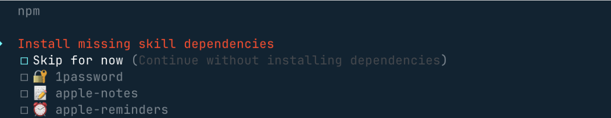
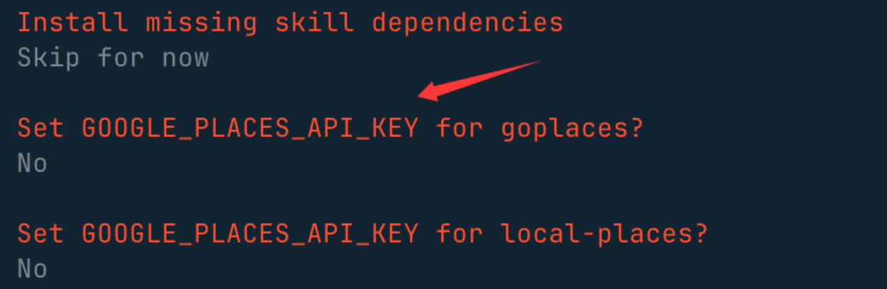
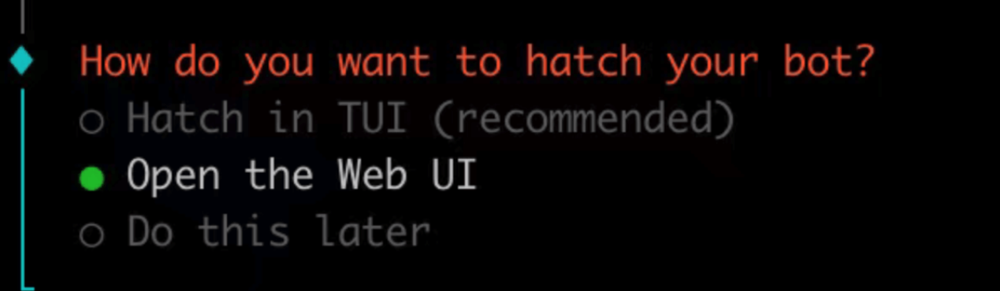

# 目录
- [1 简介](#1-简介)
- [2 安装OpenClaw](#2-安装openclaw)
  - [2.1 方式4](#21-方式4)
  - [2.2 方式1](#22-方式1)
  - [2.3 常用命令](#23-常用命令)
  - [2.4 卸载](#24-卸载)
- [3 配置大模型](#3-配置大模型)
- [4 skills](#4-skills)
- [搜素skill](#搜素skill)
- [下载安装新技能](#下载安装新技能)
- [批量更新已安装技能](#批量更新已安装技能)

---

# 1 简介
OpenClaw 官网: https://openclaw.ai/

中文文档： https://docs.openclaw.ai/zh-CN

Github 地址：https://github.com/openclaw/openclaw

OpenClaw 技能合集: https://github.com/VoltAgent/awesome-openclaw-skills

# 2 安装OpenClaw

方式1：通过云服务器ECS预置镜像安装，2核2G起步即可支持OpenClaw运行。

方式2：基于容器服务镜像一键部署，零门槛秒级启动并支持弹性扩展。

方式3：依托AI云桌面预置镜像灵活部署，支持Windows、Mac、iOS、Android多端登录。

方式4：本地脚本一键安装（推荐）

1）macOS/Linux：
>```bash
>curl -fsSL https://openclaw.ai/install.sh | bash
>```

2）Windows：  
>```bash
># PowerShell
>iwr -useb https://openclaw.ai/install.ps1 | iex
>
># CMD
>curl -fsSL https://openclaw.ai/install.cmd -o install.cmd && install.cmd && del install.cmd
>```

它会完成环境检测，并且安装必要的依赖，还会启动 onboarding(设置向导) 流程。

后期要重新进入设置向导，可以执行以下命令：
>```bash
>openclaw onboard --install-daemon
>```

方式5：手动安装  
需要 Node.js ≥22 并完成基本配置

方式6：从源码安装

## 2.1 方式4
执行脚本安装完成后进入 onboarding(设置向导) 流程：

1. 会提醒你这个龙虾能力很强，当然风险也很大，我们选 yes

2. 接下来我们就选快速启动 QuickStart 选项

3. 接下来我们需要配置一个大模型，Model/Auth Provider 选择 AI 供应商。  
认证配置文件（OAuth + API 密钥）在 `~/.openclaw/agents/<agentId>/agent/auth-profiles.json` ，后期也可以在这个文件上修改。  
可以先选最后一个 Skip 暂时跳过

4. 其他配置，比如端口的设置 Gateway Port，按默认的 18789 即可，比如 Skills、包的安装管理器选 npm 或其他，可以一路 Yes 下去。

5. 选一些自己喜欢的 skills，也可以直接跳过，使用空格按键选择：


6. 这些 API key，没有的直接选 no


7. 最后这三个钩子可以开启，使用空格按键选择，主要做内容引导日志和会话记录


8. 选择Open the Web UI，使用浏览器打开：


安装完后，就会自动访问 http://127.0.0.1:18789/chat，就可以打开聊天界面让它开始工作。

## 2.2 方式1
以联通云为例

1. 购买云服务器ECS，并选择OpenClaw镜像。  

    规格大于等于2C2G即可。  

    该云服务器创建成功后，已具备OpenClaw应用以及初始环境。

2. 获取API Key

    在联通云AI服务平台选择“服务接入”，点击“创建服务”。选择您所需要的大模型类型，获得API Key。  
    或购买CodingPlan，获得API Key。

3. OpenClaw配置（采用联通云内置脚本一键部署）（自定义配置见 https://support.cucloud.cn/document/127/571/128.html?id=128&arcid=6999 ）

    通过SSH或VNC连接进入云服务器ECS
    >```bash
    >ssh 用户名@公网IP地址
    ># 然后输入你的密码
    >```

    注意：为保证安全使用OpenClaw，OpenClaw云服务器ECS在创建时，系统为您分配默认专有网络VPC、默认子网、默认安全组，  
    所以在创建完成时，请您进入云服务器后，执行以下命令，检查并配置DNS解析服务：

    >```bash
    >vim /etc/resolv.conf
    >```
    在打开的文件中，确认是否存在nameserver配置项。若未配置或需要修改，请添加以下内容（以Google公共DNS为例）:  nameserver 8.8.8.8  

    先按i进入编辑模式，在文件中添加 nameserver 8.8.8.8 ，再按esc退出编辑模式，输入:wq（或:x）保存并退出（注意：输入法要是英文）

    下载最新的脚本并赋予执行权限
    >```bash
    >curl -o update-openclaw-config.py https://console.cucloud.cn/console/subApp/woc-ecs-beta/assets/update-openclaw-config.py
    >chmod +x update-openclaw-config.py
    >```

    运行脚本，按提示进行配置（配置钉钉见 https://support.cucloud.cn/document/127/571/128.html?id=128&arcid=7008 ）
    >```bash
    >./update-openclaw-config.py
    >```

    之后可以在终端输入以下内容启动OpenClaw并交互
    >```bash
    >python3 -m openclaw.cli
    >```

## 2.3 常用命令
| **命令分类**       | **功能描述**                     | **具体命令**                                                                 |
|--------------------|----------------------------------|-----------------------------------------------------------------------------|
| **状态查看**       | 查看整体服务状态                 | `openclaw status`                                                           |
|                    | 查看 Gateway 网关状态           | `openclaw gateway status`                                                   |
| **手动运行**       | 前台运行 Gateway 网关           | `openclaw gateway --port 18789 --verbose`                                   |
| **安装后操作**     | 运行新手引导（安装守护进程）     | `openclaw onboard --install-daemon`                                         |
|                    | 快速系统检查                     | `openclaw doctor`                                                           |
|                    | 检查 Gateway 网关健康状态        | `openclaw status` + `openclaw health`                                       |
|                    | 打开可视化仪表板                 | `openclaw dashboard`                                                        |


## 2.4 卸载
>```bash
># 使用内置卸载程序
>openclaw uninstall
>
>非交互式（自动化 / npx）：
>openclaw uninstall --all --yes --non-interactive
>npx -y openclaw uninstall --all --yes --non-interactive
>```

# 3 配置大模型

步骤1：打开配置文件。  
运行以下命令打开 Web UI，然后在Web UI的左侧菜单栏中选择Config > Raw。
>```bash
>openclaw dashboard
>```

步骤2：修改配置文件。

1）在 JSON 根对象中加入如下 models 配置（如果已存在则替换）。

- 请将 <YOUR_API_KEY> 替换为您的 Coding Plan 专属API Key

- 在baseUrl中填写Coding Plan的BaseUrl。目前套餐仅支持贵阳基地二区，使用openai接口协议时，填写https://aigw-gzgy2.cucloud.cn:8443/v1

>```json
>"models": {
>  "mode": "merge",
>  "providers": {
>    "unicom-cloud": {
>      "baseUrl": "https://aigw-gzgy2.cucloud.cn:8443/v1",
>      "apiKey": "<YOUR_API_KEY>",
>      "api": "openai-completions",
>      "models": [
>        {
>          "id": "MiniMax-M2.5",
>          "name": "MiniMax-M2.5",
>          "reasoning": false,
>          "input": ["text"],
>          "cost": { "input": 0, "output": 0, "cacheRead": 0, "cacheWrite": 0 },
>          "contextWindow": 202752,
>          "maxTokens": 16384
>        }
>      ]
>    }
>  }
>}
>```

2）找到 agents.defaults 对象，并替换或添加以下两个字段：、
>```
>"model": {
>  "primary": "unicom-cloud/MiniMax-M2.5"
>},
>"models": {
>  "unicom-cloud/MiniMax-M2.5": {}
>}
>```

步骤3：保存配置  
如果在Web UI中修改，先单击右上角 Save 保存，然后单击 Update来使配置生效。  
如果在终端中修改，先保存文件并退出，然后运行以下命令来使配置生效。  
>```bash
>openclaw gateway restart
>```

步骤4：使用  
在终端运行以下命令，可以用 Web UI 的方式使用 OpenClaw。
>```bash
>openclaw dashboard
>```

# 4 skills
使用 ClawHub 查找、安装技能

ClawHub 技能仓库地址：https://clawhub.ai/

ClawHub 国内镜像：https://skillhub.tencent.com/

安装 ClawHub 工具：
>```bash
># 推荐方式（npx 无需全局安装）
>npx clawhub@latest --version
>
># 或全局安装（方便以后直接用 clawhub 命令）
>npm install -g clawhub
># 或者用 pnpm
>pnpm add -g clawhub
>```

```bash
# 登录
clawhub login

# 搜素skill
clawhub search "postgres backups"

# 下载安装新技能
clawhub install my-skill-pack

# 批量更新已安装技能
clawhub update --all
```

# 5 插件
```bash

```

```bash

```

```bash

```

```bash

```

# 常用命令
| 命令                          | 作用          | 说明                                                                 |
|-------------------------------|---------------|----------------------------------------------------------------------|
| `vim /etc/resolv.conf`        | 配置 DNS      | 创建 OpenClaw 的 ECS 实例后，配置 DNS 解析服务（如修改 nameserver）。 |
| `ps -ef \| grep open`         | 查询服务状态  | 检查 OpenClaw 相关进程是否已启动（如 `openclaw-gateway`）。          |
| `openclaw gateway run`        | 启动服务      | 正常启动 OpenClaw 服务（前台运行，终端会持续输出日志）。             |
| `openclaw gateway --force`    | 强制重启服务  | 杀死旧进程并重新启动 OpenClaw 服务（适用于服务异常时强制恢复）。      |
| `openclaw logs --follow`      | 实时查看日志  | 跟踪 OpenClaw 执行过程中的日志输出（类似 `tail -f`）。               |


| **功能分类**       | **命令**                          | **说明**                                                                 |
|--------------------|-----------------------------------|--------------------------------------------------------------------------|
| **基础操作**       | `openclaw start`                  | 启动 OpenClaw 服务                                                       |
|                    | `openclaw stop`                   | 停止 OpenClaw 服务                                                       |
|                    | `openclaw restart`                | 重启 OpenClaw 服务                                                       |
|                    | `openclaw status`                 | 查看服务运行状态                                                         |
| **网关管理**       | `openclaw gateway start`          | 启动网关服务                                                             |
|                    | `openclaw gateway stop`           | 停止网关服务                                                             |
|                    | `openclaw gateway restart`        | 重启网关服务                                                             |
|                    | `openclaw gateway status`         | 查看网关状态（包括监听端口、服务健康度等）                               |
| **配置管理**       | `openclaw config get <path>`      | 查看指定配置项的值（如 `config get models.default`）                     |
|                    | `openclaw config set <path> <value>` | 修改配置项（如 `config set gateway.port 18789`）                         |
|                    | `openclaw configure`              | 交互式配置向导（模型、通道、技能等）                                     |
| **模型与技能管理** | `openclaw models list`            | 列出所有可用模型                                                         |
|                    | `openclaw models set <model>`     | 切换默认模型（如 `models set claude-3-5`）                               |
|                    | `openclaw skills list`            | 列出所有可用技能                                                         |
|                    | `openclaw skills enable <name>`   | 启用指定技能（如 `skills enable file-organizer`）                        |
| **日志与诊断**     | `openclaw logs`                   | 查看实时日志                                                             |
|                    | `openclaw logs --tail=100`        | 查看最近 100 行日志                                                      |
|                    | `openclaw doctor`                 | 系统诊断与自动修复（推荐在遇到问题时运行）                               |
| **通道管理**       | `openclaw channels list`          | 列出已连接的聊天通道（如 Telegram、Discord 等）                          |
|                    | `openclaw channels add --channel telegram` | 添加 Telegram 通道（需提前配置 API Token）                          |
| **内存管理**       | `openclaw memory search "关键词"`  | 搜索长期记忆或每日日志中的内容                                           |
| **定时任务**       | `openclaw cron add --name "任务名" --cron "0 9 * * *" --message "提醒内容"` | 添加每日定时任务（如早上 9 点的提醒） |
| **高级命令**       | `openclaw dashboard`              | 打开 Web 控制面板（默认地址 `http://127.0.0.1:18789`）                   |
|                    | `openclaw update`                 | 检查并更新 OpenClaw 到最新版本                                           |
|                    | `openclaw reset`                  | 重置本地配置（谨慎使用，会清除所有自定义设置）                           |


# 常见问题

1. 若您在使用OpenClaw时，出现“no output”字样：

    可能原因为客户端无法访问大模型，建议检查虚拟机与大模型的连通性，如未配置DNS导致与大模型无法链接。

2. 如果下载最新的脚本赋予执行权限时报如下错误，则可通过配置DNS解析进行解决。


# 常用命令

| 命令                        | 作用           | 说明                                                                 |
|-----------------------------|----------------|----------------------------------------------------------------------|
| `openclaw onboard`          | 启动配置向导   | 交互式配置，如果遇到问题可以重新执行引导                             |
| `openclaw gateway install`  | 安装服务       | 同时启动服务，并设置开机自启                                         |
| `openclaw gateway start`    | 启动服务       | 需要先执行 `install` 命令                                            |
| `openclaw gateway stop`     | 停止服务       | 会卸载服务（注意与 `start` 的依赖关系）                             |
| `openclaw gateway status`   | 查看状态       | 检查服务是否正在运行                                                 |
| `openclaw logs --follow`    | 查看实时日志   | 跟踪执行过程中的日志输出（类似 `tail -f`）                          |


# 其他
## OpenClaw 的 Web 控制面板
>```bash
>root@open:~# openclaw dashboard
>
>🦞 OpenClaw 2026.2.9 (33c75cb) — Turning "I'll reply later" into "my bot replied instantly".
>
>Dashboard URL: http://127.0.0.1:18789/#token=b0cafaae9480bbfce097f058f7c3a52c7e5d5250ea9cefc4
>```
在 你的本地电脑（而非服务器）的终端中运行以下命令，将服务器的 18789 端口映射到本地的 18789 端口：
>```bash
>ssh -N -L 18789:127.0.0.1:18789 root@42.4.62.221
>```
- -N：不执行远程命令（仅端口转发）。
- -L 18789:127.0.0.1:18789：将本地 18789 端口转发到服务器的 127.0.0.1:18789。
- root@42.4.62.221：服务器的 SSH 地址（替换为你的实际 IP）。

保持 SSH 隧道运行，然后在本地浏览器中访问以下 URL：http://localhost:18789/

如果进去之后报：  
disconnected (1008): unauthorized: gateway token missing (open a tokenized dashboard URL or paste token in Control UI settings)

在云服务器上执行
>```bash
>openclaw config get gateway.auth.token
>```
输出的那一串就是 Gateway Token

在 Web 界面中：
1. 左侧菜单点 Control → Overview；
2. 页面里找到 Gateway Access / Gateway Access Panel；
3. 在 Gateway Token 输入框里粘贴刚才查到的 token；
4. 点击 保存 / 连接。

或者直接而用 openclaw dashboard 命令返回的链接，他已经自带token。

## 服务常驻
在这个镜像里，OpenClaw 并没有“常驻后台服务”，每次 SSH 里敲命令都是一次性前端进程
>```bash
>systemctl status openclaw
>systemctl status openclaw-daemon
>```
都显示 Unit ... could not be found. 说明镜像里并没有预先配置好的 openclaw.service。  
所以没有后台 Gateway 常驻。

正确用法是：让 Gateway 以服务形式常驻后台，SSH 只是用来建隧道 / 偶尔维护。

官方推荐：把 Gateway 注册为系统服务  
Linux 下用 systemd 用户服务 openclaw-gateway.service，命令是：
>```bash
>   openclaw gateway install   # 安装为系统服务（开机自启）
>   openclaw gateway restart   # 重启
>   # openclaw gateway stop      # 停止
>   openclaw gateway status
>   openclaw status
>   # 如果显示 Runtime: running、RPC probe: ok，说明 Gateway 已经在后台正常运行
>```


