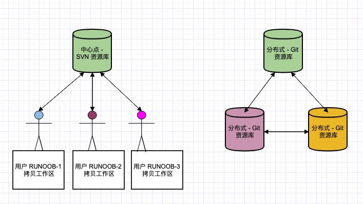
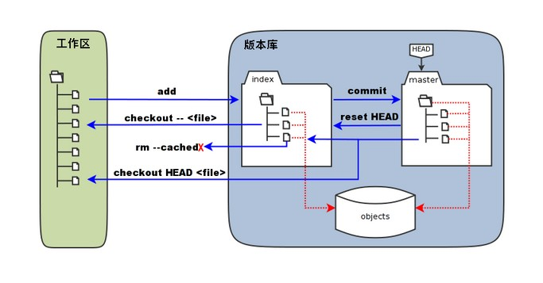

# Git 简介
Git 是一个开源的分布式版本控制系统。

Git 与常用的版本控制工具 CVS, Subversion 等不同，它采用了分布式版本库的方式，不必服务器端软件支持。

## Git 与 SVN 区别
Git 不仅仅是个版本控制系统，它也是个内容管理系统(CMS)，工作管理系统等。

1. **Git 是分布式的，SVN 不是**

2. **Git 把内容按元数据方式存储，而 SVN 是按文件**：所有的资源控制系统都是把文件的元信息隐藏在一个类似 .svn、.cvs 等的文件夹里。

3. **Git 分支和 SVN 的分支不同**：分支在 SVN 中一点都不特别，其实它就是版本库中的另外一个目录。

4. **Git 没有一个全局的版本号，而 SVN 有**

5. **Git 的内容完整性要优于 SVN**：Git 的内容存储使用的是 SHA-1 哈希算法。这能确保代码内容的完整性，确保在遇到磁盘故障和网络问题时降低对版本库的破坏。



## Git 与 Github
Git是个版本控制的工具，用来管理本地的代码工程，它可以记录代码内容的变更；而Github是一个代码托管平台，我们可以使用Git将本地代码上传到Github。

**Git工作流程**  

- 工作区(Workspace)：平时存放项目代码的地方
- 暂存区(Index/Stage)：用于临时存放改动信息
- 本地仓库(Repository)：存放所有提交的版本数据
- 远程仓库(Remote)：托管代码的服务器，比如我们经常用的Github就是个代码托管平台

# Git 安装配置
跳过

检查git安装是否成功，请在cmd中键入以下内容
>```bash
>git -version
>```

在GitHub上创建账户,Git和GitHub账户应该同步。基本配置，应在命令提示符中输入以下命令
>```bash
>git config –-global user.name "UserNameOnGithub"  
>git config –-global user.email "Email"
>```

## Git 配置
Git 提供了一个叫做 `git config` 的命令，用来配置或读取相应的工作环境变量。

这些环境变量，决定了 Git 在各个环节的具体工作方式和行为。

这些变量可以存放在以下三个不同的地方：

- /etc/gitconfig 文件：系统中对所有用户都普遍适用的配置。若使用 git config 时用 --system 选项，读写的就是这个文件。

- ~/.gitconfig 文件：用户目录下的配置文件只适用于该用户。若使用 git config 时用 --global 选项，读写的就是这个文件。

- 当前项目的 Git 目录中的配置文件（也就是工作目录中的 .git/config 文件）：这里的配置仅仅针对当前项目有效。每一个级别的配置都会覆盖上层的相同配置，所以 .git/config 里的配置会覆盖 /etc/gitconfig 中的同名变量。

在 Windows 系统上，Git 会找寻用户主目录下的 .gitconfig 文件。主目录即 $HOME 变量指定的目录，一般都是 C:\Documents and Settings\$USER。

此外，Git 还会尝试找寻 /etc/gitconfig 文件，只不过看当初 Git 装在什么目录，就以此作为根目录来定位。

**用户信息**

配置个人的用户名称和电子邮件地址，这是为了在每次提交代码时记录提交者的信息：
>```bash
>git config –-global user.name "UserNameOnGithub"  
>git config –-global user.email "Email"
>```
如果用了 --global 选项，那么更改的配置文件就是位于你用户主目录下的那个，以后你所有的项目都会默认使用这里配置的用户信息。

如果去掉 --global 参数只对当前仓库有效。

如果要在某个特定的项目中使用其他名字或者电邮，只要去掉 --global 选项重新配置即可，新的设定保存在当前项目的 .git/config 文件里。

**文本编辑器**

设置 Git 默认使用的文本编辑器,一般可能会是 Vi 或者 Vim，如果你有其他偏好，比如 VS Code 的话，可以重新设置：
>```bash
>git config --global core.editor "code --wait"

**差异分析工具**

还有一个比较常用的是，在解决合并冲突时使用哪种差异分析工具。比如要改用 vimdiff 的话：
>```bash
>git config --global merge.tool vimdiff
>```
Git 可以理解 kdiff3，tkdiff，meld，xxdiff，emerge，vimdiff，gvimdiff，ecmerge，和 opendiff 等合并工具的输出信息。

当然，也可以指定使用自己开发的工具，具体怎么做可以参阅Git分支管理。

**查看配置信息**
>```bash
>git config --list
>```
有时候会看到重复的变量名，那就说明它们来自不同的配置文件（比如 /etc/gitconfig 和 ~/.gitconfig），不过最终 Git 实际采用的是最后一个。

这些配置我们也可以在 ~/.gitconfig 或 /etc/gitconfig 看到

也可以直接查阅某个环境变量的设定，只要把特定的名字跟在后面即可：
>```bash
>git config user.name
>```
编辑 git 配置文件:
>```bash
>git config -e    # 针对当前仓库 
>git config -e --global   # 针对系统上所有仓库

**生成 SSH 密钥（可选）**

如果你需要通过 SSH 进行 Git 操作，可以生成 SSH 密钥并添加到你的 Git 托管服务（如 GitHub、GitLab 等）上。
>```bash
>ssh-keygen -t rsa -b 4096 -C "your.email@example.com"
>```
按提示完成生成过程，然后将生成的公钥添加到相应的平台。

**验证安装**

在终端或命令行中运行以下命令，确保 Git 已正确安装并配置：
>```bash
>git --version
>git config --list

# Git 工作流程


1. 克隆仓库  
如果你要参与一个已有的项目，首先需要将远程仓库克隆到本地：
    >```bash
    >git clone https://github.com/username/repo.git
    >cd repo
    >```

2. 创建新分支  
为了避免直接在 main 或 master 分支上进行开发，通常会创建一个新的分支：
    >```bash
    >git checkout -b new-feature
    >```

3. 工作目录  
在工作目录中进行代码编辑、添加新文件或删除不需要的文件。

4. 暂存文件  
将修改过的文件添加到暂存区，以便进行下一步的提交操作：
    >```bash
    >git add filename
    ># 或者添加所有修改的文件
    >git add .
    >```

5. 提交更改  
将暂存区的更改提交到本地仓库，并添加提交信息：
    >```bash
    >git commit -m "Add new feature"
    >```

6. 拉取最新更改  
在推送本地更改之前，最好从远程仓库拉取最新的更改，以避免冲突：
    >```bash
    >git pull origin main
    ># 或者如果在新的分支上工作
    >git pull origin new-feature
    >```

7. 推送更改  
将本地的提交推送到远程仓库：
    >```bash
    >git push origin new-feature
    >```

8. 创建 Pull Request（PR）  
在 GitHub 或其他托管平台上创建 Pull Request，邀请团队成员进行代码审查。PR 合并后，你的更改就会合并到主分支。

9. 合并更改  
在 PR 审核通过并合并后，可以将远程仓库的主分支合并到本地分支：
    >```bash
    >git checkout main
    >git pull origin main
    >git merge new-feature
    >```

10. 删除分支  
如果不再需要新功能分支，可以将其删除：
    >```bash
    >git branch -d new-feature
    ># 或者从远程仓库删除分支：
    >git push origin --delete new-feature
    >```

# Git 工作区、暂存区和版本库
- **工作区**：就是你在电脑里能看到的目录，当前项目的所有文件和子目录都属于工作区。
  - 文件的修改在工作区中进行，但这些修改还没有被记录到版本控制中。

- **暂存区**：英文叫 stage 或 index。一般存放在 .git 目录下的 index 文件（.git/index）中，所以我们把暂存区也叫作索引。是一个临时存储区域，它包含了即将被提交到版本库中的文件快照。
  - 暂存区保存了将被包括在下一个提交中的更改。
  - 你可以多次使用 git add 命令来将文件添加到暂存区，直到你准备好提交所有更改。
  >  ```bash
  >  git add filename       # 将单个文件添加到暂存区
  >  git add .              # 将工作区中的所有修改添加到暂存区
  >  git status
  >  ```
- **版本库**：工作区有一个隐藏目录 .git 它是 Git 的版本库。包含项目的所有版本历史记录。每次提交都会在版本库中创建一个新的快照，这些快照是不可变的，确保了项目的完整历史记录。
  - 版本库分为本地版本库和远程版本库。这里主要指本地版本库。
  - 本地版本库存储在 .git 目录中，它包含了所有提交的对象和引用。




- 图中左侧为工作区，右侧为版本库。在版本库中标记为 "index" 的区域是暂存区（stage/index），标记为 "master" 的是 master 分支所代表的目录树。

- 图中我们可以看出此时 "HEAD" 实际是指向 master 分支的一个"游标"。所以图示的命令中出现 HEAD 的地方可以用 master 来替换。

- 图中的 objects 标识的区域为 Git 的对象库，实际位于 ".git/objects" 目录下，里面包含了创建的各种对象及内容。

- 当对工作区修改（或新增）的文件执行 `git add` 命令时，暂存区的目录树被更新，同时工作区修改（或新增）的文件内容被写入到对象库中的一个新的对象中，而该对象的ID被记录在暂存区的文件索引中。

- 当执行提交操作`git commit`时，暂存区的目录树写到版本库（对象库）中，master 分支会做相应的更新。即 master 指向的目录树就是提交时暂存区的目录树。

- 当执行 `git reset HEAD` 命令时，暂存区的目录树会被重写，被 master 分支指向的目录树所替换，但是工作区不受影响。

- 当执行 `git rm --cached <file>` 命令时，会直接从暂存区删除文件，工作区则不做出改变。

- 当执行 `git checkout .` 或者 `git checkout -- <file>` 命令时，会用暂存区全部或指定的文件替换工作区的文件。这个操作很危险，会清除工作区中未添加到暂存区中的改动。

- 当执行 `git checkout HEAD .` 或者 `git checkout HEAD <file>` 命令时，会用 HEAD 指向的 master 分支中的全部或者部分文件替换暂存区和以及工作区中的文件。这个命令也是极具危险性的，因为不但会清除工作区中未提交的改动，也会清除暂存区中未提交的改动。

## 工作区、暂存区和版本库之间的关系
1. 工作区 -> 暂存区
使用 git add 命令将工作区中的修改添加到暂存区。
    >    ```bash
    >    git add filename
    >    ```

2. 暂存区 -> 版本库
使用 git commit 命令将暂存区中的修改提交到版本库。
    >    ```bash
    >    git commit -m "Commit message"
    >    ```

3. 版本库 -> 远程仓库
使用 git push 命令将本地版本库的提交推送到远程仓库。
    >    ```bash
    >    git push origin branch-name
    >    ```

4. 远程仓库 -> 本地版本库
使用 git pull 或 git fetch 命令从远程仓库获取更新。
    >    ```bash
    >    git pull origin branch-name
    >    # 或者
    >    git fetch origin branch-name
    >    git merge origin/branch-name
    >    ```

# Git 创建仓库
三种方式

1、 从创建一个新的目录开始
>```bash
>mkdir my-project
>cd my-project
>```
使用当前目录作为 Git 仓库，我们只需使它初始化。
>```bash
>git init
>```
该命令执行完后会在当前目录生成一个 .git 目录。


2、 从已有目录作为Git仓库。
>```bash
>git init newrepo
>```
初始化后，会在 newrepo 目录下会出现一个名为 .git 的目录，所有 Git 需要的数据和资源都存放在这个目录中。

如果当前目录下有几个文件想要纳入版本控制，需要先用 git add 命令告诉 Git 开始对这些文件进行跟踪，然后提交：
>```bash
>git add *.c
>git add README
>git commit -m '初始化项目版本'
>```
以上命令将目录下以 .c 结尾及 README 文件提交到仓库中。

**注**： 在 Linux 系统中，commit 信息使用单引号 '，Windows 系统，commit 信息使用双引号 "。

3、从现有 Git 仓库中拷贝项目
>```bash
>git clone <repo>
># 如果需要克隆到指定的目录，可以使用
>git clone <repo> <directory>
>```
- repo：Git 仓库。
- directory：本地目录。

# Git 基本命令

## 创建仓库
| 命令 | 说明 |
| --- | --- |
| git init | 初始化仓库 |
| git clone | 拷贝一份远程仓库，也就是下载一个项目 |

## 提交与修改
| 命令 | 说明 |
| --- | --- |
| git add | 添加文件到暂存区 |
| git status | 查看仓库当前的状态，显示有变更的文件 |
| git diff | 比较文件的不同，即暂存区和工作区的差异 |
| git difftool | 使用外部差异工具查看和比较文件的更改 |
| git range-diff | 比较两个提交范围之间的差异 |
| git commit | 提交暂存区到本地仓库 |
| git reset | 回退版本 |
| git rm | 将文件从暂存区和工作区中删除 |
| git mv | 移动或重命名工作区文件 |
| git notes | 添加注释 |
| git checkout | 分支切换 |
| git switch （Git 2.23 版本引入） | 更清晰地切换分支 |
| git restore （Git 2.23 版本引入） | 恢复或撤销文件的更改 |
| git show | 显示 Git 对象的详细信息 |

## 提交日志
| 命令 | 说明 |
| --- | --- |
| git log | 查看历史提交记录 |
| git blame <file> | 以列表形式查看指定文件的历史修改记录 |
| git shortlog | 生成简洁的提交日志摘要 |
| git describe | 生成一个可读的字符串，该字符串基于 Git 的标签系统来描述当前的提交 |

## 远程操作
| 命令 | 说明 |
| --- | --- |
| git remote | 远程仓库操作 |
| git fetch | 从远程获取代码库 |
| git pull | 下载远程代码并合并 |
| git push | 上传远程代码并合并 |
| git submodule | 管理包含其他 Git 仓库的项目 |


# Git 文件状态
**未跟踪（Untracked）**：新创建的文件，未被 Git 记录。

**已跟踪（Tracked）**： 通过 git add 命令将未跟踪的文件添加到暂存区后，文件变为已跟踪状态。

**已修改（Modified）**：已被 Git 跟踪的文件发生了更改，但这些更改还没有被提交到 Git 记录中。

**已暂存（Staged）**： 使用 git add 命令将修改过的文件添加到暂存区后，文件进入已暂存状态，等待提交。

**已提交（Committed）**： 使用 git commit 命令将暂存区的更改提交到本地仓库后，这些更改被记录下来，文件状态返回为已跟踪状态。

# Git 分支管理
能够让多个开发人员并行工作，开发新功能、修复 bug 或进行实验，而不会影响主代码库。

Git 分支实际上是指向更改快照的指针。


## 创建与切换分支
创建新分支：  
`git branch <branch_name>`

创建新分支并切换到该分支：(checkout 是老版本，新版switch)  
`git checkout -b <branch_name>` 

切换分支：  
`git checkout <branch_name>`

注：当你切换分支的时候，Git 会用该分支的最后提交的快照替换你的工作目录的内容， 所以多个分支不需要多个目录。

## 查看分支
查看所有分支：    
`git branch`

查看远程分支：  
`git branch -r`

查看所有本地和远程分支：  
`git branch -a`

## 合并分支
将其他分支合并到当前分支：  
`git merge <branch_name>`

`git merge [被合并的分支] -> 合并到 [你当前的分支] 上`  

## 删除分支
删除本地分支：  
`git branch -d <branch_name>`

强制删除未合并的分支：  
`git branch -D <branch_name>`

删除远程分支：  
`git push origin --delete <branch_name>`

## 最常用分支命令
>```bash
># 1. 查看所有分支（当前分支前面有 *）
>git branch
>
># 2. 新建分支
>git branch 分支名
>
># 3. 切换分支
>git switch 分支名
>
># 4. 新建 + 立刻切换
>git switch -c 分支名
>
># 5. 把分支合并到当前所在分支
>git merge 要合并的分支名
>
># 6. 删除本地分支
>git branch -d 分支名
>
># 7. 把本地分支推送到远程
>git push origin 分支名
>
># 8. 查看本地 + 远程所有分支
>git branch -a
>```

## 完整工作流程
### 步骤 1：永远从最新主分支开新功能
>```bash
># 切到主分支
>git switch main
>
># 拉取最新代码（保证你的主分支是最新的）
>git pull
>```

### 步骤 2：创建你的功能分支
>```bash
>git switch -c feature-login
>```
现在你进入独立开发空间，**随便写代码，不影响主分支**。

### 步骤 3：在分支上正常写代码、提交
>```bash
>git add .
>git commit -m "完成登录功能"
>```

### 步骤 4：写完了，合并回主分支
先切回主分支
>```bash
>git switch main
>```

再合并你的功能分支
>```bash
>git merge feature-login
>```

合并成功后，推送到远程
>```bash
>git push
>```

### 步骤 5：合并完，删除旧分支
>```bash
>git branch -d feature-login
>```

## 主分支被改，怎么同步到你的分支？
场景：
你在写分支，同事更新了 main 分支，你想**把最新主分支代码拿到你的分支里**。

>```bash
># 1. 切到 main，拉最新
>git switch main
>git pull
>
># 2. 切回你的分支
>git switch feature-login
>
># 3. 把 main 合并进来
>git merge main
>```

你的分支就变成**最新代码 + 你的新功能**了。

## 遇到冲突怎么办？
Git 提示：
`Automatic merge failed; fix conflicts and then commit the result.`

解决方法：
1. 打开 VS Code
2. 点文件里的冲突标记
3. 选择：
   - Accept Current Change（保留当前）
   - Accept Incoming Change（保留 incoming）
   - Accept Both（都保留）
4. 保存文件
5. 提交
>```bash
>git add .
>git commit -m "解决冲突"
>```

## 远程分支操作
### 1. 把本地分支发到远程
>```bash
>git push origin feature-login
>```

### 2. 拉取别人创建的远程分支
>```bash
>git fetch
>git switch 分支名
>```

### 3. 删除远程分支
>```bash
>git push origin --delete 分支名
>```

## 分支模板

>```bash
>1. 切回主分支
>git switch main
>
>2. 拉最新（把远程主分支同步到本地）
>git pull
>
>3. 切回你的分支
>git switch feature-login
>
>4. 把最新主分支合并进你的分支（让你的分支变最新）
>git merge main
>
>5. 再切回主分支
>git switch main
>
>6. 把你的功能合并进主分支
>git merge feature-login
>
>7. 推送到网上
>git push
>
>8. 删除分支（清理）
>git branch -d feature-login
>```

# Git 查看提交历史
查看 Git 提交历史可以帮助你了解代码的变更情况和开发进度。

Git 提供了多种命令和选项来查看提交历史，从简单的日志到详细的差异对比。

- git log - 查看历史提交记录。
- git blame <file> - 以列表形式查看指定文件的历史修改记录。

## git log
查看 Git 仓库中提交历史记录，包括提交的哈希值、作者、提交日期和提交消息等。

基本语法：

`git log [选项] [分支名/提交哈希]`

常用的选项包括：
- -p：显示提交的补丁（具体更改内容）。
- --oneline：以简洁的一行格式显示提交信息。
- --graph：以图形化方式显示分支和合并历史。
- --decorate：显示分支和标签指向的提交。
- --author=<作者>：只显示特定作者的提交。
- --since=<时间>：只显示指定时间之后的提交。
- --until=<时间>：只显示指定时间之前的提交。
- --grep=<模式>：只显示包含指定模式的提交消息。
- --no-merges：不显示合并提交。
- --stat：显示简略统计信息，包括修改的文件和行数。
- --abbrev-commit：使用短提交哈希值。
- --pretty=<格式>：使用自定义的提交信息显示格式。

## git blame
逐行显示指定文件的每一行代码是由谁在什么时候引入或修改的，包括作者、提交哈希、提交日期和提交消息等信息。

`git blame [选项] <文件路径>`

常用的选项包括：

- -L <起始行号>,<结束行号>：只显示指定行号范围内的代码注释。
- -C：对于重命名或拷贝的代码行，也进行代码行溯源。
- -M：对于移动的代码行，也进行代码行溯源。
- -C -C 或 -M -M：对于较多改动的代码行，进行更进一步的溯源。
- --show-stats：显示包含每个作者的行数统计信息。

# Git 恢复和回退
Git 提供了多种方式来恢复和回退到之前的版本，不同的命令适用于不同的场景和需求。

以下是几种常见的方法：

- git checkout：切换分支或恢复文件到指定提交。
- git reset：重置当前分支到指定提交（软重置、混合重置、硬重置）。
- git revert：创建一个新的提交以撤销指定提交，不改变提交历史。
- git reflog：查看历史操作记录，找回丢失的提交。

##  git checkout
恢复工作目录中的文件到某个提交：
>```bash
>git checkout <commit> -- <filename>
>```
例如，将 file.txt 恢复到 abc123 提交时的版本：
>```bash
>git checkout abc123 -- file.txt
>```
切换到特定提交：
>```bash
>git checkout <commit>
>```
例如：
>```bash
>git checkout abc123
>```
这种方式切换到特定的提交时，处于分离头指针（detached HEAD）状态。

## git reset
git reset 命令可以更改当前分支的提交历史，它有三种主要模式：--soft、--mixed 和 --hard。

`--soft`：只重置 HEAD 到指定的提交，暂存区和工作目录保持不变。
>```bash
>git reset --soft <commit>
>```

`--mixed（默认）`：重置 HEAD 到指定的提交，暂存区重置，但工作目录保持不变。
>```bash
>git reset --mixed <commit>
>```

`--hard`：重置 HEAD 到指定的提交，暂存区和工作目录都重置。
>```bash
>git reset --hard <commit>
>```
例如，将当前分支重置到 abc123 提交：
>```bash
>git reset --hard abc123

## git revert
git revert 命令创建一个新的提交，用来撤销指定的提交，它不会改变提交历史，适用于已经推送到远程仓库的提交。
>```bash
>git revert <commit>
>```
例如，撤销 abc123 提交：
>```bash
>git revert abc123

## git reflog
git reflog 命令记录了所有 HEAD 的移动。即使提交被删除或重置，也可以通过 reflog 找回。
>```bash
>git reflog
>```
利用 reflog 可以找到之前的提交哈希，从而恢复到特定状态。例如：
>```bash
>git reset --hard HEAD@{3}

## 示例
查看提交历史：
>```bash
>git log --oneline
>```
假设输出如下：
>```bash
>abc1234 Commit 1
>def5678 Commit 2
>ghi9012 Commit 3
>```
切换到 Commit 2（处于分离头指针状态）：
>```bash
>git checkout def5678
>```
重置到 Commit 2，保留更改到暂存区：
>```bash
>git reset --soft def5678
>```
重置到 Commit 2，取消暂存区更改：
>```bash
>git reset --mixed def5678
>```
重置到 Commit 2，丢弃所有更改：
>```bash
>git reset --hard def5678
>```
撤销 Commit 2：
>```bash
>git revert def5678
>```
查看 reflog 找回丢失的提交：
>```bash
>git reflog
>```
找到之前的提交哈希并恢复：
>```bash
>git reset --hard HEAD@{3}

# Git 标签
如果你达到一个重要的阶段，并希望永远记住提交的快照，你可以使用 git tag 给它打上标签。  

比如说，我们想为我们的 test 项目发布一个 "1.0" 版本，我们可以用 git tag -a v1.0 命令给最新一次提交打上（HEAD） "v1.0" 的标签。  

-a 选项意为"创建一个带注解的标签"，它会记录这标签是啥时候打的，谁打的。不用 -a 选项也可以执行，但我们推荐一直创建带注解的标签。  

当你执行 git tag -a 命令时，Git 会打开你的编辑器，让你写一句标签注解，就像你给提交写注解一样。  

`git tag <tagname>`

如果我们忘了给某个提交打标签，又将它发布了，我们可以给它追加标签。  

`git tag -a <tagname> <commit>`

如果我们要查看所有标签可以使用以下命令：  

`git tag`

**推送标签到远程仓库**

默认情况下，git push 不会推送标签，你需要显式地推送标签。

`git push origin <tagname>`

推送所有标签：

`git push origin --tags`

**删除标签**

本地删除：

`git tag -d <tagname>`

远程删除：

`git push origin --delete <tagname>`

**附注标签**

`git tag -a <tagname> -m "message"`

查看标签信息：

`git show <tagname>`

# Git Flow
Git Flow 是一种基于 Git 的分支模型。

Git Flow 主要由以下几类分支组成：
- 主分支（main/master）
  - 永远保持稳定和可发布的状态。
  - 每次发布一个新的版本时，都会从 develop 分支合并到 master 分支。

- 开发分支（develop）
  - 代表了最新的开发进度。
  - 功能分支、发布分支和修复分支都从这里分支出去，最终合并回这里。

- 功能分支（feature）
  - 从 develop 分支创建，用于开发新功能。
  - 用于开发新功能。
  - 命名规范：feature/feature-name。

- 发布分支（release）
  - 从 develop 分支创建，用于准备发布。
  - 用于准备新版本的发布。
  - 命名规范：release/release-name。

- 热修复分支（hotfix）
  - 从 main 分支创建，修复完成后合并回 master 和 develop 分支，并打上版本标签。
  - 用于紧急修复生产问题。
  - 命名规范：hotfix/hotfix-name。

  

Master 分支上的每个 Commit 应打上 Tag，Develop 分支基于 Master 创建。

Feature 分支完成后合并回 Develop 分支，并通常删除该分支。

Release 分支基于 Develop 创建，用于测试和修复 Bug，发布后合并回 Master 和 Develop，并打 Tag 标记版本号。

Hotfix 分支基于 Master 创建，完成后合并回 Master 和 Develop，并打 Tag。

## Git Flow 安装
在 Windows 上，你可以通过以下方式安装 Git Flow：

使用 Git for Windows: 其中包含了 Git Flow。你可以从 Git for Windows 安装 Git，然后使用 Git Bash 来使用 Git Flow。

## Git Flow 工作流程
1.初始化 Git Flow  

首先，在项目中初始化 Git Flow。可以使用 Git Flow 插件（例如 git-flow）来简化操作。
>```bash
>git flow init
> ```  
初始化时，你需要设置分支命名规则和默认分支。

2.创建功能分支  

当开始开发一个新功能时，从 develop 分支创建一个功能分支。
>```bash
>git flow feature start feature-name
>```  
完成开发后，将功能分支合并回 develop 分支，并删除功能分支。
>```bash
>git flow feature finish feature-name
>```

3.创建发布分支  

当准备发布一个新版本时，从 develop 分支创建一个发布分支。
>```bash
>git flow release start release-name
>```  
在发布分支上进行最后的测试和修复，准备好发布后，将发布分支合并回 develop 和 master 分支，并打上版本标签。
>```bash
>git flow release finish release-name
>```

4.创建修复分支  

当发现需要紧急修复的问题时，从 master 分支创建一个修复分支。
>```bash
>git flow hotfix start hotfix-name
>```  
修复完成后，将修复分支合并回 master 和 develop 分支，并打上版本标签。
>```bash
>git flow hotfix finish hotfix-name
>```

# Git 进阶操作

## Git Stash
允许你临时保存当前工作目录的更改，以便你可以切换到其他分支或处理其他任务。

保存当前工作进度：
`git stash`

查看存储的进度：
`git stash list`

应用最近一次存储的进度：
`git stash apply`

应用并删除最近一次存储的进度：
`git stash pop`

删除特定存储：
`git stash drop stash@{n}`

清空所有存储：
`git stash clear`

## Git Rebase
变基：将一个分支上的更改移到另一个分支之上。它可以帮助保持提交历史的线性，减少合并时的冲突。

变基当前分支到指定分支：
`git rebase <branchname>`

例如，将当前分支变基到 main 分支：
>```bash
>git rebase main
>```

交互式变基：
`git rebase -i <commit>`  
交互式变基允许你在变基过程中编辑、删除或合并提交。常用选项包括：
- pick：保留提交
- reword：修改提交信息
- edit：编辑提交
- squash：将当前提交与前一个提交合并
- fixup：将当前提交与前一个提交合并，不保留提交信息
- drop：删除提交

## Git Cherry-Pick
允许你选择特定的提交并将其应用到当前分支。它在需要从一个分支移植特定更改到另一个分支时非常有用。   

`git cherry-pick <commit>`

例如，将 abc123 提交应用到当前分支：
>```bash
>git cherry-pick abc123
>```

# Git 远程仓库
常用远程仓库及简单教程  
GitHub：https://www.runoob.com/w3cnote/git-guide.html  
GitLab：https://about.gitlab.com/  
Gitee：https://gitee.com/help/articles/

## **关联远程仓库**
如果已有远程仓库（例如在 GitHub 手动创建的空仓库），可通过命令关联：

1. **复制远程仓库的 URL**  
   登录 GitHub/GitLab，进入你的远程仓库页面，点击 **“Code”** 按钮，复制仓库的 HTTPS 或 SSH 地址（例如 `https://github.com/你的用户名/仓库名.git`）。

2. **在 VS Code 中打开终端**  
   快捷键：`Ctrl+`\`（反引号），或点击菜单栏「终端」→「新建终端」。

3. **执行关联命令**  
   在终端中输入以下命令（替换为你的远程仓库 URL）：  
   >   ```bash
   >   git remote add origin https://github.com/你的用户名/仓库名.git
   >   ```  
   >   - `origin` 是远程仓库的默认别名（可自定义，但通常用 `origin`）。

4. **首次推送并绑定分支**  
   关联后，第一次推送需要指定分支并绑定（以 `main` 分支为例）：  
   >   ```bash
   >   git push -u origin main
   >   ```  
   >   - `-u` 表示将本地 `main` 分支与远程 `main` 分支绑定，后续可直接用 `git push` 推送。


## **验证是否关联成功**
在终端输入以下命令，若显示远程仓库 URL，则说明关联成功：  
>```bash
>git remote -v
>```  
输出类似：  
>```bash
>origin  https://github.com/你的用户名/仓库名.git (fetch)
>origin  https://github.com/你的用户名/仓库名.git (push)
>```


## **常见问题解决**
- 若提示 `fatal: remote origin already exists`：表示已关联过远程仓库，可先删除旧关联再重新添加：  
>  ```bash
>  git remote rm origin  # 删除旧关联
>  git remote add origin 新的远程URL  # 添加新关联
>  ```
- 若推送失败（提示权限问题）：检查是否已登录正确账号，或远程仓库是否设置了访问权限。

## **提取远程仓库**
1、从远程仓库下载新分支与数据：
>```bash
>git fetch
>```
该命令执行完后需要执行 git merge 远程分支到你所在的分支。

2、从远端仓库提取数据并尝试合并到当前分支：
>```bash
>git merge
>```
该命令就是在执行 git fetch 之后紧接着执行 git merge 远程分支到你所在的任意分支。


# Git 服务器搭建
Github 公开的项目是免费的，2019 年开始 Github 私有存储库也可以无限制使用。我们也可以自己搭建一台 Git 服务器作为私有仓库使用。

## 使用裸存储库（Bare Repository） 
1、安装Git

接下来我们 创建一个 git 用户组和用户，用来运行git服务：
>```bash
>$ groupadd git
>$ useradd git -g git
>```
2、创建裸存储库

登录到 Git 用户，然后在其 home 目录下创建一个裸存储库。
>```bash
>$ sudo su - git
>```
首先我们选定一个目录作为 Git 仓库，假定是 /home/gitrepo/runoob.git，在 /home/gitrepo 目录下输入命令：
>```bash
>$ cd /home
>$ mkdir gitrepo
>$ chown git:git gitrepo/
>$ cd gitrepo
>
>$ git init --bare runoob.git
>```
以上命令Git创建一个空仓库，服务器上的 Git 仓库通常都以 .git 结尾。然后，把仓库所属用户改为 git（如果是其他用户操作，比如 root）：
>```bash
>$ chown -R git:git runoob.git
>```
3、创建证书登录

将你的公钥添加到 ~/.ssh/authorized_keys 中，允许远程访问。

收集所有需要登录的用户的公钥，公钥位于 id_rsa.pub 文件中，把我们的公钥导入到 /home/git/.ssh/authorized_keys 文件里，一行一个。

如果没有该文件创建它：
>```bash
>$ cd /home/git/
>$ mkdir .ssh
>$ chmod 755 .ssh
>$ touch .ssh/authorized_keys
>$ chmod 644 .ssh/authorized_keys
># 在文件中添加你的 SSH 公钥
>```
4、克隆仓库
>```bash
>$ git clone git@192.168.45.4:/home/gitrepo/runoob.git
>Cloning into 'runoob'...
>warning: You appear to have cloned an empty repository.
>Checking connectivity... done.
>```
192.168.45.4 为 Git 所在服务器 ip ，你需要将其修改为你自己的 Git 服务 ip。

这样我们的 Git 服务器安装就完成。

# Sourcetree
Git 有很多图形界面工具 ( GUI )，比如 SourceTree、Github Desktop、TortoiseGit 等。

SourceTree 是一个 Git 客户端管理工具，适用于 Windows 和 Mac 系统。

可以通过界面菜单很方便的处理 Git 操作，而不需要通过命令。

通过 SourceTree，我们可以管理所有的 Git 库，无论是远程还是本地的。SourceTree 支持 Bitbucket、GitHub 以及 Gitlab 等远程仓库。

# -----------------------------------------

# VSCode中操作（GUI操作）

在 VS Code 中使用 Git 非常方便，它内置了对 Git 的集成支持，无需额外安装插件即可完成大部分 Git 操作。


### **1. 初始化或打开 Git 仓库**
- **新建仓库**：  
  打开项目文件夹后，点击左侧边栏的 **源代码管理** 图标（类似分支的图标），然后点击 **初始化仓库**，将当前文件夹转为 Git 仓库。
  
- **打开已有仓库**：  
  直接用 VS Code 打开包含 `.git` 文件夹的项目，会自动识别为 Git 仓库。


### **2. 基本操作流程**

**① 暂存更改（Stage Changes）**
- 对文件修改后，在 **源代码管理** 面板中会显示更改的文件：
  - **U**（未跟踪）：新创建的文件，尚未加入 Git 管理
  - **M**（已修改）：已跟踪文件被修改
  - **D**（已删除）：已跟踪文件被删除
  - **A** （Added） :表示这个文件是新添加到暂存区的文件
  - **R** （Renamed）：文件被重命名后暂存
- 点击文件右侧的 **+** 号，将更改暂存到暂存区（Stage）；或点击面板顶部的 **+** 暂存所有更改。


**② 提交更改（Commit）**
- 暂存后，在面板顶部的输入框中填写 **提交信息**（描述本次修改的内容），然后点击输入框下方的 **√** 按钮，完成提交。
- 快捷键：`Ctrl+Enter`（提交）


**③ 推送到远程仓库（Push）**
- 首次推送需要关联远程仓库：  
  点击面板中的 **发布到 GitHub**（或其他平台），按提示登录并创建远程仓库，或手动添加远程地址：
>  ```bash
>  # 在终端中执行
>  git remote add origin <远程仓库URL>
>  ```
- 后续推送：点击面板中的 **↑** 按钮，将本地提交推送到远程仓库。


**④ 拉取远程更新（Pull）**
- 当远程仓库有新内容时，点击面板中的 **↓** 按钮，拉取远程更新到本地。
- 若存在冲突，VS Code 会提示并提供可视化的冲突解决界面。


### **3. 其他常用操作**

**分支管理**
- 查看分支：点击左下角的分支名称（默认显示 `main` 或 `master`）。
- 创建分支：点击分支名称 → **创建新分支**，输入分支名后回车。
- 切换分支：在分支列表中点击目标分支即可切换。
- 合并分支：切换到目标分支（如 `main`），右键需要合并的分支 → **合并到当前分支**。


**查看历史记录**
- 点击源代码管理面板中的 **更多操作**（...）→ **查看历史记录**，可查看所有提交记录，包括作者、时间、修改内容等。


**对比文件修改**
- 在更改列表中点击文件，右侧会显示 **差异对比**：
  - 红色：删除的内容
  - 绿色：新增的内容
- 可直接在对比界面编辑文件。


**终端操作**
- 若需要执行复杂的 Git 命令，可打开 VS Code 终端（`Ctrl+`\`），直接输入 Git 命令，例如：
>  ```bash
>  git checkout -b 新分支名  # 创建并切换分支
>  git reset --hard HEAD~1  # 撤销最近一次提交
>  git log --oneline        # 简洁显示提交历史
>  ```


### **4. 配置 Git 信息**
首次使用需配置用户名和邮箱（用于提交记录）：
>```bash
># 在终端中执行
>git config --global user.name "你的名字"
>git config --global user.email "你的邮箱"
>```

# GUI图标
左下角的main说明处在main这个分支

'*' 代表当前分支有未提交的修改

'+' 代表有已添加未提交的修改

'↑' 代表本地提交需要推送到云端

'↓' 有提交需要从云端拉取

这是 VS Code 「源代码管理」面板的功能菜单，每个选项对应 Git 的核心操作，以下是详细说明：


### 1. **拉取**
- 功能：从**远程仓库**（如 Gitee、GitHub）拉取最新代码到本地，同步远程的更新。
- 场景：团队协作时，他人提交了新代码，你需要更新本地仓库时使用。


### 2. **推送**
- 功能：将本地已提交的代码**推送到远程仓库**，同步本地的修改。
- 场景：你在本地完成开发并提交后，需要把代码分享到远程时使用。


### 3. **克隆**
- 功能：从远程仓库**复制整个项目到本地**（包括所有分支、提交记录）。
- 场景：首次获取别人的项目或自己的远程仓库到本地时使用。


### 4. **签出到...**
- 功能：切换到其他**分支、标签或历史提交版本**（“签出”即切换分支/版本）。
- 场景：需要切换到 `dev` 分支开发新功能，或回退到某个历史版本调试时使用。


### 5. **抓取**
- 功能：从远程仓库**获取所有分支和提交记录**（但不合并到本地分支）。
- 区别：`拉取` = `抓取 + 合并`；`抓取` 仅获取信息，需手动合并。
- 场景：想先查看远程有哪些更新，再决定是否合并时使用。


### 6. **提交**
- 子菜单包含「提交」「全部提交」等选项：
  - **提交**：将本地暂存的修改**记录到本地仓库**（需填写提交信息）。
  - **提交所有更改并推送**：自动将 **所有修改的文件（包括未暂存的）** 暂存并提交到本地仓库。

  普通提交（无后缀）是最常用的流程，需手动暂存 + 提交。    
  “全部提交” 可简化 “暂存 + 提交” 步骤，适合快速迭代。  
  “(修改)” 系列强调是对已有分支的增量更新。  
  “(已签名)” 系列用于需要身份验证的场景（如开源项目的贡献者验证）。  
  日常开发用 “提交” 或 “全部提交”；需要身份签名时选 “已签名” 系列；操作失误时用 “撤消上次提交” 回退。  


### 7. **更改**
- 子菜单包含「暂存所有更改」「取消暂存所有更改」等选项：
  - **暂存所有更改**：将所有修改的文件加入「暂存区」（相当于 `git add .`）。
  - **取消暂存所有更改**：将暂存区的文件移出（相当于 `git reset`）。


### 8. **拉取，推送**
- 子菜单包含「拉取（所有分支）」「推送（所有分支）」等选项：
  - 批量操作多个分支的拉取/推送，适合多分支管理的场景。


### 9. **分支**
- 子菜单包含「创建分支」「合并分支」「删除分支」等选项：
  - 图形化管理分支的创建、切换、合并、删除，无需记命令。


### 10. **远程**
- 子菜单包含「添加远程」「移除远程」「重命名远程」等选项：
  - 管理远程仓库的关联（如添加 Gitee 远程、删除旧的远程仓库）。


### 11. **存储**
- 功能：临时**保存未提交的修改**（相当于 `git stash`），可在后续恢复。
- 场景：需要切换分支但本地有未提交的修改时，先存储再切换。


### 12. **标记**
- 功能：给特定提交记录打**标签**（如 `v1.0`），用于版本发布或重要节点标记。


### 13. **工作树**
- 功能：管理**多个工作目录**（Git 2.5+ 特性），可在不同目录中并行开发同一仓库的不同分支。


### 14. **显示 GIT 输出**
- 功能：打开 Git 命令的**详细日志窗口**，方便排查拉取、推送、提交时的错误。

# 分支
分支管理是版本控制中一个很重要的内容，在Git中主要有切换/创建分支(checkout)、合并分支(merge)两个指令。下面是部分分支操作的指令和图示

- 圆圈表示一个提交(commit)记录
- 矩形表示分支，它指向一个提交记录，由这个记录可以遍历之前所有的提交记录  

第一步：初始化了一个git，这个git中只有一个master分支，包含两个commit记录  


第二步：现在我们创建一个新分支，命名为develop：
>```bash
>git checkout -b develop # 表示创建并切换到develop分支
>```
  
此时master分支和develop分支都指向C1这个提交记录。

第三步：我们分别在这两个分支上进行修改并提交：
>```bash
>git commit
>git checkout master # 切换到master分支
>git commit
>```
  
可以看到master分支和develop分支指向了不同的提交记录

第四步：接下来我们将develop分支合并到master分支中
>```bash
>git merge develop
>```
  
执行上面的指令后，产生了一个新的提交记录C4，由C4我们可以遍历之前所有的提交记录，但是此时master分支和develop分支仍然指向不同的提交记录。

第五步：继续切换到develop分支，将master分支合并到develop分支中
>```bash
>git checkout develop
>git merge master
>```


# GUI分支
点击左下角图标

三个选项
- 创建新分支：从当前分支创建
- 创建新分支依据：从当前分支移动到其他分支创建
- 签出已分离：创建临时分支。未正式保存临时分支，而离开时，会删除该分支和其提交

命名建议：  
feature/功能名（新功能）、fix/问题描述（修复bug）、docs/文档说明（文档更新）

# 常用命令

### **一、仓库初始化与配置**
| 命令 | 作用 |
|------|------|
| `git init` | 在当前目录初始化 Git 仓库（创建 `.git` 文件夹） |
| `git clone <远程地址>` | 克隆远程仓库到本地（如 `git clone https://gitee.com/xxx.git`） |
| `git config --global user.name "用户名"` | 设置全局用户名（所有仓库生效） |
| `git config --global user.email "邮箱"` | 设置全局邮箱 |
| `git config user.name "用户名"` | 设置当前仓库单独的用户名（覆盖全局） |
| `git config --list` | 查看当前 Git 配置（全局加 `--global`） |


### **二、文件暂存与提交**
| 命令 | 作用 |
|------|------|
| `git add <文件名>` | 暂存单个文件（如 `git add README.md`） |
| `git add .` | 暂存当前目录所有修改（包括新增、修改，忽略 `.gitignore` 文件） |
| `git add -u` | 暂存已跟踪文件的修改（不包括新增文件） |
| `git commit -m "提交信息"` | 提交暂存区文件到本地仓库（需填写描述） |
| `git commit -am "提交信息"` | 跳过暂存，直接提交所有已跟踪文件的修改（新增文件不生效） |
| `git commit --amend` | 追加修改到上一次提交（用于修正最近的提交） |
| `git status` | 查看文件状态（未跟踪、已暂存、已提交） |
| `git diff` | 查看未暂存的修改内容 |
| `git diff --staged` | 查看已暂存但未提交的修改内容 |


### **三、分支管理**
| 命令 | 作用 |
|------|------|
| `git branch` | 查看本地所有分支（当前分支前带 `*`） |
| `git branch -r` | 查看远程所有分支 |
| `git branch -a` | 查看本地 + 远程所有分支 |
| `git branch <分支名>` | 创建新分支（如 `git branch feature/login`） |
| `git checkout <分支名>` | 切换到指定分支（如 `git checkout dev`） |
| `git checkout -b <分支名>` | 创建并切换到新分支（相当于 `branch + checkout`） |
| `git merge <分支名>` | 合并指定分支到当前分支（如 `git merge feature/login`） |
| `git branch -d <分支名>` | 删除本地分支（需先切换到其他分支，分支已合并才允许删除） |
| `git branch -D <分支名>` | 强制删除本地未合并的分支 |
| `git push origin --delete <分支名>` | 删除远程分支（如 `git push gitee --delete feature/login`） |


### **四、远程仓库操作**
| 命令 | 作用 |
|------|------|
| `git remote add <别名> <远程地址>` | 关联远程仓库（如 `git remote add gitee https://gitee.com/xxx.git`） |
| `git remote -v` | 查看已关联的远程仓库（别名和地址） |
| `git remote remove <别名>` | 取消关联远程仓库（如 `git remote remove gitee`） |
| `git fetch <远程别名>` | 从远程拉取所有分支信息（不合并到本地） |
| `git pull <远程别名> <分支名>` | 拉取远程分支并合并到本地当前分支（如 `git pull gitee main`） |
| `git push <远程别名> <分支名>` | 推送本地分支到远程（如 `git push gitee main`） |
| `git push -u <远程别名> <分支名>` | 推送并绑定本地分支与远程分支（后续可简化为 `git push`） |


### **五、版本回退与历史查看**
| 命令 | 作用 |
|------|------|
| `git log` | 查看提交历史（按时间倒序，显示哈希、作者、时间、信息） |
| `git log --oneline` | 简洁显示提交历史（仅哈希前7位和提交信息） |
| `git log --graph` | 图形化显示分支合并历史 |
| `git reset --hard <提交哈希>` | 回退到指定版本（哈希可通过 `git log` 获取，谨慎使用） |
| `git reset --soft HEAD^` | 撤销上一次提交（保留修改内容，回到暂存状态） |
| `git revert <提交哈希>` | 创建新提交来抵消指定提交的修改（安全回退，不删除历史） |
| `git reflog` | 查看所有操作记录（包括已删除的提交，用于找回误删版本） |


### **六、标签管理（用于版本发布）**
| 命令 | 作用 |
|------|------|
| `git tag` | 查看所有标签 |
| `git tag <标签名>` | 给当前提交打标签（如 `git tag v1.0`） |
| `git tag <标签名> <提交哈希>` | 给指定提交打标签 |
| `git tag -a <标签名> -m "标签说明"` | 创建带说明的标签 |
| `git push <远程别名> <标签名>` | 推送标签到远程（如 `git push gitee v1.0`） |
| `git push <远程别名> --tags` | 推送所有标签到远程 |
| `git tag -d <标签名>` | 删除本地标签 |
| `git push <远程别名> --delete <标签名>` | 删除远程标签 |


### **七、其他常用命令**
| 命令 | 作用 |
|------|------|
| `git stash` | 临时存储未提交的修改（用于切换分支前保存工作进度） |
| `git stash pop` | 恢复最近一次存储的修改，并删除存储记录 |
| `git stash list` | 查看所有存储的修改 |
| `git rm <文件名>` | 删除文件并暂存删除操作（相当于 `rm + git add`） |
| `git rm --cached <文件名>` | 取消跟踪文件（文件保留在本地，仅从 Git 管理中移除） |
| `git checkout -- <文件名>` | 丢弃未暂存的修改（恢复到最近一次提交的状态） |


### **使用建议**
- 日常开发高频命令：`git add .`、`git commit -m ""`、`git pull`、`git push`、`git branch`、`git checkout`。
- 复杂操作（如回退版本、解决冲突）建议先通过 `git status` 和 `git log` 确认当前状态，避免误操作。
- 多平台（GitHub/Gitee）管理时，用不同远程别名区分（如 `origin` 对应 GitHub，`gitee` 对应 Gitee）。

掌握这些命令可满足绝大多数开发场景，遇到问题时可通过 `git <命令> --help` 查看官方文档（如 `git commit --help`）。

# .gitignore
`.gitignore` 文件用于告诉 Git 哪些文件或文件夹不需要纳入版本控制（避免提交垃圾文件、敏感信息或环境相关文件）


### **基础语法规则**
1. **# 注释**：以 `#` 开头的行是注释，会被 Git 忽略。
2. **匹配文件/文件夹**：直接写文件名或路径（如 `logs/` 忽略 logs 文件夹）。
3. **通配符 `*`**：匹配任意字符（如 `*.pyc` 忽略所有 `.pyc` 后缀的文件）。
4. **递归匹配 `**`**：匹配任意层级的目录（如 `**/temp/` 忽略所有目录下的 temp 文件夹）。
5. **排除规则 `!`**：在匹配规则前加 `!` 表示“不忽略”（如 `!important.txt` 保留 important.txt，即使它被前面的规则匹配）。
6. **路径分隔符 `/`**：
   - 末尾加 `/` 表示匹配文件夹（如 `venv/` 忽略 venv 文件夹，而 `venv` 会同时忽略名为 venv 的文件或文件夹）。
   - 开头加 `/` 表示仅匹配项目根目录下的文件（如 `/README.md` 只忽略根目录的 README.md，子目录的不忽略）。


### **Python通用 `.gitignore` 模板**
在项目根目录创建 `.gitignore` 文件，复制以下内容（根据需求删减）：

>```txt
># Python 虚拟环境（必须忽略）
>.venv/
>venv/
>env/
>ENV/
>
># 字节码文件（Python 编译产物）
>__pycache__/
>*.py[cod]
>*$py.class
>
># 日志文件
>logs/
>*.log
>
># 临时文件
>tmp/
>temp/
>*.tmp
>*.temp
>
># 操作系统自动生成的文件
>.DS_Store  # macOS
>Thumbs.db  # Windows
>desktop.ini  # Windows
>
># 编辑器配置文件（根据你的编辑器添加）
>.idea/  # PyCharm
>.vscode/  # VS Code（如需共享配置，可删除此行）
>*.swp  # Vim 临时文件
>*.swo  # Vim 临时文件
>
># 环境变量文件（可能包含密码、密钥）
>.env
>.env.local
>.env.*.local
>
># 打包/分发文件
>dist/
>build/
>*.egg-info/
>*.whl
>
># 数据库文件
>*.db
>*.sqlite3
>
># 个人笔记/草稿（根据需要添加）
>notes/
>*.bak  # 备份文件
>```


### **其他**
1. **按项目类型选择模板**：  
   不同项目（Python/Java/前端等）有不同的忽略需求，可直接使用 [GitHub 官方 `.gitignore` 模板库](https://github.com/github/gitignore) 中的现成模板（搜索对应语言，如 `Python.gitignore`）。

2. **本地专属忽略**：  
   若某些文件仅需自己忽略（不共享给团队），可编辑 `.git/info/exclude` 文件（作用同 `.gitignore`，但不会提交到仓库）。

3. **生效方式**：  
   新建 `.gitignore` 后，需要提交到仓库才能让团队成员共享规则：
   >   ```bash
   >   git add .gitignore
   >   git commit -m "添加 .gitignore 忽略不必要文件"
   >   ```

4. **已提交的文件如何忽略**：  
   若文件已被 Git 跟踪（之前提交过），需先移除跟踪，再忽略：
   >   ```bash
   >   git rm --cached 文件名  # 移除跟踪（本地文件保留）
   >   git commit -m "停止跟踪 xxx 文件"
   >   ```
