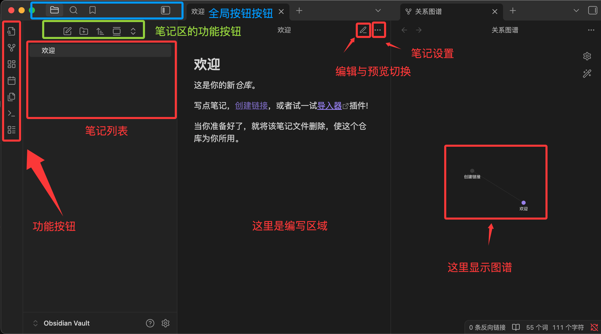

# 目录

- [1 概述](#1-概述)
- [2 Markdown编辑器](#2-markdown编辑器)
  - [2.1 VS Code Markdown](#21-vs-code-markdown)
- [3 标题](#3-标题)
- [4 文本格式](#4-文本格式)
  - [4.1 字体](#41-字体)
  - [4.2 分隔线](#42-分隔线)
  - [4.3 下划线](#43-下划线)
  - [4.4 行内代码标记](#44-行内代码标记)
  - [4.5 文本高亮](#45-文本高亮)
  - [4.6 转义](#46-转义)
- [5 列表](#5-列表)
  - [5.1 无序嵌套列表](#51-无序嵌套列表)
  - [5.2 有序嵌套列表](#52-有序嵌套列表)
  - [5.3 混合嵌套](#53-混合嵌套)
- [6 引用](#6-引用)
  - [6.1 多级嵌套引用](#61-多级嵌套引用)
  - [6.2 区块与列表](#62-区块与列表)
  - [6.3 区块与其他元素](#63-区块与其他元素)
- [7 代码](#7-代码)
- [8 链接](#8-链接)
  - [8.1 参考链接](#81-参考链接)
  - [8.2 自动链接识别](#82-自动链接识别)
- [9 锚点](#9-锚点)
  - [9.1 自定义锚点](#91-自定义锚点)
    - [9.1.1 锚点示例位置](#911-锚点示例位置)
  - [9.2 跨文件跳转语法](#92-跨文件跳转语法)
- [10 图片](#10-图片)
  - [10.1 尺寸控制](#101-尺寸控制)
  - [10.2 链接与图片](#102-链接与图片)
- [11 表格](#11-表格)
  - [11.1 对齐](#111-对齐)
  - [11.2 换行](#112-换行)
- [12 HTML元素](#12-html元素)
- [13 数学公式](#13-数学公式)
  - [13.1 行内公式与块级公式](#131-行内公式与块级公式)
- [14 图表绘制](#14-图表绘制)
  - [14.1 流程图](#141-流程图)
  - [14.2 时序图](#142-时序图)
  - [14.3 甘特图](#143-甘特图)
  - [14.4 饼图](#144-饼图)
  - [14.5 类图 ClassDiagram](#145-类图-classdiagram)
  - [14.6 自定义与交互式图表](#146-自定义与交互式图表)
- [15 Obsidian](#15-obsidian)
  - [15.1 创建一个库 (Vault)](#151-创建一个库-vault)
  - [15.2 Obsidian 插件](#152-obsidian-插件)

---
# 1 概述 
Markdown 是一种轻量级标记语言，允许使用易读易写的纯文本格式编写文档。

Markdown 编写的文档可以导出 HTML 、Word、图像、PDF、Epub 等多种格式的文档。

Markdown 编写的文档后缀为 .md, .markdown。

Markdown 并不是 HTML 的替代品，而是 HTML 的简化版本。实际上，Markdown 的最终目标就是转换为 HTML。

Markdown 源码 → 解析器 → HTML 输出 → 浏览器渲染

# 2 Markdown编辑器
1. VS Code Markdown  
2. 专门的 Markdown 编辑器  
  - Mark Text：开源的实时预览 Markdown 编辑器，界面简洁，功能完整。下载地址：https://github.com/marktext/marktext/
  - Zettlr：学术写作导向的 Markdown 编辑器，支持引用管理和论文写作功能。下载地址：https://github.com/Zettlr/Zettlr
  - Joplin：免费开源的支持 markdown 的笔记应用 -- https://joplinapp.org/
3. 在线编辑器
  - Markdown 在线编辑器：https://www.jyshare.com/front-end/712/
  - Dillinger：https://dillinger.io/ 功能齐全的在线 Markdown 编辑器，支持云同步和多种导出格式。
  - StackEdit：https://stackedit.io/ 基于浏览器的编辑器，与 Google Drive、Dropbox 等云服务集成。
  - 简书、语雀编辑器：国内平台提供的在线 Markdown 编辑环境。

## 2.1 VS Code Markdown
VS Code 自带对 Markdown 的支持，支持语法高亮、预览、导出等功能。

实时预览需要执行 Markdown: Open Preview to the Side 命令来实现。

如果使用 VS Code 等编辑器，按 Ctrl+Shift+V 打开预览面板，也可以点击右上角的预览图标

如果你需要将 markdown 转为 PDF、图片、HTML 等格式也可以安装对应的插件来实现

# 3 标题
两种格式：`=` 和 `-`以及`#`

>```markdown
>我展示的是一级标题
>=================
>
>我展示的是二级标题
>-----------------
>
># 一级标题
>## 二级标题
>### 三级标题
>#### 四级标题
>##### 五级标题
>###### 六级标题
>```
行首位置：# 号必须在行首，前面不能有其他字符（空格或制表符）。

# 4 文本格式
换行是使用两个以上空格加上回车  

当然也可以在段落后面使用一个空行来表示重新开始一个段落。

## 4.1 字体
粗体语法：使用两个星号 `**` 或两个下划线 `__` 包围文字  
斜体语法：使用一个星号 `*` 或一个下划线 `_` 包围文字  
粗斜体组合：使用三个星号 `***` 或三个下划线 `___`包围文字  
>```markdown
>这是**粗体文字**使用星号
>这是__粗体文字__使用下划线
>这是*斜体文字*使用星号
>这是_斜体文字_使用下划线
>***粗斜体文字***
>___粗斜体文字___
>```

## 4.2 分隔线
在一行中用三个以上的星号、减号、底线来建立一个分隔线，行内除空格外不能有其他东西。
>```
>***
>
>* * *
>
>- - -
>
>----------
>```

## 4.3 下划线
HTML 的 `<u>` 标签 `<u>带下划线文本</u>`

<u>带下划线文本</u>

## 4.4 行内代码标记
单行：使用一个反引号 ` 包围代码  
>```markdown
>`git commit`
>```
`git commit`

包含反引号的代码：当代码本身包含反引号时，使用两个反引号包围。
>```markdown
>`` `code` ``
>```
`` `code` ``

多行：使用三个反引号 ``` 包围代码。其后可以接语言标识符（py，javascript/js，json，css，yaml，sql，html，bash，powershell等）启用语法高亮功能。

JavaScript:
>```js 
>const users = [
>    { name: "Alice", age: 25 },
>    { name: "Bob", age: 30 }
>];
>
>const adults = users.filter(user => user.age >= 18);
>console.log(adults);
>```
SQL:
>```sql
>SELECT u.name, u.email, COUNT(o.id) as order_count
>FROM users u
>LEFT JOIN orders o ON u.id = o.user_id
>WHERE u.created_at >= '2024-01-01'
>GROUP BY u.id, u.name, u.email
>ORDER BY order_count DESC
>LIMIT 10;
>```

## 4.5 文本高亮
>```markdown
>这是<mark>高亮文本</mark>
>```
这是<mark>高亮文本</mark>

## 4.6 转义
Markdown 使用反斜杠转义特殊字符  
>```markdown
>\*\* 正常显示星号 \*\*  
>```
\*\* 正常显示星号 \*\*  

# 5 列表

## 5.1 无序嵌套列表
无序列表使用`*`、`+`或`-`作为列表标记，这些标记后面要添加一个空格，然后再填写内容
>```markdown
>* 第一项
>
>+ 第一项
>+ 第二项
>
>- 第一项
>- 第二项
>  - 第二项第一小项
>- 第三项
>```

## 5.2 有序嵌套列表
>```markdown
>1. 准备阶段
>   1. 收集资料
>   2. 制定计划
>2. 执行阶段
>   1. 开始实施
>   2. 监控进度
>3. 总结阶段
>```

## 5.3 混合嵌套
>```markdown
>1. 主要任务
>   - 子任务A
>   - 子任务B
>     1. 详细步骤1
>     2. 详细步骤2
>   - 子任务C
>2. 次要任务
>```

列表项中包含多段内容: 与列表项对齐缩进
>```markdown
>1. 第一项
>   这是第一项的详细说明，需要与列表项对齐缩进。
>   还可以包含第二段内容。
>
>2. 第二项
>   > 可以在列表项中使用引用
>```

# 6 引用
在段落开头使用 `>` 符号 ，然后后面紧跟一个`空格`符号。换行同前
>```markdown
>> 这是引用的第一行。（这后面有两个空格）  
>> 这是引用的第二行。
>> 
>> 这是引用的第二段。
>```

或者只在第一行使用 > ，其余行会自动包含在引用中
>```markdown
>> 这是一个长引用，  
>包含多行内容，  
>只需要在第一行使用 > 符号。  
>```

## 6.1 多级嵌套引用
>```markdown
>> 最外层
>> > 第一层嵌套
>> > > 第二层嵌套
>```

## 6.2 区块与列表
>```markdown
>> 区块中使用列表
>> 1. 第一项
>> 2. 第二项
>> + 第一项
>> + 第二项
>>   + 第二项第一小项 
>```
同理也可以在列表中使用区块

## 6.3 区块与其他元素
引用块内可以包含几乎所有其他 Markdown 元素

# 7 代码 
见 [文本格式 行内代码标记](#行内代码标记)

# 8 链接
>```markdown
>[链接标题](链接地址 "可选的标注")
>或
><链接地址>
>```

这是一个链接 [百度搜索](https://www.baidu.com "百度一下，你就知道") 鼠标悬停显示标注  
<https://www.baidu.com>

## 8.1 参考链接
将链接定义与使用分离，让文档更整洁，特别适合长文档或需要多次引用相同链接的情况。  

当参考标签与链接标题相同时，可以省略第二个方括号
>```markdown
>markdown[链接标题][参考标签]
>
>[参考标签]: URL "可选标注"
>```

这个链接用 1 作为网址变量 [Google][1]  
然后在文档的结尾为变量赋值网址  
markdown 我喜欢使用 [GitHub][] 来管理代码。  

[1]: http://www.google.com/  
[GitHub]: https://github.com  

## 8.2 自动链接识别
现代 Markdown 解析器通常支持自动识别 URL 和邮箱地址
>```markdown
>markdown直接输入网址：https://www.example.com  
>```
markdown直接输入网址：https://www.example.com  

# 9 锚点
>```markdown
>## 目录
>- [第一章：介绍](#第一章介绍)
>- [第二章：安装](#第二章安装)
>- [第三章：使用方法](#第三章使用方法)
>
># 第一章：介绍
>这里是介绍内容...
>
># 第二章：安装
>这里是安装说明...
>
># 第三章：使用方法
>这里是使用说明...
>```

## 9.1 自定义锚点
>```markdown
><a id="custom-anchor"></a>
>### 9.1.1 锚点示例位置
>
>[点击跳转到锚点示例位置](#custom-anchor)
>```

<a id="custom-anchor"></a>
### 9.1.1 锚点示例位置

[点击跳转到锚点示例位置](#custom-anchor)

>```markdown
>[回到顶部](#)
>```

[回到顶部](#)

## 9.2 跨文件跳转语法
>```markdown
>[显示的文字](文件路径)
>```
示例：
>```md
>使用 Conda。参阅 [Conda.md](./Conda.md)
>```

使用 Conda。参阅 [Conda.md](./Conda.md)

# 10 图片
>```markdown
>
>```
- 推荐使用相对路径，便于项目移植
- 建议创建专门的图片文件夹（如 images/、assets/）
- 使用有意义的文件名，便于管理
- 注意路径分隔符在不同操作系统中的差异

也可以像链接网址那样对图片网址使用变量

## 10.1 尺寸控制
Markdown 还没有办法指定图片的高度与宽度，如果需要的话，你可以使用 `` 标签。

>```html
>
>
>
>
><!-- 居中对齐 -->
><div align="center">
>  
></div>
>
><!-- 左对齐（默认） -->
>
>
><!-- 右对齐 -->
>
>```

## 10.2 链接与图片
将图片作为链接的可点击元素
>```markdown
>[](链接URL)
>```

# 11 表格
>```markdown
>|  表头   | 表头  |
>|  ----  | ----  |
>| 单元格  | 单元格 |
>| 单元格  | 单元格 |
>```

|  表头   | 表头  |
|  ----  | ----  |
| 单元格  | 单元格 |
| 单元格  | 单元格 |

表格单元格内可以使用大部分 Markdown 语法

| 功能 | 描述 | 状态 |
|------|------|:----:|
| **用户登录** | 支持邮箱和手机号登录 | &#x2705; |
| *密码重置* | 通过邮箱重置密码 | &#x26a0;&#xfe0f; |
| `API接口` | RESTful API 设计 | &#x2705; |
| [文档链接](https://example.com) | 查看详细文档 | &#x1f4d6; |

## 11.1 对齐
- ---: 设置内容和标题栏居右对齐。
- :--- 设置内容和标题栏居左对齐。
- :---: 设置内容和标题栏居中对齐。

>```markdown
>| 左对齐 | 右对齐 | 居中对齐 |
>| :-----| ----: | :----: |
>| 单元格 | 单元格 | 单元格 |
>| 单元格 | 单元格 | 单元格 |
>```

## 11.2 换行 
使用 `<br>`
>```markdown
>| 项目 | 详细说明 |
>|------|----------|
>| 需求分析 | 1. 收集用户需求<br>2. 分析业务场景<br>3. 确定功能范围 |
>| 技术选型 | 前端：React + TypeScript<br>后端：Node.js + Express<br>数据库：MongoDB |

| 项目 | 详细说明 |
|------|----------|
| 需求分析 | 1. 收集用户需求<br>2. 分析业务场景<br>3. 确定功能范围 |
| 技术选型 | 前端：React + TypeScript<br>后端：Node.js + Express<br>数据库：MongoDB |

# 12 HTML元素
目前支持的 HTML 元素有：`<kbd> <b> <i> <em> <sup> <sub> <br>`等

# 13 数学公式
在 Markdown 中，数学公式通过 `LaTeX` 语法来表示。

**基本语法结构**   
- 命令：以反斜杠 \ 开头，如 \alpha、\sum
- 参数：用花括号 {} 包围，如 \frac{a}{b}
- 下标：使用 _，如 x_1
- 上标：使用 ^，如 x^2
- 分组：用花括号将多个字符组合，如 x_{i+1}

## 13.1 行内公式与块级公式
行内公式使用单个美元符号 $ 包围

块级公式使用两个美元符号 $$ 包围
>```markdown
>变量 $x = 5$ 和函数 $f(x) = x^2 + 2x + 1$。
>
>$$E = mc^2$$
>
>$$\int_{-\infty}^{\infty} e^{-x^2} dx = \sqrt{\pi}$$
>```

变量 $x = 5$ 和函数 $f(x) = x^2 + 2x + 1$。

$$E = mc^2$$

$$\int_{-\infty}^{\infty} e^{-x^2} dx = \sqrt{\pi}$$

**多行公式**

使用 align 环境创建多行对齐公式
>```markdown
>$$
>    \begin{align}
>    f(x) &= ax^2 + bx + c \\
>    f'(x)  &= 2ax + b \\
>    f''(x)  &= 2a
>    \end{align}
>    $$

$$
    \begin{align}
    f(x) &= ax^2 + bx + c \\
    f'(x)  &= 2ax + b \\
    f''(x)  &= 2a
    \end{align}
    $$

其余自行了解latex语法

# 14 图表绘制
`Mermaid` 是最流行的 Markdown 图表工具之一，它允许你使用简单的文本语法生成各种图表。  
支持图表类型：流程图 (Flowchart)，序列图 (Sequence Diagram)，类图 (Class Diagram)，状态图 (State Diagram)，甘特图 (Gantt Chart)，饼图 (Pie Chart)

## 14.1 流程图
>```markdown
>```mermaid
>graph TD
>    A[开始] --> B{条件判断}
>    B -->|Yes| C[执行操作A]
>    B -->|No| D[执行操作B]
>    C --> E[结束]
>    D --> E
>```

**流程图方向**
- TD 或 TB：从上到下
- BT：从下到上
- RL：从右到左
- LR：从左到右

**节点形状**
- A[方形]：矩形
- B(圆角矩形)：圆角矩形
- C{菱形}：菱形（决策）
- D((圆形))：圆形
- E>旗帜形]：旗帜形

**连接线类型**
- --> 实线箭头
- -.-> 虚线箭头
- ==> 粗实线箭头
- -- 实线
- -. 虚线

## 14.2 时序图
>```markdown
>```mermaid
>sequenceDiagram
>    participant A as 用户
>    participant B as 系统
>    participant C as 数据库
>    
>    A->>B: 登录请求
>    B->>C: 验证用户信息
>    C-->>B: 返回验证结果
>    B-->>A: 登录成功/失败
>```

- participant 定义参与者
- ->> 实线箭头
- -->> 虚线箭头
- note 添加注释

## 14.3 甘特图
>```markdown
>```mermaid
>gantt
>    title 项目开发计划
>    dateFormat  YYYY-MM-DD
>    section 设计阶段
>    需求分析      :done,    des1, 2024-01-01,2024-01-15
>    UI设计       :active,  des2, 2024-01-10, 30d
>    section 开发阶段
>    前端开发      :         dev1, after des2, 45d
>    后端开发      :         dev2, 2024-02-01, 60d
>    section 测试阶段
>    单元测试      :         test1, after dev1, 15d
>    集成测试      :         test2, after dev2, 10d
>```

- title 设置标题
- dateFormat 定义日期格式
- section 定义阶段
- 任务状态：done（已完成）、active（进行中）、crit（关键）

## 14.4 饼图
>```markdown
>```mermaid
>pie
>    title 浏览器市场份额
>    "Chrome" : 65
>    "Safari" : 15
>    "Firefox" : 10
>    "其他" : 10
>```

## 14.5 类图 ClassDiagram
>```markdown
>```mermaid
>classDiagram
>    class 用户 {
>        +用户名: string
>        +密码: string
>        +登录()
>    }
>    
>    class 订单 {
>        +订单号: int
>        +创建日期: date
>        +计算总价()
>    }
>    
>    用户 "1" --> "n" 订单
>```

## 14.6 自定义与交互式图表
Mermaid 允许自定义图表样式：
>```markdown
>```mermaid
>%%{init: {'theme': 'forest'}}%%
>pie
>    title 自定义主题
>    "项目A" : 30
>    "项目B" : 50
>    "项目C" : 20
>```

一些工具支持添加交互功能：
>```markdown
>```mermaid
>graph TD
>    A[点击我] --> B[显示详细信息]
>    click A "https://www.runoob.com" "这是提示文本"

# 15 Obsidian
Obsidian 的定位是本地 Markdown 笔记系统，用文件夹和纯文本驱动知识结构。

Obsidian 不依赖云端格式，不锁用户数据，任何时间可迁移，可被任意编辑器读取。

Obsidian 官方网站： https://obsidian.md/



## 15.1 创建一个库 (Vault)
Vault 是 Obsidian 中最重要的概念。

Vault = 文件夹： 库其实就是你电脑上的一个普通文件夹，用来存放你所有的笔记文件。

## 15.2 Obsidian 插件
Obsidian 的插件分为两大类：核心插件和社区插件，可以在设置选择打开查看。
