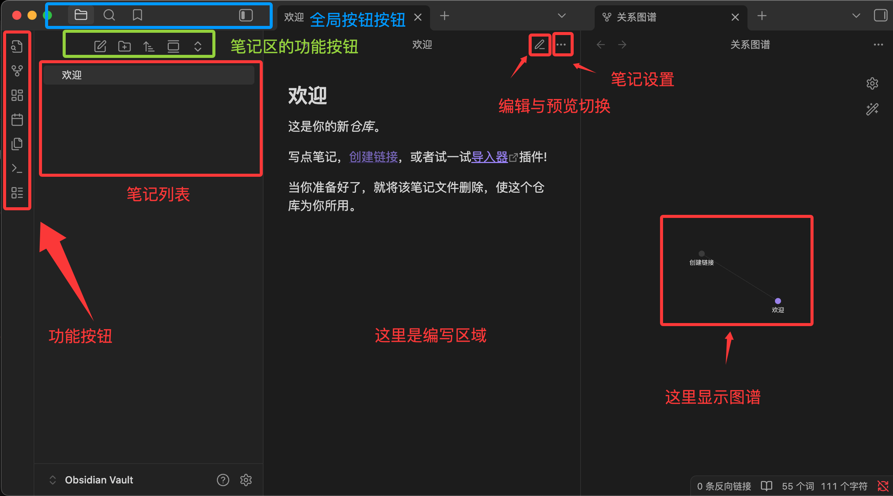

# 目录

- [1 介绍](#1-介绍)
  - [1.1 核心概念](#11-核心概念)
- [2 安装](#2-安装)
  - [2.1 常用快捷键](#21-常用快捷键)
- [3 仓库](#3-仓库)
  - [3.1 目录结构](#31-目录结构)
  - [3.2 第一个笔记与链接](#32-第一个笔记与链接)
- [4 Markdown基础](#4-markdown基础)
- [5 双链与知识图谱](#5-双链与知识图谱)
  - [5.2 块引用与标题引用](#52-块引用与标题引用)
  - [5.3 反向链接面板](#53-反向链接面板)
  - [5.4 关系图谱](#54-关系图谱)
  - [5.5 标签系统](#55-标签系统)
- [6 组织与管理](#6-组织与管理)
  - [6.1 Aliases 别名](#61-aliases-别名)
  - [6.2 Templates 模板](#62-templates-模板)
  - [6.3 搜索与快速跳转](#63-搜索与快速跳转)
  - [6.4 书签](#64-书签)
  - [6.5 文件管理](#65-文件管理)
- [7 插件](#7-插件)
  - [7.1 安装和管理](#71-安装和管理)
  - [7.2 核心插件推荐与使用](#72-核心插件推荐与使用)
    - [7.2.1 Canvas](#721-canvas)
    - [7.2.2 Outline：大纲面板](#722-outline大纲面板)
    - [7.2.3 Backlinks 与 Outgoing Links](#723-backlinks-与-outgoing-links)
    - [7.2.4 Workspaces：工作区布局](#724-workspaces工作区布局)
- [8 同步与导出](#8-同步与导出)
  - [8.1 Obsidian Sync](#81-obsidian-sync)
  - [8.2 Git + GitHub 版本管理](#82-git-github-版本管理)
  - [8.3 云盘同步](#83-云盘同步)
  - [8.4 zip打包](#84-zip打包)
  - [8.5 导出](#85-导出)
- [9 结合 Claude Code 使用](#9-结合-claude-code-使用)
  - [9.1 使用Obsidian的插件](#91-使用obsidian的插件)
  - [9.2 使用Claude的MCP](#92-使用claude的mcp)
- [10 Obsidian Web Clipper](#10-obsidian-web-clipper)

---
# 1 介绍
Obsidian 是一款基于 **Markdown** 文件的个人知识库与笔记管理工具，主要用于知识整理、笔记记录和构建个人知识体系。

采用**本地**文件存储方式，所有笔记都以普通 Markdown 文档形式保存，便于迁移、备份和长期管理。

和传统笔记软件最大的区别不是能记笔记，而是它把笔记变成一个**可连接（笔记之间可相互引用，形成知识网络）**、**可扩展（丰富的社区插件）**、可计算的知识网络。

| 能力 | 说明 |
| --- | --- |
| 知识关联 | 通过双向链接自动建立知识之间的关系 |
| 本地存储 | 所有笔记都是普通 Markdown 文件，不依赖云数据库 |
| 知识图谱 | 自动生成知识关系网络图 |
| 插件扩展 | 支持日历、任务管理、**AI**、**Git**、思维导图等插件 |
| 跨平台 | 支持 Windows、macOS、Linux、Android 和 iOS |

与其他工具的差异

| 特性 | Obsidian | Notion | Roam Research |
| --- | --- | --- | --- |
| 存储方式 | 本地 Markdown 文件 | 云端数据库 | 云端数据库 |
| 离线可用 | 完全离线 | 需预先加载 | 需联网 |
| 双链能力 | 原生支持 | 有限支持 | 原生支持（大纲式） |
| 扩展性 | 1000+ 社区插件 | 少量集成 | 较少插件 |
| 价格 | 个人免费 | 免费增值 | 付费订阅 |
| 数据迁移 | 复制文件夹即可 | 需导出 | 需导出 |


## 1.1 核心概念
1、笔记即文件

在 Obsidian 中创建一篇笔记，实际上就是在某个文件夹中创建了一个 Markdown 文件。每一篇笔记就是你硬盘上的一个 .md 文件。

你可以在资源管理器中直接看到它，用 cat 命令读取它，用 Git 追踪它。

2、双向链接
```md
# Docker 入门

Docker 是一种容器化技术，与 [[虚拟机]] 的关键区别在于...
在部署时，通常配合 [[Kubernetes]] 使用...
学习 Docker 之前建议先了解 [[Linux 基础]]...
```

当你打开「Docker 入门」这篇笔记时，你会看到它链接到了「虚拟机」「Kubernetes」「Linux 基础」三篇笔记。

同时，「Linux 基础」这篇笔记也会显示「有一篇叫 Docker 入门的笔记引用了我」。这就是双向链接。

3、知识图谱

图谱是你记笔记、建立链接之后自然生长出来的副产品。

# 2 安装

前往官网下载 [官网](https://obsidian.md/zh/)

下载后就可以双击安装，选择语言等配置。

首次打开 Obsidian 你会看到三个选项：
```md
创建新库         在本地新建一个 Vault
打开已有文件夹    将现有文件夹作为 Vault
同步远程仓库
```



- 左侧栏 (文件管理器)： 管理你的文件夹和笔记列表。
- 中间区域 (编辑器)： 你主要写作的地方，支持"实时预览"模式，即你输入 Markdown 符号时，它会立刻渲染成格式。
- 右侧栏 (面板)： 默认显示反向链接（即其他哪些笔记提到了你正在看的这篇笔记）和大纲。
- 命令面板 (Ctrl/Cmd + P)： 按此快捷键，输入你想要做的操作（如"创建新笔记"），无需点击菜单。

选择创建新库，为你的知识库起一个名字，选择一个存放位置。

可以在设置里修改外观，字体，行宽等等。

## 2.1 常用快捷键

| 操作 | macOS | Windows / Linux |
| --- | --- | --- |
| 打开设置 | Cmd + , | Ctrl + , |
| 快速打开文件 | Cmd + O | Ctrl + O |
| 新建笔记 | Cmd + N | Ctrl + N |
| 打开命令面板 | Cmd + P | Ctrl + P |
| 切换编辑/阅读模式 | Cmd + E | Ctrl + E |
| 打开/关闭左侧边栏 | Cmd + [ | Ctrl + [ |
| 打开/关闭右侧边栏 | Cmd + ] | Ctrl + ] |


# 3 仓库
Vault 是 Obsidian 中最重要的概念。

Vault = 文件夹： 库其实就是你电脑上的一个普通文件夹，用来存放你所有的笔记文件。

## 3.1 目录结构
当创建一个 Vault 后，文件夹里会出现一个隐藏目录 .obsidian：

```md
MyVault/
├── .obsidian/           ← Obsidian 的配置文件
│   ├── plugins/         ← 安装的插件存放在这里
│   ├── themes/          ← 主题文件
│   ├── snippets/        ← 自定义 CSS 片段
│   └── app.json         ← 主配置文件
├── 你的第一篇笔记.md
└── ...
```

也支持多 Vault

注意：.obsidian 文件夹推荐纳入 Git 管理。这样你的插件配置、快捷键设置、主题偏好都会被版本控制。唯一的例外是 .obsidian/workspace.json，它记录了当前打开的标签页状态，可以加入 .gitignore。

## 3.2 第一个笔记与链接
1. 按 Cmd/Ctrl + N 新建笔记

2. 输入文件名

3. 编辑

4. 使用链接

    例如 [[Markdown]] 这个链接，悬停在上面时会出现预览弹窗，点击则会跳转到名为「Markdown」的笔记。

    如果这篇笔记尚不存在，点击后会自动创建。


# 4 Markdown基础
参考[Markdown](./Markdown.md)文档。

# 5 双链与知识图谱

## 5.1 [[ ]] 语法

用 `[[笔记名]]` 即可创建指向另一篇笔记的链接。

输入 `[[` 后，Obsidian 会自动弹出搜索框，支持模糊匹配笔记名称。

如果链接指向的笔记尚不存在，Obsidian 会显示为灰色链接，点击后会自动创建对应的空白笔记。

**别名链接**

有时候笔记的文件名不够自然。使用 [[文件名|显示文字]] 语法，可以让链接文字更符合上下文。

更好的做法是在目标笔记的 Front Matter 中设置 aliases，之后所有指向该笔记的链接都可以使用别名。

参考[6.1 Aliases别名](#61-aliases-别名)章节。

## 5.2 块引用与标题引用

**标题引用**

使用 [[笔记名#标题]] 直接链接到笔记中的某个标题位置。

例如

```md
详见 [[Python 基础#正则标定式]] 中的示例代码。
```

**块引用**

在目标段落的末尾添加一个 ^块ID，然后在其他笔记中用 [[笔记名#^块ID]] 引用该段落。

例如

```md
<!-- 在「Python 基础」笔记中定义一个块 -->
列表推导式是 Python 中创建列表的简洁语法，
它可以将循环和条件判断写在一行内。 ^list-comp-def
```

在另一篇笔记中引用这个段落块

```md
如 [[Python 基础#^list-comp-def]] 所述，列表推导式能大幅简化代码。
```

引用块在目标笔记中会以嵌入渲染的方式显示原文内容，而不仅仅是一个跳转链接。

**嵌入整个笔记或段落**

在链接前加一个感叹号 ![[笔记名]]，可以将目标笔记的完整内容嵌入当前笔记。

例如
```md
## 常用代码片段

![[Python 列表操作速查]]

![[环境搭建#环境变量配置]]
```

## 5.3 反向链接面板
当打开一篇笔记，右侧面板的「反向链接」区域会列出所有引用了当前笔记的其他笔记。

不需要你手动记、不需要维护索引。

反向链接面板分为两个区域：

- Linked Mentions：已经用 [[双链]] 语法显式链接到当前笔记的地方

- Unlinked Mentions：虽然提到了当前笔记的标题文字，但没有加上 [[ ]] 链接的地方

## 5.4 关系图谱

**局部图谱**

在任意笔记中点击右上角的「更多选项 → 打开局部图谱」，会显示以当前笔记为中心的链接网络。

局部图谱的默认显示深度是 1 层（直接邻居），可以调整为 2-5 层来看到更广的关联。

**全局图谱**

点击左侧边栏的图谱图标，可以查看全库的链接关系图。

图谱中的符号含义：

- 节点大小：被链接次数越多，节点越大——自然突出了你知识体系中的核心概念
- 连线密度：两个笔记互相链接则连线更粗
- 节点颜色：可通过分组功能按路径、标签、文件名等条件分配颜色

**图谱分组与过滤**

在全局图谱的设置中，创建分组规则：

```md
Group #1: 编程笔记
  - path: 编程/
  - 颜色：蓝色

Group #2: 读书笔记
  - path: 阅读/
  - 颜色：绿色

Group #3: 日记
  - path: 日记/
  - 颜色：灰色
```
通过分组，图谱能一目了然地展示不同领域的规模大小和交叉关系。

过滤器可以按关键词、标签或文件路径隐藏不需要显示的节点，避免图谱过于密集。

## 5.5 标签系统
标签是跨文件夹组织内容的重要手段。

标签写在正文或 Front Matter 中，用 # 标签名 的格式。

基础写法
```md
#python #obsidian #笔记方法
```

嵌套写法：使用` / `创建层级标签，在标签面板中会展示为树状结构。
```md
#编程/Python
#编程/JavaScript

#状态/草稿
#状态/已完成
```

标签表示「是什么属性」（语言、状态、类型），文件夹表示「在哪个项目或领域」。两者互补而非互斥。

# 6 组织与管理

## 6.1 Aliases 别名
同一篇笔记可以有多个名称入口，在 Front Matter 中设置 aliases 即可

在文件的最顶部（必须是第一行）输入三条横线 ---，然后在中间写入 aliases 属性，最后再以三条横线 --- 结束：

```md
单个别名
---
aliases: 笔记别名
---

多个别名，写成一行
---
aliases: [JS, JavaScript, 脚本语言]
---

包含特殊字符的别名，写成多行
---
aliases:
  - "C++"
  - "问题: 根本原因"
  - "标点符号【】"
---

```

在笔记 Front Matter 中定义标准别名，而不是每次用管道符 | 临时改写。这样别名统一管理，修改一次全库生效。

## 6.2 Templates 模板
Templates 是 Obsidian 的核心插件（内置但需手动启用），让你可以为常见类型的笔记定义模板。

**启用和配置**

在设置 → 核心插件中开启「模板」。

然后指定一个模板文件夹，所有模板文件都放在这个文件夹中。

**创建笔记模板**

例如
```md
---
tags:
  - 概念
created: {{date}}
---

# {{title}}

## 定义

一句话概括：是什么。

## 核心要点

- 要点一
- 要点二
- 要点三

## 与其他概念的关系

- 关联 [[概念A]]
- 区别于 [[概念B]]

## 参考资料

-
```

**插入模板**

新建笔记后，点击左侧边栏的「插入模板」按钮（或使用 Ctrl+P 搜索「模板：插入模板」），选择对应模板。

模板中的 {{title}} 会自动替换为笔记名称，{{date}} 替换为当前日期。

## 6.3 搜索与快速跳转
**快速切换（Ctrl+O）**

最常用的跳转方式，输入关键词即可搜索所有笔记文件名和别名，回车直接打开。

**全局搜索（Ctrl+Shift+F）**

搜索笔记的全文内容，支持高级搜索语法：

| 搜索语法 | 功能 | 示例 |
| --- | --- | --- |
| `file:` | 按文件名搜索 | `file:Python` |
| `path:` | 按路径搜索 | `path:编程/` |
| `tag:` | 按标签搜索 | `tag:#编程/Python` |
| `line:` | 按行内容搜索 | `line:(import os)` |
| `section:` | 按标题区块搜索 | `section:安装` |
| 组合搜索 | 用空格连接多个条件（AND 逻辑） | `path:编程 tag:#Python 闭包` |

- 默认情况下，普通关键词搜索会同时匹配文件名和内容；使用运算符可以更精细地限定搜索范围。  
- 空格表示“AND”，大写 `OR` 表示“或”， `-` 表示排除，如 `meeting -work`。


## 6.4 书签
书签功能让你可以收藏常用笔记、搜索条件或文件夹。

右键点击任何文件、文件夹或搜索结果，选择「添加到书签」。

所有书签显示在左侧边栏的书签面板中，支持拖拽排序和分组。

书签可以

- 收藏搜索条件：比如「tag:#状态/进行中」作为一个动态书签，点击即执行该搜索
- 收藏高频笔记：主页索引、项目仪表盘、每日日记入口
- 按工作流分组：写作组、学习组、项目管理组各自独立

## 6.5 文件管理
示例
```md
Vault/
├── 00-日记/              # Daily Notes 自动存放
├── 10-项目/              # 活跃项目
├── 20-领域/              # 持续关注的领域
├── 30-资源/              # 参考资料和摘录
├── 40-归档/              # 已完成或不再活跃
├── Templates/            # 模板文件夹
├── attachments/          # 图片和附件
└── 主页.md               # 仪表盘笔记，链接到最重要的内容
```

文件夹名前的数字前缀确保在文件列表中按你想要的顺序排列，而不是按拼音排序。

随着笔记积累，你对组织方式的偏好会变得更明确，届时再调整也不迟。

# 7 插件
Obsidian 的强大之处，很大程度上来自于其插件市场。

Obsidian 的插件分为两大类：**核心插件**和**社区插件**，可以在设置选择打开查看。

**核心插件**

Obsidian 自带的、官方维护的功能模块。可以根据需要选择开启或关闭。

例如：
- 画布 (Canvas)： 让你在一个无限大的白板上自由布局笔记、图片和网页，进行视觉化的思维组织。

**社区插件**

由用户（开发者）创建、维护和分享的第三方功能扩展。

在安装第三方插件之前，Obsidian 默认开启安全模式。安装插件需要手动关闭安全模式，Obsidian 会提醒用户注意安全风险（建议只安装下载量大、评分高且功能明确的插件）。

| 插件名称 | 主要功能 | 典型应用场景 |
| --- | --- | --- |
| Dataview | 将笔记库视为数据库，用类 SQL 查询语言索引、过滤、展示 Markdown 中的元数据与任务 | 自动生成任务列表、汇总带特定标签的项目或书籍清单、制作动态仪表盘 |
| Excalidraw | 在 Obsidian 中嵌入 Excalidraw，创建手绘风格图表与思维导图 | 制作流程图、概念草图、手写注释与视觉笔记 |
| Calendar | 在右侧边栏添加月历视图，与每日笔记/周记深度集成 | 快速查看和跳转到过去的每日笔记，形成日程回顾与时间管理 |
| Advanced Tables | 增强 Markdown 表格编辑：自动格式化、按列排序、公式计算、导出 CSV 等 | 轻松对齐和编辑复杂表格，无需手动调整空格 |
| Kanban | 创建基于 Markdown 的看板视图，拖拽管理任务卡片 | 任务管理、项目进度追踪、将想法从“待办”拖到“完成” |
| Obsidian Git | 将 Vault 自动备份到 Git 仓库（如 GitHub），支持版本控制与历史回溯 | 实现版本控制和多设备同步，提供额外的安全保障 |


## 7.1 安装和管理
1. 进入插件设置
  - 点击左下角的 "设置" (齿轮图标)
  - 在侧边栏找到 "核心插件" 和 "第三方插件"。

2. 安装第三方插件的步骤
  - 进入 "第三方创建" 选项卡。
  - 关闭安全模式： Obsidian 会提示你进行此操作。
  - 点击 "浏览"。
  - 在搜索框输入插件名称（如 Dataview）。
  - 点击插件，然后点击 "安装"。
  - 激活插件： 安装完成后，点击 "启用" 按钮。插件才会开始工作。

插件安装后，通常会在左侧栏、右侧栏或通过命令面板 (Ctrl + P) 来调用其功能。

## 7.2 核心插件推荐与使用

### 7.2.1 Canvas
Obsidian 内置的无限画布工具，用卡片和连线来组织思想、规划项目、绘制图表。

在文件列表中右键选择「新建画布」，或在命令面板搜索「Canvas」。

Canvas 文件以 .canvas 扩展名存储，本质上是一个 JSON 文件，可以用文本编辑器查看和编辑。

在 Canvas 中双击空白处创建卡片，或拖入以下内容：

- Markdown 笔记文件（自动创建链接卡片）
- 图片（拖入即显示）
- 网页链接（自动创建嵌入卡片）

鼠标悬停在卡片边缘会出现连接点，拖拽到另一张卡片即可创建连线。

连线可以添加文字标签（如「依赖于」「导致」「参考」），并选择颜色和线型。

框选多张卡片后右键选择「创建分组」，可以为它们添加背景色和标题。

### 7.2.2 Outline：大纲面板
大纲插件在右侧边栏显示当前文档的标题树。对于长文档的导航尤其有用

- 自动解析文档中的 # ## ### 标题，生成层级树
- 点击标题可快速跳转到文档对应位置
- 当前正在阅读的标题会高亮显示
- 拖拽标题可以在文档中重新排列章节顺序

### 7.2.3 Backlinks 与 Outgoing Links
双链功能的核心 UI 呈现。

**Backlinks（反向链接）**

显示哪些笔记链接到了当前笔记。

每个反向链接会显示链接所在的上下文（前后几行文字），让你不用跳转就能判断关联的内容。

展开每条反向链接，可以看到更多上下文，甚至直接展开该笔记的完整内容。

**Outgoing Links（出链）**

显示当前笔记链接到了哪些其他笔记。

与 Backlinks 对应，它展示的是当前笔记指向的外部分笔记清单。

两个面板结合使用，可以完整了解一篇笔记在知识网络中的位置——谁引用了它，它引用了谁。


两个面板顶部都有搜索过滤框，输入关键词可以快速筛选：
- 按路径过滤：只显示特定文件夹内的反向链接
- 按关键词过滤：只显示包含特定文字的反向链接

### 7.2.4 Workspaces：工作区布局
不同任务需要不同的面板布局。

写作时你可能希望收起所有侧边栏只留编辑区，整理笔记时你需要文件列表和标签面板同时可见。

例如

| 工作区 | 布局 |
| --- | --- |
| 写作模式 | 关闭所有侧边栏，只留编辑区，专注内容输出 |
| 整理模式 | 左侧：文件列表 + 标签面板，右侧：大纲 + 反向链接 |
| 研究模式 | 左侧：搜索结果，中间：主笔记 + Canvas，右侧：反向链接 + 大纲 |
| 回顾模式 | 左侧：书签，中间：日记 + 全局图谱，右侧：反向链接 |

**保存工作区**

调整好面板布局后，在左侧边栏的「工作区」面板中点击「管理工作区」，输入名称保存当前布局。

**切换工作区**

在工作区面板中点击已保存的布局，一键切换。

也可以通过 Ctrl+P 搜索「工作区：加载工作区」来切换。

# 8 同步与导出

## 8.1 Obsidian Sync
Obsidian Sync 是官方提供的端对端加密云同步服务。是付费服务，按年订阅。

在'设置'-'同步'中配置

## 8.2 Git + GitHub 版本管理
将 Vault 初始化为 Git 仓库，推送到 GitHub 私有仓库。

```md
# 进入你的 Vault 目录
cd ~/Documents/我的知识库

# 初始化 Git 仓库
git init

# 创建 .gitignore 文件，忽略 Obsidian 的配置和缓存
echo ".obsidian/workspace.json" >> .gitignore
echo ".obsidian/workspace-mobile.json" >> .gitignore
echo ".trash/" >> .gitignore

# 首次提交
git add .
git commit -m "初始化知识库"

# 关联 GitHub 私有仓库并推送
git remote add origin git@github.com:username/my-vault.git
git push -u origin main

# 之后使用 commit + push + pull 同步
```

更多参考[Git](./Git.md)文档。

## 8.3 云盘同步
将 Vault 文件夹放在 iCloud Drive 或 OneDrive 中

## 8.4 zip打包
同步不等于备份——同步会把你误删的文件也同步删除。

可以定期将整个 Vault 打包为 .zip，存到外接硬盘或云盘

## 8.5 导出
打开笔记，点击右上角「更多选项 → 导出 PDF」。

导出的 PDF 会保留当前的 Obsidian 主题样式。

安装 Pandoc 社区插件后，可以将笔记导出为 Word、HTML、LaTeX 等多种格式。

Obsidian Publish 是官方付费服务，可以将选定的笔记发布为网站。

发布的网站保留双链、图谱、搜索等 Obsidian 核心功能。

# 9 结合 Claude Code 使用

## 9.1 使用Obsidian的插件
参考[Claude Code](../Vibe_Coding/Claude.md)文档安装使用Claude。

从 GitHub Release https://github.com/YishenTu/claudian/releases/latest 下载 main.js、manifest.json 和 styles.css 这三个文件。

在你的 Obsidian 库的插件文件夹 plugins 中（如果没有创建一个），新建一个名为 claudian 的文件夹。

将下载好的三个文件复制到这个 claudian/plugins/ 文件夹中。

```md
.obsidian/
└── plugins/
    └── claudian/
        ├── main.js         # 插件的编译后 JavaScript 主文件（包含所有逻辑）
        ├── manifest.json   # 插件元数据（ID、名称、版本、描述、最低 Obsidian 版本等）
        └── styles.css      # 插件的 CSS 样式
```

在 Obsidian 中启用该插件：设置 → 社区插件 → 开启「Claudian」插件开关。通过设置，可以设置为中文语言。

打开任意笔记，左侧边栏会出现一个 机器人图标（或用命令面板 Ctrl+P 输入 Claudian: Open Chat）即可使用。

第一次打开会提示你选择 Claude 模型（可以设置国内的大模型），输入框打 / 会出现所有可用技能（skills）。

## 9.2 使用Claude的MCP

在 claude 中对话让它安装

需要启用 obsidian 第三方插件 Local REST API with MCP 。还需要它的key

端口 https://127.0.0.1:27124/

# 10 Obsidian Web Clipper
Obsidian 官方出品的浏览器扩展，它能将任何网页一键保存为本地的 Markdown 笔记。免费、开源、无广告。

**安装**

从浏览器扩展安装使用即可。在设置里面设置中文语言。

首次使用时，它会自动检测正在运行的 Obsidian 仓库并完成关联，无需额外配置。

**整页剪藏**

将页面以 Markdown 格式保存到你的仓库。

自动提取文章正文（去除广告和侧边栏）；标题、作者、发布日期、描述；页面 URL 和来源域名；代码块（保留语法高亮标记）、数学公式（LaTeX 格式）


**高亮剪藏**

选中你感兴趣的段落，点击高亮按钮，只保存划线部分。
- 点击扩展图标
- 选择「高亮选中内容」
- 积累好所有高亮后，点击「添加到 Obsidian」一次性保存

也可以右击鼠标选中 Obsidian Web Clipper 保存：

高亮内容会以引用块（>）的形式写入笔记。再次访问该页面时，你的高亮依然可见。

**模板**

默认情况下所有网页都以同一格式保存，而模板让你可以针对不同类型的网页定制保存结构。

我们可以在设置页面中模板选项下的 Default 中查看

**内置模板**

| 模板类型 | 提取内容 |
| --- | --- |
| 文章模板 | 自动填入 author、published、description，正文以文章格式保存 |
| 食谱模板 | 提取食材列表（自动转为待办复选框 - [ ]）、步骤、营养信息 |
| 电影/书籍模板 | 提取导演、评分、时长、主演、简介等 |
| 学术论文模板 | 完整保留代码块和 LaTeX 公式 |

**自定义模板**

在扩展设置 → 模板 → 新建模板中，你可以自定义以下内容：

| 配置项 | 说明 | 示例 |
| --- | --- | --- |
| 模板名称 | 模板的标识名称 | 「YouTube 视频」「GitHub 仓库」 |
| 笔记名称 | 支持变量 | `{{title}}` 或 `{{date}}-{{title}}` |
| 保存位置 | 指定仓库中的文件夹 | Clippings/Articles |
| Properties | 笔记顶部自动填入的结构化属性（YAML 前置元数据） | author、published、tags 等 |
| 笔记正文 | 完全自定义的 Markdown 模板 | 可嵌入变量和任意 Markdown 内容 |

设置「模板触发条件」后，访问特定网站时会自动应用对应模板，无需手动选择。触发条件为 URL 包含 `xxx`

**变量速查**

| 变量 | 说明 |
| --- | --- |
| `{{title}}` | 页面标题 |
| `{{url}}` | 当前 URL |
| `{{author}}` | 作者 |
| `{{published}}` | 发布日期 |
| `{{description}}` | 页面描述 |
| `{{content}}` | 正文内容（Markdown 格式） |
| `{{highlights}}` | 所有高亮内容 |
| `{{date}}` | 当前日期 |
| `{{site}}` | 网站名称 |
| `{{domain}}` | 域名 |
| `{{image}}` | 社交分享图片 URL |
| `{{words}}` | 字数统计 |
