# 目录

- [1 VsCode 简介](#1-vscode-简介)
- [2 VsCode 安装](#2-vscode-安装)
  - [2.1 安装汉化包扩展](#21-安装汉化包扩展)
- [3 界面说明](#3-界面说明)
- [4 活动栏](#4-活动栏)
  - [4.1 自定义活动栏](#41-自定义活动栏)
- [5 终端](#5-终端)
  - [5.1 与命令输出交互：](#51-与命令输出交互)
- [6 设置](#6-设置)
  - [6.1 切换用户设置与工作区设置](#61-切换用户设置与工作区设置)
- [7 代码](#7-代码)
  - [7.1 Light Bulb:](#71-light-bulb)
  - [7.2 语义化标识](#72-语义化标识)
- [8 版本控制](#8-版本控制)
- [9 扩展安装](#9-扩展安装)
- [10 运行与调试](#10-运行与调试)
- [11 code 命令](#11-code-命令)
- [12 快捷键](#12-快捷键)
  - [12.1 通用操作快捷键](#121-通用操作快捷键)
  - [12.2 文件与编辑器操作](#122-文件与编辑器操作)
  - [12.3 代码编辑快捷键](#123-代码编辑快捷键)
  - [12.4 多光标操作](#124-多光标操作)
  - [12.5 调试快捷键](#125-调试快捷键)
  - [12.6 搜索和导航](#126-搜索和导航)
  - [12.7 版本控制](#127-版本控制)
  - [12.8 终端操作](#128-终端操作)
  - [12.9 命令面板](#129-命令面板)
  - [12.10 显示](#1210-显示)
  - [12.11 扩展操作](#1211-扩展操作)
  - [12.12 其他](#1212-其他)
- [13 AI扩展](#13-ai扩展)
- [14 GitHub Copilot](#14-github-copilot)
  - [14.1 介绍与安装](#141-介绍与安装)
  - [14.2 设置](#142-设置)
  - [14.3 快捷键](#143-快捷键)
  - [14.4 使用技巧](#144-使用技巧)
  - [14.5 聊天模式](#145-聊天模式)
- [15 接入DeepSeek](#15-接入deepseek)
  - [15.1 安装 Roo Code 扩展](#151-安装-roo-code-扩展)
  - [15.2 设置 API Key](#152-设置-api-key)
- [16 数据库扩展](#16-数据库扩展)
- [17 MCP](#17-mcp)
  - [17.1 配置 MCP 服务器](#171-配置-mcp-服务器)
  - [17.2 示例](#172-示例)

---
# 1 VsCode 简介

# 2 VsCode 安装
官网下载链接 https://code.visualstudio.com/Download  
默认情况下访问 VS Code 官网 https://code.visualstudio.com/  页面会根据你的系统自动匹配安装包  

## 2.1 安装汉化包扩展

# 3 界面说明
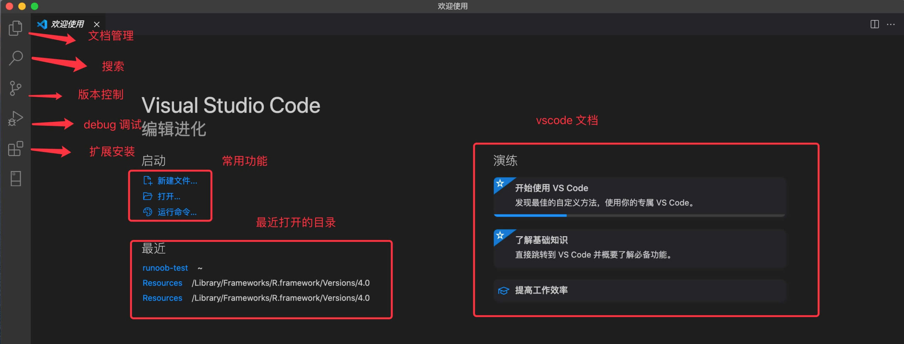  

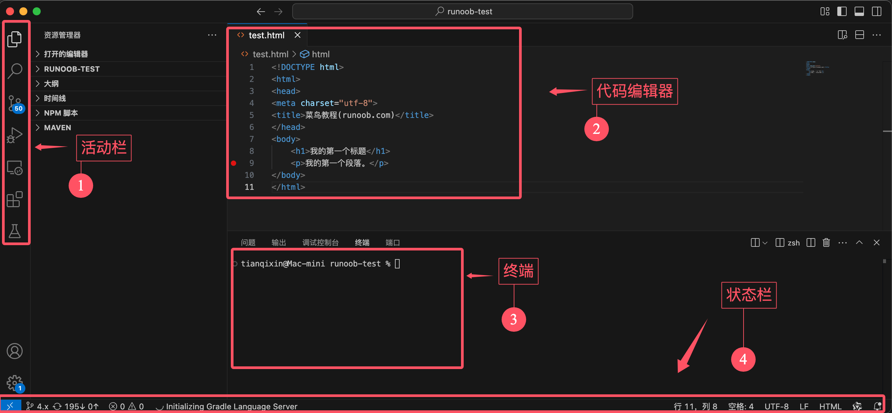

# 4 活动栏
1. 文件资源管理器（Explorer）
2. 搜索（Search）  
允许你在整个项目中查找特定的文本或代码片段,点击搜索图标（放大镜）后，你可以输入关键词，VS Code 会在项目中匹配并显示所有相关结果。
3. 源代码管理（Source Control）
4. 调试（Debug）
5. 扩展（Extensions）

## 4.1 自定义活动栏  
可以右击状态栏，控制功能图标是否显示，打勾☑️的表示显示，反之，不显示：

# 5 终端
快捷键：

显示集成终端 `` Ctrl + ` ``  

新建终端	`` Ctrl+Shift+" ``  

切换终端	``Ctrl+PageUp/PageDown``  

关闭终端	``Ctrl+Shift+W``   

浏览历史命令 ``Ctrl + ↑``

可以选择和切换不同终端

## 5.1 与命令输出交互：  
打开你之前运行过 ls 或 dir 命令的终端。  
在终端中，按住 Ctrl/Cmd 键，将鼠标悬停在文件名上，然后可以直接打开。  

# 6 设置
配置 VS Code 的两种方式：  
- 使用设置编辑器（Settings Editor） 修改设置。  
- 直接编辑 settings.json 文件。  

Windows/Linux 快捷键: ``Ctrl + ,``

要将某项设置恢复为默认值，将鼠标移动到设置项旁边，会显示齿轮图标，点击它然后选择重置此设置

要想快速找到所有已修改的设置，可以在搜索框中输入 @modified：

## 6.1 切换用户设置与工作区设置  
- 用户设置（User settings）：对所有工作区生效。  
- 工作区设置（Workspace settings）：仅适用于当前工作区，并会覆盖用户设置。  

# 7 代码

## 7.1 Light Bulb:  

在 VS Code 中编写代码时出现的「小灯泡」（Light Bulb）是快速修复 / 代码操作提示图标，核心作用是为当前代码位置的问题（语法错误、格式不规范、可优化点等）或可执行的代码操作（重构、补全、导入等）提供一键式解决方案，大幅提升编码效率。

快捷键 ``Ctrl+.``

操作流程：  
点击小灯泡（或按快捷键）→ 弹出下拉菜单 → 选择对应的修复 / 操作选项 → VS Code 自动修改代码。

## 7.2 语义化标识
VS Code 代码提示（补全 / 建议列表）前的各类图形（图标）是语义化标识，核心作用是快速区分提示项的「类型」

| 图标样式       | 常见图形描述 | 代表类型                | 示例场景                                                                 |
|----------------|--------------|-------------------------|--------------------------------------------------------------------------|
| 🔧 扳手        | 扳手/齿轮    | 代码操作/快速修复       | 对应「小灯泡」的同类操作（如修复语法错误、自动导入、重构建议），出现在补全列表时表示「可执行的代码操作」。 |
| 🧩 立方体/模块 | 立方体/方块  | 模块/包/命名空间        | 导入第三方库/内置模块时出现（如 JavaScript 中导入 `lodash`、Python 中导入 `numpy`）。 |
| ⚙️ 齿轮        | 齿轮/设置    | 配置/命令相关           | 少数场景下表示「编辑器配置项」或「命令面板快捷操作」（如补全中触发 VS Code 命令）。 |
| 🔍 放大镜      | 放大镜       | 查找/引用相关           | 补全项关联到「查找所有引用」「跳转到定义」等操作时出现。 |
| 📝 铅笔        | 铅笔         | 文本/字符串相关         | 纯文本补全、字符串常量、注释模板等。 |
| 🔤 字母        | 字母/文本块  | 变量/常量               | 局部变量、全局常量、类属性等（不同语言略有差异，如 JS 中 `let` 定义的变量）。 |
| 📌 图钉        | 图钉         | 关键字/保留字           | 编程语言原生关键字（如 `if`/`for`/`class`/`def`）。 |
| 🛠️ 工具        | 工具/锤子    | 函数/方法               | 普通函数、类的方法、箭头函数等（如 JS 中 `function fn()`、Python 中 `def fn()`）。 |
| 🧱 砖块        | 砖块         | 类/构造函数             | 类定义、构造函数（如 `class User {}`、`new User()`）。 |
| 📚 书本        | 书本         | 接口/类型               | TypeScript 接口（`interface`）、类型别名（`type`）等。 |
| 🎯 靶心        | 靶心         | 枚举/枚举值             | 枚举类型（如 TypeScript 中 `enum Status { Success }`）。 |

很多编程语言或工具插件会自定义图标，补充原生标识的不足，常见示例：
| 插件/语言       | 专属图标       | 含义                     |
|-----------------|----------------|--------------------------|
| ESLint          | ❌/⚠️ 叉号/警告 | 代码规范错误/警告修复项  |
| React/Vue       | ⚛️/🟢  React 标志/Vue 标志 | 框架专属组件/指令（如 React 组件、Vue 指令 `v-if`） |
| Python          | 🐍 蛇形        | Python 内置函数/库方法（如 `print()`/`pandas.DataFrame`） |
| Git             | 🌀 分支/提交   | Git 相关操作（如提交、暂存、分支切换） |
| HTML/CSS        | 🌐/🎨 地球/调色板 | HTML 标签（`<div>`）/CSS 属性（`color`） |

鼠标悬浮在提示项上，会弹出完整类型说明

# 8 版本控制
见'Git.md'

# 9 扩展安装

# 10 运行与调试

1. 设置断点  

鼠标移到对应行左侧，点击小红点（鼠标移动到红点位置会显示），或者按下 F9 键来设置断点。

编辑器左侧的边距中会出现一个红点，表示已设置断点。

断点可以让程序执行到某一行代码时暂停，便于调试。

2. 启动调试会话

按下 F5 启动调试会话。

系统会提示选择调试器，选择 Python 调试器。

选择运行当前的 Python 文件

3. 调试代码

程序启动后，执行会在设置的断点处暂停。

提示：将鼠标悬停在编辑器中的变量上，即可查看其值。在调试视图的 变量视图（Variables View） 中，可以随时查看变量的值。

4. 继续执行程序

在调试工具栏中，点击 Continue（继续） 按钮，或再次按下 F5，以继续执行程序。

# 11 code 命令
启用 VSCode 的 code 命令 非常简单，先打开命令面板：

macOS 系统快捷键：`⇧⌘P`
Windows/Linux 快捷键: `Ctrl + Shift + P`
搜索安装 >shell command:
然后选择 Shell Command: Install 'code' command in PATH 即可为系统 PATH 路径添加了 code 命令的引用

| 命令 | 功能说明 |
|------|----------|
| `code --help` | 查看 VS Code 命令行帮助信息 |
| `code <路径>` | 打开指定的文件或文件夹 |
| `code .` | 打开当前目录作为 VS Code 工作区 |
| `code --new-window` | 在新的 VS Code 窗口中打开（默认路径/当前目录） |
| `code --diff` | 对比两个文件的内容（需补充文件路径，如 `code --diff file1.js file2.js`） |
| `code --wait` | 等待 VS Code 窗口关闭后，再返回终端命令行 |
| `code --disable-extensions` | 禁用所有扩展，以纯净模式运行 VS Code |
| `code --install-extension <扩展名>` | 安装指定的扩展（扩展名可填扩展ID或名称，如 `code --install-extension esbenp.prettier-vscode`） |
| `code --list-extensions` | 列出当前已安装的所有 VS Code 扩展 |
| `code --uninstall-extension <扩展名>` | 卸载指定的扩展（同理，可填扩展ID或名称） |

- 命令中的 `<路径>` `<扩展名>` 为占位符，使用时需替换为实际内容（如 `code ~/projects/my-app`、`code --install-extension ms-python.python`）；
- 部分命令支持组合使用，例如 `code --new-window --disable-extensions .` 表示「在新窗口以纯净模式打开当前目录」。

# 12 快捷键
快捷键的设置可以通过菜单栏的`` Code > 首选项 > 键盘快捷方式 ``查看

## 12.1 通用操作快捷键
| 功能 | Windows/Linux 快捷键 |
|------|----------------------|
| 打开命令面板 | Ctrl + Shift + P |
| 打开设置 | Ctrl + , |
| 打开终端 | Ctrl + ` |
| 新建窗口 | Ctrl + Shift + N |
| 关闭窗口 | Ctrl + Shift + W |
| 保存文件 | Ctrl + S |
| 全部保存 | Ctrl + K S |
| 自动保存切换 | Ctrl + Shift + P 后搜索 Auto Save |
| 快速打开，转到文件 | Ctrl + P |
| 键盘快捷键设置 | Ctrl + K, Ctrl + S |

## 12.2 文件与编辑器操作
| 功能 | Windows/Linux 快捷键 |
|------|----------------------|
| 新建文件 | Ctrl + N |
| 打开文件 | Ctrl + O |
| 保存文件 | Ctrl + S |
| 另存为 | Ctrl + Shift + S |
| 关闭文件 | Ctrl + W |
| 关闭所有文件 | Ctrl + K, Ctrl + W |
| 重新打开关闭的文件 | Ctrl + Shift + T |
| 打开文件夹 | Ctrl+K O |
| 上一个文件 | Ctrl+Tab |
| 下一个文件 | Ctrl+Shift+Tab |
| 切换编辑器布局 | Alt+Shift+数字 |
| 全屏切换 | F11 |

## 12.3 代码编辑快捷键
| 功能 | Windows/Linux 快捷键 |
|------|----------------------|
| 撤销 | Ctrl + Z |
| 重做 | Ctrl + Y |
| 复制 | Ctrl + C |
| 剪切 | Ctrl + X |
| 粘贴 | Ctrl + V |
| 查找 | Ctrl + F |
| 替换 | Ctrl + H |
| 全选 | Ctrl + A |
| 格式化代码 | Shift + Alt + F |
| 注释行 | Ctrl + / |
| 多行注释 | Shift + Alt + A |
| 复制当前行 | Alt + Shift + Down |
| 删除当前行 | Ctrl + Shift + K |
| 移动当前行 | Alt + Up/Down |
| 选中当前行 | Ctrl + L |
| 查找替换 | Ctrl + H |
| 转到行号 | Ctrl + G |
| 在下方插入行 | Ctrl + Enter |
| 在上方插入行 | Ctrl + Shift + Enter |
| 跳转到匹配的括号 | Ctrl + Shift + \ |
| 缩进/取消缩进 | Ctrl + ] / [ |
| 转到行首/行尾 | Home / End |
| 转到文件开头/结尾 | Ctrl + Home / End |
| 折叠/展开区域 | Ctrl + Shift + [ / ] |
| 切换块注释 | Shift + Alt + A |
| 切换自动换行 | Alt + Z |

## 12.4 多光标操作
| 功能 | Windows/Linux 快捷键 |
|------|----------------------|
| 插入光标 | Alt + 点击 |
| 在上方/下方插入光标 | Ctrl + Alt + ↑ / ↓ |
| 撤销上一个光标操作 | Ctrl + U |
| 选择当前行 | Ctrl + L |
| 选择所有匹配项 | Ctrl + F2 |
| 列选择 | Shift + Alt + 拖动 |
| 选中所有匹配内容 | Ctrl + Shift + L |
| 选中下一个匹配 | Ctrl + D |

## 12.5 调试快捷键
| 功能 | Windows/Linux 快捷键 |
|------|----------------------|
| 开始调试 | F5 |
| 停止调试 | Shift+F5 |
| 步过 | F10 |
| 步入 | F11 |
| 步出 | Shift+F11 |
| 切换断点 | F9 |

## 12.6 搜索和导航
| 功能 | Windows/Linux 快捷键 |
|------|----------------------|
| 全局搜索 | Ctrl+Shift+F |
| 转到定义 | F12 |
| 转到声明 | Ctrl+F12 |
| 查找引用 | Shift+F12 |
| 显示大纲 | Ctrl+Shift+O |
| 跳转到上一个位置 | Ctrl+Alt+Left |
| 跳转到下一个位置 | Ctrl+Alt+Right |

## 12.7 版本控制
| 功能 | Windows/Linux 快捷键 |
|------|----------------------|
| 打开版本控制视图 | Ctrl+Shift+G |
| 提交代码 | Ctrl+Enter |
| 查看变更 | Ctrl+Shift+D |

## 12.8 终端操作
| 功能 | Windows/Linux 快捷键 |
|------|----------------------|
| 显示集成终端 | Ctrl + ` |
| 新建终端 | Ctrl+Shift+` |
| 切换终端 | Ctrl+PageUp/PageDown |
| 关闭终端 | Ctrl+Shift+W |

## 12.9 命令面板
| 操作 | Windows/Linux 快捷键 |
|------|----------------------|
| 打开命令面板 | Ctrl + Shift + P |
| 打开键盘快捷键参考 | Ctrl + K, Ctrl + S |

## 12.10 显示
| 功能 | Windows/Linux 快捷键 |
|------|----------------------|
| 切换全屏 | F11 |
| 放大/缩小 | Ctrl + = / - |
| 切换侧边栏可见性 | Ctrl + B |
| 显示资源管理器 | Ctrl + Shift + E |
| 显示搜索 | Ctrl + Shift + F |
| 显示源代码控制 | Ctrl + Shift + G |
| 显示调试 | Ctrl + Shift + D |
| 显示扩展 | Ctrl + Shift + X |

## 12.11 扩展操作
| 操作 | Windows/Linux 快捷键 |
|------|----------------------|
| 安装扩展 | Ctrl + Shift + X |
| 扩展管理 | Ctrl + Shift + P → 输入 "Extensions" |

## 12.12 其他
| 功能 | Windows/Linux 快捷键 |
|------|----------------------|
| 打开 Markdown 预览 | Ctrl + K, V |
| 禅模式 | Ctrl + K, Z |

# 13 AI扩展
包括Cline、Roo Code、Continue、Codeium、通义灵码、GitHub Copilot等等  

**Qoder**  

Qoder 是阿里推出的一款面向开发者的 AI 驱动的集成开发环境（IDE），可以直接下载安装，基于 VS Code，用起来更 VS Code 差不多。

访问 Qoder 官网 https://qoder.com/ 默认情况，下载按钮会自动匹配我们的电脑系统，我们也可以找到适合自己电脑操作系统的 Qoder 安装包，进行下载。

**Trae**

Trae（/treɪ/）是字节跳动推出的一款面向开发者的 AI 驱动的集成开发环境（IDE），类似 Cursor，支持中文，集成 Claude 和 GPT-4o 模型，目前免费。

Trae与 AI 深度集成，提供智能问答、代码自动补全以及基于 Agent 的 AI 自动编程能力。

访问 Trae 官网 https://www.trae.com.cn/ 默认情况，下载按钮会自动匹配我们的电脑系统，我们也可以找到适合自己电脑操作系统的 Trae 安装包，进行下载。

**Cursor**

Cursor 不是 VS Code 的扩展，但是它是基于 VS Code 开发的一款编辑器，它在保留 VS Code 强大功能和熟悉操作体验的同时，专注于集成 AI 技术。

Cursor 操作界面类似 VSCode，是个付费开发工具，免费使用的有限制。

Cursor 教程：https://www.runoob.com/cursor/cursor-intro.html

# 14 GitHub Copilot
## 14.1 介绍与安装
...

启用 GitHub Copilot：在 VS Code 中按下 Ctrl + Shift + P，输入 Copilot: Enable。

## 14.2 设置
打开 VS Code 的设置，搜索 Copilot,在这里我们可以在 VS Code 设置中调整：
- 建议触发方式（自动或手动）
- 建议显示位置
- 语言偏好设置

## 14.3 快捷键
|快捷键	            |功能描述|
|---                |---|
|Tab	            |接受建议
|Esc	            |忽略建议
|Ctrl + ]	        |查看下一个建议
|Ctrl + [	        |查看上一个建议
|Ctrl + Enter	    |打开 Copilot 面板
|Ctrl + I           |显示 Copilot 建议
|Ctrl + Shift + P	|启用/禁用 Copilot

## 14.4 使用技巧
直接写注释，Copilot 会帮你实现

可以在编辑器中右击鼠标，选择 Copilot，调出需要的功能：

## 14.5 聊天模式
根据你的具体需求，你可以选择不同的聊天模式：

|模式	        |描述	                            |场景|
|---            |---                               |---|
|提问 (Ask)	    |询问有关代码库或技术概念的问题。	  |理解代码片段的工作原理、头脑风暴软件设计想法或探索新技术。|
|编辑 (Edit)	|在代码库中进行多文件编辑。	          |直接在项目中应用代码编辑，用于实现新功能、修复错误或重构代码。|
|代理 (Agent)	|启动代理式编码工作流。	              |在极少的指导下，自主实现新功能或项目的高级需求，调用工具执行专业任务，并在出现问题时迭代解决。|

# 15 接入DeepSeek
以 Roo Code 为例演示如何接入 DeepSeek。

## 15.1 安装 Roo Code 扩展
Roo Code（前身为 Roo Cline）是一款基于 VS Code 的 AI 编程助手插件，通过集成多种 AI 模型和强大的自动化功能，为开发者提供高效、智能的编程体验。

Roo Code 可与 OpenAI、DeepSeek、Anthropic、Google Gemini 等主流 API 无缝对接，还支持通过 Ollama 使用本地模型，开发者能根据需求和预算灵活切换。

Roo Code 提供了多种预设模式，包括 Code（代码模式）、Architect（架构模式）和 Ask（问答模式），并支持用户自定。例如，用户可以创建一个专注于编写测试用例的 QA 工程师角色。

扩展搜索关键词：``Roo Code``

## 15.2 设置 API Key
安装扩展后在左侧活动栏会有个小火箭的图标，打开就可以看到支持的大模型，我们可以选择 DeepSeek：

填写我们申请的 API Key：

我们可以在 DeepSeek 官网 API 开放平台 https://platform.deepseek.com/usage 申请 API Key：

安装成功后，我们就可以点击扩展右上角的加号 +，开启对话窗口：

也可以选择文件中的一小段代码，让大模型帮我们解析或修正：

使用 @ 符号为 AI 提供上下文。输入 @ 即可查看文件夹中所有文件和代码符号的列表。


# 16 数据库扩展
1、SQLTools

SQLTools 是一款开源的数据库管理扩展，支持多种常用数据库，包括MySQL、PostgreSQL、Microsoft SQL Server、SQLite 等。

SQLTools 以轻量和高效著称，提供数据库连接、查询执行和结果展示等功能。

扩展搜索关键词：``SQLTools``

安装后需根据数据库类型安装对应的驱动扩展，搜索 @tag:sqltools-driver 将列出所有适用于 SQLTools 的驱动程序。  

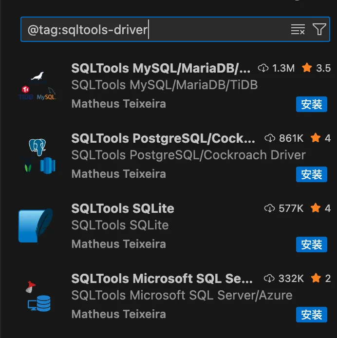

2、MSSQL

MSSQL 由 Microsoft 官方开发，专为 SQL Server 和 Azure SQL 数据库设计的扩展。

MSSQL 提供了强大的 T-SQL 脚本支持和数据库管理功能，适合 SQL Server 开发者。

扩展搜索关键词：``MSSQL``

3、Database Client

Database Client 是一款支持多种数据库的扩展，包括 MySQL、PostgreSQL、SQLite、Redis、ClickHouse 等。

Database Client 提供基本的数据库管理和备份功能，适合需要通用解决方案的开发者。

扩展搜索关键词：``Database Client``

打开左侧数据库面板，点击添加按钮，在连接页面配置相应的数据库信息：  

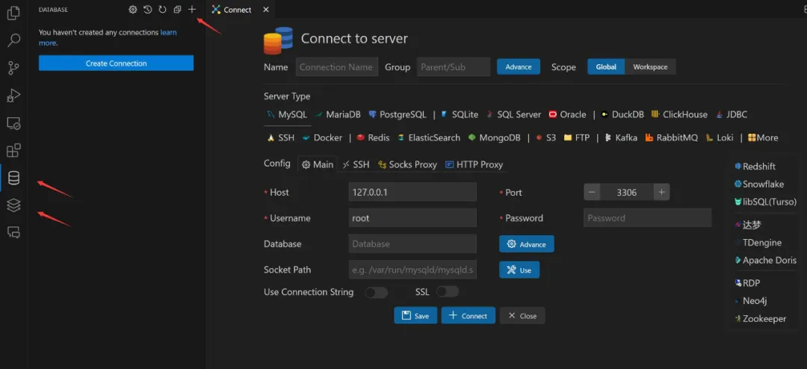

4、DBCode

DBCode 是一款功能强大的数据库管理扩展，支持 PostgreSQL、MySQL、MariaDB、SQL Server、SQLite、MongoDB 等多种数据库。

DBCode 不仅提供基本的数据库操作，还集成了 AI 查询和数据可视化功能。

扩展搜索关键词：``DBCode``


5、DevDb

DevDb 是一款轻量级数据库管理扩展，支持 SQLite、MySQL、PostgreSQL 和 SQL Server。

DevDb 适合轻量级项目或需要在开发过程中快速查看和编辑数据库的开发者。

扩展搜索关键词：``DevDb``

界面预览：

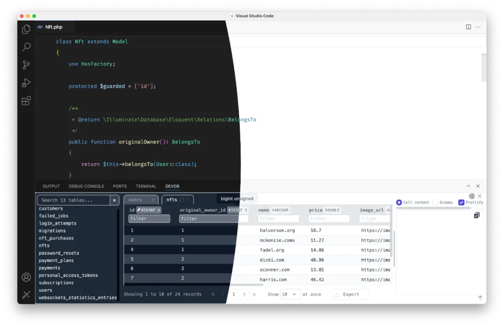  

6、MongoDB for VS Code

MongoDB for VS Code 是由 MongoDB 官方提供的扩展，专为 MongoDB 数据库设计，支持本地和云端（MongoDB Atlas）实例的管理。

MongoDB for VS Code 提供直观的数据浏览、查询原型设计和脚本执行功能，适合 NoSQL 开发者。

扩展搜索关键词：``MongoDB for VS Code``

界面预览：  

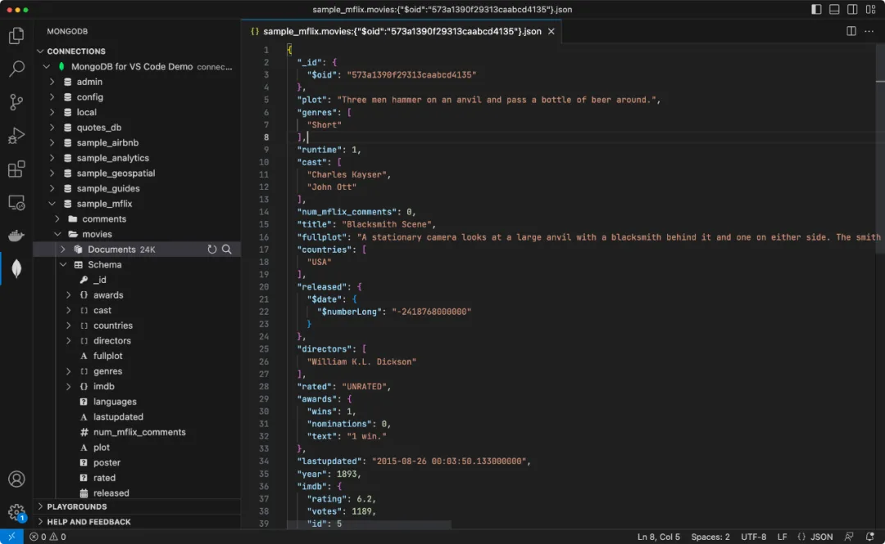

# 17 MCP
MCP（Model Context Protocol）是一种开放标准，提供统一接口，让 AI 模型能够发现和调用外部工具，实现读取文件、调用 API、执行任务等多种操作。

在 VS Code 中，MCP 客户端（如Copilot）通过 MCP 服务器提供的工具完成任务，而服务器端可以部署在本地或远程。

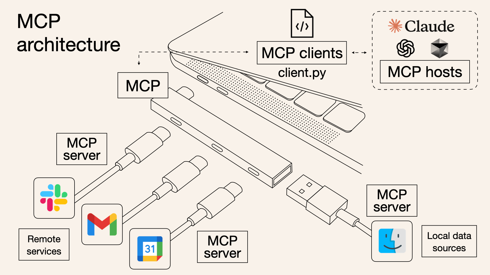

- MCP 是核心，一边连 客户端（MCP clients），像用 client.py 写的程序；另一边通过服务器（MCP server），连远程服务（比如图里的彩色图标 App）和本地数据源（蓝色笑脸图标这类）。

- 客户端还能对接 MCP 主机（hosts），像 Claude、ChatGPT 这些，让 MCP 能调用它们的能力，把各方串起来干活～ 就像给不同工具搭了个 "协作网"，让 MCP 能连通远程、本地，还能借外部大模型的力 。

在使用 VS Code MCP 服务前，确保安装最新版的 Visual Studio Code。

然后还要安装相关的 VS Code 的 AI 扩展，我们可以使用微软的 GitHub Copilot，登录账号（包括 Free、Business 或 Enterprise 计划）即可。

从 VS Code 1.102 版本开始，VS Code 中的 MCP 支持已全面可用，可以在设置中看是否启用。

## 17.1 配置 MCP 服务器
在 VS Code 中添加 MCP 服务器有多种方式：

- 直接安装：访问精选的 MCP 服务器列表 https://code.visualstudio.com/mcp，选择任意 MCP 服务器上的 "安装"，即可自动将其添加到你的 VS Code 实例中。

- 工作区设置：在工作区中添加 .vscode/mcp.json 文件，为该工作区配置 MCP 服务器，并与团队成员共享配置。

- 用户设置：在用户配置（通过 "MCP：打开用户配置"）中指定服务器，使该 MCP 服务器在所有工作区中启用，并通过 "设置同步" 进行同步。

- 自动发现：启用自动发现功能（chat.mcp.discovery.enabled），以发现其他工具（如 Claude 桌面版）中定义的 MCP 服务器。

这里使用工作区设置的方法。

## 17.2 示例
我们先创建一个 python 文件 test.py，代码如下：
>```python
>import sys
>import json
>
># 读取 MCP 初始化请求
>_ = json.load(sys.stdin)
>
># 输出 MCP 响应（标准 JSON）
>json.dump({
>    "type": "text",
>    "text": "Hello World from MCP!"
>}, sys.stdout)
>```
接下来我们创建一个能返回 "Hello World" 的 MCP 服务器配置。

在你的工作区文件夹中创建 .vscode/mcp.json（没有 .vscode 目录就创建它） 文件，填入以下配置（模拟一个简单的本地 MCP 服务器）:
>```json
>{
>  "servers": {
>    "HelloWorldServer": {
>      "type": "stdio",
>      "command": "python3",
>      "args": ["test.py"]
>    }
>  }
>}
>```
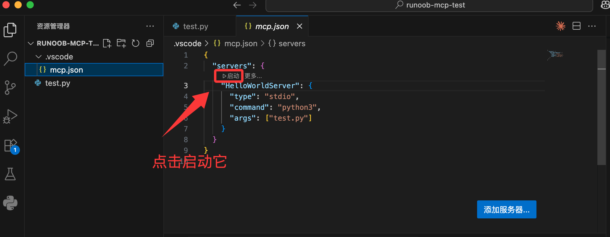

保存文件后，打开 VS Code 命令面板（Ctrl+Shift+P）：运行 "MCP: Show Installed Servers" 命令:

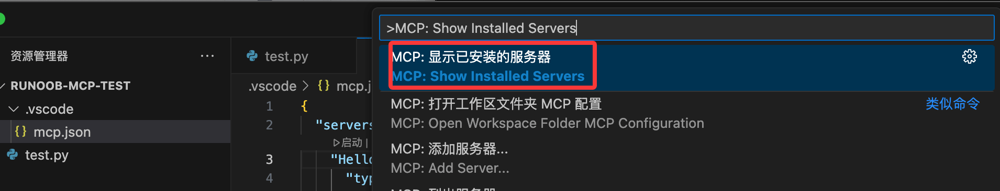

你会看到配置的 "HelloWorldServer":

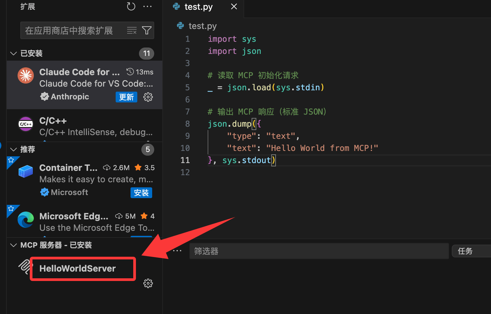

启动该服务器，它会立即返回 "Hello World from MCP!" 信息

我们可以在 AI 的聊天窗口输入"执行 HelloWorldServer"，就可以看到输出结果了：

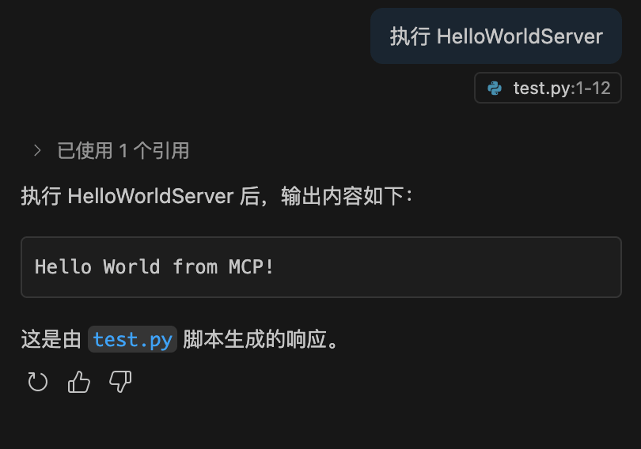

打开 .vscode/mcp.json 右下角有个"添加服务器..."的图标，我们可以通过它添加更多服务，包含执行的命令或者远程的 http 服务：

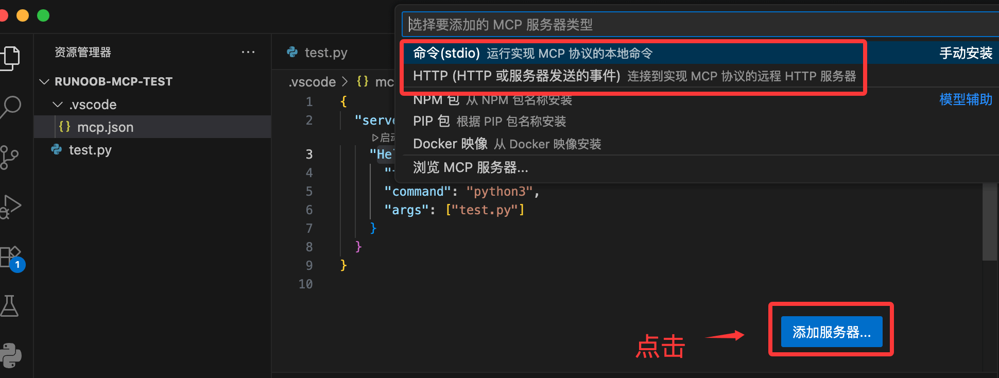
