# 目录

- [1 介绍](#1-介绍)
- [2 核心组件与工作原理](#2-核心组件与工作原理)
- [3 大语言模型](#3-大语言模型)
  - [3.1 Transfomer 架构](#31-transfomer-架构)
  - [3.2 API调用](#32-api调用)
- [4 提示词与token](#4-提示词与token)
- [5 推理与规划](#5-推理与规划)
  - [5.1 思维链 CoT（Chain of Thought）](#51-思维链-cotchain-of-thought)
  - [5.2 ReAct（Reasoning + Acting）](#52-reactreasoning-acting)
  - [5.3 Plan-and-Execute（规划先行执行模式）](#53-plan-and-execute规划先行执行模式)
  - [5.4 ToT (Tree of Thoughts) 与树状多路径探索](#54-tot-tree-of-thoughts-与树状多路径探索)
  - [5.5 任务规划 & MCTS (蒙特卡洛树搜索)](#55-任务规划-mcts-蒙特卡洛树搜索)
  - [5.6 Reflexion：自我反思与纠错](#56-reflexion自我反思与纠错)
  - [5.7 任务分解策略与工程化实践](#57-任务分解策略与工程化实践)
- [6 RAG](#6-rag)
  - [6.1 文档切分](#61-文档切分)
  - [6.2 向量检索](#62-向量检索)
  - [6.3 Advanced RAG](#63-advanced-rag)
  - [6.4 Self-RAG 与 CRAG](#64-self-rag-与-crag)
  - [6.5 GraphRAG：知识图谱 + 检索融合](#65-graphrag知识图谱-检索融合)
  - [6.6 技术与数据库选型](#66-技术与数据库选型)
  - [6.7 评估指标](#67-评估指标)
- [7 Agent架构](#7-agent架构)
  - [7.1 单 Agent 循环（Single Agent Loop）](#71-单-agent-循环single-agent-loop)
  - [7.2 规划 + 执行（Plan & Execute）](#72-规划-执行plan-execute)
  - [7.3 多 Agent 协作（Multi-Agent）](#73-多-agent-协作multi-agent)
  - [7.4 反思与修正（Reflection）](#74-反思与修正reflection)
  - [7.5 RAG + Agent（检索增强型智能体）](#75-rag-agent检索增强型智能体)
  - [7.6 工作流编排（Workflow / DAG 有向无环图）](#76-工作流编排workflow-dag-有向无环图)
- [8 skills](#8-skills)
- [9 Function Calling](#9-function-calling)
  - [9.1 工具定义](#91-工具定义)
  - [9.2 参数提取与验证](#92-参数提取与验证)
  - [9.3 错误处理与重试机制](#93-错误处理与重试机制)
- [10 记忆系统](#10-记忆系统)
  - [10.1 短期记忆（同一会话内、多轮之间）](#101-短期记忆同一会话内多轮之间)
  - [10.2 长期记忆（可以跨轮次、跨会话、跨天、跨设备）](#102-长期记忆可以跨轮次跨会话跨天跨设备)
  - [10.3 对话历史](#103-对话历史)
    - [10.3.1 基本管理](#1031-基本管理)
    - [10.3.2 基于时间的衰减](#1032-基于时间的衰减)
    - [10.3.3 基于相关性的选择](#1033-基于相关性的选择)
    - [10.3.4 混合选择策略](#1034-混合选择策略)
  - [10.4 对话历史压缩](#104-对话历史压缩)
  - [10.5 向量数据库](#105-向量数据库)
  - [10.6 记忆压缩与总结策略](#106-记忆压缩与总结策略)
    - [10.6.1 基于重要性的压缩](#1061-基于重要性的压缩)
    - [10.6.2 基于聚类的压缩](#1062-基于聚类的压缩)
    - [10.6.3 增量总结策略](#1063-增量总结策略)
  - [10.7 记忆生命周期管理](#107-记忆生命周期管理)
- [11 智能体通信协议](#11-智能体通信协议)
  - [11.1 MCP](#111-mcp)
  - [11.2 A2A](#112-a2a)
  - [11.3 ANP](#113-anp)

---
# 1 介绍
智能体，本质是自动执行任务的程序，核心在于让模型不只回答问题，而是按步骤完成动作。  

Agent = LLM (大脑) + Planning (规划) + Tool use (执行) + Memory (记忆)。

# 2 核心组件与工作原理

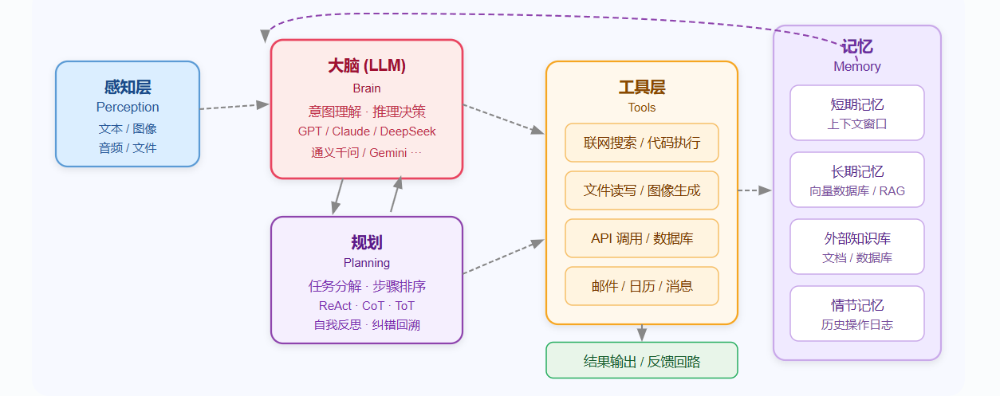

# 3 大语言模型

## 3.1 Transfomer 架构
参考[NLP.md](../NLP/NLP.md)

## 3.2 API调用


```python
from openai import OpenAI
import os

client = OpenAI(
    api_key='',
    base_url='',
)

response = client.responses.create(
    model='',
    instructions='You are a coding assistant that talks like a pirate.',
    input='How do I check if a Python object is an instance of a class?'
)

print(response.output_text)
```


```python
# 国内支持openai，如阿里云。
# 更多调用https://bailian.console.aliyun.com/cn-beijing/?spm=5176.29619931.J_SEsSjsNv72yRuRFS2VknO.2.2a5610d7c1Gxp0&tab=api#/api/?type=model&url=2833609
client = OpenAI( 
        # api_key=os.getenv("DASHSCOPE_API_KEY"),
        api_key="sk-xxx",
        base_url="https://dashscope.aliyuncs.com/compatible-mode/v1",
)
completion = client.chat.completions.create(
    model="qwen-plus",  
    messages=[{'role': 'system', 'content': 'You are a helpful assistant.'},
              {'role': 'user', 'content': '你是谁？'}],
    stream=True,  # 流式调用
    stream_options={"include_usage": True} # 流式调用
)
# print(completion.model_dump_json())
# print(completion.choices[0].message.content)

for chunk in completion:
    # chunk 里可能没有 choices 或 delta
    if hasattr(chunk, "choices") and len(chunk.choices) > 0:
        choice = chunk.choices[0]
        if hasattr(choice, "delta") and hasattr(choice.delta, "content"):
            print(choice.delta.content, end='', flush=True)
```

# 4 提示词与token
参考[prompt](../Agent/prompt.ipynb)

# 5 推理与规划

## 5.1 思维链 CoT（Chain of Thought）
传统 LLM 生成答案时往往是直觉式的一步到位。

CoT 核心思想是：强制要求模型在输出最终答案前，先显式地输出中间的推理步骤。这种做法能显著激活模型在复杂数学、逻辑推理和常识问答中的潜力。

CoT 不仅让模型有了更多的计算时间（token 数量代表计算量），还让后续的生成能建立在前面正确的逻辑基础上。

>```txt
># 通过提供包含推理过程的示例，引导模型进行 CoT 推理
>prompt = """
>问题：罗杰有5个网球。他又买了2罐网球。每罐有3个网球。他现在共有多少个网球？
>解答：罗杰一开始有5个网球。2罐网球，每罐3个，共计 2 * 3 = 6 个网球。5 + 6 = 11。答案是11。
>
>问题：食堂有23个苹果。如果他们用掉20个做午餐，又买了6个，现在有多少个苹果？
>解答：食堂本来有23个苹果。用掉20个后剩下 23 - 20 = 3 个。又买了6个，现在有 3 + 6 = 9 个。答案是9。
>
>问题：{user_question}
>解答："""
>```

## 5.2 ReAct（Reasoning + Acting）
Agent 遵循 Thought（思考） -> Action（行动） -> Observation（观察） 的循环，直到得出最终结论。

>```mermaid
>flowchart LR
>    subgraph ROAM[ ]
>        direction LR
>        A[思考<br/>Reason<br/>LLM 推理]:::blue
>        B[行动<br/>Action<br/>调用工具]:::green
>        C[观察<br/>Observe<br/>获取结果]:::orange
>        D[记忆<br/>Memory<br/>存储上下文]:::purple
>        E((用户<br/>User)):::dark
>    end
>
>    A -- 1.生成计划 --> B
>    B -- 2.执行动作 --> C
>    C -- 3.接收反馈 --> D
>    D -- 4.更新记忆，继续推理 --> A
>
>    classDef blue fill:#3498db,stroke:#2980b9,stroke-width:2px,color:white
>    classDef green fill:#2ecc71,stroke:#27ae60,stroke-width:2px,color:white
>    classDef orange fill:#e67e22,stroke:#d35400,stroke-width:2px,color:white
>    classDef purple fill:#9b59b6,stroke:#8e44ad,stroke-width:2px,color:white
>    classDef dark fill:#34495e,stroke:#2c3e50,stroke-width:2px,color:white
>```

局限性： ReAct 在短期的、步骤清晰的任务中表现优异。  
但由于整个思维和动作历史都积压在同一个上下文窗口中，当任务链条过长时，极易陷入死循环或因为上下文超载而遗忘初始目标。

## 5.3 Plan-and-Execute（规划先行执行模式）
>```txt
>复杂目标 --> Plan规划(1. 抓取网页 2. 提取数据 3. 生成报告) --> Executor执行(逐个处理子任务，每次独立上下文) --> 最终交付
>```

## 5.4 ToT (Tree of Thoughts) 与树状多路径探索
**树状多路径探索**

无论是 CoT 还是 Plan-and-Execute，本质上都是线性的路径探索。但在写代码、解数学题或创意写作时，人类往往会设想多种方案，评估后选择最佳的，甚至在发现错误时回溯。

**ToT（思维树）**

将推理过程建模为一棵树：节点是当前的思维状态。  
模型会在每一个分支点生成多个候选 Thought，然后通过内部的 Evaluator（评估器）对这些节点进行打分（如：可行、可能有风险、不可行）。  
结合 BFS（广度优先搜索） 或 DFS（深度优先搜索） 算法，决定是继续深入还是回溯重试。  

## 5.5 任务规划 & MCTS (蒙特卡洛树搜索)

在涉及战略游戏或极高难度的推理任务（如前沿的数学验证、复杂的代码仓库重构）时，简单的 ToT 仍不够高效。

业界开始将 LLM 与传统的强化学习搜索算法 MCTS（Monte Carlo Tree Search） 结合（类似 AlphaGo 的核心逻辑）。

LLM 作为策略网络（Policy Network）：提供启发式的下一步行动建议，减少无意义的分支扩展。

LLM/代码环境作为价值网络（Value Network）：通过仿真执行（Rollout）预判某个行动序列的最终胜率或成功率。

优势：在庞大的解空间中，能够找到最具有全局最优潜力的规划路径。

## 5.6 Reflexion：自我反思与纠错

Reflexion 框架赋予了 Agent 自我反思与纠错的能力。

在 Reflexion 闭环中，当 Agent 的输出被判定为失败（例如：测试用例未通过、API 报错）时，会触发一个 Reviewer 机制。

LLM 被要求根据"历史动作"和"失败的反馈"写一段口语化的反思（Reflection），例如："我刚才使用了错误的 API 参数格式，下一次我应该查阅文档后再传递 JSON"。

这段反思会被存入情景记忆（Episodic Memory）中，作为下一次尝试的上下文提示，从而大幅提升 Agent 的自愈合能力。

>```txt
>reflection_prompt = """
>你是一个正在尝试编写 Python 爬虫的 AI 助手。
>这是你刚才执行的代码：{previous_code}
>这是运行环境返回的错误信息：{error_traceback}
>
>请深刻反思：
>1. 错误发生的根本原因是什么？
>2. 在下一次尝试中，你具体的修改策略是什么？
>
>请将反思记录下来，以指导后续的行动。
>"""
>```

## 5.7 任务分解策略与工程化实践
在实际生产级的 AI 智能体开发中，纯靠 LLM "零样本"进行复杂规划是不稳定的。常用的混合干预策略包括：

| 干预策略          | 核心做法                 | 适用场景                           |
|-------------------|------------------------|-------------------------------------|
| 子任务模板化 (SOP) | 不让 LLM 自由规划，而是预先定义好标准操作程序（SOP），让 LLM 在固定的状态机（State Machine）中流转。         | 客服系统、标准化的数据清洗流水线。   |
| HITL (Human-in-the-Loop) | 在 Planner 生成任务列表后，中断执行，要求人类用户进行确认、修改或审批（Approve），然后再交由 Executor 执行。   | 高风险操作：如删除数据库记录、发送群发邮件、大额资金转账。    |
| RLHF 引导规划     | 利用强化学习和人类偏好反馈，专门微调大模型的规划能力，使其更倾向于生成安全、高效的步骤组合。    | 底层大语言模型基座的训练阶段（如 OpenAI 的 o1 模型训练）。   |


# 6 RAG
检索增强生成:让 LLM 在回答问题时，先从外部知识库中检索相关内容，再基于检索结果生成回答

解决了 LLM 的两个核心痛点：知识截止日期（模型不知道训练后发生的事）和幻觉问题（模型在不确定时会编造答案）。

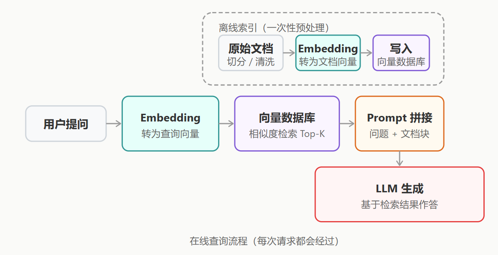

## 6.1 文档切分
**文档解析**

在切分时往往面临着格式解析的挑战。特别是 PDF、Word 或扫描件中的表格、图片和多栏排版，普通的文本提取极易造成语义错乱。

目前行业主流方案是引入 文档解析引擎（如 LlamaParse、Unstructured）或多模态大模型，将复杂图文转换为结构化的 Markdown，为后续高质量切分打下基础。

**切分策略**

| 切分策略              | 适用场景          | 优点                     | 缺点                |
|-----------------------|-------------------|--------------------------|---------------------------------|
| 固定大小切分          | 通用文本          | 实现简单，速度快   | 可能切断语义完整的句子                   |
| 递归字符切分          | 结构化文本（Markdown、代码） | 优先按段落、句子等语义边界切分   | 实现略复杂，需设定合理的分隔符列表     |
| 语义切分 (Semantic)   | 长文档、书籍      | 利用 Embedding 计算相邻句子的相似度，自动寻找语义转折点切分  | 计算成本高，预处理速度慢  |
| 父子文档检索 (Small-to-Big) | 全面覆盖场景   | 用"小块"进行高精度向量检索，命中后返回对应的"大块"（父文档）给 LLM，兼顾了检索精度和上下文完整性 | 数据库设计和维护成本翻倍 |

实践中常在切分时加入 重叠（overlap），即相邻块之间共享若干字符，防止重要信息在边界处被截断。典型配置：块大小 512 tokens，重叠 50~100 tokens。

>```py
>from langchain.text_splitter import RecursiveCharacterTextSplitter
>
>splitter = RecursiveCharacterTextSplitter(
>    chunk_size=512,        # 每块最大 token 数
>    chunk_overlap=50,      # 相邻块的重叠 token 数，防止信息在边界处丢失
>    separators=["\n\n", "\n", "。", ".", " ", ""]  # 优先按段落、句子切分
>)
>
>chunks = splitter.split_text(document_text)
>print(f"切分为 {len(chunks)} 个文档块")
>```

## 6.2 向量检索
**Embedding模型**

Embedding 模型负责将文本转换为稠密向量（通常是 768 或 1536 维的浮点数数组）。语义相近的文本在向量空间中距离更近，这正是相似度检索的数学基础。

**距离度量**

检索的核心是度量距离。最常用的是余弦相似度（Cosine Similarity），它计算两个向量的夹角余弦值，值域 [-1, 1]，越接近 1 越相似。

此外还有点积（Dot Product）和欧氏距离（L2 Distance）。

**检索算法**

为了在百万级向量中实现毫秒级检索，数据库通常采用近似最近邻（ANN）算法（如 HNSW、IVF）。

HNSW 是目前最主流的算法，它通过构建多层跳跃图网络，牺牲极少的精度换取了数量级的搜索速度提升。

## 6.3 Advanced RAG
基础架构（Naive RAG）常面临检索不准确、冗余信息多导致"上下文淹没"等问题。Advanced RAG 通过 `预检索优化 → 检索融合 → 后检索优化` 的三段式架构予以解决。

1、预检索：查询优化

用户的原始问题往往表达不够精确：
- 查询改写（Query Rewriting）：用 LLM 将口语化提问改写为规范化的检索词。
- HyDE（Hypothetical Document Embedding）：让 LLM 先"盲猜"一个假设性答案，由于生成的答案通常比原问题包含更多行业术语，用这个假设答案的向量去检索，往往能召回更高质量的文档。

2、混合检索（Hybrid Search）

将向量检索（懂语义，容错率高）与关键词检索（BM25，匹配度高）的结果按权重融合。  
这在遇到专有名词、产品型号、代码片段时尤为重要，因为传统的向量检索容易在特定的专有名词上"翻车"。

3、后检索优化：重排序（Reranking）

这是一个 `粗排 → 精排` 的两阶段设计。向量检索虽然快，但打分不够精确。  
重排序（Reranking）会引入 Cross-Encoder 模型（如 `bge-reranker`），将"问题"和"文档"成对输入模型进行联合推理打分。  
它的运算量大，只负责精选 Top-20 到 Top-5。

>```py
># 伪代码
>from sentence_transformers import CrossEncoder
>
>reranker = CrossEncoder("BAAI/bge-reranker-v2-m3") 
>
># 1. 粗排：向量检索极速召回 Top-50
>candidates = vector_store.similarity_search(query, k=50)
>
># 2. 精排：构建 [问题, 文档] 对进行精确打分
>pairs = [[query, doc.page_content] for doc in candidates]
>scores = reranker.predict(pairs)
>
># 3. 筛选最终传入 LLM 的 Top-5
>ranked_docs = sorted(zip(scores, candidates), reverse=True)
>final_docs = [doc for _, doc in ranked_docs[:5]]
>```

## 6.4 Self-RAG 与 CRAG
加入自我反思机制。  
例如 CRAG（Corrective RAG）在拿到检索结果后，先由 LLM 充当"评委"打分。  
如果本地知识库查无此文或质量极低，系统会自动触发 Web Search（如 Google API）作为补充，大幅降低幻觉。

## 6.5 GraphRAG：知识图谱 + 检索融合
传统 RAG 将知识库当作独立的文本碎片，无法回答诸如"找到所有同时由现任 CEO 创办且市值超千亿的公司"这类需要跨文档、多跳推理的复杂问题。  
GraphRAG 引入知识图谱（Knowledge Graph），将实体和关系显式建模。

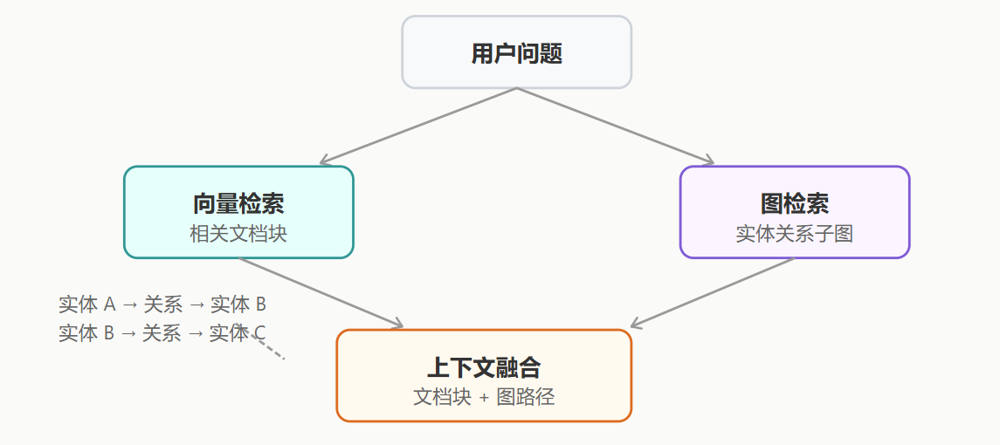

核心步骤
- 知识构建：离线阶段使用 LLM 从文档提取三元组（主体、关系、客体），写入 Neo4j 等图数据库。
- 双路检索：针对提问中的实体，不仅做传统的向量检索，同时在图谱中触发图遍历（Graph Traversal），提取多跳关系链。
- 图文融合生成：将向量检索找回的"片段"与图检索找回的"路径结构"拼装进 Prompt，使得 LLM 既具备全局视野又掌握具体细节。

## 6.6 技术与数据库选型

| 数据库/工具选型 | 类型   | 推荐落地场景 |
|--------------|------|-------------|
| **Pinecone / Zilliz Cloud** | 全托管云服务 | 开箱即用，无需维护基础设施；适合快速商用场景，搭配 **Cohere Rerank + GPT-4o** 可实现高效检索与生成结合。 |
| **Qdrant**| 开源 + 托管  | 基于 Rust 编写，内存管理优秀，性能极高；适合企业级私有化部署，尤其是对检索速度和稳定性要求高的场景。 |
| **Weaviate / Elasticsearch** | 开源 + 托管  | 内置成熟的 **BM25 + 向量混合检索（Hybrid Search）**；适合专有名词较多、需要语义与关键词结合检索的场景（如法律、医疗文档）。|
| **Milvus**| 开源分布式   | 适合十亿至百亿级别的超大规模企业级检索平台；支持高并发、分布式扩展，适合大数据量下的高性能检索需求。 |
| **Chroma / FAISS**    | 本地库/嵌入式 | 极轻量，无需部署独立服务；适合本地开发、个人知识库项目验证，或对资源占用敏感的轻量级应用。|


## 6.7 评估指标
主流使用 RAGAS 框架，从"检索"和"生成"两个维度进行自动化量化测试：

- Context Recall（检索召回率）：标准答案中的信息有多少比例能被检索到。
- Context Precision（检索精确率）：检索到的文档中有多少比例是真正相关的。
- Faithfulness（忠实度/幻觉指标）：生成的答案是否都有检索出的文档支撑。
- Answer Relevance（答案相关性）：生成的答案是否真正回答了用户的问题，避免答非所问。

# 7 Agent架构

## 7.1 单 Agent 循环（Single Agent Loop）
单 Agent 循环直接体现了 ReAct 模式

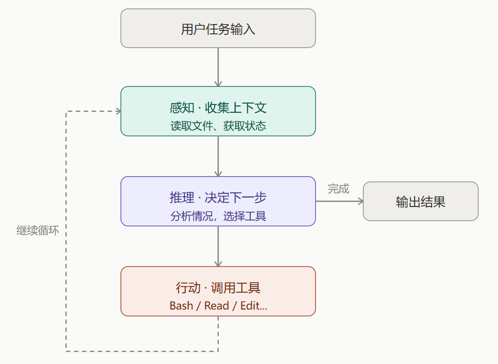

每次工具调用的结果都会回写到上下文。因此随着任务推进，上下文会不断增长，直到触达 LLM 的上下文窗口限制——这是单 Agent 循环最主要的瓶颈。

- 实现简单
- 无法并行处理多个子任务
- 上下文窗口容易撑满。

>```py
># 单 Agent 循环的简化实现 —— 展示 ReAct 模式的核心逻辑
>
>class SimpleAgent:
>    """单 Agent 循环的基本结构"""
>
>    def __init__(self, model, tools, max_turns=10):
>        self.model = model          # 大语言模型
>        self.tools = tools          # 可用工具列表
>        self.max_turns = max_turns  # 最大循环轮次，防止无限循环
>
>    def run(self, task: str) -> str:
>        """执行任务的主循环"""
>        context = f"用户任务：{task}"
>
>        for turn in range(self.max_turns):
>            # 第一步：思考 —— 让模型决定下一步
>            response = self.model.think(context)
>
>            # 如果模型认为任务完成，返回最终答案
>            if response.is_final():
>                return response.content
>
>            # 第二步：行动 —— 调用模型选择的工具
>            tool_name = response.tool_name
>            tool_args = response.tool_args
>            tool_result = self.tools[tool_name](**tool_args)
>
>            # 第三步：将工具结果反馈给模型，进入下一轮
>            context += f"\n工具 {tool_name} 返回：{tool_result}"
>
>        return "达到最大轮次，任务未完成"
>
># 使用示例
>agent = SimpleAgent(model=llm, tools={
>    "read_file": read_file,
>    "search_code": search_code,
>    "run_test": run_test
>})
>result = agent.run("修复项目中 user.py 的类型错误")
>```

## 7.2 规划 + 执行（Plan & Execute）
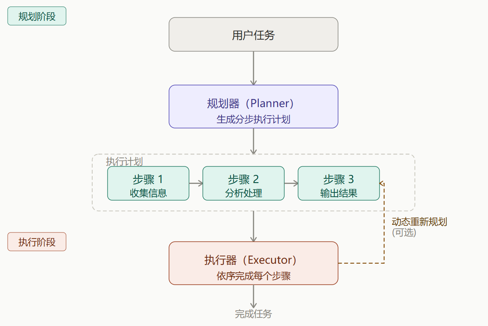


|规划|行为|典型场景|特点与代价|
| ---- | ---- | ---- | ---- |
|静态规划|计划一次性生成，按顺序线性执行，不中途调整|流程固定、步骤明确的任务，如数据迁移脚本|实现相对简单，但缺乏灵活性，难以应对任务执行过程中的变化|
|动态规划|每执行一步后重新评估，根据结果调整后续计划|结果不确定的任务，如调试、探索性数据分析|更健壮，能适应任务执行中的变化，但实现复杂度更高，且每步重新规划会消耗额外的 token|

Claude Code 的 Plan Mode 就是这个架构的体现

- 执行前可人工审查计划
- 推理和执行分离
- 增加了推理轮次，对长任务友好，简单任务浪费
- 初始计划可能不够准确
- 两阶段增加了延迟
- 静态版本难以应对意外情况

>```py
># Plan & Execute 架构的简化实现
>
>class PlanExecuteAgent:
>    """先规划、后执行的 Agent"""
>
>    def plan(self, task: str) -> list:
>        """阶段一：生成执行计划"""
>        plan = self.model.generate(f"""
>        请将以下任务拆解为可执行的步骤列表：
>        任务：{task}
>        返回 JSON 格式的步骤列表，每步包含：
>        - step_id: 步骤编号
>        - description: 步骤描述
>        - tool: 需要调用的工具名
>        """)
>        return plan
>
>    def execute(self, plan: list, dynamic: bool = False) -> str:
>        """阶段二：逐步执行计划"""
>        results = []
>        remaining_plan = plan.copy()
>
>        while remaining_plan:
>            step = remaining_plan.pop(0)
>            output = self.tools[step["tool"]](step["description"])
>            results.append({"step": step["step_id"], "output": output})
>
>            if dynamic and remaining_plan:
>                # 动态规划：根据当前结果重新评估后续计划
>                remaining_plan = self.replan(remaining_plan, results)
>
>        return self.summarize(results)
>
># 使用示例
>agent = PlanExecuteAgent()
>plan = agent.plan("为项目添加用户认证功能")
># 人类可以先审查 plan，确认合理后再执行
>result = agent.execute(plan, dynamic=True)
>```

## 7.3 多 Agent 协作（Multi-Agent）
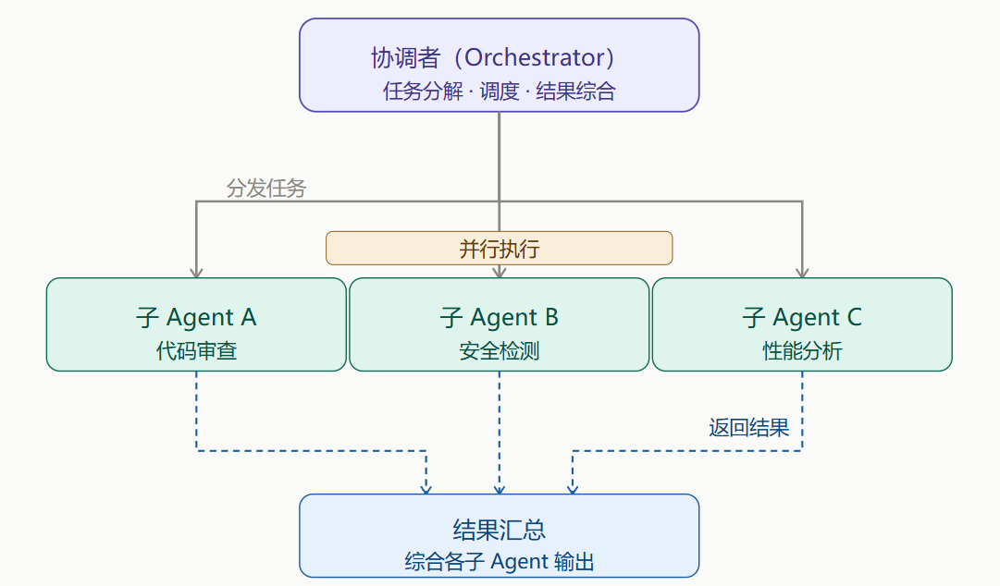

每个子 Agent 拥有独立的上下文窗口。

子 Agent（Subagent）是短暂的、隔离的——完成一个任务后即销毁。Agent 团队（Agent Teams）则是多个独立 Agent 实例长时间协作、互相发消息，更像一个真实的团队。

- 天然支持并行，速度快
- 子 Agent 各自独立，上下文互不干扰
- 可以专门化每个子 Agent 的角色
- 协调逻辑复杂，调试困难
- 多个 Agent 并行的 Token 成本更高
- Orchestrator 本身可能成为瓶颈
- 多 Agent 协作的主要成本是编排开销。如果子任务非常简单（每个只需 1-2 步），编排开销可能超过实际工作的开销，单 Agent 更合适。

>```py
># 多 Agent 协作的简化实现
>
>class Orchestrator:
>    """编排器：负责任务拆解、分发和结果汇总"""
>
>    def __init__(self):
>        self.subagents = {
>            "code_review": Subagent(
>                name="代码审查",
>                tools=["read_file", "static_analysis"],
>                system_prompt="你是代码审查专家..."
>            ),
>            "security": Subagent(
>                name="安全检测",
>                tools=["scan_vulnerability", "check_deps"],
>                system_prompt="你是安全检测专家..."
>            ),
>            "performance": Subagent(
>                name="性能分析",
>                tools=["profile_code", "analyze_complexity"],
>                system_prompt="你是性能分析专家..."
>            )
>        }
>
>    def handle_task(self, task: str) -> dict:
>        # 第一步：分析任务，决定需要哪些 Subagent
>        needed = self.plan(task)
>
>        # 第二步：并行分发（各 Subagent 同时工作，独立上下文）
>        results = {}
>        for agent_name in needed:
>            sub_task = self.decompose(task, agent_name)
>            results[agent_name] = self.subagents[agent_name].run(sub_task)
>
>        # 第三步：汇总各 Subagent 的结果，综合输出
>        return self.synthesize(task, results)
>
># 使用示例：一次运行，三个维度并行分析
>orch = Orchestrator()
>report = orch.handle_task("审查PR #42")
>```

## 7.4 反思与修正（Reflection）
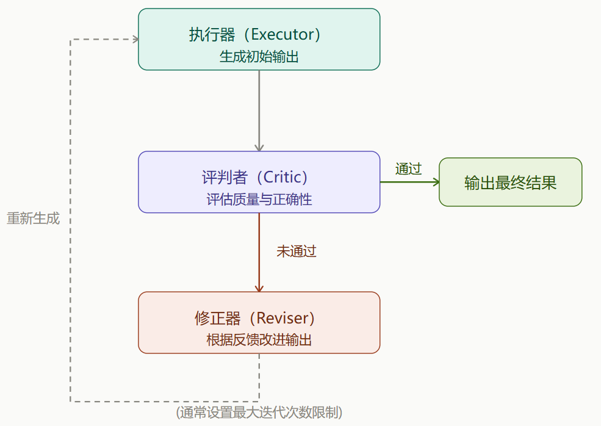

| 方式       | 机制                                                         | 优点                          | 缺点                                      |
|------------|--------------------------------------------------------------|-------------------------------|-------------------------------------------|
| 自我反思   | 同一个模型先执行再评估自己的输出                             | 实现简单，无额外模型成本       | 模型可能对自己的错误"视而不见"            |
| Critic 模型 | 用独立的评判模型评估执行模型的输出                           | 更客观，能发现执行模型盲区     | 增加模型调用成本和延迟                    |

- 显著提升输出质量
- 可以设置明确的质量标准
- 适合有客观评判标准的任务
- 多次迭代增加延迟和成本
- 需要设置最大迭代次数防止死循环
- 评判标准难以形式化时效果有限

>```py
># 反思架构的简化实现
>
>class ReflectiveAgent:
>    """带有自我反思能力的 Agent"""
>
>    def __init__(self, model, tools, max_reflections=3):
>        self.model = model
>        self.tools = tools
>        self.max_reflections = max_reflections  # 最多修正次数，防止死循环
>
>    def run(self, task: str) -> str:
>        # 第一步：正常执行，产生初始输出
>        output = self.model.generate(task)
>
>        for i in range(self.max_reflections):
>            # 第二步：反思 —— 评估输出质量
>            critique = self.model.generate(f"""
>            请严格评估以下输出：
>            原始任务：{task}
>            当前输出：{output}
>            检查：事实错误？逻辑漏洞？遗漏信息？格式问题？
>            如果输出完美无缺，请回复 "PASS"。
>            """)
>
>            if "PASS" in critique:
>                break  # 输出通过审查
>
>            # 第三步：修正 —— 根据批评意见改进
>            output = self.model.generate(f"""
>            原始任务：{task}
>            上次输出：{output}
>            问题反馈：{critique}
>            请根据反馈修正输出。
>            """)
>
>        return output
>
># 使用示例
>agent = ReflectiveAgent(model=llm, tools={})
>code = agent.run("编写一个 Python 函数，实现字符串的 AES 加密")
># Agent 生成代码后自我检查加密实现、密钥处理，
># 发现漏洞后自动修正，确保输出安全可靠
>```

## 7.5 RAG + Agent（检索增强型智能体）
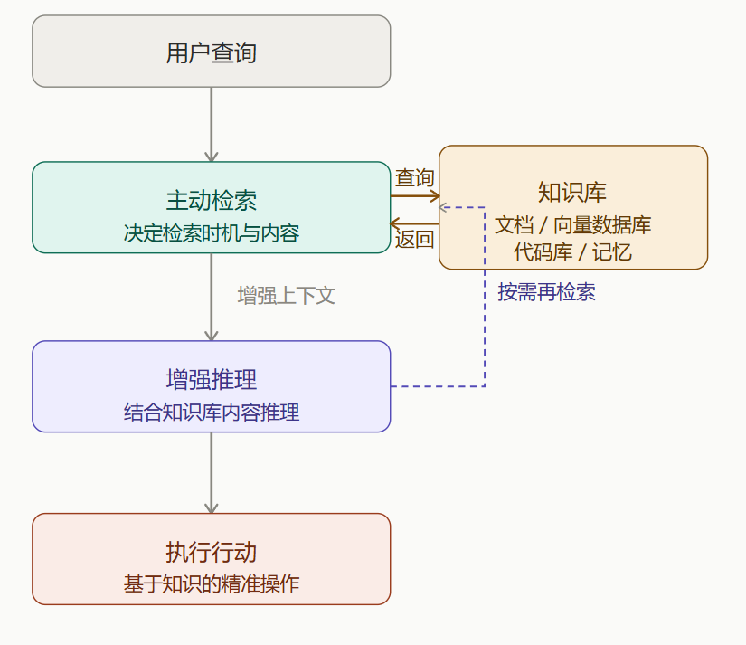

与一般RAG不同：   
一般 RAG 是用户提问时固定检索一次，将结果塞入 Prompt。  
RAG + Agent 中 Agent 自主判断在推理的哪个环节需要补充知识、需要检索什么，并可以多次查询知识库，直到获得足够的信息来完成任务。

- 突破上下文窗口限制
- 输出有据可查，减少幻觉
- 知识库可独立更新
- 检索质量影响整体效果
- 向量数据库的维护成本
- 检索延迟增加响应时间

>```py
># RAG + Agent 的简化实现
>
>class RAGAgent:
>    """带有动态检索能力的 Agent"""
>
>    def __init__(self, model, vector_db, max_retrievals=5):
>        self.model = model
>        self.vector_db = vector_db  # 向量数据库
>        self.max_retrievals = max_retrievals
>
>    def should_retrieve(self, context: str, question: str) -> bool:
>        """Agent 自己判断是否需要检索更多信息"""
>        decision = self.model.generate(f"""
>        当前已知信息：{context}
>        当前问题：{question}
>        现有信息是否足以回答问题？回答 YES 或 NO。
>        """)
>        return "NO" in decision
>
>    def run(self, task: str) -> str:
>        context = ""
>        retrieval_count = 0
>
>        while retrieval_count < self.max_retrievals:
>            # Agent 自主判断是否需要检索
>            if not self.should_retrieve(context, task):
>                break
>
>            # Agent 自主决定检索什么
>            search_query = self.model.generate(f"""
>            任务：{task}
>            已有信息：{context}
>            为了完成任务，下一步应该检索什么信息？
>            """)
>
>            # 执行检索，结果追加到上下文
>            docs = self.vector_db.search(search_query)
>            context += "\n".join(docs)
>            retrieval_count += 1
>
>        # 综合所有信息生成最终答案
>        return self.model.generate(f"任务：{task}\n参考资料：{context}")
>
># 使用示例
>agent = RAGAgent(model=llm, vector_db=runoob_docs_db)
>answer = agent.run("项目框架中如何配置数据库连接池？")
># Agent 先检索"连接池配置"，发现提到"最大连接数"
># 如果不理解，会再次检索"最大连接数最佳实践"
># 最终综合多轮检索结果给出完整回答
>```

## 7.6 工作流编排（Workflow / DAG 有向无环图）
把 Agent 行为固化为一张有向无环图（DAG），每个节点是一个 LLM 调用或工具调用，边表示数据依赖关系，由框架驱动执行。

这是最接近传统软件工程的一种 Agent 架构。与前面几种架构的最大区别在于：`Agent 的自主决策空间被限制在单个节点内部，节点之间的流转是预先定义好的，不可更改。`

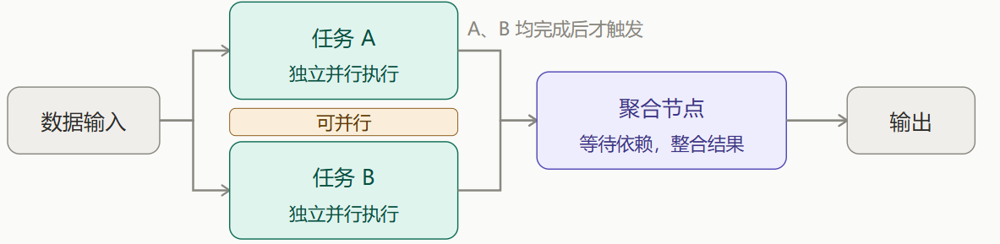

- 可预测、可审计、可重试
- 支持并行加速
- 工程化程度高，运维友好
- 流程需要预先设计，灵活性低
- 难以应对未预期的情况
- 需要学习编排框架

>```py
># DAG 工作流的简化定义（类似 LangGraph 风格）
>
>from langgraph import StateGraph
>
># 定义工作流状态 —— 节点间传递的数据对象
>class PipelineState:
>    raw_data: str = ""         # 原始输入数据
>    cleaned_data: str = ""     # 清洗后的数据
>    analysis_result: dict = {} # 分析结果
>    final_report: str = ""     # 最终报告
>
># 定义 DAG 节点 —— 每个节点是独立的处理单元
>def extract_data(state: PipelineState) -> PipelineState:
>    """节点1：从 runoob 数据库中提取原始数据"""
>    state.raw_data = query_database("SELECT * FROM logs")
>    return state
>
>def clean_data(state: PipelineState) -> PipelineState:
>    """节点2：清洗数据（去重、标准化格式）"""
>    state.cleaned_data = preprocess(state.raw_data)
>    return state
>
>def analyze_data(state: PipelineState) -> PipelineState:
>    """节点3：统计分析"""
>    state.analysis_result = statistical_analysis(state.cleaned_data)
>    return state
>
>def generate_report(state: PipelineState) -> PipelineState:
>    """节点4：使用 LLM 生成报告"""
>    state.final_report = llm.generate(
>        f"基于以下分析结果生成报告：{state.analysis_result}"
>    )
>    return state
>
># 构建 DAG：定义节点和边（数据流向）
>workflow = StateGraph(PipelineState)
>workflow.add_node("extract", extract_data)
>workflow.add_node("clean", clean_data)
>workflow.add_node("analyze", analyze_data)
>workflow.add_node("report", generate_report)
>
># 定义边：extract → clean → analyze → report
>workflow.add_edge("extract", "clean")
>workflow.add_edge("clean", "analyze")
>workflow.add_edge("analyze", "report")
>workflow.set_entry_point("extract")
>workflow.set_finish_point("report")
>
># 编译并运行
>app = workflow.compile()
>result = app.invoke(PipelineState())
>print(result.final_report)
>```

# 8 skills
参考[calude](../Vibe_Coding/Claude.ipynb) 中的skill讲解

# 9 Function Calling
工具调用是让 LLM 能够使用外部工具的核心机制

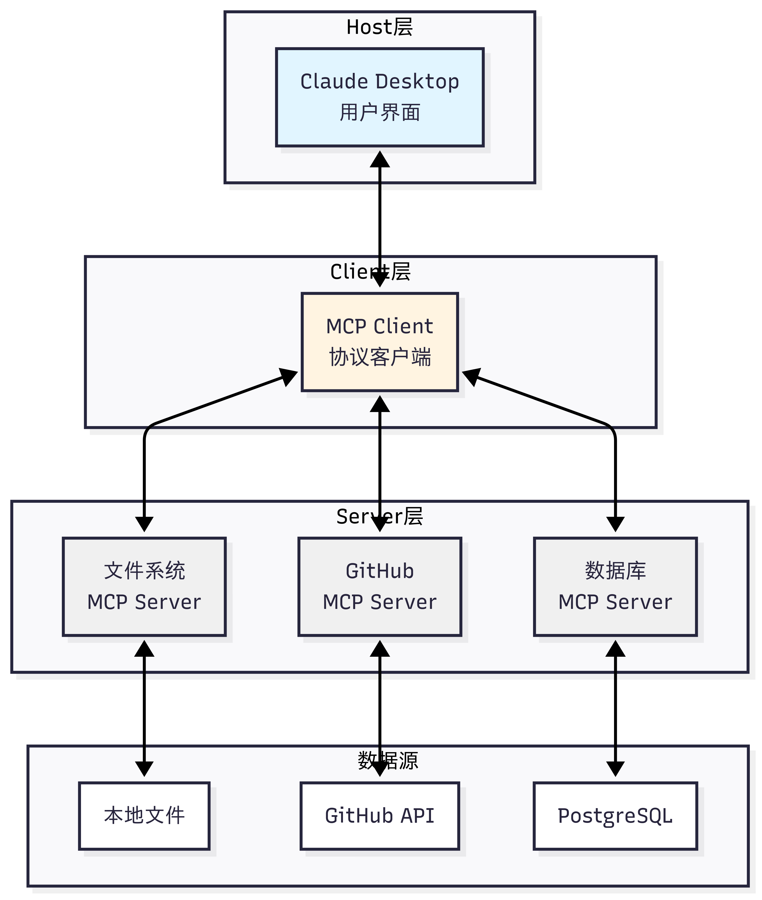

## 9.1 工具定义
工具定义示例结构
```py
weather_tool = {
    "name": "get_weather",  # 工具名称
    "description": "获取指定城市的天气信息",  # 工具描述
    "parameters": {  # 参数定义
        "type": "object",
        "properties": {
            "city": {
                "type": "string",
                "description": "城市名称，如'北京'、'上海'"
            },
            "date": {
                "type": "string",
                "description": "日期，格式'YYYY-MM-DD'，或'今天'、'明天'",
                "enum": ["今天", "明天", "后天"]
            }
        },
        "required": ["city"]  # 必填参数
    }
}
```

编写优质的工具描述
```py
# 对于有限的选项，使用枚举（enum）帮助 LLM 理解：
"unit": {
    "type": "string",
    "description": "温度单位",
    "enum": ["celsius", "fahrenheit"],
    "default": "celsius"
}

# 提供示例值:在描述中提供示例，帮助 LLM 理解格式：
"date": {
    "type": "string",
    "description": "日期，格式应为'YYYY-MM-DD'，例如'2024-06-15'"
}
```

示例:
```py
calculator_tool = {
    "name": "calculate",
    "description": "执行数学计算，支持加减乘除、幂运算等基本运算",
    "parameters": {
        "type": "object",
        "properties": {
            "expression": {
                "type": "string",
                "description": "数学表达式，如'2 + 3 * 4'、'sqrt(16)'、'sin(30)'"
            }
        },
        "required": ["expression"]
    }
}
```

## 9.2 参数提取与验证
当 LLM 决定调用工具时，它会分析用户输入，提取出工具所需的参数

```txt
用户输入: "查询北京明天的天气温度"
工具: get_weather
提取参数: {"city": "北京", "date": "明天"}
```

```py
class ParameterValidator:
    """参数验证器"""

    def __init__(self, tool_def):
        self.tool_def = tool_def

    def validate(self, params):
        """执行完整的参数验证"""
        all_errors = []

        # 检查必填参数
        required_errors = self.validate_required(params)
        all_errors.extend(required_errors)

        # 检查参数类型
        type_errors = self.validate_type(params)
        all_errors.extend(type_errors)

        # 检查参数范围
        range_errors = self.validate_range(params)
        all_errors.extend(range_errors)

        # 检查额外参数（未定义的参数）
        extra_errors = self.validate_extra(params)
        all_errors.extend(extra_errors)

        return len(all_errors) == 0, all_errors

    def validate_required(self, params):
        """验证必填参数"""
        errors = []
        required_params = self.tool_def["parameters"].get("required", [])

        for param_name in required_params:
            if param_name not in params or params[param_name] is None:
                errors.append(f"缺少必填参数: {param_name}")

        return errors

    def validate_type(self, params):
        """验证参数类型"""
        errors = []

        for param_name, param_value in params.items():
            if param_name in self.tool_def["parameters"]["properties"]:
                param_def = self.tool_def["parameters"]["properties"][param_name]
                expected_type = param_def.get("type")

                if expected_type == "string" and not isinstance(param_value, str):
                    errors.append(f"参数'{param_name}'应为字符串类型，实际为{type(param_value).__name__}")
                elif expected_type == "integer" and not isinstance(param_value, int):
                    errors.append(f"参数'{param_name}'应为整数类型，实际为{type(param_value).__name__}")
                elif expected_type == "number" and not isinstance(param_value, (int, float)):
                    errors.append(f"参数'{param_name}'应为数字类型，实际为{type(param_value).__name__}")
                elif expected_type == "boolean" and not isinstance(param_value, bool):
                    errors.append(f"参数'{param_name}'应为布尔类型，实际为{type(param_value).__name__}")

        return errors

    def validate_range(self, params):
        """验证参数范围"""
        errors = []

        for param_name, param_value in params.items():
            if param_name in self.tool_def["parameters"]["properties"]:
                param_def = self.tool_def["parameters"]["properties"][param_name]

                # 检查最小值
                if "minimum" in param_def and param_value < param_def["minimum"]:
                    errors.append(f"参数'{param_name}'不能小于{param_def['minimum']}")

                # 检查最大值
                if "maximum" in param_def and param_value > param_def["maximum"]:
                    errors.append(f"参数'{param_name}'不能大于{param_def['maximum']}")

                # 检查枚举值
                if "enum" in param_def and param_value not in param_def["enum"]:
                    errors.append(f"参数'{param_name}'必须是{param_def['enum']}中的一个")

        return errors

    def validate_extra(self, params):
        """检查未定义的额外参数"""
        errors = []
        defined_params = set(self.tool_def["parameters"]["properties"].keys())
        provided_params = set(params.keys())

        extra_params = provided_params - defined_params
        if extra_params:
            errors.append(f"提供了未定义的参数: {', '.join(extra_params)}")

        return errors

# 使用示例
validator = ParameterValidator(weather_tool)
params = {"city": "北京", "date": "明天", "extra": "不应该有的参数"}
is_valid, errors = validator.validate(params)

if is_valid:
    print("参数验证通过")
else:
    print("参数验证失败:")
    for error in errors:
        print(f"  - {error}")
```

当参数验证失败时，可以采取以下策略：

- 询问用户：直接向用户询问缺失或错误的参数
- 使用默认值：对于可选参数，使用预定义的默认值
- 智能推断：根据上下文推断合理的参数值
- 格式转换：将用户提供的格式转换为工具要求的格式

```py
def fix_parameters(params, errors, tool_def):
    """尝试修正参数错误"""
    fixed_params = params.copy()

    for error in errors:
        if "缺少必填参数" in error:
            param_name = error.split(": ")[1]
            # 尝试从上下文推断或使用默认值
            if param_name == "date":
                fixed_params[param_name] = "今天"  # 使用当天作为默认值

        elif "应为字符串类型" in error:
            param_name = error.split("'")[1]
            # 尝试转换为字符串
            fixed_params[param_name] = str(params[param_name])

    return fixed_params
```

## 9.3 错误处理与重试机制
- 网络错误：API 调用超时、连接失败
- 参数错误：参数验证失败、格式不正确
- 权限错误：API 密钥无效、权限不足
- 资源错误：服务不可用、达到调用限制
- 逻辑错误：工具内部逻辑错误

```py
class ToolExecutor:
    """工具执行器"""

    def __init__(self):
        self.tools = {}  # 注册的工具
        self.validator = ParameterValidator
        self.error_handler = ErrorHandler()
        self.retry = ExponentialBackoffRetry()
        self.breaker = CircuitBreaker()

    def register_tool(self, name, tool_def, func):
        """注册工具"""
        self.tools[name] = {
            "definition": tool_def,
            "function": func
        }

    def execute_tool(self, tool_name, params):
        """执行工具"""
        if tool_name not in self.tools:
            return {
                "success": False,
                "error": f"工具'{tool_name}'未注册"
            }

        tool_info = self.tools[tool_name]
        tool_def = tool_info["definition"]
        tool_func = tool_info["function"]

        # 验证参数
        validator = self.validator(tool_def)
        is_valid, errors = validator.validate(params)

        if not is_valid:
            return {
                "success": False,
                "error": "参数验证失败",
                "details": errors
            }

        # 通过熔断器执行（带重试）
        try:
            def execute_with_retry():
                return self.breaker.execute(
                    lambda: self.retry.retry(tool_func, **params)
                )

            result = execute_with_retry()

            return {
                "success": True,
                "result": result,
                "tool": tool_name
            }

        except Exception as e:
            # 错误处理
            error_response = self.error_handler.handle(e, {
                "tool": tool_name,
                "params": params
            })

            return {
                "success": False,
                "error": error_response["error"],
                "retryable": error_response.get("retryable", False),
                "suggestion": error_response.get("suggestion", "")
            }

    def handle_user_request(self, user_input):
        """处理用户请求（简化版）"""
        # 1. 让LLM选择工具和提取参数（这里简化处理）
        # 实际应用中，这里会调用LLM进行工具选择和参数提取

        # 模拟LLM的输出
        if "天气" in user_input:
            tool_name = "get_weather"
            # 简单提取城市（实际应用中LLM会做得更好）
            if "北京" in user_input:
                params = {"city": "北京", "date": "今天"}
            elif "上海" in user_input:
                params = {"city": "上海", "date": "今天"}
            else:
                params = {"city": "北京", "date": "今天"}  # 默认值
        else:
            return "抱歉，我无法处理这个请求"

        # 2. 执行工具
        result = self.execute_tool(tool_name, params)

        # 3. 生成最终回答
        if result["success"]:
            weather = result["result"]
            return f"{params['city']}今天天气：{weather['condition']}，温度{weather['temperature']}°C"
        else:
            return f"获取天气信息失败：{result['error']}"

# 使用示例
executor = ToolExecutor()

# 注册天气工具
def mock_weather_api(city, date):
    """模拟天气API"""
    # 模拟API调用延迟
    time.sleep(0.1)
    return {"temperature": 22, "condition": "多云"}

executor.register_tool("get_weather", weather_tool, mock_weather_api)

# 处理用户请求
response = executor.handle_user_request("北京今天天气怎么样？")
print(response)
```

# 10 记忆系统
一轮：一次问答

会话：包含多轮

上下文窗口 ： 大模型一次性能吃下的最大 Token 容量

只有两种情况才会开全新上下文窗口：
- 用户新建会话
- 程序主动清空上下文、重置会话

## 10.1 短期记忆（同一会话内、多轮之间）
- 通常只能保存最近的几次对话
- 快速访问：读取和写入速度很快
- 临时性：对话结束后通常会被清除或压缩
- 上下文相关：直接影响当前的响应生成

主要用来保持对话的连贯性，存储当前任务的中间结果，记住用户在当前对话中提到的偏好

```py
class ShortTermMemory:
    """短期记忆实现"""

    def __init__(self, max_turns=10):
        self.max_turns = max_turns  # 最大对话轮数
        self.conversation_history = []  # 对话历史
        self.temporary_data = {}  # 临时数据存储

    def add_message(self, role, content):
        """添加消息到对话历史"""
        message = {"role": role, "content": content, "timestamp": time.time()}
        self.conversation_history.append(message)

        # 保持历史不超过最大长度
        if len(self.conversation_history) > self.max_turns:
            self.conversation_history.pop(0)

    def get_context(self):
        """获取对话上下文（用于发送给LLM）"""
        return self.conversation_history[-self.max_turns:]

    def store_temp(self, key, value):
        """存储临时数据"""
        self.temporary_data[key] = value

    def get_temp(self, key, default=None):
        """获取临时数据"""
        return self.temporary_data.get(key, default)

    def clear_temp(self):
        """清除临时数据"""
        self.temporary_data.clear()
```

## 10.2 长期记忆（可以跨轮次、跨会话、跨天、跨设备）

- 容量大：可以存储大量信息
- 持久化：信息会长期保存，不会自动清除
- 检索式访问：通过查询检索相关信息，而非顺序读取
- 结构化存储：信息通常以结构化方式存储，便于检索

主要存储用户的个人信息和偏好，积累知识和经验，记住重要的对话内容，保存任务执行结果

```py
class LongTermMemory:
    """长期记忆基类"""

    def __init__(self):
        self.memories = []  # 记忆条目列表

    def add_memory(self, content, metadata=None):
        """添加记忆"""
        memory = {
            "id": str(uuid.uuid4()),
            "content": content,
            "metadata": metadata or {},
            "timestamp": time.time(),
            "importance": 0.5  # 默认重要性
        }
        self.memories.append(memory)
        return memory["id"]

    def search_memories(self, query, limit=5):
        """搜索记忆（子类需要实现具体搜索逻辑）"""
        raise NotImplementedError

    def get_memory(self, memory_id):
        """获取特定记忆"""
        for memory in self.memories:
            if memory["id"] == memory_id:
                return memory
        return None

    def delete_memory(self, memory_id):
        """删除记忆"""
        self.memories = [m for m in self.memories if m["id"] != memory_id]
```

## 10.3 对话历史
LLM 的上下文长度有限。

多轮对话不是每轮新开窗口，是把历史 + 当前问题一起塞进同一个窗口。

窗口有上限，塞不下就会被截断，需要智能地管理哪些历史信息应该保留、哪些可以丢弃。

不是所有历史对话都同样重要。智能的历史选择可以提高上下文的使用效率.


### 10.3.1 基本管理
采用「从最新对话往回倒序填充、按 Token 估算限制长度」的滑动窗口策略，只保留最近 N 轮完整原始对话，直到触达最大 Token 上限，更早历史直接丢弃。
```py
class ConversationManager:
    """对话管理器"""

    def __init__(self, max_context_length=4000):
        self.max_context_length = max_context_length  # 最大token数
        self.history = []  # 完整的对话历史
        self.active_context = []  # 当前活跃的上下文

    def add_exchange(self, user_input, assistant_response):
        """添加一轮对话"""
        self.history.append({
            "user": user_input,
            "assistant": assistant_response,
            "timestamp": time.time()
        })

    def build_context(self, current_query, include_history=True):
        """构建当前查询的上下文"""

        if not include_history or not self.history:
            # 没有历史或不需要历史，只返回当前查询
            return [{"role": "user", "content": current_query}]

        # 从最近的对话开始，逐步添加历史，直到达到长度限制
        context = []
        context_length = self.estimate_tokens(current_query)

        # 添加当前查询
        context.insert(0, {"role": "user", "content": current_query})

        # 从最近到最远添加历史
        for exchange in reversed(self.history):
            user_tokens = self.estimate_tokens(exchange["user"])
            assistant_tokens = self.estimate_tokens(exchange["assistant"])

            # 检查是否会超出限制
            if context_length + user_tokens + assistant_tokens > self.max_context_length:
                break

            # 添加助理回复（在用户输入之前）
            context.insert(0, {"role": "assistant", "content": exchange["assistant"]})
            context.insert(0, {"role": "user", "content": exchange["user"]})

            context_length += user_tokens + assistant_tokens

        return context

    def estimate_tokens(self, text):
        """粗略估计文本的token数量（实际应用中应使用准确的tokenizer）"""
        # 简单估算：英文约0.75单词/token，中文约1-2字符/token
        if self.is_chinese(text):
            return len(text) // 2  # 中文每2字符约1个token
        else:
            words = len(text.split())
            return int(words * 1.3)  # 英文每单词约1.3个token

    def is_chinese(self, text):
        """判断文本是否主要为中文"""
        chinese_chars = sum(1 for c in text if '\u4e00' <= c <= '\u9fff')
        return chinese_chars / max(len(text), 1) > 0.3

    def clear_history(self):
        """清空对话历史"""
        self.history.clear()
        self.active_context.clear()
```

### 10.3.2 基于时间的衰减
```py
def time_based_selection(history, current_time, max_items=10):
    """基于时间的选择：越近的对话权重越高"""
    scored_items = []

    for item in history:
        # 计算时间衰减分数（越近分数越高）
        time_diff = current_time - item["timestamp"]
        time_score = max(0, 1 - time_diff / 3600)  # 1小时内完全保留，之后衰减

        # 结合其他因素（如对话长度、重要性标记等）
        total_score = time_score

        scored_items.append((total_score, item))

    # 按分数排序，选择分数最高的
    scored_items.sort(key=lambda x: x[0], reverse=True)
    return [item for score, item in scored_items[:max_items]]
```

### 10.3.3 基于相关性的选择
```py
def relevance_based_selection(history, current_query, embedding_model, max_items=5):
    """基于与当前查询相关性的选择"""
    if not history:
        return []

    # 计算当前查询的向量
    query_embedding = embedding_model.encode(current_query)

    scored_items = []

    for item in history:
        # 将历史对话内容转换为向量
        content = item["user"] + " " + item["assistant"]
        content_embedding = embedding_model.encode(content)

        # 计算余弦相似度
        similarity = cosine_similarity([query_embedding], [content_embedding])[0][0]

        scored_items.append((similarity, item))

    # 按相似度排序，选择最相关的
    scored_items.sort(key=lambda x: x[0], reverse=True)
    return [item for similarity, item in scored_items[:max_items]]
```

### 10.3.4 混合选择策略
```py
class SmartHistorySelector:
    """智能历史选择器"""

    def __init__(self, embedding_model=None):
        self.embedding_model = embedding_model

    def select_history(self, history, current_query, max_context_length=3000):
        """智能选择历史对话"""

        selected = []
        current_length = 0

        # 策略1：总是包含最近的一轮对话
        if history:
            recent = history[-1]
            recent_length = self.estimate_length(recent)
            if recent_length <= max_context_length:
                selected.append(recent)
                current_length += recent_length

        # 策略2：基于相关性的选择
        if self.embedding_model and len(history) > 1:
            relevant = self.select_by_relevance(history[:-1], current_query, 3)
            for item in relevant:
                item_length = self.estimate_length(item)
                if current_length + item_length <= max_context_length:
                    selected.append(item)
                    current_length += item_length

        # 策略3：如果还有空间，按时间顺序添加
        remaining_space = max_context_length - current_length
        if remaining_space > 100:  # 至少100token的空间
            for item in history:
                if item not in selected:
                    item_length = self.estimate_length(item)
                    if item_length <= remaining_space:
                        selected.append(item)
                        remaining_space -= item_length

        # 按时间顺序排序
        selected.sort(key=lambda x: x["timestamp"])
        return selected

    def select_by_relevance(self, history, query, max_items):
        """基于相关性选择"""
        # 简化实现，实际应使用向量相似度
        query_lower = query.lower()
        scored = []

        for item in history:
            content = (item["user"] + " " + item["assistant"]).lower()
            # 简单关键词匹配
            score = sum(1 for word in query_lower.split() if word in content)
            scored.append((score, item))

        scored.sort(key=lambda x: x[0], reverse=True)
        return [item for score, item in scored[:max_items]]

    def estimate_length(self, exchange):
        """估计对话长度"""
        return len(exchange["user"]) + len(exchange["assistant"])
```

## 10.4 对话历史压缩
当对话历史太长时，可以对其进行压缩，保留核心信息
```py
class HistoryCompressor:
    """对话历史压缩器"""

    def __init__(self, llm_client):
        self.llm = llm_client

    def compress_conversation(self, conversation_history, max_summary_length=500):
        """压缩对话历史"""

        if len(conversation_history) <= 2:
            return conversation_history  # 太短不需要压缩

        # 将对话历史转换为文本
        conversation_text = self.history_to_text(conversation_history)

        # 使用LLM生成摘要
        prompt = f"""
请将以下对话历史压缩为一个简短的摘要，保留核心信息和重要细节：

对话历史：
{conversation_text}

摘要要求：
1. 不超过{max_summary_length}字
2. 保留用户的主要需求和助理的关键回答
3. 忽略问候语、重复内容和无关细节

摘要：
"""

        summary = self.llm.generate(prompt, max_tokens=max_summary_length)

        # 创建压缩后的历史（摘要 + 最近几轮对话）
        compressed_history = [
            {
                "role": "system",
                "content": f"之前的对话摘要：{summary}"
            }
        ]

        # 保留最近的1-2轮对话以保持连贯性
        for exchange in conversation_history[-2:]:
            compressed_history.append({
                "role": "user" if exchange["role"] == "user" else "assistant",
                "content": exchange["content"]
            })

        return compressed_history

    def history_to_text(self, history):
        """将对话历史转换为文本"""
        lines = []
        for exchange in history:
            role = "用户" if exchange["role"] == "user" else "助理"
            lines.append(f"{role}: {exchange['content']}")
        return "\n".join(lines)
```

## 10.5 向量数据库
向量数据库是长期记忆系统的核心技术，它允许 Agent 基于语义相似度检索相关信息，而不仅仅是关键词匹配。

```py
import chromadb
from sentence_transformers import SentenceTransformer
import uuid
import time

class VectorMemory:
    """基于向量数据库的记忆系统"""

    def __init__(self, persist_directory="./memory_db"):
        # 初始化 embedding 模型
        self.embedding_model = SentenceTransformer('paraphrase-multilingual-MiniLM-L12-v2')

        # 初始化 ChromaDB
        self.client = chromadb.PersistentClient(path=persist_directory)
        self.collection = self.client.get_or_create_collection(
            name="agent_memories",
            metadata={"description": "AI Agent 的长期记忆"}
        )

    def add_memory(self, content, metadata=None, importance=0.5):
        """添加记忆到向量数据库"""

        # 生成 embedding
        embedding = self.embedding_model.encode(content).tolist()

        # 准备元数据
        full_metadata = {
            "timestamp": time.time(),
            "importance": importance,
            "content_length": len(content)
        }
        if metadata:
            full_metadata.update(metadata)

        # 生成唯一ID
        memory_id = str(uuid.uuid4())

        # 添加到数据库
        self.collection.add(
            documents=[content],
            embeddings=[embedding],
            metadatas=[full_metadata],
            ids=[memory_id]
        )

        return memory_id

    def search_memories(self, query, n_results=5, min_similarity=0.3):
        """搜索相关记忆"""

        # 生成查询的 embedding
        query_embedding = self.embedding_model.encode(query).tolist()

        # 在向量数据库中搜索
        results = self.collection.query(
            query_embeddings=[query_embedding],
            n_results=n_results,
            include=["documents", "metadatas", "distances"]
        )

        # 处理结果
        memories = []
        if results["documents"]:
            for i in range(len(results["documents"][0])):
                similarity = 1 - results["distances"][0][i]  # 转换距离为相似度

                if similarity >= min_similarity:
                    memory = {
                        "content": results["documents"][0][i],
                        "metadata": results["metadatas"][0][i],
                        "similarity": similarity,
                        "id": results["ids"][0][i]
                    }
                    memories.append(memory)

        # 按相似度排序
        memories.sort(key=lambda x: x["similarity"], reverse=True)
        return memories

    def get_relevant_context(self, query, max_memories=3):
        """获取与查询相关的记忆作为上下文"""

        memories = self.search_memories(query, n_results=max_memories)

        if not memories:
            return ""

        # 构建上下文字符串
        context_parts = []
        for i, memory in enumerate(memories):
            content = memory["content"]
            similarity = memory["similarity"]
            timestamp = memory["metadata"]["timestamp"]

            # 格式化时间
            time_str = time.strftime("%Y-%m-%d %H:%M", time.localtime(timestamp))

            context_parts.append(
                f"[相关记忆 {i+1}，相似度：{similarity:.2f}，时间：{time_str}]\n{content}"
            )

        return "\n\n".join(context_parts)

    def delete_memory(self, memory_id):
        """删除记忆"""
        self.collection.delete(ids=[memory_id])

    def get_all_memories(self, limit=100):
        """获取所有记忆（按时间倒序）"""
        # 注意：ChromaDB 没有直接的获取所有功能
        # 这里通过搜索一个通用查询来获取
        results = self.collection.query(
            query_embeddings=[self.embedding_model.encode(" ").tolist()],  # 空查询
            n_results=limit
        )

        memories = []
        if results["documents"]:
            for i in range(len(results["documents"][0])):
                memory = {
                    "content": results["documents"][0][i],
                    "metadata": results["metadatas"][0][i],
                    "id": results["ids"][0][i]
                }
                memories.append(memory)

        # 按时间倒序排序
        memories.sort(key=lambda x: x["metadata"]["timestamp"], reverse=True)
        return memories
```

**元数据过滤**：利用向量数据库的元数据过滤功能提高检索精度
```py
# 使用元数据过滤
results = collection.query(
    query_embeddings=[query_embedding],
    n_results=5,
    where={"type": "personal_preference"},  # 只检索个人偏好类型的记忆
    where_document={"$contains": "编程"}  # 只检索包含"编程"的文档
)
```

**混合搜索**：结合向量搜索和关键词搜索
```py
def hybrid_search(query, vector_memory, keyword_weight=0.3):
    """混合搜索：结合向量相似度和关键词匹配"""

    # 向量搜索
    vector_results = vector_memory.search_memories(query, n_results=10)

    # 关键词搜索（简化实现）
    keyword_results = []
    query_words = set(query.lower().split())

    # 这里简化实现，实际应从数据库检索
    all_memories = vector_memory.get_all_memories(limit=100)
    for memory in all_memories:
        content_words = set(memory["content"].lower().split())
        common_words = query_words & content_words
        keyword_score = len(common_words) / max(len(query_words), 1)

        if keyword_score > 0:
            memory["keyword_score"] = keyword_score
            keyword_results.append(memory)

    # 合并结果
    all_results = {}
    for result in vector_results:
        result_id = result["id"]
        all_results[result_id] = {
            "vector_score": result["similarity"],
            "keyword_score": 0,
            "content": result["content"],
            "metadata": result["metadata"]
        }

    for result in keyword_results:
        result_id = result["id"]
        if result_id in all_results:
            all_results[result_id]["keyword_score"] = result["keyword_score"]
        else:
            all_results[result_id] = {
                "vector_score": 0,
                "keyword_score": result["keyword_score"],
                "content": result["content"],
                "metadata": result["metadata"]
            }

    # 计算综合分数
    final_results = []
    for result_id, result in all_results.items():
        combined_score = (
            (1 - keyword_weight) * result["vector_score"] +
            keyword_weight * result["keyword_score"]
        )
        result["combined_score"] = combined_score
        final_results.append(result)

    # 按综合分数排序
    final_results.sort(key=lambda x: x["combined_score"], reverse=True)
    return final_results[:5]
```

## 10.6 记忆压缩与总结策略
随着对话的进行，记忆会不断累积。为了避免信息过载和减少资源消耗，需要定期对记忆进行压缩和总结。

### 10.6.1 基于重要性的压缩
```py
class ImportanceBasedCompressor:
    """基于重要性的记忆压缩器"""

    def __init__(self, llm_client):
        self.llm = llm_client

    def compress_memories(self, memories, target_ratio=0.5):
        """压缩记忆，保留重要内容"""

        if len(memories) <= 1:
            return memories  # 记忆太少，不需要压缩

        # 评估每个记忆的重要性
        scored_memories = []
        for memory in memories:
            importance = self.evaluate_importance(memory)
            scored_memories.append((importance, memory))

        # 按重要性排序
        scored_memories.sort(key=lambda x: x[0], reverse=True)

        # 保留最重要的部分
        keep_count = max(1, int(len(memories) * target_ratio))
        compressed_memories = [memory for _, memory in scored_memories[:keep_count]]

        return compressed_memories

    def evaluate_importance(self, memory):
        """评估记忆的重要性"""
        content = memory["content"]
        metadata = memory.get("metadata", {})

        # 基于规则的重要性评估
        importance_score = 0.0

        # 1. 基于类型
        memory_type = metadata.get("type", "")
        if memory_type == "personal_info":
            importance_score += 0.8
        elif memory_type == "preference":
            importance_score += 0.7
        elif memory_type == "fact":
            importance_score += 0.5
        elif memory_type == "conversation":
            importance_score += 0.3

        # 2. 基于长度（适中的长度可能更重要）
        content_length = len(content)
        if 50 <= content_length <= 500:
            importance_score += 0.2
        elif content_length > 500:
            importance_score += 0.1

        # 3. 基于时间衰减（越新的记忆越重要）
        timestamp = metadata.get("timestamp", 0)
        if timestamp > 0:
            age_days = (time.time() - timestamp) / (24 * 3600)
            recency_score = max(0, 1 - age_days / 30)  # 30天内线性衰减
            importance_score += recency_score * 0.5

        # 4. 基于显式重要性标记
        explicit_importance = metadata.get("importance", 0.5)
        importance_score += explicit_importance * 0.5

        return min(importance_score, 1.0)  # 归一化到0-1
``` 

### 10.6.2 基于聚类的压缩
将相似记忆聚类，然后总结每个聚类

```py
from sklearn.cluster import KMeans
import numpy as np

class ClusterBasedCompressor:
    """基于聚类的记忆压缩器"""

    def __init__(self, embedding_model):
        self.embedding_model = embedding_model

    def compress_by_clustering(self, memories, n_clusters=None):
        """通过聚类压缩记忆"""

        if len(memories) <= 3:
            return memories  # 记忆太少，不需要聚类

        # 确定聚类数量
        if n_clusters is None:
            n_clusters = min(3, len(memories) // 2)

        # 获取所有记忆的embedding
        embeddings = []
        for memory in memories:
            embedding = self.embedding_model.encode(memory["content"])
            embeddings.append(embedding)

        embeddings = np.array(embeddings)

        # 执行K-means聚类
        kmeans = KMeans(n_clusters=n_clusters, random_state=42, n_init=10)
        labels = kmeans.fit_predict(embeddings)

        # 对每个聚类进行总结
        compressed_memories = []
        for cluster_id in range(n_clusters):
            # 获取该聚类的所有记忆
            cluster_memories = [
                memories[i] for i in range(len(memories)) if labels[i] == cluster_id
            ]

            if cluster_memories:
                # 总结该聚类的记忆
                summary = self.summarize_cluster(cluster_memories)
                compressed_memories.append(summary)

        return compressed_memories

    def summarize_cluster(self, cluster_memories):
        """总结一个聚类的记忆"""

        if len(cluster_memories) == 1:
            # 只有一个记忆，直接返回
            return cluster_memories[0]

        # 合并所有记忆内容
        all_content = "\n".join([m["content"] for m in cluster_memories])

        # 使用LLM生成总结（这里简化实现）
        # 实际应调用LLM生成高质量的总结
        summary_content = f"相关主题的{len(cluster_memories)}条记忆摘要：{all_content[:500]}..."

        # 合并元数据
        merged_metadata = {
            "type": "cluster_summary",
            "original_count": len(cluster_memories),
            "compressed": True,
            "timestamp": time.time()
        }

        return {
            "content": summary_content,
            "metadata": merged_metadata
        }
```

### 10.6.3 增量总结策略
在对话过程中逐步总结，而不是一次性处理所有历史

```py
class IncrementalSummarizer:
    """增量总结器"""

    def __init__(self, llm_client, summary_interval=5):
        self.llm = llm_client
        self.summary_interval = summary_interval  # 每多少轮对话总结一次
        self.conversation_buffer = []
        self.summaries = []

    def add_conversation(self, user_input, assistant_response):
        """添加对话到缓冲区"""

        self.conversation_buffer.append({
            "user": user_input,
            "assistant": assistant_response,
            "timestamp": time.time()
        })

        # 检查是否需要总结
        if len(self.conversation_buffer) >= self.summary_interval:
            self.create_summary()

    def create_summary(self):
        """创建总结"""

        if not self.conversation_buffer:
            return

        # 将对话缓冲区的所有内容总结为一段文字
        conversation_text = ""
        for exchange in self.conversation_buffer:
            conversation_text += f"用户: {exchange['user']}\n"
            conversation_text += f"助理: {exchange['assistant']}\n\n"

        # 使用LLM生成总结
        prompt = f"""
请将以下对话内容总结为一个简短的段落，保留核心信息和重要细节：

对话内容：
{conversation_text}

总结要求：
1. 不超过200字
2. 保留用户的主要需求和助理的关键回答
3. 忽略问候语、重复内容和无关细节

总结：
"""

        summary = self.llm.generate(prompt, max_tokens=200)

        # 保存总结
        self.summaries.append({
            "content": summary,
            "timestamp": time.time(),
            "original_count": len(self.conversation_buffer)
        })

        # 清空缓冲区
        self.conversation_buffer.clear()

    def get_context(self, include_recent=True, include_summaries=True):
        """获取上下文"""

        context_parts = []

        if include_summaries and self.summaries:
            # 添加所有总结
            for i, summary in enumerate(self.summaries[-3:]):  # 最多3个总结
                context_parts.append(f"[对话总结 {i+1}]\n{summary['content']}")

        if include_recent and self.conversation_buffer:
            # 添加最近的对话
            for exchange in self.conversation_buffer[-3:]:  # 最多3轮最近对话
                context_parts.append(f"用户: {exchange['user']}")
                context_parts.append(f"助理: {exchange['assistant']}")

        return "\n\n".join(context_parts)
```

## 10.7 记忆生命周期管理


```py
class MemoryLifecycleManager:
    """记忆生命周期管理器"""

    def __init__(self):
        self.short_term = ShortTermMemory()
        self.long_term = VectorMemory()
        self.compressor = ImportanceBasedCompressor()

    def process_memory(self, content, initial_importance=0.5):
        """处理新记忆"""

        # 1. 先存入短期记忆
        self.short_term.store_temp("recent_memory", content)

        # 2. 评估重要性
        evaluated_importance = self.evaluate_importance(content, initial_importance)

        # 3. 根据重要性决定存储策略
        if evaluated_importance >= 0.8:
            # 高重要性：立即存入长期记忆
            self.long_term.add_memory(content, {"importance": evaluated_importance})
        elif evaluated_importance >= 0.5:
            # 中等重要性：标记为待处理
            self.queue_for_review(content, evaluated_importance)
        else:
            # 低重要性：仅保留在短期记忆，稍后清理
            pass

    def evaluate_importance(self, content, initial_importance):
        """评估记忆重要性"""
        # 这里可以实现更复杂的评估逻辑
        return initial_importance

    def queue_for_review(self, content, importance):
        """将记忆加入待处理队列"""
        # 实现队列逻辑
        pass

    def periodic_maintenance(self):
        """定期维护"""

        # 1. 压缩长期记忆
        all_memories = self.long_term.get_all_memories(limit=1000)
        if len(all_memories) > 100:
            compressed = self.compressor.compress_memories(all_memories, target_ratio=0.7)

            # 更新长期记忆（实际实现中可能需要更复杂的逻辑）
            # 这里简化处理

        # 2. 清理旧的低重要性记忆
        self.cleanup_old_memories()

    def cleanup_old_memories(self, max_age_days=30, min_importance=0.3):
        """清理旧记忆"""
        # 获取所有记忆
        all_memories = self.long_term.get_all_memories(limit=1000)
        current_time = time.time()

        for memory in all_memories:
            metadata = memory.get("metadata", {})
            timestamp = metadata.get("timestamp", 0)
            importance = metadata.get("importance", 0.5)

            # 计算记忆年龄
            age_days = (current_time - timestamp) / (24 * 3600)

            # 删除旧且不重要的记忆
            if age_days > max_age_days and importance < min_importance:
                self.long_term.delete_memory(memory["id"])
```

# 11 智能体通信协议
如何让智能体与外部世界高效交互？如何让多个智能体相互协作？

这正是智能体通信协议要解决的核心问题。

三种通信协议：
- MCP（Model Context Protocol）用于智能体与工具的标准化通信
- A2A（Agent-to-Agent Protocol）用于智能体间的点对点协作
- ANP（Agent Network Protocol）用于构建大规模智能体网络。这三种协议共同构成了智能体通信的基础设施层。

Function Calling是模型内置的能力：模型输出固定格式 JSON，应用层执行函数并返回结果。它的短板在规模化 / 企业级场景下非常明显：
- 碎片化严重、无统一标准
  - OpenAI、Anthropic、Google、开源模型（Llama/Qwen）Schema 格式各不兼容
  - M 个模型 × N 个工具 = M×N 次重复适配，换模型就要重写代码
  - 工具无法「即插即用」，每个接入都要定制开发
- 工具发现与管理能力弱
  - 每次会话必须全量声明所有工具，工具一多（>20 个）上下文爆炸、选择准确率暴跌
  - 不支持动态发现新工具、服务端推送能力更新
  - 工具无组织、无分类，难以做权限与版本管理
- 上下文传递僵化，不适合复杂 Agent
  - 只能传「参数→返回值」，无持久化上下文（如文件句柄、数据库连接、会话状态）
  - 多步骤链式调用要靠应用层硬编码编排，模型无全局流程感知
  - 大上下文 / 长会话场景下，Token 成本高、易超限
- 安全与治理缺失
  - 工具执行在应用本地，权限边界模糊，难做细粒度访问控制
  - 缺乏统一的认证、授权、审计机制，企业级合规难落地
- 跨模型 / 跨平台互操作性差
  - 强绑定单一模型生态，无法在不同 LLM 间无缝迁移工具
  - 难以构建「多模型 + 多工具」的分布式智能体网络

MCP等智能体通信协议，核心动因之一就是解决原生 Function Calling 在「标准化、可扩展、复杂上下文、安全治理」上的不足，但二者不是替代关系，而是互补关系。

选择合适的协议
- 如果你的智能体需要访问外部服务（文件、数据库、API），选择MCP
- 如果你需要多个智能体相互协作完成任务，选择A2A
- 如果你要构建大规模的智能体生态系统，考虑ANP

## 11.1 MCP
MCP：智能体与工具的桥梁

由 Anthropic 团队提出，其核心设计理念是标准化智能体与外部工具/资源的通信方式


- Host（宿主层）：Claude Desktop 作为 Host，负责接收用户提问并与模型交互。Host 是用户直接交互的界面，它管理整个对话流程。

- Client（客户端层）：当模型决定需要访问文件系统时，Host 中内置的 MCP Client 被激活。Client 负责与适当的 MCP Server 建立连接，发送请求并接收响应。

- Server（服务器层）：文件系统 MCP Server 被调用，执行实际的文件扫描操作，并返回找到的文档列表。

完整的交互流程：用户问题 → Claude Desktop(Host) → Claude 模型分析 → 需要文件信息 → MCP Client 连接 → 文件系统 MCP Server → 执行操作 → 返回结果 → Claude 生成回答 → 显示在 Claude Desktop 上

这种架构设计的优势在于关注点分离：Host 专注于用户体验，Client 专注于协议通信，Server 专注于具体功能实现。开发者只需专注于开发对应的 MCP Server，无需关心 Host 和 Client 的实现细节。

工具选择与调用流程如图：
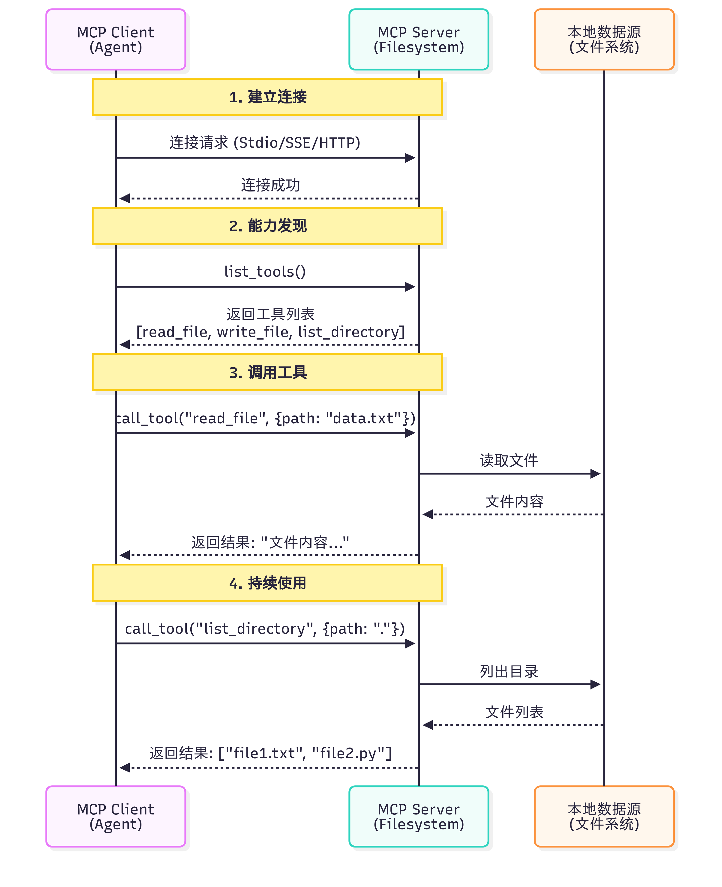

| 维度 | Function Calling | MCP |
| --- | --- | --- |
| 本质 | LLM的一种能力 | 标准化的通信协议 |
| 作用层级 | 模型层 | 基础设施层 |
| 解决问题 | 让LLM知道“如何调用函数” | 让工具和模型“如何连接” |
| 标准化 | 每个模型提供商实现不同 | 统一的协议规范 |
| 工具复用 | 需要为每个应用重写 | 社区工具可直接使用 |

Function Calling 与 MCP 并非竞争关系，而是相辅相成的。Function Calling 是大语言模型的一项核心能力，它体现了模型内在的智能，使模型能够理解何时需要调用函数，并精准生成相应的调用参数。相对地，MCP 则扮演着基础设施协议的角色，它在工程层面解决了工具与模型如何连接的问题，通过标准化的方式来描述和调用工具。

## 11.2 A2A
A2A：智能体间的对话

A2A（Agent-to-Agent Protocol）协议由 Google 团队提出2，其核心设计理念是实现智能体之间的点对点通信。与 MCP 关注智能体与工具的通信不同，A2A 关注的是智能体之间如何相互协作。  
A2A 的设计哲学是"对等通信"。如图 10.2 所示，在 A2A 网络中，每个智能体既是服务提供者，也是服务消费者。智能体可以主动发起请求，也可以响应其他智能体的请求。这种对等的设计避免了中心化协调器的瓶颈，让智能体网络更加灵活和可扩展。

## 11.3 ANP
ANP：智能体网络的基础设施

ANP（Agent Network Protocol）是一个概念性的协议框架3，目前由开源社区维护，还没有成熟的生态，其核心设计理念是构建大规模智能体网络的基础设施。如果说 MCP 解决的是"如何访问工具"，A2A 解决的是"如何与其他智能体对话"，那么 ANP 解决的是"如何在大规模网络中发现和连接智能体"。  
ANP 的设计哲学是"去中心化服务发现"。在一个包含成百上千个智能体的网络中，如何让智能体能够找到它需要的服务？ANP 提供了服务注册、发现和路由机制，让智能体能够动态地发现网络中的其他服务，而不需要预先配置所有的连接关系。

# AI Agent 简单实现


```python
from typing import Any, Dict, List, Callable
import time

# -----------------------------
# Memory（非常轻量）
# -----------------------------
class Memory:
    def __init__(self):
        self.short = {}   # 当前会话上下文
        self.long = {}    # 长期偏好/联系人等

    def get_short(self, k, default=None):
        return self.short.get(k, default)

    def set_short(self, k, v):
        self.short[k] = v

    def get_long(self, k, default=None):
        return self.long.get(k, default)

    def set_long(self, k, v):
        self.long[k] = v

# -----------------------------
# LLM 抽象（替换点）
# -----------------------------
class LLMInterface:
    def generate(self, prompt: str) -> str:
        """
        这里给出一个非常简单的规则式模拟回答器。
        真实使用时：替换为 OpenAI/其它模型的调用代码，返回 model 文本。
        """
        # 极简解析示例：识别是否需要判断"下雨"
        if "是否下雨" in prompt or "下雨" in prompt:
            return "请先查询天气；如果有雨，请生成提醒并发送给目标联系人。"
        if "生成提醒" in prompt:
            return "请提醒小王：明天北京有雨，请带伞。"
        return "我理解了。"

# -----------------------------
# 工具注册与模拟工具
# -----------------------------
class ToolRegistry:
    def __init__(self):
        self.tools: Dict[str, Callable[..., Any]] = {}

    def register(self, name: str, fn: Callable[..., Any]):
        self.tools[name] = fn

    def call(self, name: str, *args, **kwargs):
        if name not in self.tools:
            raise ValueError(f"工具未注册: {name}")
        return self.tools[name](*args, **kwargs)

# 模拟工具：天气查询（真实情况会调用天气 API）
def mock_weather_api(city: str, date: str) -> Dict[str, Any]:
    # 简单规则：如果 city 包含 "北京" 且 date 包含 "明天"，返回下雨示例
    if "北京" in city and "明天" in date:
        return {"city": city, "date": date, "cond": "雨", "precip_mm": 5}
    return {"city": city, "date": date, "cond": "晴", "precip_mm": 0}

# 模拟工具：发送消息（真实情况会调用短信/邮件/企业微信等）
def mock_send_message(contact: str, message: str) -> bool:
    print(f"[发送消息] to={contact} message={message}")
    return True

# 模拟工具：简单搜索（示意）
def mock_search(query: str) -> str:
    return f"模拟搜索结果：关于 `{query}` 的信息摘要。"

# -----------------------------
# Planner / Executor
# -----------------------------
class SimplePlanner:
    def plan(self, goal: str) -> List[Dict[str, Any]]:
        """
        将目标拆解为步骤列表（非常简化的实现）
        每一步包含：action(工具名或内部动作)、params
        """
        steps = []
        # 例：若提示包含"天气"，生成两个步骤：查天气、判断并可能发提醒
        if "天气" in goal or "下雨" in goal:
            steps.append({"action": "query_weather", "params": {"city": "北京", "date": "明天"}})
            steps.append({"action": "decide_and_notify", "params": {"contact_name": "小王"}})
        else:
            steps.append({"action": "search", "params": {"query": goal}})
        return steps

class Executor:
    def __init__(self, tools: ToolRegistry, memory: Memory, llm: LLMInterface):
        self.tools = tools
        self.memory = memory
        self.llm = llm

    def run_step(self, step: Dict[str, Any]):
        action = step["action"]
        params = step.get("params", {})
        if action == "query_weather":
            res = self.tools.call("weather", params["city"], params["date"])
            self.memory.set_short("last_weather", res)
            return res
        if action == "decide_and_notify":
            weather = self.memory.get_short("last_weather", {})
            # 简单规则决策
            if weather.get("cond") == "雨":
                # 让 LLM 生成提醒文本（示例）
                prompt = f"基于天气信息：{weather}，生成一条发给{params['contact_name']}的提醒。"
                reminder = self.llm.generate(prompt)
                # 从长期记忆中获取联系方式
                contact = self.memory.get_long(params["contact_name"]) or "13800000000"
                ok = self.tools.call("send_message", contact, reminder)
                return {"notified": ok, "message": reminder}
            else:
                return {"notified": False, "reason": "天气晴朗"}
        if action == "search":
            return self.tools.call("search", params["query"])
        raise ValueError(f"未知动作: {action}")

# -----------------------------
# Agent 本体
# -----------------------------
class SimpleAgent:
    def __init__(self):
        self.memory = Memory()
        self.tools = ToolRegistry()
        self.llm = LLMInterface()
        self.planner = SimplePlanner()
        self.executor = Executor(self.tools, self.memory, self.llm)
        # 注册默认工具
        self.tools.register("weather", mock_weather_api)
        self.tools.register("send_message", mock_send_message)
        self.tools.register("search", mock_search)
        # 假设长期记忆里存了小王的联系方式
        self.memory.set_long("小王", "13911112222")

    def handle(self, user_prompt: str):
        # 1) 大脑解析（用 LLM 抽象）
        intent = self.llm.generate(user_prompt)
        # 2) 规划
        steps = self.planner.plan(user_prompt)
        # 3) 逐步执行
        results = []
        for step in steps:
            r = self.executor.run_step(step)
            results.append({"step": step, "result": r})
        # 4) 输出合并
        return {"intent": intent, "steps": results}

# -----------------------------
# 运行示例
# -----------------------------
if __name__ == "__main__":
    agent = SimpleAgent()
    task = "查一下明天北京的天气，如果下雨，帮我写个提醒并发给小王。"
    out = agent.handle(task)
    import json
    print(json.dumps(out, ensure_ascii=False, indent=2))
```
